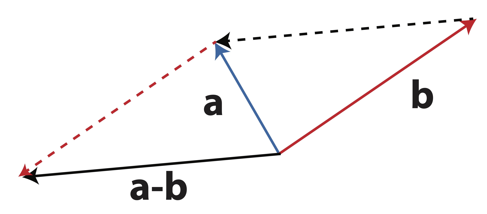
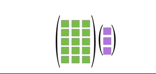

# Matrix Operations

## Vector {#vector-def}


<iframe width="560" height="315" src="https://www.youtube.com/embed/fNk_zzaMoSs" title="YouTube video player" frameborder="0" allow="accelerometer; autoplay; clipboard-write; encrypted-media; gyroscope; picture-in-picture" allowfullscreen style="border:1;display:block;margin:10px auto;"></iframe>


__Vector__: A vector in $n$-space is an ordered list of $n$ numbers.  These numbers can be represented as either a row vector or a column vector: 
$${\bf v} = \begin{bmatrix} v_1 & v_2 & \dots & v_n\end{bmatrix}$$
$${\bf v} = \begin{bmatrix} v_1 \\ v_2 \\ \vdots \\ v_n \end{bmatrix}$$ 
        
We can also think of a vector as defining a point in $n$-dimensional space, usually $\mathbb{R}^n$; each element of the vector defines the coordinate of the point in a particular direction.

__Vector Addition and Subtraction__:  If two vectors, ${\bf u}$ and ${\bf v}$, have the same size (i.e. have the same number of elements), they can be added (subtracted) together:
$${\bf u} + {\bf v} = \begin{bmatrix} u_1 + v_1 \\ u_2 + v_2 \\ \vdots \\ u_k + v_n \end{bmatrix}$$
$${\bf u} - {\bf v} = \begin{bmatrix} u_1 - v_1 \\ u_2 - v_2 \\ \vdots \\ u_k - v_n \end{bmatrix}$$

Geometrically, vector addition is witnessed by placing the two vectors, $\mathbf{a}$ and $\mathbf{b}$, _tail-to-head_. The result, $\mathbf{a}+\mathbf{b}$, is the vector from the open tail to the open head. This is demonstrated in @fig-vectoradd.

```{r, fig=T, label='fig-vectoradd', fig.show="hold", out.width="40%", echo=F,fig.align='center',fig.cap = 'Geometry of Vector Addition [(Source)](https://shainarace.github.io/LinearAlgebra/mult.html)'}
knitr::include_graphics("images/vectoradd.png")
```

When subtracting vectors as $\mathbf{a}-\mathbf{b}$ we simply add $-\mathbf{b}$ to $\mathbf{a}$. The vector $-\mathbf{b}$ has the same length as $\mathbf{b}$ but points in the opposite direction. This vector has the same length as the one which connects the two heads of $\mathbf{a}$ and $\mathbf{b}$ as shown in @fig-vectorsub. 

```{r, fig=T, label='fig-vectorsub', fig.show="hold", out.width="40%", echo=F,fig.align='center', fig.cap = 'Geometry of Vector Subtraction [(Source)](https://shainarace.github.io/LinearAlgebra/mult.html)'}

```


__Scalar Multiplication__:  The product of a scalar $c$ (i.e. a constant) and vector ${\bf v}$ is: \
$$ c{\bf v} =  \begin{bmatrix} cv_1 \\ cv_2 \\ \dots \\ cv_n \end{bmatrix} $$

Scalar multiplication changes the length of a vector but not the overall direction (although a negative scalar will scale the vector in the opposite direction through the origin). We can see this geometric interpretation of scalar multiplication in @fig-vectormult.


```{r, fig=T, out.width='40%', echo=F,fig.align='center', label='fig-vectormult', fig.cap='Geometric Effect of Scalar Multiplication [(Source)](https://shainarace.github.io/LinearAlgebra/mult.html)'} 
knitr::include_graphics('images/vectormult.jpg')
```

## Special Vectors {#special-vectors}

__Zero Vector__:  The zero vector is a vector of all zeros.  It is the additive identity for vectors.  That is, if ${\bf v}$ is any vector, then ${\bf v} + {\bf 0} = {\bf v}$.  The zero vector is denoted by ${\bf 0}$.

__Unit Vectors__:  A unit vector is a vector of length 1.  There are many unit vectors, one for each dimension.  For example, in $\mathbb{R}^3$, there are three unit vectors: 

$${\bf e}_1 = \begin{bmatrix} 1 \\ 0 \\ 0 \end{bmatrix}, {\bf e}_2 = \begin{bmatrix} 0 \\ 1 \\ 0 \end{bmatrix}, \;\;\mathrm{ and }\;\; {\bf e}_3 = \begin{bmatrix} 0 \\ 0 \\ 1 \end{bmatrix}.$$

These are the unit vectors in the $x$, $y$, and $z$ directions, respectively.  Unit vectors are useful for representing directions in space.


## Linear Combinations 


<iframe width="560" height="315" src="https://www.youtube.com/embed/k7RM-ot2NWY" title="YouTube video player" frameborder="0" allow="accelerometer; autoplay; clipboard-write; encrypted-media; gyroscope; picture-in-picture" allowfullscreen style="border:1;display:block;margin:10px auto;"></iframe>


__Linear combinations__: The vector ${\bf u}$ is a linear combination of the vectors ${\bf v}_1, {\bf v}_2,  \cdots , {\bf v}_k$ if

$${\bf u} = c_1{\bf v}_1 + c_2{\bf v}_2 +  \cdots + c_k{\bf v}_k$$


For example,  $\begin{bmatrix}9 \\ 13 \\ 17 \end{bmatrix}$ is a linear combination of the following three vectors: $\begin{bmatrix}1 \\ 2 \\ 3 \end{bmatrix}$, $\begin{bmatrix} 2 \\ 3\\ 4\end{bmatrix}$, and $\begin{bmatrix} 3 \\ 4 \\ 5 \end{bmatrix}$. This is because 
$$\begin{bmatrix}9 \\ 13 \\ 17 \end{bmatrix} = (2)\begin{bmatrix}1 \\ 2 \\ 3 \end{bmatrix} + (-1)\begin{bmatrix} 2 \\ 3\\ 4\end{bmatrix} + 3\begin{bmatrix} 3 \\ 4 \\ 5 \end{bmatrix}.$$


Notice that you can always represent one vector into linear combinations of the unit vectors, where the coefficients are the elements in each coordinates. For example, $\begin{bmatrix} 9 \\ 13 \\ 17 \end{bmatrix}$ is a linear combination of the unit vectors $\begin{bmatrix} 1 \\ 0 \\ 0 \end{bmatrix}$, $\begin{bmatrix} 0 \\ 1 \\ 0 \end{bmatrix}$, and $\begin{bmatrix} 0 \\ 0 \\ 1 \end{bmatrix}$, with coefficients $9$, $13$, and $17$, respectively.


## Matrix {#matrixbasics}

__Matrix__: A matrix of size $m\times n$ is an array of real numbers arranged in $m$ rows by $n$ columns. The dimensionality of the matrix is defined as the number of rows by the number of columns, $m \times n$. 

$${\bf A}=\begin{bmatrix}
    A_{11} & A_{12} & \cdots & A_{1n} \\
    A_{21} & A_{22} & \cdots & A_{2n} \\
    \vdots & \vdots & \ddots & \vdots \\
    A_{m1} & A_{m2} & \cdots & A_{mn}
\end{bmatrix}$$

The element of matrix $\mathbf{A}$ corresponding to _row_ $i$ and _column_ $j$ is written $A_{ij}$.
        
Note that you can think of vectors as special cases of matrices; a column vector of length $k$ is a $k \times 1$ matrix, while a row vector of the same length is a $1 \times k$ matrix.

:::{#exm-dimensions}
### Matrix Dimensions
Consider the following data matrix, containing observations on the two variables *Credit Score* and *Income*:

$$\mathbf{A}=\begin{bmatrix} 780 & 95000\\ 600 & 60000\\ 550 & 65000\\ 400 & 35000\\ 450 & 40000\\ 750 & 80000\end{bmatrix}$$

The dimension of the matrix $\mathbf{A}$ is $6\times 2$ because $\mathbf{A}$ has 6 rows and 2 columns. Thus when referring to $\mathbf{A}$ we might write $\mathbf{A}_{6\times 2}$ when the size is important. Note that the number of rows _always_ comes first when specifying the size of a matrix!
:::

It's also useful to think of matrices as being made up of a collection of row or column vectors.  

When we write 
$$\mathbf{A}=[\mathbf{a}_1 | \mathbf{a}_2 | \dots | \mathbf{a}_n ]$$
we are viewing the matrix $\mathbf{A}$ as collection of column vectors, $\mathbf{a}_j$, in the following way:
$$\mathbf{A}=[ \mathbf{a}_1 | \mathbf{a}_2 | \dots | \mathbf{a}_n ]=\left[\begin{matrix} \uparrow & \uparrow &\uparrow&\dots & \uparrow \\ \mathbf{a}_1&\mathbf{a}_2&\mathbf{a}_3&\dots&\mathbf{a}_n \\ \downarrow &\downarrow &\downarrow &\dots&\downarrow   \end{matrix}\right].$$

Similarly, we can write $\mathbf{A}$ as a collection of row vectors:

$$\mathbf{A}=\left[\begin{matrix} \mathbf{a}_1 \\ \mathbf{a}_2 \\ \vdots \\  \mathbf{a}_m \end{matrix}\right] =  \left[\begin{matrix} \longleftarrow & \mathbf{a}_1 & \longrightarrow \\ \longleftarrow & \mathbf{a}_2 & \longrightarrow \\ \vdots & \vdots & \vdots \\ \longleftarrow & \mathbf{a}_m & \longrightarrow \end{matrix}\right].$$

Sometimes, we will want to refer to both rows and columns in the same context. In these situations, we may use $\mathbf{A}_{i \star}$ to reference the $i$-th row and $\mathbf{A}_{\star j}$ to reference the $j$-th column.

__Matrix Addition__: Let $\bf A$ and $\bf B$ be two $m\times n$ matrices.

$$\mathbf{A+B}=\begin{bmatrix} a_{11}+b_{11} & a_{12}+b_{12} & \cdots & a_{1n}+b_{1n} \\ a_{21}+b_{21} & a_{22}+b_{22} & \cdots & a_{2n}+b_{2n} \\ \vdots & \vdots  & \ddots & \vdots \\ a_{m1}+b_{m1} & a_{m2}+b_{m2} & \cdots & a_{mn}+b_{mn} \end{bmatrix}$$

Note that matrices ${\bf A}$ and ${\bf B}$ must have the same dimensionality, in which case they are __conformable for addition__.
    
:::{#exm-matrixaddition}
$${\bf A}=\begin{bmatrix} 1 & 2 & 3 \\ 4 & 5 & 6 \end{bmatrix}, \qquad {\bf B}=\begin{bmatrix} 1 & 2 & 1 \\ 2 & 1 & 2 \end{bmatrix}$$
Find $\mathbf{A}+\mathbf{B}$
:::


__Scalar Multiplication__:  Given the scalar $s$, the scalar multiplication of $s {\bf A}$ is
$$ s {\bf A}=  s \begin{bmatrix} a_{11} & a_{12} & \cdots & a_{1n} \\ a_{21} & a_{22} & \cdots & a_{2n} \\ \vdots & \vdots & \ddots & \vdots \\ a_{m1} & a_{m2} & \cdots & a_{mn} \end{bmatrix} = \begin{bmatrix} s a_{11} & s a_{12} & \cdots & s a_{1n} \\ s a_{21} & s a_{22} & \cdots & s a_{2n} \\ \vdots & \vdots & \ddots & \vdots \\ s a_{m1} & s a_{m2} & \cdots & s a_{mn} \end{bmatrix}$$

:::{#exm-scalarmulti}

$s=2$, 

$${\bf A}=\begin{bmatrix} 1 & 2 & 3 \\ 4 & 5 & 6 \end{bmatrix}$$
  
Find $s {\bf A}$

:::


## Transpose {#transpose}

One important transformation we will have to perform on a matrix is to switch the columns into rows. It is not necessary that you see the importance of this transformation right now, but trust that it is something we will need quite frequently.

__Matrix Transpose__: The transpose of the $m\times n$ matrix $\bf A$ is the $n\times m$ matrix ${\bf A}^\top$  (also written ${\bf A}'$) obtained by interchanging the rows and columns of $\bf A$.

In other words, the $(i,j)$-th element of $\mathbf{A}^\top$ is the $(j,i)$-th element of $\mathbf{A}$.

$$\left(\mathbf{A}^\top\right)_{ij} = \mathbf{A}_{ji}$$

_Note: If we transpose the transpose of a matrix, we will get back the original matrix. That is,_ $$(\mathbf{A}^\top)^\top = \mathbf{A}.$$

For example,

${\bf A}=\begin{bmatrix} 4&-2&3\\0&5&-1\end{bmatrix}, \qquad {\bf A}^\top=\begin{bmatrix} 4&0\\-2&5\\3&-1 \end{bmatrix}$

${\bf B}=\begin{bmatrix} 2\\-1\\3 \end{bmatrix}, \qquad {\bf B}^\top=\begin{bmatrix} 2&-1&3\end{bmatrix}$


Thus, if $\mathbf{A}$ is a $3\times 4$ matrix then $\mathbf{A}^\top$ is a $4\times 3$ matrix as follows:

$$\mathbf{A} = \begin{bmatrix} A_{11} & A_{12} & A_{13} &A_{14}\\ A_{21} & A_{22} & A_{23} &A_{24}\\ A_{31} & A_{32} & A_{33} &A_{34}\end{bmatrix} \quad  \mathbf{A}^\top = \begin{bmatrix} A_{11} & A_{21} & A_{31} \\ A_{12} & A_{22} & A_{32} \\ A_{13} & A_{23} & A_{33} \\ A_{14} & A_{24} & A_{34}\end{bmatrix}$$

:::{#exm-transpose}

For the following matrices and vectors, determine the transpose:
$$\mathbf{B}=\begin{bmatrix} 2 & -3 & -4 \\5&-6&-7\\-8&9&0 \end{bmatrix} \qquad \mathbf{M}=\begin{bmatrix} -1&2\\-3&6\\7&-9\\5&-1 \end{bmatrix} \qquad \mathbf{x}=\begin{bmatrix}3\\-4\\5\\6\end{bmatrix}$$
To find the transpose, we simply create new matrices whose rows are the corresponding columns of each matrix or vector:
$$\mathbf{B}^\top=\begin{bmatrix} 2 &5& -8\\-3&-6&9\\-4&-7&0\end{bmatrix} \qquad \mathbf{M}^\top = \begin{bmatrix}-1&-3&7&5\\2&6&-9&-1 \end{bmatrix} $$ $$\mathbf{x}^\top = \begin{bmatrix} 3&-4&5&6 \end{bmatrix}$$
:::

The following properties of matrix transpose are useful to know:

1. $({\bf A+B})^\top = {\bf A}^\top+{\bf B}^\top$
2. $({\bf A}^\top)^\top={\bf A}$
3. $(s{\bf A})^\top = s{\bf A}^\top$
4. $({\bf AB})^\top = {\bf B}^\top{\bf A}^\top$; and by induction $({\bf ABC})^\top = {\bf C}^\top{\bf B}^\top{\bf A}^\top$

Example of $({\bf AB})^\top = {\bf B}^\top{\bf A}^\top$:

$${\bf A}=\begin{bmatrix} 1&3&2\\2&-1&3\end{bmatrix}, \qquad {\bf B}=\begin{bmatrix} 0&1\\2&2\\3&-1\end{bmatrix}$$

$$ ({\bf AB})^\top = \left[ \begin{bmatrix} 1&3&2\\2&-1&3\end{bmatrix} \begin{bmatrix} 0&1\\2&2\\3&-1\end{bmatrix} \right]^\top = \begin{bmatrix} 12&7\\5&-3 \end{bmatrix}$$

$$ {\bf B}^\top{\bf A}^\top= \begin{bmatrix} 0&2&3\\1&2&-1 \end{bmatrix}  \begin{bmatrix} 1&2\\3&-1\\2&3 \end{bmatrix} = \begin{bmatrix} 12&7\\5&-3 \end{bmatrix}$$


## Special Matrices {#special-matrix}

__Zero Matrix__: The zero matrix is a matrix of all zeros. For example, the $3\times 4$ zero matrix is given by 
$${\bf 0}_{3\times 4}=\begin{bmatrix} 0&0&0&0\\0&0&0&0\\0&0&0&0 \end{bmatrix}$$

__Square Matrix__: A square matrix is a matrix with the same number of rows and columns. For example, the $3\times 3$ matrix is a square matrix, but the $3\times 4$ matrix is not.

__Identity Matrix__: The identity matrix is a square matrix with ones on the main diagonal and zeros elsewhere. For example, the $3\times 3$ identity matrix is given by
$${\bf I}_3=\begin{bmatrix} 1&0&0\\0&1&0\\0&0&1 \end{bmatrix}$$

Notice that we can write identity matrix as collections of unit vectors. For example, the $3\times 3$ identity matrix can be written as
$$\mathbf{I}_3=\left[ \mathbf{e}_1 | \mathbf{e}_2 | \mathbf{e}_3 \right],$$
where
$${\bf e}_1 = \begin{bmatrix} 1 \\ 0 \\ 0 \end{bmatrix}, {\bf e}_2 = \begin{bmatrix} 0 \\ 1 \\ 0 \end{bmatrix}, \;\;\mathrm{ and }\;\; {\bf e}_3 = \begin{bmatrix} 0 \\ 0 \\ 1 \end{bmatrix}$$
are unit vectors in $\mathbb{R}^3$, the 3-dimensional vector space.

__Symmetric Matrix__: A matrix is symmetric if it is equal to its transpose. That is, if $\mathbf{A}$ is a symmetric matrix, then 
$$\mathbf{A}=\mathbf{A}^\top.$$

__Diagonal Matrix__: A matrix is diagonal if all the elements outside the main diagonal are zero. 

For example:
$$\mathbf{D} = \begin{bmatrix} \sigma_1 & 0 & 0 & 0 \\ 0 & \sigma_2 & 0 & 0\\ 0&0&\sigma_3&0\\ 0&0&0&\sigma_4 \end{bmatrix}$$
Since the off diagonal elements are 0, we need only define the diagonal elements for such a matrix. Thus, we will frequently write
$$\mathbf{D}=\mathrm{diag}\{\sigma_1,\sigma_2,\sigma_3,\sigma_4\}.$$


## Vector Inner Product


When we multiply matrices, we do not perform the operation element-wise as we did with addition and scalar multiplication. Matrix multiplication is, in itself, a very powerful tool for summarizing information. In fact, many of the analytical tools, like linear regression, can all be understood more clearly with a firm grasp on matrix multiplication. Because this operation is so important, we will spend a considerable amount of energy breaking it down in many ways. 

We often want to summarize the relationship between two vectors into a single number. If the two vectors are pointing in similar directions, the number should be positive. If the two vectors are pointing in opposite directions, the number should be negative. If the two vectors are perpendicular, the number should be zero. This idea leads to the definition of the inner product of two vectors.

__Inner Product__: The inner product (also called dot product) of two vectors $\mathbf{u}$ and $\mathbf{v}$ is defined as
$$\mathbf{u} \cdot \mathbf{v}=\mathbf{u}^\top\mathbf{v}=\sum_{i=1}^n u_i v_i = u_1 v_1 + u_2 v_2+\cdots u_n v_n.$$
The inner product is a scalar quantity.

If ${\bf u} \cdot {\bf v} = 0$, the two vectors are orthogonal (or perpendicular).

```{r, label='fig-animinnerproduct', fig.align='center', fig.cap = 'Animation of Inner Product between two vectors [(Source)](https://shainarace.github.io/LinearAlgebra/mult.html)', echo=F, out.width="50%"}
knitr::include_graphics("images/animinnerprod.gif")
```

Why are we doing this? To understand what's going on intuitively, let's think about the case of two-dimensions where we can break down the components of the inner product into $x$ and $y$ axis.
Denote
$$\mathbf{a}=\begin{bmatrix}a_x \\ a_y\end{bmatrix}=a_x\begin{bmatrix}1 \\ 0\end{bmatrix} + a_y\begin{bmatrix}0 \\ 1\end{bmatrix}$$
$$\mathbf{b}=\begin{bmatrix}b_x \\ b_y\end{bmatrix}=b_x\begin{bmatrix}1 \\ 0\end{bmatrix} + b_y\begin{bmatrix}0 \\ 1\end{bmatrix}$$
Since $x$ and $y$ axis are perpendicular to each other, the inner products of their unit vectors $\begin{bmatrix}1 \\ 0\end{bmatrix}$ and $\begin{bmatrix}0 \\ 1\end{bmatrix}$ are zero, thus we have that
\begin{align*}\mathbf{a}\cdot\mathbf{b}
&=\left(a_x\begin{bmatrix}1 \\ 0\end{bmatrix} + a_y\begin{bmatrix}0 \\ 1\end{bmatrix}\right)\cdot\left(b_x\begin{bmatrix}1 \\ 0\end{bmatrix} + b_y\begin{bmatrix}0 \\ 1\end{bmatrix}\right) \\
&=
a_x b_x \underbrace{\begin{bmatrix}1 \\ 0\end{bmatrix}^\top \begin{bmatrix}1 \\ 0\end{bmatrix}}_{=1\cdot 1 + 0\cdot0=1} + 
a_x b_y \underbrace{\begin{bmatrix}1 \\ 0\end{bmatrix}^\top \begin{bmatrix}0 \\ 1\end{bmatrix}}_{=1\cdot 0 + 0\cdot1=0} + 
a_y b_x \underbrace{\begin{bmatrix}0 \\ 1\end{bmatrix}^\top \begin{bmatrix}1 \\ 0\end{bmatrix}}_{=0\cdot 1 + 1\cdot0=0} + 
a_y b_y \underbrace{\begin{bmatrix}0 \\ 1\end{bmatrix}^\top \begin{bmatrix}0 \\ 1\end{bmatrix}}_{=0\cdot 0 + 1\cdot1=1}\\
&=a_x b_x + a_y b_y
\end{align*}


```{r, label='fig-dot-product-components', fig.align='center', fig.cap = 'Components of Inner Product [(Source)](https://betterexplained.com/articles/vector-calculus-understanding-the-dot-product/)', echo=F, out.width="50%"}
knitr::include_graphics("images/dot_product_components.jpeg")
```


:::{#exm-inner-prod}
### Vector Inner Product
Let $$\mathbf{x}=\begin{bmatrix} -1 \\2\\4\\0 \end{bmatrix} \quad \mathbf{y}=\begin{bmatrix} 3 \\5\\1\\7 \end{bmatrix} \quad \mathbf{v}=\begin{bmatrix} -3 \\-2\\5\\3\\-2 \end{bmatrix} \quad \mathbf{u}= \begin{bmatrix} 2\\-1\\3\\-3\\-2 \end{bmatrix}$$

If possible, compute the following inner products:

a. $\mathbf{x}^\top\mathbf{y}$
\begin{align*}
\mathbf{x}^\top\mathbf{y} &=\begin{bmatrix} -1 &2&4&0 \end{bmatrix} \begin{bmatrix} 3 \\5\\1\\7 \end{bmatrix} \\
&= (-1)(3)+(2)(5)+(4)(1)+(0)(7) = -3+10+4=11
\end{align*}
b. $\mathbf{x}^\top\mathbf{v}$
This is not possible because $\mathbf{x}$ and $\mathbf{v}$ do not have the same number of elements
c. $\mathbf{v}^\top\mathbf{u}$
\begin{align*}
\mathbf{v}^\top\mathbf{u} &= \begin{bmatrix} -3 &-2&5&3&-2 \end{bmatrix} \begin{bmatrix} 2\\-1\\3\\-3\\-2 \end{bmatrix} \\
&= (-3)(2)+(-2)(-1)+(5)(3)+(3)(-3)+(-2)(-2) = -6+2+15-9+4 = 6
\end{align*}
:::


:::{#exr-vectors1}

Let $u = \begin{bmatrix} 7\\1\\-5\\3\end{bmatrix}$, $v = \begin{bmatrix} 9\\-3\\2\\8 \end{bmatrix}$, $w = \begin{bmatrix} 1\\13\\ -7\\2 \\15 \end{bmatrix}$, and $c = 2$. Calculate the following: 
  
  1. $u-v$
  
  2. $cw$
  
  3. $u \cdot v$
  
  4. $w \cdot v$
  
:::

__Vector Norm__: The norm of a vector is a measure of its length.  There are many different ways to calculate the norm, but the most common is the Euclidean norm (which corresponds to our usual conception of distance):
$$\lVert \mathbf{v}\rVert = \sqrt{\mathbf{v}\cdot\mathbf{v}} =  \sqrt{\mathbf{v}^\top\mathbf{v}} = \sqrt{ v_1^2 + v_2^2 + \cdots + v_n^2}.$$
This is merely measuring the distance between the point $\mathbf{v}$ and the origin. 

In other words, the norm of a vector is the square root of the sum of the squares of its components, which is also the square root of the inner product of itself. The norm of a vector is always non-negative. The norm of a zero vector is 0. The norm of a unit vector is 1.

To compute the distance between two different points, say $\mathbf{x}$ and $\mathbf{y}$, we'd calculate 
\begin{align*}
\lVert \mathbf{x}-\mathbf{y}\rVert 
&= \sqrt{(\mathbf{x}-\mathbf{y})^\top(\mathbf{x}-\mathbf{y})} \\
&= \sqrt{(x_1-y_1)^2 + (x_2-y_2)^2 + \dots + (x_n-y_n)^2}
\end{align*}


:::{#exm-norm}
Suppose I have two vectors in $3$-dimensional space: 
$$\mathbf{x}=(1,1,1) \;\;\;\textrm{   and   }\;\;\; \mathbf{y}=(1,0,0)$$
Then the Euclidean norm of $\mathbf{x}$ (i.e. its length or distance from the origin) is
$$\lVert \mathbf{x}\rVert =\sqrt{1^2+1^2+1^2}=\sqrt{3}$$
and the Euclidean norm of $\mathbf{y}$ is
$$\lVert \mathbf{y} \rVert =\sqrt{1^2+0^2+0^2}=1$$
and the Euclidean distance between point $\mathbf{x}$ and point $\mathbf{y}$ is
$$\lVert \mathbf{x}-\mathbf{y} \rVert =\sqrt{(1-1)^2 + (1-0)^2 + (1-0)^2} =\sqrt{2}.$$
The Euclidean norm is crucial to many methods in data analysis as it measures the closeness of two data points.
:::

## Matrix Multiplication

Matrix multiplication is nothing more than a collection of inner products done simultaneously in one operation. We must be careful when multiplying matrices because, as with vectors, the operation is not always possible. Unlike the vector inner product, the order in which you multiply matrices makes a big difference!


__Matrix Multiplication__: Let $\mathbf{A}$ be a $m\times n$ matrix and $\mathbf{B}$ be a ${k\times p}$ matrix. The matrix product $\mathbf{A}\mathbf{B}$ is possible if and only if $n=k$; that is, when the number of columns in $\mathbf{A}$ is the same as the number of rows in $\mathbf{B}$. If this condition holds, then the the product, $\mathbf{A}\mathbf{B}$, is a $m\times p$ matrix and the $(i,j)$ entry of the product $\mathbf{A}\mathbf{B}$ is the inner product of the $i$th row of $\mathbf{A}$ and the $j$th column of $\mathbf{B}$:

$$(\mathbf{A}\mathbf{B})_{ij} = \mathbf{A}_{i\star}\cdot\mathbf{B}_{\star j}$$

In other words,


\begin{align*}
\mathbf{AB}
&=\left[\begin{matrix} \longleftarrow & \mathbf{a}_1 & \longrightarrow \\ 
\longleftarrow & \mathbf{a}_2 & \longrightarrow \\ 
\vdots & \vdots & \vdots \\ 
\longleftarrow & \mathbf{a}_m & \longrightarrow \end{matrix}\right]
\left[\begin{matrix} \uparrow & \uparrow &\dots & \uparrow \\ 
\mathbf{b}_1&\mathbf{b}_2&\dots&\mathbf{b}_p \\ 
\downarrow &\downarrow &\dots&\downarrow   \end{matrix}\right] \\
&=\begin{bmatrix} \mathbf{a}_1\cdot\mathbf{b}_1 & \mathbf{a}_1\cdot\mathbf{b}_2 & \cdots & \mathbf{a}_1\cdot\mathbf{b}_p \\ \mathbf{a}_2\cdot\mathbf{b}_1 & \mathbf{a}_2\cdot\mathbf{b}_2 & \cdots & \mathbf{a}_2\cdot\mathbf{b}_p \\ \vdots & \vdots & \ddots & \vdots \\ \mathbf{a}_m\cdot\mathbf{b}_1 & \mathbf{a}_m\cdot\mathbf{b}_2 & \cdots & \mathbf{a}_m\cdot\mathbf{b}_p \end{bmatrix}
\end{align*}
where $\mathbf{a}_i$ is the $i$th row of $\mathbf{A}$ and $\mathbf{b}_j$ is the $j$th column of $\mathbf{B}$.

:::{#exm-matmult}

### Steps to Compute Matrix Multiplication

Let $$\mathbf{A}=\begin{bmatrix} 2 & 3 \\ -1 & 4 \\ 5 & 1 \end{bmatrix} \quad \;\;\mathrm{ and }\;\; \quad \mathbf{B}=\begin{bmatrix}  0 & -2 \\ 2 & -3 \end{bmatrix}$$

When we first get started with matrix multiplication, we often follow a few simple steps:

1. Write down the matrices and their dimensions. Make sure the "inside" dimensions match - those corresponding to the columns of the first matrix and the rows of the second matrix: $$\underset{(3\times \red{2})}{\mathbf{A}} \underset{(\red{2} \times 2)}{\mathbf{B}}$$ If these dimensions match, then we can multiply the matrices. If they don't, we stop right there - multiplication is not possible.
2. Now, look at the "outer" dimensions - this will tell you the size of the resulting matrix. $$\underset{(\blue{3}\times 2)}{\mathbf{A}} \underset{(2\times \blue{2})}{\mathbf{B}}$$ So the product $\mathbf{A}\mathbf{B}$ is a $3\times 2$ matrix.
3. Finally, we compute the product of the matrices by multiplying each row of $\mathbf{A}$ by each column of $\mathbf{B}$ using inner products. The element in the first row and first column of the product (written $(\mathbf{A}\mathbf{B})_{11}$) will be the inner product of the first row of $\mathbf{A}$ and the first column of $\mathbf{B}$. Then, $(\mathbf{A}\mathbf{B})_{12}$ will be the inner product of the first row of $\mathbf{A}$ and the second column of $\mathbf{B}$, etc. $$\mathbf{A}\mathbf{B} =\begin{bmatrix} (2)(0)+(3)(2) & (2)(-2)+(3)(-3)\\ (-1)(0)+(4)(2) & (-1)(-2)+(4)(-3)\\ (5)(0)+(1)(2) & (5)(-2)+(1)(-3) \end{bmatrix} = \begin{bmatrix} 6&-13\\8 & -10\\2&-13\end{bmatrix} $$
:::


:::{#exr-matmult}
### Matrix Multiplication

Suppose we have 
$$\mathbf{A}_{4\times 6} \quad \mathbf{B}_{5\times 5} \quad \mathbf{M}_{5\times 4} \quad \mathbf{P}_{6\times 5}$$
Circle the matrix products that are possible to compute and write the dimension of the result.
$$\mathbf{A}\mathbf{M} \qquad \mathbf{M}\mathbf{A} \qquad \mathbf{B}\mathbf{M}  \qquad \mathbf{M}\mathbf{B} \qquad \mathbf{P}\mathbf{A} \qquad \mathbf{P}\mathbf{M} \qquad \mathbf{A}\mathbf{P} \qquad \mathbf{A}^\top\mathbf{P} \qquad \mathbf{M}^\top\mathbf{B}$$
Let 
$$\mathbf{A}=\begin{bmatrix} 1&1&0&1\\0&1&1&1\\1&0&1&0\end{bmatrix} \quad \mathbf{M} = \begin{bmatrix} -2&1&-1&2&-2\\1&-2&0&-1&2\\2&1&-3&-2&3 \\ 1&3&2&-1&2\end{bmatrix}$$
$$\mathbf{C}=\begin{bmatrix} -1&0&1&0\\1&-1&0&0\\0&0&1&-1 \end{bmatrix}$$
Determine the following matrix products, if possible:

1. $\mathbf{A}\mathbf{C}$
2. $\mathbf{A}\mathbf{M}$
3. $\mathbf{A}^\top\mathbf{C}$
:::

The following properties of matrix multiplication and addition are useful to know:

1. Associative: $\bf (A+B)+C = A+(B+C)$
2. $\bf (AB)C = A(BC)$
3. Commutative: $\bf A+B=B+A$
4. Distributive: $\bf A(B+C)=AB+AC$
5. $\bf (A+B)C=AC+BC$

Commutative law for multiplication does not hold -- the order of multiplication matters:
$$\bf AB \ne BA$$

For example,
$${\bf A}=\begin{bmatrix} 1&2\\-1&3\end{bmatrix}, \qquad {\bf B}=\begin{bmatrix} 2&1\\0&1\end{bmatrix}$$
$${\bf AB}=\begin{bmatrix} 2&3\\-2&2\end{bmatrix}, \qquad {\bf BA}=\begin{bmatrix} 1&7\\-1&3\end{bmatrix}$$

## Matrix-Vector Product


What if we want to multiply matrix and vector? A matrix-vector product works exactly the same way as matrix multiplication; after all, a vector $\mathbf{x}$ is nothing but an $n\times 1$ matrix. In order to multiply a matrix by a vector, again we must match the dimensions to make sure they line up correctly. For example, if we have an $m\times n$ matrix $\mathbf{A}$, we can multiply by a $1\times m$ row vector $\mathbf{v}^\top$ on the left:
$$\mathbf{v}^\top\mathbf{A} \quad \textrm{works because } \underset{ (1\times \red{m})}{\mathbf{v}^\top} \underset{(\red{m}\times n)}{\mathbf{A}}$$
$$\Longrightarrow \textrm{The result will be a   } 1 \times n \textrm{ row vector.}$$
or we can multiply by an $n\times 1$ column vector $\mathbf{x}$ on the right:

$$\mathbf{A}\mathbf{x} \quad \textrm{works because } \underset{(m\times \red{n})}{\mathbf{A}}\underset{(\red{n}\times 1)}{\mathbf{x}} $$
$$\Longrightarrow \textrm{The result will be a   } m\times 1 \textrm{ column vector.}$$

Matrix-vector multiplication works the same way as matrix multiplication: we simply multiply rows by columns until we've completed the answer. In the case of $\mathbf{v}^\top\mathbf{A}$, we'd multiply the row $\mathbf{v}$ by each of the $n$ columns of $\mathbf{A}$, carving out our solution, one entry at a time :

$$\mathbf{v}^\top\mathbf{A} = \begin{bmatrix} \mathbf{v}^\top\mathbf{A}_{*1} & \mathbf{v}^\top\mathbf{A}_{*2} & \cdots & \mathbf{v}^\top\mathbf{A}_{*n} \end{bmatrix}.$$

In the case of $\mathbf{A}\mathbf{x}$, we'd multiply each of the $m$ rows of $\mathbf{A}$ by the column $\mathbf{x}$:

$$\mathbf{A}\mathbf{x} = \begin{bmatrix} \mathbf{A}_{1*}\mathbf{x} \\ \mathbf{A}_{2*}\mathbf{x} \\ \vdots \\ \mathbf{A}_{m*}\mathbf{x} \end{bmatrix}.$$

:::{#exm-matrix-vector-product}
### Matrix-Vector Product
Let $$\mathbf{A}=\begin{bmatrix} 2 & 3 \\ -1 & 4 \\ 5 & 1 \end{bmatrix}  \quad \mathbf{v}=\begin{bmatrix} 3\\2 \end{bmatrix} \quad \mathbf{q}=\begin{bmatrix} 2\\-1\\3\end{bmatrix}$$

Determine whether the following matrix-vector products are possible. When possible, compute the product.

Let $$\mathbf{A}=\begin{bmatrix} 2 & 3 \\ -1 & 4 \\ 5 & 1 \end{bmatrix}  \quad \mathbf{v}=\begin{bmatrix} 3\\2 \end{bmatrix} \quad \mathbf{q}=\begin{bmatrix} 2\\-1\\3\end{bmatrix}$$
d. $\mathbf{v}^\top\mathbf{A}$ $$\textrm{Not Possible: Inner dimensions do not match} \quad \underset{(1\times \red{2})}{\mathbf{v}^\top}\underset{(\red{3}\times 2)}{\mathbf{A}}$$
:::


## Matrix Product IS Linear Combination

All matrix products can be viewed as linear combinations. This vantage point is _extremely_ crucial to our understanding of linear algebra. Let's start with matrix-vector product and see how we can depict it as a linear combination of the columns of the matrix.

__Matrix-Vector Product as Linear Combination__:

Let $\mathbf{A}$ be an $m\times n$ matrix partitioned into columns, 
$$\mathbf{A} = \begin{bmatrix}\mathbf{a}_1 | \mathbf{a}_2 | \dots | \mathbf{a}_n\end{bmatrix}$$
and let $\mathbf{x}$ be a $n$-dimensional vector
$$\mathbf{x}=\begin{bmatrix} x_1 \\ x_2 \\ \vdots \\ x_n \end{bmatrix}$$
Then, $\mathbf{A}\mathbf{x}$ is the linear combination of the columns of $\mathbf{A}$ using coefficients in $\mathbf{x}$:
$$\mathbf{A}\mathbf{x} = x_1\mathbf{a}_1 + x_2\mathbf{a}_2 + \dots + x_n\mathbf{a}_n.$$

The animation below illustrates the relationship between matrix-vector product and linear combination. 

```{r, fig=T, label='fig-matvecprodlincombanim', fig.show="hold", out.width="50%", echo=F,fig.align='center',fig.cap = 'Illustration of Matrix-Vector Product as Linear Combinations [(Source)](https://shainarace.github.io/LinearAlgebra/mult.html)'}

```

:::{#exm-matrix-vector-product-lc}
Calculate 
$$\begin{bmatrix} 3 & 1 \\ 1 & 2\end{bmatrix}\begin{bmatrix}-1 \\ 2\end{bmatrix}.$$

Calculate 
$$(-1)\begin{bmatrix} 3 \\ 1 \end{bmatrix}+(2)\begin{bmatrix}1 \\ 2\end{bmatrix}.$$

Interpret the geometric relationship between the two.

:::

Conceptually, while doing matrix-vector product, the matrix $\mathbf{A}$ is **transforming** the vector $\mathbf{x}$ in a specific way (by taking linear cominations) to the vector $\mathbf{A}\mathbf{x}$. This is illustrated in the video below.

<iframe width="560" height="315" src="https://www.youtube.com/embed/kYB8IZa5AuE" title="YouTube video player" frameborder="0" allow="accelerometer; autoplay; clipboard-write; encrypted-media; gyroscope; picture-in-picture" allowfullscreen style="border:1;display:block;margin:10px auto;"></iframe>


__Matrix Multiplication as Collection of Linear Combinations__:

We can view matrix multiplication as applying matrix-vector product iteratively. 

If 
$$\mathbf{A}\mathbf{B}=\mathbf{C},$$ 
then the columns of $\mathbf{C}$ can be viewed as linear combinations of the columns of $\mathbf{A}$ and the coefficients are given in the elements of each column of $\mathbf{B}$. Denote

$$\mathbf{A}_{m\times n} = \begin{bmatrix}\mathbf{a}_1 | \mathbf{a}_2 | \dots | \mathbf{a}_n\end{bmatrix}$$
$$\mathbf{B}_{n\times p} = \begin{bmatrix}\mathbf{b}_1 | \mathbf{b}_2 | \dots | \mathbf{b}_p\end{bmatrix}$$
$$\mathbf{C}_{m\times p} = \begin{bmatrix}\mathbf{c}_1 | \mathbf{c}_2 | \dots | \mathbf{c}_p\end{bmatrix}$$
Then, for example, $\mathbf{c}_1$ is the linear combination of the columns of $\mathbf{A}$ using coefficients in the first column of $\mathbf{B}$, i.e., $\mathbf{b}_1$:
$$\mathbf{b}_1=\begin{bmatrix}B_{11}\\ B_{21}\\ \vdots \\ B_{n1} \end{bmatrix},$$
$$\mathbf{C}_1= B_{11}\mathbf{a}_1 + B_{21}\mathbf{a}_2 + \dots + B_{n1}\mathbf{a}_n=\mathbf{A}\mathbf{b}_1,$$

which is the matrix-vector product of $\mathbf{A}$ and $\mathbf{b}_1$. As a result, we can write the whole matrix multiplication as a collection of matrix-vector products by columns:

$$\mathbf{C} = \begin{bmatrix}\mathbf{c}_1 | \mathbf{c}_2 | \dots | \mathbf{c}_p\end{bmatrix} = \begin{bmatrix}\mathbf{A}\mathbf{b}_1 | \mathbf{A}\mathbf{b}_2 | \cdots | \mathbf{A}\mathbf{b}_p\end{bmatrix}.$$


The animation below illustrates the relationship between matrix multiplication and linear combinations.

```{r, fig=T, label='multlincombanim', fig.show="hold", out.width="50%", echo=F,fig.align='center',fig.cap = 'Illustration of Matrix Multiplication as Linear Combinations [(Source)](https://shainarace.github.io/LinearAlgebra/mult.html)'}
knitr::include_graphics("images/animmultlincombanim.gif")
```

In fact, when doing matrix multiplication, we're actually applying a **series of transformations**, illustrated nicely in the video below.

<iframe width="560" height="315" src="https://www.youtube.com/embed/XkY2DOUCWMU" title="YouTube video player" frameborder="0" allow="accelerometer; autoplay; clipboard-write; encrypted-media; gyroscope; picture-in-picture" allowfullscreen style="border:1;display:block;margin:10px auto;"></iframe>


## Answers to Examples and Exercises {-}


Answer to @exr-vectors1:

  1. $\begin{bmatrix} -2 &4&-7&-5 \end{bmatrix}$
  2. $\begin{bmatrix} 2 &26&-14&4&30 \end{bmatrix}$
  3. 63 -3 -10 + 24 = 74
  4. undefined

Answer to @exm-matrixaddition:

${\bf A+B}=\begin{bmatrix} 2 & 4 & 4 \\ 6 & 6 & 8 \end{bmatrix}$
    
Answer to @exm-scalarmulti:

$s {\bf A} = \begin{bmatrix} 2 & 4 & 6 \\ 8 & 10 & 12 \end{bmatrix}$


