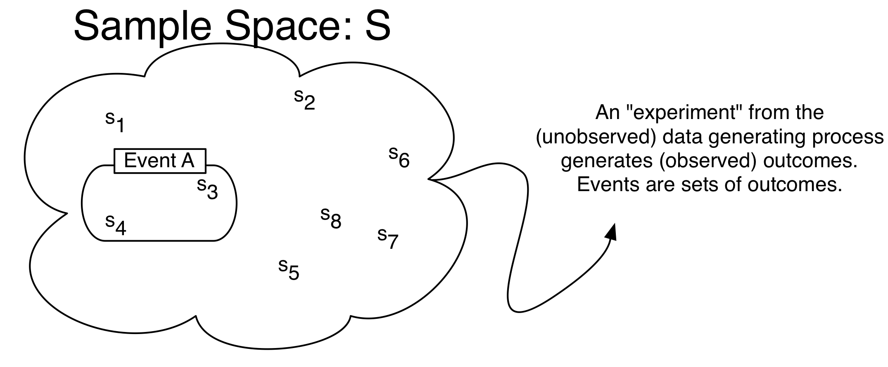

# Probability Theory {#probability-theory}

Probability and Inferences are mirror images of each other, and both are integral to social science. Probability quantifies uncertainty, which is important because many things in the social world are at first uncertain. Inference is then the study of how to learn about facts you don't observe from facts you do observe.

 
```{r, include = FALSE}
library(ggplot2)
options(knitr.graphics.auto_pdf = TRUE) # use pdf for images
```
 

## Counting Rules

Probability in high school is usually really about combinatorics: the probability of event _A_ is the number of ways in which _A_ can occur divided by the number of all other possibilities. This is a very simplified version of probability, which we can call the "counting definition of probability", essentially because each possible event to count is often equally likely and discrete. But it is still good to review the underlying rules here.


__Fundamental Theorem of Counting__: If an object has $j$ different characteristics that are independent of each other, and each characteristic $i$ has $n_i$ ways of being expressed, then there are $\prod_{i = 1}^j n_i$ possible unique objects.

:::{#exm-countingrules}

Suppose we are given a stack of cards. Cards can be either red or black and can take on any of 13 values. There is only one of each color-number combination. In this case,

1. $j =$

2. $n_{\text{color}} =$ 

3. $n_{\text{number}} =$ 

4. Number of Outcomes $=$

:::


We often need to count the number of ways to choose a subset from some set of possibilities.  The number of outcomes depends on two characteristics of the process: does the order matter and is replacement allowed?

It is useful to think of any problem concretely, e.g. through a __sampling table__: If there are $n$ objects which are numbered 1 to $n$ and we select $k < n$ of them, how many different outcomes are possible?

If the order in which a given object is selected matters, selecting 4 numbered objects in the following order (1, 3, 7, 2) and selecting the same four objects but in a different order such as (7, 2, 1, 3) will be counted as different outcomes. 

If replacement is allowed, there are always the same $n$ objects to select from. However, if replacement is not allowed, there is always one less option than the previous round when making a selection. For example, if replacement is not allowed and I am selecting 3 elements from the following set {1, 2, 3, 4, 5, 6}, I will have 6 options at first, 5 options as I make my second selection, and 4 options as I make my third. 


1. So if ___order matters___ AND we are sampling ___with replacement___, the number of different outcomes is $n^k$.

2. If  ___order matters___ AND we are sampling ___without replacement___, the number of different outcomes is $n(n-1)(n-2)...(n-k+1)=\frac{n!}{(n-k)!}$.

3. If  ___order doesn't matter___ AND we are sampling ___without replacement___, the number of different outcomes is $\binom{n}{k} = \frac{n!}{(n-k)!k!}$.


Expression $\binom{n}{k}$ is read as "n choose k" and denotes $\frac{n!}{(n-k)!k!}$. Also, note that $0! = 1$.

:::{#exm-counting}

### Counting
There are five balls numbered from 1 through 5 in a jar. Three balls are chosen. How many possible choices are there?

1. Ordered, with replacement $=$ 

2. Ordered, without replacement $=$ 

3. Unordered, without replacement $=$ 

:::

:::{#exr-counting1}
### Counting
Four cards are selected from a deck of 52 cards. Once a card has been drawn, it is not reshuffled back into the deck. Moreover, we care only about the complete hand that we get (i.e. we care about the set of selected cards, not the sequence in which it was drawn). How many possible outcomes are there?
:::


## Sets {#setoper}

Probability is about quantifying the uncertainty of events. _Sets_ (set theory) are the mathematical way we choose to formalize those events. Events are not inherently numerical: the onset of war or the stock market crashing is not inherently a number. Sets can define such events, and we wrap math around so that we have a transparent language to communicate about those events. _Measure theory_ might sound mysterious or hard, but it is also just a mathematical way to quantify things like length, volume, and mass. Probability can be thought of as a particular application of measure theory where we want to quantify the measure of a set. 


__Set__ : A set is any well defined collection of elements.  If $x$ is an element of $S$, $x \in S$.

__Sample Space (S)__:  A set or collection of all possible outcomes from some process.  Outcomes in the set can be discrete elements (countable) or points along a continuous interval (uncountable).

Examples:

1. Discrete:  the numbers on a die, whether a vote cast is republican or democrat.
2. Continuous: GNP, arms spending, age.

__Event__: Any collection of possible outcomes of an experiment. Any subset of the full set of possibilities, including the full set itself. Event A $\subset$ S.

__Empty Set__: a set with no elements.  $S = \{\}$. It is denoted by the symbol $\emptyset$.


Set operations:

1. __Union__: The union of two sets $A$ and $B$, $A \cup B$, is the set containing all of the elements in $A$ or $B$. $$A_1 \cup A_2  \cup \cdots \cup A_n = \bigcup_{i=1}^n A_i$$
2. __Intersection__: The intersection of sets $A$ and $B$, $A \cap B$, is the set containing all of the elements in both $A$ and $B$. $$A_1 \cap A_2  \cap \cdots \cap A_n = \bigcap_{i=1}^n A_i$$
3. __Complement__: If set $A$ is a subset of $S$, then the complement of $A$, denoted $A^C$, is the set containing all of the elements in $S$ that are not in $A$.


Properties of set operations:

* __Commutative__: $A \cup B = B \cup A$; $A \cap B = B \cap A$
* __Associative__: $A \cup (B \cup C) = (A \cup B) \cup C$; $A \cap (B \cap C) = (A \cap B) \cap C$
* __Distributive__: $A \cap (B \cup C) = (A \cap B) \cup (A \cap C)$; $A \cup (B \cap C) = (A \cup B) \cap (A \cup C)$
* __de Morgan's laws__: $(A \cup B)^C = A^C \cap B^C$; $(A \cap B)^C = A^C \cup B^C$
* __Disjointness__: Sets are disjoint when they do not intersect, such that $A \cap B = \emptyset$.  A collection of sets is pairwise disjoint (**mutually exclusive**) if, for all $i \neq j$, $A_i \cap A_j = \emptyset$.  A collection of sets form a partition of set $S$ if they are pairwise disjoint and they cover set $S$, such that $\bigcup_{i = 1}^k A_i = S$.


:::{#exm-sets}

### Sets

Let set $A$ be {1, 2, 3, 4}, $B$ be {3, 4, 5, 6}, and $C$ be {5, 6, 7, 8}. Sets $A$, $B$, and $C$ are all subsets of the sample space $S$ which is {1, 2, 3, 4, 5, 6, 7, 8, 9, 10}

Write out the following sets:

1. $A \cup B$
2. $C \cap B$
3. $B^c$
4. $A \cap (B \cup C)$
  
:::


:::{#exr-sets1}

Suppose you had a pair of four-sided dice. You sum the results from a single toss.

What is the set of possible outcomes (i.e. the sample space)?
  
Consider subsets A {2, 8} and B {2,3,7} of the sample space you found. What is

1. $A^c$
2. $(A \cup B)^c$
    
:::


## Probability {#probdef}

```{r, #fig-prob-image, fig.cap='Probablity as a Measure^[Images of Probability and Random Variables drawn by Shiro Kuriwaki and inspired by Blitzstein and Morris]', echo = FALSE}

```

### Probability Definitions: Formal and Informal {-}

Many things in the world are uncertain. In everyday speech, we say that we are  _uncertain_ about the outcome of random events. Probability is a formal model of uncertainty which provides a measure of uncertainty governed by a particular set of rules (@fig-prob-image). A different model of uncertainty would, of course, have a set of rules different from anything we discuss here.  Our focus on probability is justified because it has proven to be a particularly useful model of uncertainty.


__Probability Distribution Function__: a mapping of each event in the sample space $S$ to the real numbers that satisfy the following three axioms (also called Kolmogorov's Axioms).

Formally, 

:::{#def-prob}

### Probability
Probability is a function that maps events to a real number, obeying the axioms of probability.

:::

The axioms of probability make sure that the separate events add up in terms of probability, and -- for standardization purposes -- that they add up to 1.

:::{#def-}
### Axioms of Probability

1. For any event $A$, $P(A)\ge 0$.
2. $P(S)=1$
3. The Countable Additivity Axiom: For any sequence of _disjoint_ (mutually exclusive) events $A_1,A_2,\ldots$ (of which there may be infinitely many), $$P\left( \bigcup\limits_{i=1}^k
A_i\right)=\sum\limits_{i=1}^k P(A_i)$$

The last axiom is an extension of a union to infinite sets. When there are only two events in the space, it boils down to:
  
\begin{align*}
P(A_1 \cup A_2) = P(A_1) + P(A_2) \quad\text{for disjoint } A_1, A_2
\end{align*}

:::


### Probability Operations  {-}

Using these three axioms, we can define all of the common rules of probability.

:::{#prop-prob}

1.  $P(\emptyset)=0$
2.  For any event $A$, $0\le P(A) \le 1$
3. $P({A}^C)=1-P(A)$
4. If $A\subset B$ ($A$ is a subset of $B$), then $P(A)\le P(B)$
5. For _any_ two events $A$ and $B$, $P(A\cup B)=P(A)+P(B)-P(A\cap B)$
6. Boole's Inequality: For any sequence of $n$ events (which need not be disjoint) $A_1,A_2,\ldots,A_n$,  then $$P\left( \bigcup\limits_{i=1}^n A_i\right) \leq \sum\limits_{i=1}^n P(A_i)$$
:::

:::{#exm-prob}
Assume we have an evenly-balanced, six-sided die.

Then,

1. Sample space $S$ = 
2. $P(1)=\cdots=P(6)=$
3. $P(\emptyset)=P(7)=$
4.  $P\left( \{ 1, 3, 5 \} \right)=$
5. $P\left( \{ 1, 2 \}^C \right)= P\left( \{ 3, 4, 5, 6 \}\right)=$
6. Let $A=\{ 1,2,3,4,5 \}\subset S$.  Then $P(A)=5/6<P(S)=$ 
7.  Let $A=\{ 1, 2, 3 \}$ and $B=\{ 2, 4, 6 \}$.  Then $A\cup B$? $A\cap B$? $P(A \cup B)$?
:::


:::{#exr-prob1}

Suppose you had a pair of four-sided dice. You sum the results from a single toss. Let us call this sum, or the outcome, X.

1. What is $P(X = 5)$, $P(X = 3)$, $P(X = 6)$?
2. What is $P(X=5 \cup X = 3)^C$? 
:::


## Conditional Probability

__Conditional Probability__:  The conditional probability $P(A|B)$ of an event $A$ is the probability of $A$, given that another event $B$ has occurred. Conditional probability allows for the inclusion of other information into the calculation of the probability of an event.  It is calculated as

$$P(A|B)=\frac{P(A\cap B)}{P(B)}$$

Note that conditional probabilities are probabilities and must also follow the Kolmagorov axioms of probability.

:::{#exm-condprobexm1}
### Conditional Probability
Assume $A$ and $B$ occur with the following frequencies: $\quad$


           $A$          $A^c$
--------- ---------  ---------
$B$       $n_{ab}$   $n_{a^cb}$
$B^C$     $n_{ab^c}$ $n_{(ab)^c}$
    
and let $n_{ab}+n_{a^Cb}+n_{ab^C}+n_{(ab)^C}=N$.  Then

1.  $P(A)=$ 
2.  $P(B)=$ 
3.  $P(A\cap B)=$ 
4.  $P(A|B)= \frac{P(A\cap B)}{P(B)}=$ 
5.  $P(B|A)= \frac{P(A\cap B)}{P(A)}=$ 
:::

:::{#exm-condprobexm2}

### Conditional Probability 2

 A six-sided die is rolled.  What is the probability of a 1, given the outcome is an odd number? 
  
:::


You could rearrange the fraction to highlight how a joint probability could be expressed as the product of a conditional probability. 

:::{#def-}
### Multiplicative Law of Probability

The probability of the intersection of two events $A$ and $B$ is 
$$P(A\cap B)=P(A)P(B|A)=P(B)P(A|B)$$ 
which follows directly from the definition of conditional probability. More generally,

\begin{align*}
P(A_1\cap \cdots\cap A_k) = &P(A_k| A_{k-1}\cap \cdots \cap A_1) \\
\times &P(A_{k-1}|A_{k-2}\cap \cdots A_1) \\
\vdots & \\
\times &P(A_2|A_1) \\
\times &P(A_1)
\end{align*}

Sometimes it is easier to calculate these conditional probabilities and sum them than it is to calculate $P(A)$ directly.
:::


:::{#def-}
### Law of Total Probability
Let $S$ be the sample space of some experiment and let the disjoint $k$ events $B_1,\ldots,B_k$ partition $S$, such that $P(B_1\cup ... \cup B_k) = P(S) = 1$.  If $A$ is some other event in $S$, then the events $A\cap B_1, A\cap B_2, \ldots, A\cap B_k$ will form a partition of $A$ and we can write $A$ as $$A=(A\cap B_1)\cup\cdots\cup (A\cap B_k)$$.  

Since the $k$ events are disjoint,

\begin{align*}
P(A)&=\sum\limits_{i=1}^k P(A \cap B_i)\\
    &=\sum\limits_{i=1}^k P(B_i)P(A|B_i)
\end{align*}
:::


## Bayes Rule

__Bayes Rule__: Assume that events $B_1,\ldots,B_k$ form a partition of the space $S$.  Then by the Law of Total Probability 

$$P(B_j|A)= \frac{P(A \cap B_j)} {P(A)} = \frac{P(B_j) P(A|B_j)}{\sum\limits_{i=1}^k P(B_i)P(A|B_i)}$$

If there are only two states of $B$, then this is just 
$$P(B_1|A)=\frac{P(B_1)P(A|B_1)} {P(B_1)P(A|B_1)+P(B_2)P(A|B_2)}$$

Bayes' rule  determines the posterior probability of a state  $P(B_j|A)$ by calculating the probability $P(A \cap B_j)$ that both the event $A$ and the state $B_j$ will occur and dividing it by the probability that the event will occur regardless of the state (by summing across all $B_i$). The states could be something like Normal/Defective, Healthy/Diseased, Republican/Democrat/Independent, etc.  The event on which one conditions could be something like a sampling from a batch of components, a test for a disease, or a question about a policy position.

__Prior and Posterior Probabilities__:  Above, $P(B_1)$ is often called the prior probability, since it's the probability of $B_1$ before anything else is known.  $P(B_1|A)$ is called the posterior probability, since it's the probability after other information is taken into account.

:::{#exm-bayesrule}

### Bayes' Rule

In a given town, 40% of the voters are Democrat and 60% are Republican. The president's budget is supported by 50% of the Democrats and 90% of the Republicans. If a randomly (equally likely) selected voter is found to support the president's budget, what is the probability that they are a Democrat?
:::

:::{#exr-condprobexr}
### Conditional Probability

Assume that 2% of the population of the U.S. are members of some extremist militia group. We develop a survey that positively classifies someone as being a member of a militia group given that they are a member 95% of the time and negatively classifies someone as not being a member of a militia group given that they are not a member 97% of the time. What is the probability that someone positively classified as being a member of a militia group is actually a militia member?
:::


## Independence 

:::{#def-}
### Independence
If the occurrence or nonoccurrence of either events $A$ and $B$ have no effect on the occurrence or nonoccurrence of the other, then $A$ and $B$ are independent. 
:::

If $A$ and $B$ are independent, then

:::{#prop-}
1. $P(A|B)=P(A)$
2. $P(B|A)=P(B)$
3. $P(A\cap B)=P(A)P(B)$
4. More generally than the above, $P(\bigcap_{i=1}^k A_i) = \prod_{i = 1}^K P(A_i)$
:::

Are mutually exclusive events independent of each other?

No. If A and B are mutually exclusive, then they cannot happen simultaneously. If we know that A occurred, then we know that B couldn't have occurred. Because of this, A and B aren't independent.

**Pairwise Independence**: A set of more than two events $A_1, A_2, \dots, A_k$ is pairwise independent if  $P(A_i\cap A_j)=P(A_i)P(A_j)$, $\forall i\neq j$.  Note that this does __not__ necessarily imply joint independence.

**Conditional Independence**: If $A$ and $B$ are independent once you know the occurrence of a third event $C$, then $A$ and $B$ are conditionally independent (conditional on $C$):

1. $P(A|B \cap C)=P(A|C)$
2. $P(B|A \cap C)=P(B|C)$
3. $P(A\cap B|C)=P(A|C)P(B|C)$


Just because two events are conditionally independent does not mean that they are independent. Actually it is hard to think of real-world things that are "unconditionally" independent. That's why it's always important to ask about a finding: What was it conditioned on?  For example, suppose that a graduate school admission decisions are done by only one professor, who picks a group of 50 bright students and flips a coin for each student to generate a class of about 25 students. Then the the probability that two students get accepted are conditionally independent, because they are determined by two separate coin tosses. However, this does not mean that their admittance is not completely independent. Knowing that student $A$ got in gives us information about whether student $B$ got in, if we think that the professor originally picked her pool of 50 students by merit. 

Perhaps more counter-intuitively: If two events are already independent, then it might seem that no amount of "conditioning" will make them dependent. But this is not always so. For example^[Example taken from Blitzstein and Hwang, Example 2.5.10], suppose I only get a call from two people, Alice and Bob. Let $A$ be the event that Alice calls, and $B$ be the event that Bob calls. Alice and Bob do not communicate, so $P(A \mid B) = P(A).$ But now let $C$ be the event that your phone rings. For conditional independence to hold here, then $P(A \mid C)$ must be equal to $P(A \mid B \cap C).$ But this is not true -- $A \mid C$  may or may not be true, but $P(A \mid B \cap C)$ certainly is true. 
 


## Random Variables

Most questions in the social sciences involve events, rather than numbers per se. To analyze and reason about events quantitatively, we need a way of mapping events to numbers. A random variable does exactly that.

```{r, #fig-rv-image, fig.cap='The Random Variable as a Real-Valued Function', echo = FALSE}
knitr::include_graphics('images/rv.png')
```


:::{#def-}
## Random Variable
A random variable is a measurable function $X$ that maps from the sample space $S$ to the set of real numbers $R.$ It assigns a real number to every outcome $s \in S$. 
:::


@fig-rv-image shows a image of the function. It might seem strange to define a random variable as a function -- which is neither random nor variable. The randomness comes from the realization of an event from the sample space $s$.


__Randomness__  means that the outcome of some experiment is not deterministic, i.e. there is some probability ($0 < P(A) < 1$) that the event will occur.

The support of a random variable is all values for which there is a positive probability of occurrence.

Example: Flip a fair coin two times.   What is the sample space? 

A random variable must map events to the real line. For example, let a random variable $X$ be the number of heads. The event $(H, H)$ gets mapped to 2 $X(s) = 2$, and the events $\{(H, T), (T, H)\}$ gets mapped to 1 $(X(s) = 1)$, the event $(T, T)$ gets mapped to 0 $(X(s) = 0)$. 

What are other possible random variables?


## Distributions

We now have two main concepts in this section -- probability and random variables. Given a sample space $S$ and the same experiment, both probability and random variables take events as their inputs. But they output different things (probabilities measure the "size" of events, random variables give a number in a way that the analyst chose to define the random variable). How do the two concepts relate?

The concept of distributions is the natural bridge between these two concepts.

:::{#def-}
### Distribution of a random variable
A distribution of a random variable is a function that specifies the probabilities of all events associated with that random variable. There are several types of distributions: A probability mass function for a discrete random variable and probability density function for a continuous random variable.
:::

Notice how the definition of distributions combines two ideas of random variables and probabilities of events. First, the distribution considers a random variable, call it $X$. $X$ can take a number of possible numeric values. 


:::{#exm-}

Consider three binary outcomes, one for each patient recovering from a disease: $R_i$ denotes the event in which patient $i$ ($i = 1, 2, 3$) recovers from a disease. $R_1$, $R_2$, and $R_3$.  How would we represent the total number of people who end up recovering from the disease?

:::

:::{.solution}
Define the random variable $X$ be the total number of people (out of three) who recover from the disease. Random variables are functions, that take as an input a set of events (in the sample space $S$) and deterministically assigns them to a number of the analyst's choice.

Recall that with each of these numerical values there is a class of *events*. In the previous example, 

- For $X = 3$ there is one outcome ($R_1, R_2, R_3$) 
- For $X = 1$ there are multiple $\{(R_1, R_2^c, R_3^c), (R_1^c, R_2, R_3^c), (R_1^c, R_2^c, R_3), \}$

Now, the thing to notice here is that each of these events naturally come with a probability associated with them. That is, $P(R_1, R_2, R_3)$ is a number from 0 to 1, as is $P(R_1, R_2^c, R_3^c)$. These all have probabilities because they are in the sample space $S$. The function that tells us these probabilities that are associated with a numerical value of a random variable is called a distribution.

In other words, a random variable $X$ *induces a probability distribution* $P$ (sometimes written $P_X$ to emphasize that the probability density is about the r.v. $X$)

:::

### Discrete Random Variables {-}

The formal definition of a random variable is easier to given by separating out two cases: discrete random variables when the numeric summaries of the events are discrete,  and continuous random variables when they are continuous.

:::{#def-}
### Discrete Random Variable
$X$ is a discrete random variable if it can assume only a finite or countably infinite number of distinct values. Examples:  number of wars per year, heads or tails.
:::


The distribution of a discrete r.v. is a PMF:

:::{#def-}

### Probability Mass Function

For a discrete random variable $X$, the probability mass function (Also referred to simply as the "probability distribution.") (PMF), $p(x)=P(X=x)$, assigns probabilities to a countable number of distinct $x$ values such that

1. $0\le p(x)\le 1$
2.  $\sum\limits_y p(x)=1$
:::

:::{#exm-}
For a fair six-sided die, there is an equal probability of rolling any number.  Since there are six sides, the probability mass function is then $p(y)=1/6$ for $y=1,\ldots,6$, 0 otherwise.
:::

In a discrete random variable,  __cumulative distribution function__ (Also referred to simply as the "cumulative distribution" or previously as the "distribution function"), $F(x)$ or $P(X\le x)$, is the probability that $X$ is less than or equal to some value $x$, or $$P(X\le x)=\sum\limits_{i\le x} p(i)$$

Properties a CDF must satisfy:

1. $F(x)$ is non-decreasing in $x$.
2. $\lim\limits_{x \to -\infty} F(x) = 0$ and $\lim\limits_{x \to \infty} F(x) = 1$
3. $F(x)$ is right-continuous.


Note that $P(X > x) = 1 - P(X \le x)$.

:::{#exm-}
For a fair die with its value as $Y$, What are the following?
  
1. $P(Y\le 1)$
2. $P(Y\le 3)$
3. $P(Y\le 6)$
:::


### Continuous Random Variables {-}

We also have a similar definition for _continuous_ random variables. 


:::{#def-}

### Continuous Random Variable

$X$ is a continuous random variable if there exists a nonnegative function $f(x)$ defined for all real $x\in (-\infty,\infty)$, such that for any interval $A$, $P(X\in A)=\int\limits_A f(x)dx$. Examples: age, income, GNP, temperature.

:::

:::{#def-}
### Probability Density Function

The function $f$ above is called the probability density function (pdf) of $X$ and must satisfy
$$f(x)\ge 0$$
$$\int\limits_{-\infty}^\infty f(x)dx=1$$

Note also that $P(X = x)=0$ --- i.e., the probability of any point $y$ is zero.
:::


For both discrete and continuous random variables, we have a unifying concept of another measure: the cumulative distribution: 

:::{#def-}

### Cumulative Distribution Function
Because the probability that a continuous random variable will assume any particular value is zero, we can only make statements about the probability of a continuous random variable being within an interval.  The cumulative distribution gives the probability that $Y$ lies on the interval $(-\infty,y)$ and is defined as $$F(x)=P(X\le x)=\int\limits_{-\infty}^x f(s)ds.$$  Note that $F(x)$ has similar  properties with continuous distributions as it does with discrete - non-decreasing, continuous (not just right-continuous), and $\lim\limits_{x \to -\infty} F(x) = 0$ and $\lim\limits_{x \to \infty} F(x) = 1$.
:::

We can also make statements about the probability of $Y$ falling in an interval $a\le y\le b$. 
$$P(a\le x\le b)=\int\limits_a^b f(x)dx$$

The PDF and CDF are linked by the integral: The CDF of the integral of the PDF: $$f(x) = F'(x)=\frac{dF(x)}{dx}$$


:::{#exm-}

For $f(y)=1, \quad 0<y<1$, find: (1) The CDF $F(y)$ and  (2) The probability $P(0.5<y<0.75)$.

:::

## Answers to Examples and Exercises  {-}

Answer to @exm-counting:

1. $5 \times 5 \times 5 = 125$

2. $5 \times 4 \times 3 = 60$

3. $\binom{5}{3} = \frac{5!}{(5-3)!3!} = \frac{5 \times 4}{2 \times 1} = 10$


Answer to @exr-counting1:

1. $\binom{52}{4} = \frac{52!}{(52-4)!4!} = 270725$


Answer to @exm-sets:

1. {1, 2, 3, 4, 5, 6}
2. {5, 6}
3. {1, 2, 7, 8, 9, 10}
4. {3, 4}

Answer to @exr-sets1:

Sample Space: {2, 3, 4, 5, 6, 7, 8}

1. {3, 4, 5, 6, 7}
2. {4, 5, 6}


Answer to @exm-prob:


1. ${1, 2, 3, 4, 5, 6}$

2. $\frac{1}{6}$

3. $0$

4. $\frac{1}{2}$

5. $\frac{4}{6} = \frac{2}{3}$

6. $1$

7. $A\cup B=\{1, 2, 3, 4, 6\}$, $A\cap B=\{2\}$, $\frac{5}{6}$


Answer to @exr-prob1:

1. $P(X = 5) = \frac{4}{16}$, $P(X = 3) = \frac{2}{16}$, $P(X = 6) = \frac{3}{16}$

  
2. What is $P(X=5 \cup X = 3)^C = \frac{10}{16}$? 

Answer to @exm-condprobexm1:

1. $\frac{n_{ab} + n_{ab^c}}{N}$

2. $\frac{n_{ab} + n_{a^cb}}{N}$

3. $\frac{n_{ab}}{N}$

4. $\frac{\frac{n_{ab}}{N}}{\frac{n_{ab} + n_{a^cb}}{N}} = \frac{n_{ab}}{n_{ab} + n_{a^cb}}$

5. $\frac{\frac{n_{ab}}{N}}{\frac{n_{ab} + n_{ab^c}}{N}} = \frac{n_{ab}}{n_{ab} + n_{ab^c}}$

Answer to @exm-condprobexm2:

$P(1|Odd) = \frac{P(1 \cap Odd)}{P(Odd)} = \frac{\frac{1}{6}}{\frac{1}{2}} = \frac{1}{3}$


Answer to @exm-bayesrule:

We are given that
$$P(D) = .4, P(D^c) = .6, P(S|D) = .5, P(S|D^c) = .9$$
Using this, Bayes' Law and the Law of Total Probability, we know: 

$$P(D|S) = \frac{P(D)P(S|D)}{P(D)P(S|D) + P(D^c)P(S|D^c)}$$
$$P(D|S) = \frac{.4 \times .5}{.4 \times .5 + .6 \times .9 } = .27$$

Answer to @exr-condprobexr:


We are given that

$$P(M) = .02, P(C|M) = .95, P(C^c|M^c) = .97$$


$$P(M|C) = \frac{P(C|M)P(M)}{P(C)}$$

$$= \frac{P(C|M)P(M)}{P(C|M)P(M) + P(C|M^c)P(M^c)}$$

$$= \frac{P(C|M)P(M)}{P(C|M)P(M) + [1-P(C^c|M^c)]P(M^c)}$$
$$ = \frac{.95 \times .02}{.95 \times .02 + .03 \times .98} = .38$$

