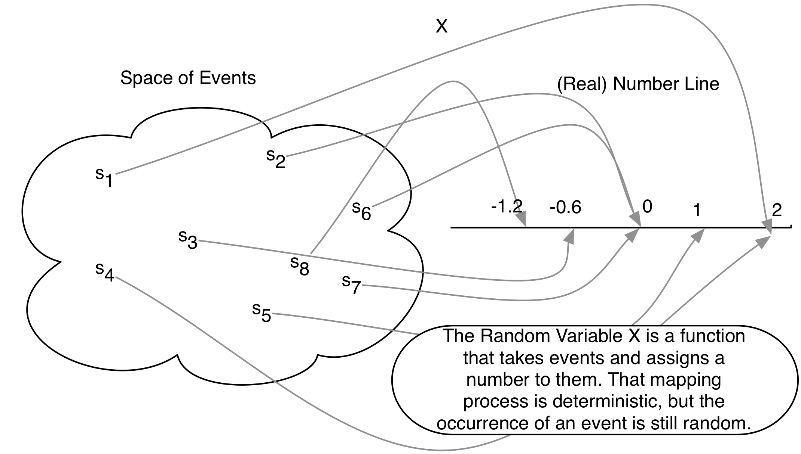

--- 
title: "UCSD Political Science Math Camp"
author: ""
date: "Under Construction"
description: "Text for UCSD Department of Political Science Math Camp"
github-repo: "UCSDPoliSci/MathCamp"
site: bookdown::bookdown_site
documentclass: book
geometry: "margin=1.5in"
biblio-style: apalike
link-citations: yes
cover-image: "./images/logo.png"
---
# About this Booklet {-}
The UC San Diego Math camp is held each year in September. The 2021 Math Camp instructors are Keng-Chi Chang and Rachel Schoner. The faculty coordinator is Molly Roberts.

This booklet serves as the text for the Math Camp, available as a webpage updated automatically. Is it the product of generations of Math Camp instructors and is adapted from the [Harvard Gov Prefresher](https://github.com/IQSS/prefresher). 


For information about the role of this math camp as an introduction to graduate school, you may be interested in ["The Math Prefresher and The Collective Future of Political Science Graduate Training](https://gking.harvard.edu/prefresher), in PS: Political Science & Politics, by Gary King, Shiro Kuriwaki, and Yon Soo Park.

### Authors and Contributors {-}

This material is adapted from previous instructors of the class at UCSD and [Harvard Gov Prefresher](https://github.com/IQSS/prefresher). 

- Past Authors and Instructors:  
- Repository Maintainer: 


### Contributing {-}

We transitioned the booklet into a bookdown [github repository](https://github.com/UCSDPoliSci/MathCamp) in 2021.  As we update this version, we appreciate any bug reports or fixes appreciated. 

All changes should be made in the `.Rmd` files in the project root. To contribute a change, please make a pull request and set the repository maintainer as the reviewer.

<!--chapter:end:index.Rmd-->

# Pre-Math Camp Exercises {-}


Before our first meeting, please try solving these questions. They are a sample of the very beginning of each math section. We have provided links to the parts of the book you can read if the concepts are new to you. 

The goal of this "pre"-math camp assignment is not to intimidate you but to set common expectations so you can make the most out of the actual Math Camp. Even if you do not understand some or all of these questions after skimming through the linked sections, your effort will pay off, and you will be better prepared for the math camp. We are also open to adjusting these expectations based on feedback (this class is for _you_), so please do not hesitate to write to the instructors for feedback. 


## Linear Algebra {-}

### Vectors {-}

Define the vectors $u = \begin{pmatrix} 1 \\2 \\3 \end{pmatrix}$, $v = \begin{pmatrix} 4\\5\\6 \end{pmatrix}$, and the scalar $c = 2$. Calculate the following:

1. $u + v$
2. $cv$
3. $u \cdot v$

If you are having trouble with these problems, please review Section \@ref(vector-def) "Working with Vectors" in Chapter \@ref(linearalgebra). 


Are the following sets of vectors linearly independent?

1. $u = \begin{pmatrix} 1\\ 2\end{pmatrix}$, $v = \begin{pmatrix} 2\\4\end{pmatrix}$


2. $u = \begin{pmatrix} 1\\ 2\\ 5 \end{pmatrix}$, $v = \begin{pmatrix} 3\\ 7\\ 9 \end{pmatrix}$


3. $a = \begin{pmatrix} 2\\ -1\\ 1 \end{pmatrix}$, $b = \begin{pmatrix} 3\\ -4\\ -2 \end{pmatrix}$, $c = \begin{pmatrix} 5\\ -10\\ -8 \end{pmatrix}$ (this requires some guesswork)


If you are having trouble with these problems, please review Section \@ref(linearindependence). 


### Matrices {-}

\[{\bf A}=\begin{pmatrix}
			7 & 5 & 1 \\
			11 & 9 & 3 \\ 
			2 & 14 & 21 \\ 
			4 & 1 & 5
		\end{pmatrix}\]
		
		
What is the dimensionality of matrix ${\bf A}$?

What is the element $a_{23}$ of ${\bf A}$?

Given that 
		
\[{\bf B}=\begin{pmatrix}
			1 & 2 & 8 \\
			3 & 9 & 11 \\ 
			4 & 7 & 5 \\ 
			5 & 1 & 9
		\end{pmatrix}\]
		
What is ${\bf A}$ + ${\bf B}$?


Given that 
		
\[{\bf C}=\begin{pmatrix}
			1 & 2 & 8 \\
			3 & 9 & 11 \\ 
			4 & 7 & 5 \\ 
		\end{pmatrix}\]
		
What is ${\bf A}$ + ${\bf C}$?


Given that 

\[c = 2\]

What is $c$${\bf A}$?

If you are having trouble with these problems, please review Section \@ref(matrixbasics). 


## Operations {-}

### Summation {-}

Simplify the following

1. \(\sum\limits_{i = 1}^3 i\)

2. \(\sum\limits_{k = 1}^3(3k + 2)\)

3. \(\sum\limits_{i= 1}^4 (3k + i + 2)\)


### Products {-}

1. \(\prod\limits_{i= 1}^3 i\)

2. \(\prod\limits_{k=1}^3(3k + 2)\)


To review this material, please see Section \@ref(sum-notation).


### Logs and exponents {-}

Simplify the following

1.  \(4^2\)
2.  \(4^2 2^3\)
3.  \(\log_{10}100\)
4.  \(\log_{2}4\)
5.  \(\log e\), where $\log$ is the natural log (also written as $\ln$) -- a log with base $e$, and $e$ is Euler's constant
6.  \(e^a e^b e^c\), where $a, b, c$ are each constants
7.  \(\log 0\)
8.  \(e^0\)
9.  \(e^1\)
10. \(\log e^2\)

To review this material, please see Section \@ref(logexponents)


## Limits {-}

Find the limit of the following.

1. $\lim\limits_{x \to 2} (x - 1)$
2. $\lim\limits_{x \to 2} \frac{(x - 2) (x - 1)}{(x - 2)}$
3. $\lim\limits_{x \to 2}\frac{x^2 - 3x + 2}{x- 2}$

To review this material please see Section \@ref(limitsfun)


## Calculus {-}

For each of the following functions $f(x)$, find the derivative $f'(x)$ or $\frac{d}{dx}f(x)$

1. $f(x)=c$
2. $f(x)=x$
3. $f(x)=x^2$
4. $f(x)=x^3$
5. $f(x)=3x^2+2x^{1/3}$
6. $f(x)=(x^3)(2x^4)$

For a review, please see Section \@ref(derivintro) - \@ref(derivpoly)

## Optimization {-}

For each of the followng functions $f(x)$, does a maximum and minimum exist in the domain $x \in \mathbf{R}$? If so, for what are those values and for which values of $x$?

1. $f(x) = x$
2. $f(x) = x^2$
3. $f(x) = -(x  - 2)^2$

If you are stuck, please try sketching out a picture of each of the functions.
	

## Probability {-}

1. If there are 12 cards, numbered 1 to 12, and 4 cards are chosen, how many distinct possible choices are there? (unordered, without replacement)
2. Let $A = \{1,3,5,7,8\}$ and $B = \{2,4,7,8,12,13\}$. What is $A \cup B$? What is $A \cap B$? If $A$ is a subset of the Sample Space $S = \{1,2,3,4,5,6,7,8,9,10\}$, what is the complement $A^C$? 
3. If we roll two fair dice, what is the probability that their sum would be 11?
4. If we roll two fair dice, what is the probability that their sum would be 12?


For a review, please see Sections \@ref(setoper) - \@ref(probdef).


<!--chapter:end:00_warmup.Rmd-->

# (PART) Programming {-}


# Orientation and Reading in Data^[Module originally written by Shiro Kuriwaki] {#dataimport}


Welcome to the first in-class session for programming. Up till this point, you should have already:

* Completed the R Visualization and Programming primers (under "The Basics") on your own at <https://rstudio.cloud/learn/primers/>,
* Made an account at RStudio Cloud and join the Math Prefresher 2019 Space, and
* Successfully signed up for the University wi-fi: <https://getonline.harvard.edu/> (Access Harvard Secure with your HarvardKey. Try to get a HarvardKey as soon as possible.)


## Motivation: Data and You {-}

The modal social science project starts by importing existing datasets. Datasets come in all shapes and sizes. As you search for new data you may encounter dozens of file extensions -- csv, xlsx, dta, sav, por, Rdata, Rds, txt, xml, json, shp ... the list continues. Although these files can often be cumbersome, its a good to be able to find a way to encounter any file that your research may call for. 

Reviewing data import will allow us to get on the same page on how computer systems work.


### Where are we? Where are we headed? {-}

Today we'll cover:

* What's what in RStudio
* What R is, at a high level
* How to read in data 
* Comment on coding style on the way

### Check your understanding  {-}

* What is the difference between a file and a folder?
* In the RStudio windows, what is the difference between the "Source" Pane and the "Console"? What is a "code chunk"?
* How do you read a R help page? What is the `Usage` section, the `Values` section, and the `Examples` section?
* What use is the "Environment" Pane?
* How would you read in a spreadsheet in R?
* How would you figure out what variables are in the data? size of the data?
* How would you read in a `csv` file, a `dta` file, a `sav` file?


```{r, include = FALSE, message = FALSE}
library(ggplot2)
library(dplyr)
library(fs)
```


## Orienting

1. We will be using a cloud version of RStudio at <https://rstudio.cloud>. You should join the Math Prefresher Space 2019 from the link that was emailed to you. Each day, click on the project with the day's date on it.

    Although most of you will probably doing your work on RStudio local rather than cloud, we are trying to use cloud because it makes it easier to standardize people's settings.  

2.  RStudio (either cloud or desktop) is a __GUI__ and an IDE for the programming language R. A Graphical User Interface allows users to interface with the software (in this case R) using graphical aids like buttons and tabs. Often we don't think of GUIs because to most computer users, everything is a GUI (like Microsoft Word or your "Control Panel"), but it's always there! A Integrated Development Environment just says that the software to interface with R comes with useful useful bells and whistles to give you shortcuts. 

    The __Console__ is kind of a the core window through which you see your GUI actually operating through R. It's not graphical so might not be as intuitive. But all your results, commands, errors, warnings.. you see them in here. A console tells you what's going on now. 


3. via the GUI, you the analyst needs to sends instructions, or __commands__, to the R application. The verb for this is "run" or "execute" the command. Computer programs ask users to provide instructions in very specific formats. While a English-speaking human can understand a sentence with a few typos in it by filling in the blanks, the same typo or misplaced character would halt a computer program. Each program has its own requirements for how commands should be typed; after all, each of these is its own language. We refer to the way a program needs its commands to be formatted as its __syntax__. 


4.  Theoretically, one could do all their work by typing in commands into the Console. But that would be a lot of work, because you'd have to give instructions each time you start your data analysis. Moreover, you'll have no record of what you did. That's why you need a __script__. This is a type of __code__. It can be referred to as a __source__ because that is the source of your commands. Source is also used as a verb; "source the script" just means execute it.  RStudio doesn't start out with a script, so you can make one from "File > New" or the New file icon.


4.  You can also open scripts that are in folders in your computer. A script is a type of File. Find your Files in the bottom-right "Files" pane. 

    To load a dataset, you need to specify where that file is. Computer files (data, documents, programs) are organized hiearchically, like a branching tree. Folders can contain files, and also other folders.   The GUI toolbar makes this lineaer and hiearchical relationship apparent. When we turn to locate the file in our commands, we need another set of syntax. Importantly, denote the hierarchy of a folder by the `/` (slash) symbol. `data/input/2018-08` indicates the `2018-08` folder, which is included in the `input` folder, which is in turn included in the `data` folder. 

    Files (but not folders) have "file extensions" which you are probably familiar with already: `.docx`, `.pdf`, and `.pdf`. The file extensions you will see in a stats or quantitative social science class are:
    
    * `.pdf`: PDF, a convenient format to view documents and slides in, regardless of Mac/Windows.
    * `.csv`: A comma separated values file
    * `.xlsx`: Microsoft Excel file
    * `.dta`: Stata data
    * `.sav`: SPSS data
    
    * `.R`: R code (script)
    * `.Rmd`: Rmarkdown code (text + code)
    * `.do`: Stata code (script)


5.   In R, there are two main types of scripts. A classic `.R` file and a `.Rmd` file (for Rmarkdown). A .R file is just lines and lines of R code that is meant to be inserted right into the Console. A .Rmd tries to weave code and English together, to make it easier for users to create reports that interact with data and intersperse R code with explanation. For example, we built this book in Rmds. 

    The Rmarkdown facilitates is the use of __code chunks__, which are used here. These start and end with three back-ticks. In the beginning, we can add options in curly braces (`{}`). Specifying `r` in the beginning tells to render it as R code. Options like `echo = TRUE` switch between showing the code that was executed or not; `eval = TRUE` switch between evaluating the code. More about Rmarkdown in Section \@ref(nonwysiwyg). For example, this code chunk would evaluate `1 + 1` and show its output when compiled, but not display the code that was executed.


\newpage
## But what is R?
R is an object oriented programming language primarily used for statistical computing. An object oriented language is a programming language built around manipulating objects. 

* In R, objects can be matrices, vectors, scalars, strings, and data frames, for example
* Objects contain different types of information
* Different objects have different allowable procedures:

```{r}
# Adding a string and a string does not work because the '+' operator 
# does not work for strings:

# 'Harvard' + 'Gov'

# The '+' operator can add numbers just fine
9 + 13

# Reminder: to figure out the type of an object use:
x <- 9
class(9)
class(x)
class('Harvard')
```

Object oriented programming makes languages flexible and powerful:

* You can create custom functions and objects for your needs
* Other people can create great packages for everyone to use
* Many errors come from using the wrong data type and a lot of programming in R is getting data into the right format and type to work with.

It is helpful to think in terms of object manipulation at a high level while programming in R, particularly at the beginning of tackling a new problem. Think about what objects you want to manipulate, what types they are, and how they fit together. Once you have the logic of your solution ready then you can write it in R.


## The Computer and You: Giving Instructions

We'll do the Peanut Butter and Jelly Exercise in class as an introduction to programming for those who are new.^[This Exercise is taken from Harvard's Introductory Undergraduate Class, CS50 (<https://www.youtube.com/watch?v=kcbT3hrEi9s>), and many other writeups.]

Assignment: Take 5 minutes to write down on a piece of paper, how to make a peanut butter and jelly sandwich. Be as concise and unambiguous as possible so that a robot (who doesn't know what a PBJ is) would understand. You can assume that there will be loaf of sliced bread, a jar of jelly, a jar of peanut butter, and a knife. 

Simpler assignment: Say we just want a robot to be able to tell us if we have enough ingredients to make a peanut butter and jelly sandwich. Write down instructions so that if told how many slices of bread, servings of peanut butter, and servings of jelly you have, the robot can tell you if you can make a PBJ.

Now, translate the simpler assignment into R code using the code below as a starting point:

```{r}
n_bread <- 8
n_pb <- 3
n_jelly <- 9

# write instructions in R here


```


## Base-R vs. tidyverse 

One last thing before we jump into data. Many things in R and other open source packages have competing standards. A lecture on a technique inevitably biases one standard over another. Right now among R users in this area, there are two families of functions: base-R and tidyverse.  R instructors thus face a dilemma about which to teach primarily.^[See for example this community discussion: https://community.rstudio.com/t/base-r-and-the-tidyverse/2965/17]

In this prefresher, we try our best to choose the one that is most useful to the modal task of social science researchers, and make use of the tidyverse functions in most applications. but feel free to suggest changes to us or to the booklet. 

Although you do not need to choose one over the other, for beginners it is confusing what is a tidyverse function and what is not. Many of the tidyverse _packages_ are covered in this 2017 graphic below, and the cheat-sheets that other programmers have written: https://www.rstudio.com/resources/cheatsheets/


The following side-by-side comparison of commands for a particular function compares some tidyverse and non-tidyverse functions (which we refer to loosely as base-R). This list is not meant to be comprehensive and more to give you a quick rule of thumb.

### Dataframe subsetting {-}

| In order to ...        | in tidyverse: | in base-R:  |
|----------------------|:------------------------|:----------------------|
| Count each category | `count(df, var)` | `table(df$var)`|
| Filter rows by condition | `filter(df, var == "Female") ` | `df[df$var == "Female", ]` or `subset(df, var == "Female")` |
| Extract columns | `select(df, var1, var2)`| `df[, c("var1", "var2")]` |
| Extract a single column as a vector |  `pull(df, var)` | `df[["var"]]` or `df[, "var"]` |
| Combine rows | `bind_rows()` | `rbind()` |
| Combine columns | `bind_cols()` | `cbind()` |
| Create a dataframe | `tibble(x = vec1, y = vec2)`| `data.frame(x = vec1, y = vec2)` |
| Turn a dataframe into a tidyverse dataframe | `tbl_df(df)` | |


Remember that tidyverse applies to _dataframes_ only, not vectors. For subsetting vectors, use the base-R functions with the square brackets.


### Read data {-}

Some non-tidyverse functions are not quite "base-R" but have similar relationships to tidyverse. For these, we recommend using the _tidyverse_ functions as a general rule due to their common format, simplicity, and scalability. 

| In order to ...        | in tidyverse: | in base-R:  |
|----------------------|:------------------------|:----------------------|
| Read a Excel file | `read_excel()` | `read.xlsx()` |
| Read a csv | `read_csv()` | `read.csv()` |
| Read a Stata file |  `read_dta()` | `read.dta()` |
| Substitute strings | `str_replace()` | `gsub()` |
| Return matching strings | `str_subset()` | `grep(., value = TRUE)` |
| Merge `data1` and `data2` on variables  `x1` and `x2` | `left_join(data1, data2, by = c("x1", "x2"))` | `merge(data1, data2, by.x = "x1", by.y = "x2", all.x = TRUE)` |


### Visualization {-}

Plotting by ggplot2 (from your tutorials) is also a tidyverse family.

| In order to ...        | in tidyverse: | in base-R:  |
|----------------------|:------------------------|:----------------------|
| Make a scatter plot | `ggplot(data, aes(x, y)) + geom_point()` | `plot(data$x, data$y)` |
| Make a line plot | `ggplot(data, aes(x, y)) + geom_line()` | `plot(data$x, data$y, type = "l")` |
| Make a histogram | `ggplot(data, aes(x, y)) + geom_histogram()` | `hist(data$x, data$y)` |
| Make a barplot | See Section \@ref(dataviz) | See Section \@ref(dataviz)|


## A is for Athens

For our first dataset, let's try reading in a dataset on the Ancient Greek world. Political Theorists and Political Historians study the domestic systems, international wars, cultures and writing of this era to understand the first instance of democracy, the rise and overturning of tyranny, and the legacies of political institutions. 

This POLIS dataset was generously provided by Professor Josiah Ober of Stanford University. This dataset includes information on city states in the Ancient Greek world, parts of it collected by careful work by historians and archaeologists. It is part of his recent books on Greece (Ober 2015), "The Rise and Fall of Classical Greece"^[[Ober, Josiah (2015). _The Rise and Fall of Classical Greece_. Princeton University Press.](https://press.princeton.edu/titles/10423.html)] and Institutions in Ancient Athens (Ober 2010) , "Democracy and Knowledge: Innovation and Learning in Classical Athens."^[[Ober, Josiah (2010). _Democracy and Knowledge: Innovation and Learning in Classical Athens_. Princeton University Press.](https://press.princeton.edu/titles/8742.html)]

### Locating the Data 
What files do we have in the `data/input` folder?

```{r, echo = FALSE}
dir_ls("data/input")
```

A typical file format is Microsoft Excel. Although this is not usually the best format for R because of its highly formatted structure as opposed to plain text (more on this in Section \ref@(sec:wysiwyg)), recent packages have made this fairly easy. 


### Reading in Data


In Rstudio, a good way to start is to use the GUI and the Import tool. Once you click a file, an option to "Import Dataset" comes up. RStudio picks the right function for you, and you can copy that code, but it's important to eventually be able to write that code yourself. 

For the first time using an outside package, you first need to install it. 
```{r, eval = FALSE}
install.packages("readxl")
```

After that, you don't need to install it again. But you __do__ need to load it each time. 

```{r, eval = FALSE}
library(readxl)
```

The package `readxl` has a website: https://readxl.tidyverse.org/. Other packages are not as user-friendly, but they have a help page with a table of contents of all their functions. 

```{r, eval = FALSE}
help(package = readxl)
```

From the help page, we see that `read_excel()` is the function that we want to use. 

Let's try it. 

```{r}
library(readxl)
ober <- read_excel("data/input/ober_2018.xlsx")
```

Review: what does the `/` mean?  Why do we need the `data` term first? Does the argument need to be in quotes? 


### Inspecting 

For almost any dataset, you usually want to do a couple of standard checks first to understand what you loaded.


```{r}
ober
```


```{r}
dim(ober)
```

From your tutorials, you also know how to do graphics! Graphics are useful for grasping your data, but we will cover them more deeply in Chapter \@ref(dataviz).

```{r}
ggplot(ober, aes(x = Fame)) + geom_histogram()
```

What about the distribution of fame by regime?
```{r}
ggplot(ober, aes(y = Fame, x = Regime, group = Regime)) +
  geom_boxplot()
```

What do the 1's, 2's, and 3's stand for? 

### Finding observations

These `tidyverse` commands from the `dplyr` package are newer and not built-in, but they are one of the increasingly more popular ways to wrangle data. 

* 80 percent of your data wrangling needs might be doable with these basic `dplyr` functions: `select`, `mutate`, `group_by`, `summarize`, and `arrange`.
* These verbs roughly correspond to the same commands in SQL, another important language in data science. 
* The `%>%` symbol is a pipe. It takes the thing on the left side and pipes it down to the function on the right side. We could have done `count(cen10, race)` as `cen10 %>% count(race)`. That means take `cen10` and pass it on to the function `count`, which will count observations by race and return a collapsed dataset with the categories in its own variable and their respective counts in `n`.


### Extra: A sneak peak at Ober's data


Although this is a bit beyond our current stage, it's hard to resist the temptation to see what you can do with data like this.  For example, you can map it.^[In mid-2018, changes in Google's services made it no longer possible to render maps on the fly. Therefore, the map is not currently rendered automatically (but can be rendered once the user registers their API).  Instead, you now need to register with Google. See the [change](https://github.com/dkahle/ggmap/blob/e55c0b22b0d16a010b4b45dd2fce800ff0ef19b8/NEWS#L6-L12) to the pacakge ggmap.]

Using the `ggmap` package
```{r message=FALSE, warning=FALSE, eval = FALSE}
library(ggmap)
```

First get a map of the Greek world.
```{r, message=FALSE, warning=FALSE, eval = FALSE}
greece <- get_map(location = c(lon = 22.6382849, lat = 39.543287),
                  zoom = 5, 
                  source = "stamen",
                  maptype = "toner")
ggmap(greece)
```


I chose the specifications for arguments `zoom` and `maptype` by looking at the webpage and Googling some examples.


Ober's data has the latitude and longitude of each polis. Because the map of Greece has the same coordinates, we can add the polei on the same map. 

```{r, warning=FALSE, eval = FALSE}
gg_ober <- ggmap(greece) +
  geom_point(data = ober, 
             aes(y = Latitude, x = Longitude), 
             size = 0.5,
             color = "orange")
gg_ober + 
  scale_x_continuous(limits = c(10, 35)) + 
  scale_y_continuous(limits = c(32, 44)) +
  theme_void()
```


## Exercises {-}

### 1 {-}

What is the Fame value of Delphoi?

```{r}
# Enter here
```


### 2 {-}

Find the polis with the top 10 Fame values.

```{r}
# Enter here
```


### 3 {-}

Make a scatterplot with the number of colonies on the x-axis and Fame on the y-axis.

```{r}
# Enter here
```


### 4 {-}
Find the correct function to read the following datasets (available in your rstudio.cloud session) into your R window.


* `data/input/acs2015_1percent.csv`: A one percent sample of the American Community Survey
* `data/input/gapminder_wide.tab`: Country-level wealth and health from Gapminder^[Formatted and taken from <https://doi.org/10.7910/DVN/GJQNEQ>]
* `data/input/gapminder_wide.Rds`: A Rds version of the Gapminder (What is a Rds file? What's the difference?)
* `data/input/Nunn_Wantchekon_sample.dta`: A sample from the Afrobarometer survey (which we'll explore tomorrow). `.dta` is a Stata format. 
* `data/input/german_credit.sav`: A hypothetical dataset on consumer credit. `.sav` is a SPSS format. 

Our Recommendations: Look at the packages `haven` and `readr`


```{r}
# Enter here, perhaps making a chunk for each file.
```


### 5 {-}
Read Ober's codebook and find a variable that you think is interesting. Check the distribution of that variable in your data, get a couple of statistics, and summarize it in English.

```{r}
# Enter here
```


### 6 {-}
This is day 1 and we covered a lot of material. Some of you might have found this completely new; others not so. Please click through this survey before you leave so we can adjust accordingly on the next few days.

<https://harvard.az1.qualtrics.com/jfe/form/SV_8As7Y7C83iBiQzH>

<!--chapter:end:11_data-handling_counting.Rmd-->

#  Manipulating Vectors and  Matrices^[Module originally written by Shiro Kuriwaki and Yon Soo Park] {#rmatrices}

```{r, include=FALSE, message = FALSE, warning = FALSE}
library(dplyr)
library(readr)
library(haven)
library(ggplot2)
```

### Motivation {-}

[Nunn and Wantchekon (2011)](https://dash.harvard.edu/bitstream/handle/1/11986331/nunn-slave-trade.pdf) --  "The Slave Trade and the Origins of Mistrust in Africa"^[[Nunn, Nathan, and Leonard Wantchekon. 2011. “The Slave Trade and the Origins of Mistrust in Africa.” American Economic Review 101(7): 3221–52.](https://dash.harvard.edu/bitstream/handle/1/11986331/nunn-slave-trade.pdf)] --  argues that across African countries, the distrust of co-ethnics fueled by the slave trade has had long-lasting effects on modern day trust in these territories. They argued that the slave trade created distrust in these societies in part because as some African groups were employed by European traders to capture their neighbors and bring them to the slave ships.

Nunn and Wantchekon use a variety of statistical tools to make their case (adding controls, ordered logit, instrumental variables, falsification tests, causal mechanisms), many of which will be covered in future courses. In this module we will only touch on their first set of analysis that use Ordinary Least Squares (OLS). OLS is likely the most common application of linear algebra in the social sciences. We will cover some linear algebra, matrix manipulation, and vector manipulation from this data. 


### Where are we? Where are we headed? {-}

Up till now, you should have covered:

* R basic programming
* Data Import
* Statistical Summaries.


Today we'll cover

* Matrices & Dataframes in R
* Manipulating variables 
* And other `R` tips


## Read Data


```{r}
library(haven)
nunn_full <- read_dta("data/input/Nunn_Wantchekon_AER_2011.dta")
```


Nunn and Wantchekon's main dataset has more than 20,000 observations. Each observation is a respondent from the Afrobarometer survey.
```{r}
head(nunn_full)
colnames(nunn_full)
```


First, let's consider a small subset of this dataset. 
```{r, include = FALSE, eval = FALSE}
set.seed(02138)
sample <- sample_n(nunn_full, 10)
sample <- select(sample, trust_neighbors, exports, ln_exports, export_area, ln_export_area)
write_dta(sample, "data/input/Nunn_Wantchekon_sample.dta")
```

```{r}
nunn <- read_dta("data/input/Nunn_Wantchekon_sample.dta")
```

```{r}
nunn
```


## data.frame vs. matricies
This is a `data.frame` object. 
```{r}
class(nunn)
```


But it can be also consider a matrix in the linear algebra sense. What are the dimensions of this matrix?
```{r}
nrow(nunn)
```

`data.frame`s and matrices have much overlap in `R`, but to explicitly treat an object as a matrix, you'd need to coerce its class. Let's call this matrix `X`.

```{r}
X <- as.matrix(nunn)
```


What is the difference between a `data.frame` and a matrix? A `data.frame` can have columns that are of different types, whereas --- in a matrix --- all columns must be of the same type (usually either "numeric" or "character").


You can think of data frames maybe as matrices-plus, because a column can take on characters as well as numbers. As we just saw, this is often useful for real data analyses.


Another way to think about data frames is that it is a type of list. Try the `str()` code below and notice how it is organized in slots. Each slot is a vector. They can be vectors of numbers or characters.
```{r, eval = FALSE}
# enter this on your console
str(cen10)
```


## Handling matricies in `R`

You can easily transpose a matrix
```{r}
X
t(X)
```


What are the values of all rows in the first column? 
```{r}
X[, 1]
```

What are all the values of "exports"? (i.e. return the whole "exports" column)
```{r}
X[, "exports"]
```

What is the first observation (i.e. first row)?
```{r}
X[1, ]
```

What is the value of the first variable of the first observation?
```{r}
X[1, 1]
```

Pause and consider the following problem on your own. What is the following code doing? 
```{r}
X[X[, "trust_neighbors"] == 0, "export_area"]
```
Why does it give the same output as the following? 
```{r}
X[which(X[, "trust_neighbors"] == 0), "export_area"]
```


Some more manipulation 
```{r}
X + X
```

```{r}
X - X
```

```{r}
t(X) %*% X
```

```{r}
cbind(X, 1:10)
```

```{r}
cbind(X, 1)
```


```{r}
colnames(X)
```


## Variable Transformations

`exports` is the total number of slaves that were taken from the individual's ethnic group between Africa's four slave trades between 1400-1900. 

What is `ln_exports`? The article describes this as the natural log of one plus the `exports`. This is a transformation of one column by a particular function

```{r}
log(1 + X[, "exports"])
```
Question for you: why add the 1? 

Verify that this is the same as `X[, "ln_exports"]`


## Linear Combinations

In Table 1 we see "OLS Estimates". These are estimates of OLS coefficients and standard errors. You do not need to know what these are for now, but it doesn't hurt to getting used to seeing them. 


A very crude way to describe regression is through linear combinations. The simplest linear combination is a one-to-one transformation.

Take the first number in Table 1, which is -0.00068. Now, multiply this by `exports`

```{r}
-0.00068 * X[, "exports"]
```


Now, just one more step. Make a new matrix with just exports and the value 1
```{r}
X2 <- cbind(1, X[, "exports"])
```

name this new column "intercept"

```{r}
colnames(X2)
```

```{r}
colnames(X2) <- c("intercept", "exports")
```


What are the dimensions of the matrix `X2`?
```{r}
dim(X2)
```


Now consider a new matrix, called `B`.

```{r}
B <- matrix(c(1.62, -0.00068))
```

What are the dimensions of `B`?
```{r}
dim(B)
```


What is the product of `X2` and `B`? From the dimensions, can you tell if it will be conformable?
```{r}
X2 %*% B
```

What is this multiplication doing in terms of equations?


```{r, echo = FALSE, eval = FALSE}
## FYI regression in Table 1 (without cluster SEs)

form <- "trust_neighbors ~ exports + age + age2 +  male + urban_dum + factor(education) + factor(occupation) + factor(religion) + factor(living_conditions) + district_ethnic_frac + frac_ethnicity_in_district + isocode"
lm_1_1 <- lm(as.formula(form), nunn_full)
summary(lm_1_1)
```


## Matrix Basics


Let's take a look at Matrices in the context of R

```{r, message = FALSE}
cen10 <- read_csv("data/input/usc2010_001percent.csv")
head(cen10)
```

What is the dimension of this dataframe? What does the number of rows represent? What does the number of columns represent?
```{r, message = FALSE}
dim(cen10)
nrow(cen10)
ncol(cen10)
```


What variables does this dataset hold? What kind of information does it have?

```{r, message = FALSE}
colnames(cen10)
```

We can access column vectors, or vectors that contain values of variables by using the $ sign

```{r, message = FALSE}
head(cen10$state)

head(cen10$race)
```

We can look at a unique set of variable values by calling the unique function


```{r, message = FALSE}
unique(cen10$state)
```

How many different states are represented (this dataset includes DC as a state)? 

```{r, message = FALSE}
length(unique(cen10$state))
```

Matrices are rectangular structures of numbers (they have to be numbers, and they can't be characters).

A cross-tab can be considered a matrix:
```{r}
table(cen10$race, cen10$sex)
```


```{r}
cross_tab <- table(cen10$race, cen10$sex)
dim(cross_tab)
cross_tab[6, 2]
```


But a subset of your data -- individual values-- can be considered a matrix too. 


```{r, warning = FALSE}
# First 20 rows of the entire data
# Below two lines of code do the same thing
cen10[1:20, ]

cen10 %>% slice(1:20)

# Of the first 20 rows of the entire data, look at values of just race and age
# Below two lines of code do the same thing
cen10[1:20, c("race", "age")]

cen10 %>% slice(1:20) %>% select(race, age)
```

A vector is a special type of matrix with only one column or only one row 
```{r}

# One column
cen10[1:10, c("age")]

cen10 %>% slice(1:10) %>% select(c("age"))

# One row
cen10[2, ]

cen10 %>% slice(2)
```

What if we want a special subset of the data? For example, what if I only want the records of individuals in California? What if I just want the age and race of individuals in California?
```{r}
# subset for CA rows
ca_subset <- cen10[cen10$state == "California", ]

ca_subset_tidy <- cen10 %>% filter(state == "California")

all_equal(ca_subset, ca_subset_tidy)

# subset for CA rows and select age and race
ca_subset_age_race <- cen10[cen10$state == "California", c("age", "race")]

ca_subset_age_race_tidy <- cen10 %>% filter(state == "California") %>% select(age, race)

all_equal(ca_subset_age_race, ca_subset_age_race_tidy)
```

Some common operators that can be used to filter or to use as a condition. Remember, you can use the unique function to look at the set of all values a variable holds in the dataset. 
```{r}
# all individuals older than 30 and younger than 70
s1 <- cen10[cen10$age > 30 & cen10$age < 70, ]
s2 <- cen10 %>% filter(age > 30 & age < 70)
all_equal(s1, s2)

# all individuals in either New York or California
s3 <- cen10[cen10$state == "New York" | cen10$state == "California", ]
s4 <- cen10 %>% filter(state == "New York" | state == "California")
all_equal(s3, s4)


# all individuals in any of the following states: California, Ohio, Nevada, Michigan
s5 <- cen10[cen10$state %in% c("California", "Ohio", "Nevada", "Michigan"), ]
s6 <- cen10 %>% filter(state %in% c("California", "Ohio", "Nevada", "Michigan"))
all_equal(s5, s6)

# all individuals NOT in any of the following states: California, Ohio, Nevada, Michigan
s7 <- cen10[!(cen10$state %in% c("California", "Ohio", "Nevada", "Michigan")), ]
s8 <- cen10 %>% filter(!state %in% c("California", "Ohio", "Nevada", "Michigan"))
all_equal(s7, s8)
```

## Checkpoint {-}


### 1 {-}
Get the subset of cen10 for non-white individuals (Hint: look at the set of values for the race variable by using the unique function)
```{r}
# Enter here
```

### 2 {-}
Get the subset of cen10 for females over the age of 40
```{r}
# Enter here
```


### 3 {-}
Get all the serial numbers for black, male individuals who don't live in Ohio or Nevada.
```{r}
# Enter here
```


## Exercises {-}

### 1 {-}

Let
\[\mathbf{A} = \left[\begin{array}
{rrr}
0.6 & 0.2\\
0.4 & 0.8\\
\end{array}\right]
\]

Use R to write code that will create the matrix $A$, and then  consecutively multiply $A$ to itself 4 times. What is the value of $A^{4}$? 

```{r}
## Enter yourself
```


Note that R notation of matrices is different from the math notation. Simply trying `X^n` where `X` is a matrix will only take the power of each element to `n`. Instead, this problem asks you to perform matrix multiplication.


### 2 {-}
Let's apply what we learned about subsetting or filtering/selecting. Use the `nunn_full` dataset you have already loaded

a) First, show all observations (rows) that have a `"male"` variable higher than 0.5

```{r}
## Enter yourself
```

b) Next, create a matrix / dataframe with only two columns: `"trust_neighbors"` and `"age"`

```{r}
## Enter yourself
```

c) Lastly, show all values of `"trust_neighbors"` and `"age"` for observations (rows) that have the "male" variable value that is higher than 0.5

```{r}
## Enter yourself
```

### 3 {-}

Find a way to generate a vector of "column averages" of the matrix `X` from the Nunn and Wantchekon data in one line of code. Each entry in the vector should contain the sample average of the values in the column. So a 100 by 4 matrix should generate a length-4 matrix.


### 4 {-}

Similarly, generate a vector of "column medians". 


### 5 {-}

Consider the regression that was run to generate Table 1:
```{r}
form <- "trust_neighbors ~ exports + age + age2 +  male + urban_dum + factor(education) + factor(occupation) + factor(religion) + factor(living_conditions) + district_ethnic_frac + frac_ethnicity_in_district + isocode"
lm_1_1 <- lm(as.formula(form), nunn_full)

# The below coef function returns a vector of OLS coefficiants
coef(lm_1_1)
```
First, get a small subset of the nunn_full dataset. This time, sample 20 rows and select for variables `exports`, `age`, `age2`, `male`, and `urban_dum`. To this small subset, add (`bind_cols()` in tidyverse or `cbind()` in base R) a column of 1's; this represents the intercept. If you need some guidance, look at how we sampled 10 rows selected for a different set of variables above in the lecture portion. 
```{r}
# Enter here
```

Next let's try calculating predicted values of levels of trust in neighbors by multiplying coefficients for the intercept, `exports`, `age`, `age2`, `male`, and `urban_dum` to the actual observed values for those variables in the small subset you've just created. 
```{r}
# Hint: You can get just selected elements from the vector returned by coef(lm_1_1)

# For example, the below code gives you the first 3 elements of the original vector
coef(lm_1_1)[1:3]

# Also, the below code gives you the coefficient elements for intercept and male
coef(lm_1_1)[c("(Intercept)", "male")]
```

<!--chapter:end:12_matricies-manipulation.Rmd-->

# Objects, Functions, Loops {#robjloops}


### Where are we? Where are we headed? {-}

Up till now, you should have covered:

* R basic programming
* Data Import
* Statistical Summaries
* Visualization


Today we'll cover

* Objects
* Functions
* Loops


## What is an object?

Now that we have covered some hands-on ways to use graphics, let's go into some fundamentals of the R language. 

Let's first set up 

```{r, message=FALSE, warning=FALSE}
library(dplyr)
library(readr)
library(haven)
library(ggplot2)
```


```{r}
cen10 <- read_csv("data/input/usc2010_001percent.csv", col_types = cols())
```


Objects are abstract symbols in which you store data. Here we will create an object from `copy`, and assign `cen10` to it. 

```{r}
copy <- cen10 
```


This looks the same as the original dataset:
```{r}
copy
```


What happens if you do this next?
```{r}
copy <- ""
```


It got reassigned:
```{r}
copy
```


### lists

Lists are one of the most generic and flexible type of object. You can make an empty list by the function `list()`

```{r}
my_list <- list()
my_list
```

And start filling it in. Slots on the list are invoked by double square brackets `[[]]`

```{r}
my_list[[1]] <- "contents of the first slot -- this is a string"
my_list[["slot 2"]] <- "contents of slot named slot 2"
my_list
```

each slot can be anything. What are we doing here? We are defining the 1st slot of the list `my_list` to be a vector `c(1, 2, 3, 4, 5)`
```{r}
my_list[[1]] <- c(1, 2, 3, 4, 5)
my_list
```


You can even make nested lists. Let's say we want the 1st slot of the list to be another list of three elements. 

```{r}
my_list[[1]][[1]] <- "subitem 1 in slot 1 of my_list"
my_list[[1]][[2]] <- "subitem 1 in slot 2 of my_list"
my_list[[1]][[3]] <- "subitem 1 in slot 3 of my_list"

my_list
```


## Making your own objects
We've covered one type of object, which is a list. You saw it was quite flexible. How many types of objects are there? 

There are an infinite number of objects, because people make their own class of object. You can detect the type of the object (the class) by the function `class`

Object can be said to be an instance of a class.

___Analogies___: 

__class__ - Pokemon, __object__ - Pikachu

__class__ - Book, __object__ - To Kill a Mockingbird

__class__ - DataFrame, __object__ - 2010 census data

__class__ - Character, __object__ - "Programming is Fun"
           

What is type (class) of object is `cen10`?
```{r}
class(cen10)
```


What about this text? 
```{r}
class("some random text")
```


To change or create the class of any object, you can _assign_ it. To do this, assign the name of your class to character to an object's `class()`. 

We can start from a simple list. For example, say we wanted to store data about pokemon. Because there is no pre-made package for this, we decide to make our own class. 

```{r}
pikachu <- list(name = "Pikachu",
                number = 25,
                type = "Electric",
                color = "Yellow")
```


and we can give it any class name we want. 
```{r}
class(pikachu) <- "Pokemon"
str(pikachu)
pikachu$type

```


### Seeing R through objects
Most of the R objects that you will see as you advance are their own objects. For example, here's a linear regression object (which you will learn more about in Gov 2000):
```{r}
ols <- lm(mpg ~ wt + vs + gear + carb, mtcars)
class(ols)
```


Anything can be an object! Even graphs (in `ggplot`) can be assigned, re-assigned, and edited. 

```{r, warning=FALSE}

grp_race <- group_by(cen10, race)%>%
  summarize(count = n())

grp_race_ordered <- arrange(grp_race, count) %>% 
  mutate(race = forcats::as_factor(race))

gg_tab <- ggplot(data = grp_race_ordered) +
  aes(x = race, y = count) +
  geom_col() +
  labs(caption = "Source: U.S. Census 2010")

gg_tab
```


You can change the orientation
```{r}
gg_tab<- gg_tab + coord_flip()
```


### Parsing an object by `str()s`
It can be hard to understand an `R` object because it's contents are unknown. The function `str`, short for structure, is a quick way to look into the innards of an object

```{r}
str(my_list)
class(my_list)
```

Same for the object we just made
```{r}
str(pikachu)
```


What does a `ggplot` object look like? Very complicated, but at least you can see it:

```{r, eval = FALSE}
# enter this on your console
str(gg_tab)
```


## Types of variables
In the social science we often analyze variables. As you saw in the tutorial, different types of variables require different care. 

A key link with what we just learned is that variables are also types of R objects. 

### scalars
One number. How many people did we count in our Census sample?
```{r}
nrow(cen10)
```

Question: What proportion of our census sample is Native American? This number is also a scalar
```{r}
# Enter yourself
unique(cen10$race)
mean(cen10$race == "American Indian or Alaska Native")
```

Hint: you can use the function `mean()` to calcualte the sample mean. The sample proportion is the mean of a sequence of number, where your event of interest is a 1 (or `TRUE`) and others are 0 (or `FALSE`).


### numeric vectors

A sequence of numbers. 

```{r}
grp_race_ordered$count
class(grp_race_ordered$count)
```

Or even, all the ages of the millions of people in our Census. Here are just the first few numbers of the list. 
```{r}
head(cen10$age)
```

### characters (aka strings)

This can be just one stretch of characters 
```{r}
my_name <- "Meg"
my_name
class(my_name)
```

or more characters. Notice here that there's a difference between a vector of individual characters and a length-one object of characters.
```{r}
my_name_letters <-  c("M","e","g")
my_name_letters
class(my_name_letters)
```

Finally, remember that lower vs. upper case matters in R!
```{r}
my_name2 <- "shiro"
my_name == my_name2
```


## What is a function?

Most of what we do in R is executing a function. `read_csv()`, `nrow()`, `ggplot()` .. pretty much anything with a parentheses is a function. And even things like `<-` and `[` are functions as well.

A function is a set of instructions with specified ingredients. It takes an __input__, then __manipulates__ it -- changes it in some way -- and then returns the manipulated product. 

One way to see what a function actually does is to enter it without parentheses. 
```{r, eval = FALSE}
# enter this on your console
table
```
You'll see below that the most basic functions are quite complicated internally. 

You'll notice that functions contain other functions. _wrapper_ functions are functions that "wrap around" existing functions. This sounds redundant, but it's an important feature of programming. If you find yourself repeating a command more than two times, you should make your own function, rather than writing the same type of code. 


### Write your own function
It's worth remembering the basic structure of a function. You create a new function, call it `my_fun` by this:
```{r, eval = F}
my_fun <- function() {
  
}
```

If we wanted to generate a function that computed the number of men in your data, what would that look like?

```{r}
count_men <- function(data) {
  
  nmen <- sum(data$sex == "Male")
  
  return(nmen)
}
```


Then all we need to do is feed this function a dataset
```{r}
count_men(cen10)
```

The point of a function is that you can use it again and again without typing up the set of constituent manipulations. So, what if we wanted to figure out the number of men in California?

```{r}
count_men(cen10[cen10$state == "California",])
```


Let's go one step further. What if we want to know the proportion of non-whites in a state, just by entering the name of the state? There's multiple ways to do it, but it could look something like this

```{r}
nw_in_state <- function(data, state) {
  
  s.subset <- data[data$state == state,]
  total.s <- nrow(s.subset)
  nw.s <- sum(s.subset$race != "White")
  
  nw.s / total.s
}
```

The last line is what gets generated from the function. To be more explicit you can wrap the last line around `return()`. (as in `return(nw.s/total.s`). `return()` is used when you want to break out of a function in the middle of it and not wait till the last line.

Try it on your favorite state!
```{r}
nw_in_state(cen10, "Massachusetts")

```


## Checkpoint {-}


### 1 {-}

Try making your own function, `average_age_in_state`, that will give you the average age of people in a given state.
```{r}
# Enter on your own

```


### 2 {-}

Try making your own function, `asians_in_state`, that will give you the number of `Chinese`, `Japanese`, and `Other Asian or Pacific Islander` people in a given state.
```{r}
# Enter on your own
```

### 3 {-}

Try making your own function, 'top_10_oldest_cities', that will give you the names of cities whose population's average age is top 10 oldest. 

```{r}
# Enter on your own
```


## What is a package?
You can think of a package as a suite of functions that other people have already built for you to make your life easier. 

```{r}
help(package = "ggplot2")
```


To use a package, you need to do two things: (1) install it, and then (2) load it. 

Installing is a one-time thing
```{r, eval = FALSE}
install.packages("ggplot2")
```

But you need to load each time you start a  R instance. So always keep these commands on a script.
```{r}
library(ggplot2)
```


In `rstudio.cloud`, we already installed a set of packages for you. But when you start your own R instance, you need to have installed the package at some point. 

## Conditionals

Sometimes, you want to execute a command only under certain conditions. This is done through the almost universal function, `if()`. Inside the `if` function we enter a logical statement. The line that is adjacent to, or follows, the `if()` statement only gets executed if the statement returns `TRUE`. 

For example, 

For example, 

```{r}
x <- 5
if (x >0) {
  print("positive number")
} else if (x == 0)  {
  print ("zero")
} else {
  print("negative number")
}
```

You can wrap that whole things in a function 

```{r, warning = FALSE}
is_positive <- function(number) {
  if (number >0) {
    print("positive number")
  } else if (number == 0)  {
    print ("zero")
  } else {
    print("negative number")
  }
}

is_positive(5)
is_positive(-3)
```
## For-loops

Loops repeat the same statement, although the statement can be "the same" only in an abstract sense.  Use the `for(x in X)` syntax to repeat the subsequent command as many times as there are elements in the right-hand object `X`. Each of these elements will be referred to the left-hand index `x`

First, come up with a vector. 
```{r}
fruits <- c("apples", "oranges", "grapes")
```

Now we use the `fruits` vector in a `for` loop.

```{r}
for (fruit in fruits) {
  print(paste("I love", fruit))
}
``` 

Here `for()` and `in` must be part of any for loop. The right hand side `fruits` must be a thing that exists. Finally the `left-hand` side object is "Pick your favor name." It is analogous to how we can index a sum with any letter. $\sum_{i=1}^{10}i$ and `sum_{j = 1}^{10}j` are in fact the same thing.


```{r}
for (i in 1:length(fruits)) {
  print(paste("I love", fruits[i]))
}
``` 

```{r}
states_of_interest <- c("California", "Massachusetts", "New Hampshire", "Washington")

for( state in states_of_interest){
  state_data <- cen10[cen10$state == state,]
  nmen <- sum(state_data$sex == "Male")

  n <- nrow(state_data)
  men_perc <- round(100*(nmen/n), digits=2)
  print(paste("Percentage of men in",state, "is", men_perc))

}

``` 

Instead of printing, you can store the information in a vector
```{r}
states_of_interest <- c("California", "Massachusetts", "New Hampshire", "Washington")
male_percentages <- c()
iter <-1 

for( state in states_of_interest){
  state_data <- cen10[cen10$state == state,]
  nmen <- sum(state_data$sex == "Male")
  n <- nrow(state_data)
  men_perc <- round(100*(nmen/n), digits=2)
  
  male_percentages <- c(male_percentages, men_perc)
  names(male_percentages)[iter] <- state
  iter <- iter + 1
}

male_percentages

```

## Nested Loops

What if I want to calculate the population percentage of a race group for all race groups in states of interest?
You could probably use tidyverse functions to do this, but let's try using loops!

```{r}

states_of_interest <- c("California", "Massachusetts", "New Hampshire", "Washington")
for (state in states_of_interest) {
  for (race in unique(cen10$race)) {
    race_state_num <- nrow(cen10[cen10$race == race & cen10$state == state, ])
    state_pop <- nrow(cen10[cen10$state == state, ])
    race_perc <- round(100*(race_state_num/(state_pop)), digits=2)
    print(paste("Percentage of ", race , "in", state, "is", race_perc))
  }
}
```
## Exercises {-}


### Exercise 1: Write your own function {-}
Write your own function that makes some task of data analysis simpler. Ideally, it would be a function that helps you do either of the previous tasks in fewer lines of code. You can use the three lines of code that was provided in exercise 1 to wrap that into another function too!
```{r}
# Enter yourself

``` 


### Exercise 2: Using Loops {-}


Using a loop, create a crosstab of sex and race for each state in the set "states_of_interest"
```{r}
states_of_interest <- c("California", "Massachusetts", "New Hampshire", "Washington")
# Enter yourself

``` 


### Exercise 3: Storing information derived within loops in a global dataframe {-}

Recall the following nested loop
```{r}
states_of_interest <- c("California", "Massachusetts", "New Hampshire", "Washington")
for (state in states_of_interest) {
  for (race in unique(cen10$race)) {
    race_state_num <- nrow(cen10[cen10$race == race & cen10$state == state, ])
    state_pop <- nrow(cen10[cen10$state == state, ])
    race_perc <- round(100*(race_state_num/(state_pop)), digits=2)
    print(paste("Percentage of ", race , "in", state, "is", race_perc))
  }
}
```

Instead of printing the percentage of each race in each state, create a dataframe, and store all that information in that dataframe. (Hint: look at how I stored information about male percentage in each state of interest in a vector.)


```{r}


```


<!--chapter:end:13_functions_obj_loops.Rmd-->

# Visualization^[Module originally written by Shiro Kuriwaki] {#dataviz}


```{r, include=FALSE, message=FALSE, warning=FALSE}
library(dplyr)
library(readr)
library(ggplot2)
library(forcats)
library(scales)
```


### Motivation: The Law of the Census {-}

In this module, let's visualize some cross-sectional stats with an actual Census. Then, we'll do an example on time trends with Supreme Court ideal points. 


Why care about the Census? The Census is one of the fundamental acts of a government. See the Law Review article by [Persily (2011)](http://cardozolawreview.com/Joomla1.5/content/32-3/Persily.32-3.pdf), "The Law of the Census."^[[Persily, Nathaniel. 2011. "The Law of the Census: How to Count, What to Count, Whom to Count, and Where to Count Them.”](http://cardozolawreview.com/Joomla1.5/content/32-3/Persily.32-3.pdf). _Cardozo Law Review_ 32(3): 755–91.] The Census is government's primary tool for apportionment (allocating seats to districts), appropriations (allocating federal funding), and tracking demographic change.  See for example [Hochschild and Powell (2008)](https://dash.harvard.edu/bitstream/handle/1/3153295/hoschschild_racialreorganization.pdf?sequence=2) on how the categorizations of race in the Census during 1850-1930.^[[Hochschild, Jennifer L., and Brenna Marea Powell. 2008. "Racial Reorganization and the United States Census 1850–1930: Mulattoes, Half-Breeds, Mixed Parentage, Hindoos, and the Mexican Race."](https://dash.harvard.edu/bitstream/handle/1/3153295/hoschschild_racialreorganization.pdf?sequence=2). _Studies in American Political Development_ 22(1): 59–96.] Notice also that both of these pieces are not inherently "quantitative" --- the Persily article is a Law Review and the Hochschild and Powell article is on American Historical Development --- but data analysis would be certainly relevant.


Time series data is a common form of data in social science data, and there is growing methodological work on making causal inferences with time series.^[[Blackwell, Matthew,  and Adam Glynn. 2018. "How to Make Causal Inferences with Time-Series Cross-Sectional Data under Selection on Observables."](https://doi.org/10.1017/S0003055418000357)  _American Political Science Review_]  We will use the the ideological estimates of the Supreme court. 


### Where are we? Where are we headed? {-}


Up till now, you should have covered:

* The R Visualization and Programming primers at  <https://rstudio.cloud/primers/>
* Reading and handling data
* Matrices and Vectors
   * What does `:` mean in R? What about `==`? `,`?, `!=` , `&`, `|`, `%in% `
   * What does `%>%` do?


Today we'll cover:

* Visualization
* A bit of data wrangling

### Check your understanding  {-}

* How do you make a barplot, in base-R and in ggplot?
* How do you add layers to a ggplot?
* How do you change the axes of a ggplot? 
* How do you make a histogram? 
* How do you make a graph that looks like this?

](images/Martin-Quinn_Wikipedia.png)


## Read data

First, the census. Read in a subset of the 2010 Census that we looked at earlier. This time, it is in Rds form.


```{r, message=FALSE}
cen10 <- readRDS("data/input/usc2010_001percent.Rds")
```

The data comes from IPUMS^[[Ruggles, Steven, Katie Genadek, Ronald Goeken, Josiah Grover, and Matthew Sobek. 2015. Integrated Public Use Microdata Series: Version 6.0 dataset](http://doi.org/10.18128/D010.V6.0)], a great source to extract and analyze Census and Census-conducted survey (ACS, CPS) data.


## Counting
How many people are in your sample?

```{r}
nrow(cen10)
```


This and all subsequent  tasks involve manipulating and summarizing data, sometimes called "wrangling". As per last time, there are both "base-R" and "tidyverse" approaches. 

We have already seen several functions from the tidyverse:

* `select` selects columns
* `filter` selects rows based on a logical (boolean) statement
* `slice` selects rows based on the row number
* `arrange` reordered the rows in descending order.

In this visualization section, we'll make use of the pair of functions `group_by()` and `summarize()`. 


## Tabulating

Summarizing data is the key part of communication; good data viz gets the point across.^[[Kastellec, Jonathan P., and Eduardo L. Leoni. 2007. "Using Graphs Instead of Tables in Political Science."](http://www.princeton.edu/~jkastell/Tables2Graphs/graphs.pdf).  _Perspectives on Politics_ 5 (4): 755–71.]  Summaries of data come in two forms: tables and figures.

Here are two ways to count by group, or to tabulate.

In base-R Use the `table` function, that provides how many rows exist for an unique value of the vector (remember `unique` from yesterday?)
```{r}
table(cen10$race)
```


With tidyverse, a quick convenience function is `count`, with the variable to count on included.
```{r}
count(cen10, race)
```


We can check out the arguments of `count` and see that there is a `sort` option. What does this do?
```{r}
count(cen10, race, sort = TRUE)
```

`count` is a kind of shorthand for `group_by()` and `summarize`. This code would have done the same. 

```{r}
cen10 %>% 
  group_by(race) %>% 
  summarize(n = n())
```

If you are new to tidyverse, what would you _think_ each row did? Reading the function help page, verify if your intuition was correct. 

where `n()` is a function that counts rows.


## base R graphics and ggplot

Two prevalent ways of making graphing are referred to as "base-R" and "ggplot".


### base R

"Base-R"  graphics are graphics that are made with R's default graphics commands. First, let's assign our tabulation to an object, 
then put it in the `barplot()` function.


```{r}
barplot(table(cen10$race))
``` 


### ggplot
A popular alternative a `ggplot` graphics, that you were introduced to in the tutorial. `gg` stands for grammar of graphics by Hadley Wickham, and it has a new semantics of explaining graphics in R. Again, first let's set up the data. 

Although the tutorial covered making scatter plots as the first cut, often data requires summaries before they made into graphs.

For this example, let's group and count first like we just did. But assign it to a new object.

```{r, fig.fullwidth = TRUE}
grp_race <- count(cen10, race)
```

We will now plot this grouped set of numbers. Recall that the `ggplot()` function takes two main arguments, `data` and `aes`. 

1. First enter a single dataframe from which you will draw a plot.
2. Then enter the `aes`, or aesthetics. This defines which variable in the data the plotting functions should take for pre-set dimensions in graphics. The dimensions `x` and `y` are the most important. We will assign `race` and `count` to them, respectively,
3. After you close `ggplot()` .. add __layers__ by the plus sign. A `geom` is a layer of graphical representation, for example `geom_histogram` renders a histogram, `geom_point` renders a scatter plot. For a barplot, we can use `geom_col()`


What is the right geometry layer to make a barplot? Turns out: 

```{r, fig.fullwidth = TRUE}
ggplot(data = grp_race, aes(x = race, y = n)) + geom_col()
```


## Improving your graphics

Adjusting your graphics to make the point clear is an important skill. Here is a base-R example of showing the same numbers but with a different design, in a way that aims to maximize the "data-to-ink ratio".


```{r, fig.fullwidth = TRUE}
par(oma = c(1, 11, 1, 1))
barplot(sort(table(cen10$race)), # sort numbers
        horiz = TRUE, # flip
        border = NA, # border is extraneous
        xlab = "Number in Race Category", 
        bty = "n", # no box
        las = 1) # alignment of axis labels is horizontal
```

Notice that we applied the `sort()` function to order the bars in terms of their counts. The default ordering of a categorical variable / factor is alphabetical. Alphabetical ordering is uninformative and almost never the way you should order variables.

In ggplot you might do this by:
```{r}
library(forcats)

grp_race_ordered <- arrange(grp_race, n) %>% 
  mutate(race = as_factor(race))

ggplot(data = grp_race_ordered, aes(x = race, y = n)) +
  geom_col() +
  coord_flip() +
  labs(y = "Number in Race Category",
       x = "",
       caption = "Source: 2010 U.S. Census sample")
```


The data ink ratio was popularized by Ed Tufte (originally a political economy scholar who has recently become well known for his data visualization work). See Tufte (2001),  _The Visual Display of Quantitative Information_ and his website <https://www.edwardtufte.com/tufte/>.  For a R and ggplot focused example using social science examples, check out Healy (2018),  _Data Visualization: A Practical Introduction_ with a draft at <https://socviz.co/>^[Healy, Kieran. forthcoming. _Data Visualization:  A Practical Introduction_. Princeton University Press].  There are a growing number of excellent books on data visualization.


## Cross-tabs

Visualizations and Tables each have their strengths. A rule of thumb is that more than a dozen numbers on a table is too much to digest, but less than a dozen is too few for a figure to be worth it. Let's look at a table first. 

A cross-tab is counting with two types of variables, and is a simple and powerful tool to show the relationship between multiple variables.

```{r}
xtab_race_state <- table(cen10$state, cen10$race)
xtab_race_state
```

Another function to make a cross-tab is the `xtabs` command, which uses formula notation.

```{r, eval = FALSE}
xtabs(~ state + race, cen10)
```


What if we care about proportions within states, rather than counts? Say we'd like to compare the racial composition of a small state (like Delaware) and a large state (like California). In fact, most tasks of inference is about the unobserved population, not the observed data --- and proportions are estimates of a quantity in the population.

One way to transform a table of counts to a table of proportions is the function `prop.table`. Be careful what you want to take proportions of -- this is set by the `margin` argument. In R, the first margin (`margin = 1`) is _rows_ and the second (`margin = 2`) is _columns_.


```{r}
ptab_race_state <- prop.table(xtab_race_state, margin = 2)
```

Check out each of these table objects in your console and familiarize yourself with the difference.

## Composition Plots

How would you make the same figure with `ggplot()`? First, we want a count for each state $\times$ race combination.  So group by those two factors and count how many observations are in each two-way categorization. `group_by()` can take any number of variables, separated by commas. 

```{r}
grp_race_state <- cen10 %>% 
  count(race, state)
```

Can you tell from the code what `grp_race_state` will look like?

```{r, eval = FALSE}
# run on your own
grp_race_state
```


Now, we want to tell `ggplot2` something like the following: I want bars by state, where heights indicate racial groups. Each bar should be colored by the race. With some googling, you will get something like this:

```{r, fig.height = 8}
ggplot(data = grp_race_state, aes(x =  state, y = n,  fill = race)) +
  geom_col(position = "fill") + # the position is determined by the fill ae
  scale_fill_brewer(name = "Census Race", palette = "OrRd", direction = -1) + # choose palette
  coord_flip() + # flip axes
  scale_y_continuous(labels = percent) + # label numbers as percentage
  labs(y = "Proportion of Racial Group within State",
       x = "",
       source = "Source: 2010 Census  sample") +
  theme_minimal()
```


## Line graphs

Line graphs are useful for plotting time trends.  

The Census does not track individuals over time. So let's take up another example: The U.S. Supreme Court. Take the dataset `justices_court-median.csv`.

This data is adapted from the estimates of Martin and Quinn on their website <http://mqscores.lsa.umich.edu/>.^[This exercise inspired from Princeton's R Camp Assignment.]  


```{r, message=FALSE}
justice <- read_csv("data/input/justices_court-median.csv")
```

What does the data look like? How do you think it is organized? What does each row represent?

```{r}
justice
```


As you might have guessed, these data can be shown in a time trend from the range of the `term` variable. As there are only nine justices at any given time and justices have life tenure, there times on the court are staggered. With a common measure of "preference", we can plot time trends of these justices ideal points on the same y-axis scale. 


```{r}
ggplot(justice, aes(x = term, y = idealpt)) +
  geom_line()
```
Why does the above graph not look like the the put in the beginning? Fix it by adding just one aesthetic to the graph.

```{r}
# enter a correction that draws separate lines by group.
```

If you got the right aesthetic, this seems to "work" off the shelf. But take a moment to see why the code was written as it is and how that maps on to the graphics. What is the `group` aesthetic doing for you? 

Now, this graphic already indicates a lot, but let's improve the graphics so people can actually read it.  This is left for a Exercise. 


As social scientists, we should also not forget to ask ourselves whether these numerical measures are fit for what we care about, or actually succeeds in measuring what we'd like to measure. The estimation of these "ideal points" is a subfield of political methodology beyond this prefresher. For more reading, skim through the original paper by Martin and Quinn (2002).^[[Martin, Andrew D. and Kevin M. Quinn. 2002. "Dynamic Ideal Point Estimation via Markov Chain Monte Carlo for the U.S. Supreme Court, 1953-1999"](http://mqscores.lsa.umich.edu/media/pa02.pdf). _Political Analysis._ 10(2): 134-153.] Also for a methodological discussion on the difficulty of measuring time series of preferences, check out Bailey (2013).^[[Bailey, Michael A. 2013. "Is Today’s Court the Most Conservative in Sixty Years? Challenges and Opportunities in Measuring Judicial Preferences." ](https://michaelbailey.georgetown.domains/wp-content/uploads/2018/05/JOP_proofs_June2013.pdf). _Journal of Politics_ 75(3): 821-834]


## Exercises {-}
In the time remaining, try the following exercises. Order doesn't matter. 

### 1: Rural states {-}

Make a well-labelled figure that plots the proportion of the state's population (as per the census) that is 65 years or older. Each state should be visualized as a point, rather than a bar, and there should be 51 points, ordered by their value.  All labels should be readable. 


```{r}
# Enter yourself

```


### 2: The swing justice {-}

Using the `justices_court-median.csv` dataset and building off of the plot that was given, make an improved plot by implementing as many of the following changes (which hopefully improves the graph): 

* Label axes 
* Use a black-white background.
* Change the breaks of the x-axis to print numbers for every decade, not just every two decades.
* Plots each line in translucent gray, so the overlapping lines can be visualized clearly. (Hint: in ggplot the `alpha` argument controls the degree of transparency)
* Limit the scale of the y-axis to [-5, 5] so that the outlier justice in the 60s is trimmed and the rest of the data can be seen more easily (also, who is that justice?)
* Plot the ideal point of the justice who holds the "median" ideal point in a given term. To distinguish this with the others, plot this line separately in a very light red _below_ the individual justice's lines.
* Highlight the trend-line of only the nine justices who are _currently_ sitting on SCOTUS. Make sure this is clearer than the other past justices. 
* Add the current nine justice's names to the right of the endpoint of the 2016 figure, alongside their ideal point. 
* Make sure the text labels do not overlap with each other for readability using the `ggrepel` package. 
* Extend the x-axis label to about 2020 so the text labels of justices are to the right of the trend-lines.
* Add a caption to your text describing the data briefly, as well as any features relevant for the reader (such as the median line and the trimming of the y-axis)


```{r}
# Enter yourself

``` 


### 3: Don't sort by the alphabet {-}

The Figure we made that shows racial composition by state has one notable shortcoming: it orders the states alphabetically, which is not particularly useful if you want see an overall pattern, without having particular states in mind. 


Find a way to modify the figures so that the states are ordered by the _proportion_ of White residents in the sample. 


```{r}
# Enter yourself
```


### 4 What to show and how to show it {-}

As a student of politics our goal is not necessarily to make pretty pictures, but rather make pictures that tell us something about politics, government, or society. If you could augment either the census dataset or the justices dataset in some way, what would be an substantively significant thing to show as a graphic? 

<!--chapter:end:14_visualization.Rmd-->


# Joins and Merges, Wide and Long^[Module originally written by Shiro Kuriwaki, Connor Jerzak, and Yon Soo Park] {#dempeace}

### Motivation {-}

The "Democratic Peace" is one of the most widely discussed propositions in political science, covering the fields of International Relations and Comparative Politics, with insights to domestic politics of democracies (e.g. American Politics). The one-sentence idea is that democracies do not fight with each other. There have been much theoretical debate -- for example in earlier work, [Oneal and Russet (1999)](https://blackboard.angelo.edu/bbcswebdav/institution/LFA/CSS/Course%20Material/SEC6302/Readings/Lesson_3/Oneal-Russett.pdf) argue that the democratic peace is not due to the hegemony of strong democracies like the U.S. and attempt to distinguish between realist and what they call Kantian propositions (e.g. democratic governance, international organizations)^[[The Kantian Peace: The Pacific Benefits of Democracy, Interdependence, and International Organizations, 1885-1992. _World Politics_ 52(1):1-37](https://blackboard.angelo.edu/bbcswebdav/institution/LFA/CSS/Course%20Material/SEC6302/Readings/Lesson_3/Oneal-Russett.pdf)]. 

An empirical demonstration of the democratic peace is also a good example of a __Time Series Cross Sectional__ (or panel) dataset, where the same units (in this case countries) are observed repeatedly for multiple time periods. Experience in assembling and analyzing a TSCS dataset will prepare you for any future research in this area.

## Where are we? Where are we headed? {-}

Up till now, you should have covered:

* R basic programming
* Counting. 
* Visualization. 
* Objects and Classes. 
* Matrix algebra in R
* Functions.

Today you will work on your own, but feel free to ask a fellow classmate nearby or the instructor. The objective for this session is to get more experience using R, but in the process (a) test a prominent theory in the political science literature and (b) explore related ideas of interest to you. 


## Setting up

```{r, message=FALSE, warning=FALSE}
library(dplyr)
library(tidyr)
library(readr)
library(ggplot2)
```


## Create a project directory

First start a directory for this project. This can be done manually or through RStudio's Project feature(`File > New Project...`)

Directories is the computer science / programming name for folders. While advice about how to structure your working directories might strike you as petty, we believe that starting from some well-tested guides will go a long way in improving the quality and efficiency of your work. 

Chapter 4 of Gentzkow and Shapiro's memo, [Code and Data for the Social Scientist](https://web.stanford.edu/~gentzkow/research/CodeAndData.pdf)] provides a good template. 


## Data Sources
Most projects you do will start with downloading data from elsewhere. For this task, you'll probably want to track down and download the following: 

* __Correlates of war dataset (COW):__ Find and download the Militarized Interstate Disputes (MIDs) data from the Correlates of War website: <http://www.correlatesofwar.org/data-sets>. Or a dyad-version on dataverse: <https://dataverse.harvard.edu/dataset.xhtml?persistentId=hdl:1902.1/11489>
* __PRIO Data on Armed Conflict:__ Find and download the Uppsala Conflict Data Program  (UCDP) and PRIO dyad-year data on armed conflict(<https://www.prio.org>) or this link to to the flat csv file (<http://ucdp.uu.se/downloads/dyadic/ucdp-dyadic-171.csv>). 
* __Polity:__ The Polity data can be downloaded from their website (<http://www.systemicpeace.org/inscrdata.html>). Look for the newest version of the time series that has the widest coverage.

## Example with 2 Datasets

Let's read in a sample dataset. 
```{r, warning = FALSE, message = FALSE}
polity <- read_csv("data/input/sample_polity.csv")
mid <- read_csv("data/input/sample_mid.csv")
```


What does `polity` look like?
```{r}
unique(polity$country)
ggplot(polity, aes(x = year, y = polity2)) +
  facet_wrap(~ country) +
  geom_line()

head(polity)
```


MID is a dataset that captures a `dispute` for a given country and year.
```{r}
mid
```


## Loops


Notice that in the `mid` data, we have a start of a dispute vs. an end of a dispute.In order to combine this into the `polity` data, we want a way to give each of the interval years a row. 

There are many ways to do this, but one is a loop. We go through one row at a time, and then for each we make a new dataset. that has `year` as a sequence of each year. A lengthy loop like this is typically slow, and you'd want to recast the task so you can do things with functions. But, a loop is a good place to start.


```{r}
mid_year_by_year <- data_frame(ccode = numeric(),
                               year = numeric(),
                               dispute = numeric())

for(i in 1:nrow(mid)) {
  x <- data_frame(ccode = mid$ccode[i], ## row i's country
             year = mid$StYear[i]:mid$EndYear[i],  ## sequence of years for dispute in row i
             dispute = 1) 
  mid_year_by_year <- rbind(mid_year_by_year, x)
}

head(mid_year_by_year)
```


## Merging
We want to combine these two datasets by merging. Base-R has a function called `merge`. `dplyr` has several types of `joins` (the same thing). Those names are based on SQL syntax.


Here we can do a `left_join` matching rows from `mid` to `polity`. We want to keep the rows in `polity` that do not match in `mid`, and label them as non-disputes.
```{r}
p_m <- left_join(polity,
                 distinct(mid_year_by_year),
                 by = c("ccode", "year"))

head(p_m)
```


Replace `dispute` = `NA` rows with a zero.

```{r}
p_m$dispute[is.na(p_m$dispute)] <- 0
```

Reshape the dataset long to wide
```{r}
p_m_wide <- pivot_wider(p_m, 
                        id_cols = c(scode, ccode, country),
                        names_from = year,
                        values_from = polity2)

select(p_m_wide, 1:10)
```

## Main Project

Try building a panel that would be useful in answering the Democratic Peace Question, perhaps in these steps.

### Task 1: Data Input and Standardization {-}

Often, files we need are saved in the `.xls` or `xlsx` format. It is possible to read these files directly into `R`, but experience suggests that this process is slower than converting them first to `.csv` format and reading them in as `.csv` files. 

`readxl`/`readr`/`haven` packages(<https://github.com/tidyverse/tidyverse>) is constantly expanding to capture more file types. In day 1, we used the package `readxl`, using the `read_excel()` function.


```{r}


```


### Task 2: Data Merging {-}
We will use data to test a version of the Democratic Peace Thesis (DPS).  Democracies are said to go to war less because the leaders who wage wars are accountable to voters who have to bear the costs of war. Are democracies less likely to engage in militarized interstate disputes?

To start, let's download and merge some data. 

* Load in the Militarized Interstate Dispute (MID) files. Militarized interstate disputes are hostile action between two formally recognized states. Examples of this would be threats to use force, threats to declare war, beginning war, fortifying a border with troops, and so on. 
* Find a way to __merge__ the Polity IV dataset and the MID data. This process can be a bit tricky. 
* An _advanced_ version of this task would be to download the dyadic form of the data and try merging that with polity.

```{r}


```


### Task 3: Tabulations and Visualization {-}

1.  Calculate the mean Polity2 score by year. Plot the result. Use graphical indicators of your choosing to show where key events fall in this timeline (such as 1914, 1929, 1939, 1989, 2008). Speculate on why the behavior from 1800 to 1920 seems to be qualitatively different than behavior afterwards.
2. Do the same but only among state-years that were invovled in a MID. Plot this line together with your results from 1. 
3. Do the same but only among state years that were  _not_ involved in a MID.
4. Arrive at a tentative conclusion for how well the Democratic Peace argument seems to hold up in this dataset. Visualize this conclusion. 

```{r}


```


<!--chapter:end:15_project-dempeace.Rmd-->

# Simulation^[Module originally written by Connor Jerzak and Shiro Kuriwaki] {#simulation}


```{r, include=FALSE}
library(dplyr)
```

### Motivation: Simulation as an Analytical Tool {-}

An increasing amount of political science contributions now include a simulation. 

* [Axelrod (1977)](http://www-personal.umich.edu/~axe/research/Dissemination.pdf) demonstrated via simulation how atomized individuals evolve to be grouped in similar clusters or countries, a model of culture.^[[Axelrod, Robert. 1997. "The Dissemination of Culture." _Journal of Conflict Resolution_ 41(2): 203–26.](http://www-personal.umich.edu/~axe/research/Dissemination.pdf)]
* [Chen and Rodden (2013)](http://www-personal.umich.edu/~jowei/florida.pdf) argued in a 2013 article that the vote-seat inequality in U.S. elections that is often attributed to intentional partisan gerrymandering can actually attributed to simply the reality of "human geography" -- Democratic voters tend to be concentrated in smaller area. Put another way, no feasible form of gerrymandering could spread out Democratic voters in such a way to equalize their vote-seat translation effectiveness. After demonstrating the empirical pattern of human geography, they advance their key claim by simulating thousands of redistricting plans and record the vote-seat ratio.^[[Chen, Jowei, and Jonathan Rodden.  "Unintentional Gerrymandering: Political Geography and Electoral Bias in Legislatures. _Quarterly Journal of Political Science_, 8:239-269"](http://www-personal.umich.edu/~jowei/florida.pdf)]
* [Gary King, James Honaker, and multiple other authors](https://gking.harvard.edu/files/abs/evil-abs.shtml) propose a way to analyze missing data with a method of multiple imputation, which uses a lot of simulation from a researcher's observed dataset.^[[King, Gary, et al. "Analyzing Incomplete Political Science Data: An Alternative Algorithm for Multiple Imputation". _American Political Science Review_, 95: 49-69.](https://gking.harvard.edu/files/abs/evil-abs.shtml)]  (Software: Amelia^[[James Honaker, Gary King, Matthew Blackwell (2011). Amelia II: A Program for Missing Data. Journal of
  Statistical Software, 45(7), 1-47.](http://www.jstatsoft.org/v45/i07/)])

Statistical methods also incorporate simulation: 
  
* The bootstrap: a statistical method for estimating uncertainty around some parameter by re-sampling observations. 
* Bagging: a method for improving machine learning predictions by re-sampling observations, storing the estimate across many re-samples, and averaging these estimates to form the final estimate. A variance reduction technique. 
* Statistical reasoning: if you are trying to understand a quantitative problem, a wonderful first-step to understand the problem better is to simulate it! The analytical solution is often very hard (or impossible), but the simulation is often much easier :-) 


### Where are we? Where are we headed? {-}

Up till now, you should have covered:

* `R` basics
* Visualization
* Matrices and vectors
* Functions, objects, loops
* Joining real data


In this module, we will start to work with generating data within R, from thin air, as it were. Doing simulation also strengthens your understanding of Probability (Section \@ref{probability}).


### Check your Understanding {-}

* What does the `sample()` function do?
* What does `runif()` stand for?
* What is a `seed`?
* What is a Monte Carlo?


Check if you have an idea of how you might code the following tasks:

* Simulate 100 rolls of a die
* Simulate one random ordering of 25 numbers
* Simulate 100 values of white noise (uniform random variables)
* Generate a "bootstrap" sample of an existing dataset

We're going to learn about this today!


## Pick a sample, any sample

## The `sample()` function

The core functions for coding up stochastic data revolves around several key functions, so we will simply review them here.  

Suppose you have a vector of values `x` and from it you want to randomly sample a sample of length `size`. For this, use the `sample` function
```{r}
sample(x = 1:10, size = 5)
```

There are two subtypes of sampling -- with and without replacement.

1. Sampling without replacement (`replace = FALSE`) means once an element of `x` is chosen, it will not be considered again:
```{r}
sample(x = 1:10, size = 10, replace = FALSE) ## no number appears more than once
```

2. Sampling with replacement (`replace = TRUE`) means that even if an element of `x` is chosen, it is put back in the pool and may be chosen again. 
```{r}
sample(x = 1:10, size = 10, replace = TRUE) ## any number can appear more than once
```

It follows then that you cannot sample without replacement a sample that is larger than the pool.
```{r, error = TRUE}
sample(x = 1:10, size = 100, replace = FALSE)
```


So far, every element in `x` has had an equal probability of being chosen. In some application, we want a sampling scheme where some elements are more likely to be chosen than others. The argument `prob` handles this.

For example, this simulates 20 fair coin tosses (each outcome is equally likely to happen)
```{r}
sample(c("Head", "Tail"), size = 20, prob = c(0.5, 0.5), replace = TRUE)
```


But this simulates 20 biased coin tosses, where say the probability of Tails is 4 times more likely than the number of Heads
```{r}
sample(c("Head", "Tail"), size = 20, prob = c(0.2, 0.8), replace = TRUE)
```

### Sampling rows from a dataframe

In tidyverse, there is a convenience function to sample rows randomly: `sample_n()` and `sample_frac()`. 

For example, load the dataset on cars, `mtcars`, which has 32 observations.

```{r}
mtcars
```
sample_n picks a user-specified number of rows from the dataset:

```{r}
sample_n(mtcars, 3)
```

Sometimes you want a X percent sample of your dataset. In this case use `sample_frac()`

```{r}
sample_frac(mtcars, 0.10)
```

As a side-note, these functions have very practical uses for any type of data analysis:

* Inspecting your dataset: using `head()` all the same time and looking over the first few rows might lead you to ignore any issues that end up in the bottom for whatever reason.
* Testing your analysis with a small sample: If running analyses on a dataset takes more than a handful of seconds, change your dataset upstream to a fraction of the size so the rest of the code runs in less than a second. Once verifying your analysis code runs, then re-do it with your full dataset (by simply removing the `sample_n` / `sample_frac` line of code in the beginning). While three seconds may not sound like much, they accumulate and eat up time.


## Random numbers from specific distributions

### `rbinom()` {-}
`rbinom` builds upon `sample` as a tool to help you answer the question -- what is the _total number of successes_ I would get if I  sampled a binary (Bernoulli) result from a test with `size` number of trials each, with a event-wise probability of `prob`. The first argument `n` asks me how many such numbers I want.

For example, I want to know how many Heads I would get if I flipped a fair coin 100 times. 
```{r}
rbinom(n = 1, size = 100, prob = 0.5)
```

Now imagine this I wanted to do this experiment 10 times, which would require I flip the coin 10 x 100 = 1000 times! Helpfully, we can do this in one line
```{r}
rbinom(n = 10, size = 100, prob = 0.5)
```

### `runif()` {-}
`runif` also simulates a stochastic scheme where each event has equal probability of getting chosen like `sample`, but is a continuous rather than discrete system.  We will cover this more in the next math module.

The intuition to emphasize here is that one can generate potentially infinite amounts (size `n`) of noise that is a essentially random


```{r}
runif(n = 5)
```


### `rnorm()` {-}

`rnorm` is also a continuous distribution, but draws from a Normal distribution -- perhaps the most important distribution in statistics. It runs the same way as `runif`

```{r}
rnorm(n = 5)
```

To better visualize the difference between the output of `runif` and `rnorm`, let's generate lots of each and plot a histogram.

```{r}
from_runif <- runif(n = 1000)
from_rnorm <- rnorm(n = 1000)

par(mfrow = c(1, 2)) ## base-R parameter for two plots at once
hist(from_runif)
hist(from_rnorm)
```


## r, p, and d

Each distribution can do more than generate random numbers (the prefix `r`). We can compute the cumulative probability by the function `pbinom()`, `punif()`, and `pnorm()`. Also the density -- the value of the PDF -- by `dbinom()`, `dunif()` and `dnorm()`.  


## `set.seed()`

`R` doesn't have the ability to generate truly random numbers! Random numbers are actually very hard to generate. (Think: flipping a coin --> can be perfectly predicted if I know wind speed, the angle the coin is flipped, etc.). Some people use random noise in the atmosphere or random behavior in quantum systems to generate "truly" (?) random numbers. Conversely, R uses deterministic algorithms which take as an input a "seed" and which then perform a series of operations to generate a sequence of random-seeming numbers (that is, numbers whose sequence is sufficiently hard to predict).

Let's think about this another way. Sampling is a stochastic process, so every time you run `sample()` or `runif()` you are bound to get a different output (because different random seeds are used). This is intentional in some cases but you might want to avoid it in others. For example, you might want to diagnose a coding discrepancy by setting the random number generator to give the same number each time. To do this, use the function `set.seed()`.

In the function goes any number. When you run a sample function in the same command as a preceding `set.seed()`, the sampling function will always give you the same sequence of numbers. In a sense, the sampler is no longer random (in the sense of unpredictable to use; remember: it never was "truly" random in the first place)

```{r}
set.seed(02138)
runif(n = 10)
```

The random number generator should  give you the exact same sequence of numbers if you precede the function by the same seed, 

```{r}
set.seed(02138)
runif(n = 10)
```


## Exercises {-}

### Census Sampling {-}

What can we learn from surveys of populations, and how wrong do we get if our sampling is biased?^[This example is inspired from [Meng, Xiao-Li  (2018). Statistical paradises and paradoxes in big data (I): Law of large populations, big data paradox, and the 2016 US presidential election. _Annals of  Applied Statistics_ 12:2, 685–726. doi:10.1214/18-AOAS1161SF.](https://statistics.fas.harvard.edu/files/statistics-2/files/statistical_paradises_and_paradoxes.pdf)]  Suppose we want to estimate the proportion of U.S. residents who are non-white (`race != "White"`). In reality, we do not have any population dataset to utilize and so we _only see the sample survey_. Here, however, to understand how sampling works, let's conveniently use the Census extract in some cases and pretend we didn't in others.


(a) First, load `usc2010_001percent.csv` into your R session. After loading the `library(tidyverse)`, browse it. Although this is only a 0.01 percent extract, treat this as your population for pedagogical purposes. What is the population proportion of non-White residents?

```{r}

```


(b) Setting a seed to `1669482`, sample 100 respondents from this sample. What is the proportion of non-White residents in this _particular_ sample? By how many percentage points are you off from (what we labelled as) the true proportion?

```{r}

```


(c) Now imagine what you did above was one survey. What would we get if we did 20 surveys? 

To simulate this, write a loop that does the same exercise 20 times, each time computing a sample proportion. Use the same seed at the top, but be careful to position the `set.seed` function such that it generates the same sequence of 20 samples, rather than 20 of the same sample. 

Try doing this with a `for` loop and storing your sample proportions in a new length-20 vector. (Suggestion: make an empty vector first as a container). After running the loop, show a histogram of the 20 values. Also what is the average of the 20 sample estimates?

```{r}

```


(d) Now, to make things more real, let's introduce some response bias. The goal here is not to correct response bias but to induce it and see how it affects our estimates.  Suppose that non-White residents are 10 percent less likely to respond to enter your survey than White respondents. This is plausible if you think that the Census is from 2010 but you are polling in 2018, and racial minorities are more geographically mobile than Whites.  Repeat the same exercise in (c) by modeling this behavior. 

You can do this by creating a variable, e.g. `propensity`, that is 0.9 for non-Whites and 1 otherwise. Then, you can refer to it in the propensity argument.

```{r}

```


(e) Finally, we want to see if more data ("Big Data") will improve our estimates. Using the same unequal response rates framework as (d), repeat the same exercise but instead of each poll collecting 100 responses, we collect 10,000. 


```{r}

```


(f) Optional - visualize your 2 pairs of 20 estimates, with a bar showing the "correct" population average. 

```{r}

```


### Conditional Proportions {-}

This example is not on simulation, but is meant to reinforce some of the probability discussion from math lecture. 

Read in the Upshot Siena poll from Fall 2016, `data/input/upshot-siena-polls.csv`.

In addition to some standard demographic questions, we will focus on one called `vt_pres_2` in the csv. This is a two-way presidential vote question, asking respondents who they plan to vote for President if the election were held today -- Donald Trump, the Republican, or Hilary Clinton, the Democrat, with options for Other candidates as well. For this problem, use the two-way vote question rather than the 4-way vote question. 

(a)  Drop the the respondents who answered the November poll (i.e. those for which `poll == "November"`). We do this in order to ignore this November population in all subsequent parts of this question because they were not asked the Presidential vote question. 

```{r}

```


(b) Using the dataset after the procedure in (a), find the proportion of _poll respondents_ (those who are in the sample) who support Donald Trump. 

```{r}

```


(c)  Among those who supported Donald Trump, what proportion of them has a Bachelor's degree or higher (i.e. have a Bachelor's, Graduate, or other Professional Degree)?


(d)  Among those who did not support Donald Trump (i.e. including supporters of Hilary Clinton, another candidate, or those who refused to answer the question), what proportion of them has a Bachelor's degree or higher? 


(e)  Express the numbers in the previous parts as probabilities of specified events.  Define your own symbols: For example, we can let $T$ be the event that a randomly selected respondent in the poll supports Donald Trump, then the proportion in part (b) is the probability $P(T).$ 


(f) Suppose we randomly sampled a person who participated in the survey and found that he/she had a Bachelor's degree or higher. Given this evidence, what is the probability that the same person supports Donald Trump? Use Bayes Rule and show your work -- that is, do not use data or R to compute the quantity directly.  Then, verify this is the case via R.


### The Birthday problem {-}

Write code that will answer the well-known birthday problem via simulation.^[This exercise draws from Imai (2017)]

The problem is fairly simple: Suppose $k$ people gather together in a room. What is the probability at least two people share the same birthday?

To simplify reality a bit, assume that (1) there are no leap years, and so there are always 365 days in a year, and (2) a given individual's birthday is randomly assigned and independent from each other. 


_Step 1_: Set `k` to a concrete number. Pick a number from 1 to 365 randomly, `k` times to simulate birthdays (would this be with replacement or without?).
```{r}
# Your code
```


_Step 2_: Write a line (or two) of code  that gives a `TRUE` or `FALSE` statement of whether or not at least two people share the same birth date.
```{r}
# Your code
```


_Step 3_: The above steps will generate a `TRUE` or `FALSE` answer for your event of interest, but only for one realization of an event in the sample space. In order to estimate the _probability_ of your event happening, we need a "stochastic", as opposed to "deterministic", method. To do this, write a loop that does Steps 1 and 2 repeatedly for many times, call that number of times `sims`. For each of `sims` iteration, your code should give you a `TRUE` or `FALSE` answer. Code up a way to store these estimates.
```{r}
# Your code
```


_Step 4_: Finally, generalize the function further by letting `k` be a user-defined number. You have now created a _Monte Carlo simulation_! 
```{r}
# Your code
```


_Step 5_: Generate a table or plot that shows how the probability of sharing a birthday changes by `k` (fixing `sims` at a large number like `1000`). Also generate a similar plot that shows how the probability of sharing a birthday changes by `sims` (fixing `k` at some arbitrary number like `10`). 
```{r}
# Your code
```


_Extra credit_: Give an "analytical" answer to this problem, that is an answer through deriving the mathematical expressions of the probability.
```{r}
# Your equations
```


<!--chapter:end:16_simulation.Rmd-->

#  LaTeX and markdown^[Module originally written by Shiro Kuriwaki] {#nonwysiwyg}


### Where are we? Where are we headed? {-}

Up till now, you should have covered:

* Statistical Programming in `R`

This is only the beginning of `R` -- programming is like learning a language, so learn more as we use it. And yet `R` is of likely not the only programming language you will want to use. While we cannot introduce everything, we'll pick out a few that we think are particularly helpful.

Here will cover

* Markdown
* LaTeX (and BibTeX)

as examples of a non-WYSIWYG editor

and the next chapter (you can read it without reading this LaTeX chapter) covers

* command-line
* git

command-line are a basic set of tools that you may have to use from time to time. It also clarifies what more complicated programs are doing. Markdown is an example of compiling a plain text file. LaTeX is a typesetting program and git is a version control program -- both are useful for non-quantitative work as well.


### Check your understanding {-}

Check if you have an idea of how you might code the following tasks:

* What does "WYSIWYG" stand for? How would a non-WYSIWYG format text?
* How do you start a header in markdown?
* What are some "plain text" editors?
* How do you start a document in `.tex`?
* How do you start a environment in `.tex`?
* How do you insert a figure in `.tex`?
* How do you reference a figure in `.tex`?
* What is a `.bib` file? 
* Say you came across a interesting journal article. How would you want to maintain this reference so that you can refer to its citation in all your subsequent papers?


## Motivation

Statistical programming is a fast-moving field. The beta version of `R` was released in 2000, `ggplot2` was released on 2005, and  `RStudio` started around 2010. Of course, some programming technologies are quite "old": (`C` in 1969, `C++` around 1989, `TeX` in 1978, `Linux` in 1991, Mac OS in 1984). But it is easy to feel you are falling behind in the recent developments of programming. Today we will do a **brief** and rough overview of some fundamental and new tools other than `R`, with the general aim of having you break out of your comfort zone so you won't be shut out from learning these tools in the future.


## Markdown

Markdown is the text we have been using throughout this course! At its core markdown is just plain text. Plain text does not have any formatting embedded in it. Instead, the formatting is coded up as text. Markdown is _not_ a WYSIWYG (What you see is what you get) text editor like Microsoft Word or Google Docs. This will mean that you need to explicitly code for `bold{text}` rather than hitting Command+B and making your text look __bold__ on your own computer. 

Markdown is known as a "light-weight" editor, which means that it is relatively easy to write code that will compile. It is quick and easy and satisfies most presentation purposes; you might want to try `LaTeX` for more involved papers.

### markdown commands
For italic and bold, use either the asterisks or the underlines, 

```
*italic*   **bold**
_italic_   __bold__
```

And for headers use the hash symbols, 
```
# Main Header
## Sub-headers
```

### your own markdown 

RStudio makes it easy to compile your very first markdown file by giving you templates. Got to `New > R Markdown`, pick a document and click Ok. This will give you a skeleton of a document you can compile -- or "knit".

Rmd is actually a slight modification of real markdown. It is a type of file that R reads and turns into a proper `md` file. Then, it uses a document-conversion called pandoc to compile your `md` into documents like PDF or HTML.


### A note on plain-text editors

Multiple software exist where you can edit plain-text (roughly speaking, text that is not WYSIWYG). 

* RStudio (especially for R-related links)
* TeXMaker, TeXShop (especially for TeX)
* [emacs](https://www.gnu.org/software/emacs/), aquamacs (general)
* [vim](http://www.vim.org/download.php) (general)
* [Sublime Text](https://www.sublimetext.com) (general)

Each has their own keyboard shortcuts and special features. You can browse a couple and see which one(s) you like.
 

## LaTeX

LaTeX is a typesetting program. You'd engage with LaTeX much like you engage with your `R` code. You will interact with LaTeX in a text editor, and will writing code which will be interpreted by the LaTeX compiler and which will finally be parsed to form your final PDF.

### compile online

1. Go to <https://www.overleaf.com>
2. Scroll down and go to "CREATE A NEW PAPER" if you don't have an account.
3. Let's discuss the default template.
4. Make a new document, and set it as your main document. Then type in the Minimal Working Example (MWE):

```{bash, eval = FALSE}
\documentclass{article}
\begin{document}
Hello World
\end{document}
```


### compile your first LaTeX document locally
LaTeX is a very stable system, and few changes to it have been made since the 1990s. The main benefit: better control over how your papers will look; better methods for writing equations or making tables; overall pleasing aesthetic. 

1. Open a plain text editor. Then type in the MWE

```{bash, eval = FALSE}
\documentclass{article}
\begin{document}
Hello World
\end{document}
```

2. Save this as `hello_world.tex`. Make sure you get the file extension right. 
3. Open this in your "LaTeX" editor. This can be `TeXMaker`, `Aqumacs`, etc..
4. Go through the click/dropdown interface and click compile.


### main LaTeX commands
LaTeX can cover most of your typesetting needs, to clean equations and intricate diagrams. 

Some main commands you'll be using are below, and a very concise cheat sheet here: <https://wch.github.io/latexsheet/latexsheet.pdf>

Most involved features require that you begin a specific "environment" for that feature, clearly demarcating them by the notation `\begin{figure}` and then `\end{figure}`, e.g. in the case of figures.

```
\begin{figure}
\includegraphics{histogram.pdf}
\end{figure}
```
where `histogram.pdf` is a path to one of your files. 

Notice that each line starts with a backslash `\` -- in LaTeX this is the symbol to run a command.

The following syntax at the endpoints are shorthand for math equations.
```
\[\int x^2 dx\]
```
these compile math symbols: $\displaystyle \int x^2 dx.$^[Enclosing with `$$` instead of `\[` also has the same effect, so you may see it too. But this is now discouraged due to its inflexibility.]


The `align` environment is useful to align your multi-line math, for example. 
```
\begin{align}
P(A \mid B) &= \frac{P(A \cap B)}{P(B)}\\
&= \frac{P(B \mid A)P(A)}{P(B)}
\end{align}
```
\begin{align}
P(A \mid B) &= \frac{P(A \cap B)}{P(B)}\\
&= \frac{P(B \mid A)P(A)}{P(B)}
\end{align}

Regression tables should be outputted as `.tex` files with packages like `xtable` and `stargazer`, and then called into LaTeX by `\input{regression_table.tex}` where `regression_table.tex` is the path to your regression output.

Figures and equations should be labelled with the tag (e.g. `label{tab:regression}` so that you can refer to them later with their tag `Table \ref{tab:regression}`, instead of hard-coding `Table 2`).

For some LaTeX commands you might need to load a separate package that someone else has written. Do this in your preamble (i.e. before `\begin{document}`):
```
\usepackage[options]{package}
```
where `package` is the name of the package and `options` are options specific to the package. 


### Further Guides {-}

For a more comprehensive listing of LaTeX commands, Mayya Komisarchik has a great tutorial set of folders: <https://scholar.harvard.edu/mkomisarchik/tutorials-0>

There is a version of LaTeX called Beamer, which is a popular way of making a slideshow. Slides in markdown is also a competitor. The language of Beamer is the same as LaTeX but has some special functions for slides.


## BibTeX

BibTeX is a reference system for bibliographical tests. We have a `.bib` file separately on our computer. This is also a plain text file, but it encodes bibliographical resources with special syntax so that a program can rearrange parts accordingly for different citation systems. 

### what is a `.bib` file?
For example, here is the Nunn and Wantchekon article entry in `.bib` form.

```{}
@article{nunn2011slave,
  title={The Slave Trade and the Origins of Mistrust in Africa},
  author={Nunn, Nathan and Wantchekon, Leonard},
  journal={American Economic Review},
  volume={101},
  number={7},
  pages={3221--3252},
  year={2011}
}
```

The first entry, `nunn2011slave`, is "pick your favorite" -- pick your own name for your reference system. The other slots in this `@article` entry are entries that refer to specific bibliographical text.

### what does LaTeX do with .bib files?
Now, in LaTeX, if you type  

      \textcite{nunn2011slave} argue that current variation in the trust among citizens of African countries has historical roots in the European slave trade in the 1600s.
      
as part of your text, then when the `.tex` file is compiled the PDF shows something like 


in whatever citation style (APSA, APA, Chicago) you pre-specified! 


Also at the end of your paper you will have a bibliography with entries ordered and formatted in the appropriate citation.


This is a much less frustrating way of keeping track of your references -- no need to hand-edit formatting the bibliography to conform to citation rules (which biblatex already knows) and no need to update your bibliography as you add and drop references (biblatex will only show entries that are used in the main text).


### stocking up on your .bib files
You should keep your own `.bib` file that has all your bibliographical resources. Storing entries is cheap (does not take much memory), so it is fine to keep all your references in one place (but you'll want to make a new one for collaborative projects where multiple people will compile a `.tex` file).

For example, Gary's BibTeX file is here: <https://github.com/iqss-research/gkbibtex/blob/master/gk.bib>

Citation management software (Mendeley or Zotero) automatically generates .bib entries from your library of PDFs for you, provided you have the bibliography attributes right. 

## Exercise {-}

Create a LaTeX document for a hypothetical research paper on your laptop and, once you've verified it compiles into a PDF, come show it to either one of the instructors. 

You can also use overleaf if you have preference for a cloud-based system. But don't swallow the built-in templates without understanding or testing them.

Each student will have slightly different substantive interests, so we won't impose much of a standard. But at a minimum, the LaTeX document should have:

* A title, author, date, and abstract
* Sections
* Italics and boldface
* A figure with a caption and in-text reference to it. 


Depending on your subfield or interests, try to implement some of the following:

* A bibliographical reference drawing from a separate `.bib` file
* A table
* A math expression
* A different font
* Different page margins
* Different line spacing


## Concluding the Prefresher {-}

Math may not be the perfect tool for every aspiring political scientist, but hopefully it was useful background to have at the least:

<blockquote class="twitter-tweet" data-lang="en"><p lang="en" dir="ltr">Historians think this totally meaningless and nonsensical statistic is the product of an early-modern epistemological shift in which numbers and quantifiable data became revered above other kinds of knowledge as the most useful and credible form of truth <a href="https://t.co/wVFyAQGxEv">https://t.co/wVFyAQGxEv</a></p>&mdash; Gina Anne Tam 譚吉娜 (@DGTam86) <a href="https://twitter.com/DGTam86/status/1001279033638727680?ref_src=twsrc%5Etfw">May 29, 2018</a></blockquote>
<script async src="https://platform.twitter.com/widgets.js" charset="utf-8"></script>


But we should be aware that too much slant towards math and programming can miss the point:

<blockquote class="twitter-tweet" data-lang="en"><p lang="en" dir="ltr">To be clear, PhD training in Econ (first year) is often a disaster-- like how to prove the Central Limit Theorem (the LeBron James of Statistics) with polar-cooardinates. This is mostly a way to demoralize actual economists and select a bunch of unimaginative math jocks.</p>&mdash; Amitabh Chandra (@amitabhchandra2) <a href="https://twitter.com/amitabhchandra2/status/1029359117226438657?ref_src=twsrc%5Etfw">August 14, 2018</a></blockquote>
<script async src="https://platform.twitter.com/widgets.js" charset="utf-8"></script>


Keep on learning, trying new techniques to improve your work, and learn from others! 

<blockquote class="twitter-tweet" data-lang="en"><p lang="en" dir="ltr">What <a href="https://twitter.com/hashtag/rstats?src=hash&amp;ref_src=twsrc%5Etfw">#rstats</a> tricks did it take you way too long to learn? One of mine is using readRDS and saveRDS instead of repeatedly loading from CSV</p>&mdash; Emily Riederer (@EmilyRiederer) <a href="https://twitter.com/EmilyRiederer/status/898735640031920129?ref_src=twsrc%5Etfw">August 19, 2017</a></blockquote>
<script async src="https://platform.twitter.com/widgets.js" charset="utf-8"></script>


### Your Feedback Matters {-}

_Please tell us how we can improve the Prefresher_: The Prefresher is a work in progress, with material mainly driven by graduate students. Please tell us how we should change (or not change) each of its elements:

https://harvard.az1.qualtrics.com/jfe/form/SV_esbzN8ZFAOPTqiV

<!--chapter:end:17_non-wysiwyg.Rmd-->

# (PART) Math {-}

# Preliminaries

__Topics__
 Dimensionality;
 Interval Notation for ${\bf R}^1$;
 Neighborhoods: Intervals, Disks, and Balls; Introduction to Functions;
 Domain and Range;
 Some General Types of Functions;
 $\log$, $\ln$, and $\exp$;
 Other Useful Functions;
 Graphing Functions;
 Solving for Variables;
 Finding Roots;
 Limit of a Function;
 Continuity; Sets, Sets, and More Sets.


## Summation Operators {#sum-notation}

Addition (+), Subtraction (-), multiplication and division are basic operations of arithmetic -- combining numbers. In statistics and calculus, we want to add a _sequence_ of numbers that can be expressed as a pattern without needing to write down all its components. For example, how would we express the sum of all numbers from 1 to 100 without writing a hundred numbers?

For this we use the summation operator $\sum$ and the product operator $\prod$. 

__Summation:__

\[\sum\limits_{i=1}^{100} x_i = x_1+x_2+x_3+\cdots+x_{100}\]

The bottom of the $\sum$ symbol indicates an index (here, $i$), and its start value $1$. At the top is where the index ends. The notion of "addition" is part of the $\sum$ symbol.  The content to the right of the summation is the meat of what we add. While you can pick your favorite index, start, and end values, the content must also have the index.

* \(\sum\limits_{i=1}^n c x_i = c \sum\limits_{i=1}^n x_i \)
* \(\sum\limits_{i=1}^n (x_i + y_i) =  \sum\limits_{i=1}^n x_i + \sum\limits_{i=1}^n y_i\) 
* \(\sum\limits_{i=1}^n c = n c \)


__Product:__

$$\prod\limits_{i=1}^n x_i = x_1 x_2 x_3 \cdots x_n$$

Properties:

* $\prod\limits_{i=1}^n c x_i = c^n \prod\limits_{i=1}^n x_i$
* $\prod\limits_{i=k}^n c x_i = c^{n-k+1} \prod\limits_{i=k}^n x_i$
* $\prod\limits_{i=1}^n (x_i + y_i) =$ a total mess
* $\prod\limits_{i=1}^n c = c^n$


Other Useful Functions

__Factorials!:__

$$x! = x\cdot (x-1) \cdot (x-2) \cdots (1)$$

__Modulo:__ Tells you the remainder when you divide the first number by the second. 

* $17 \mod 3 = 2$
* $100 \ \% \ 30 = 10$


```{example, name = "Operators", operators}


1. $\sum\limits_{i=1}^{5} i =$
  
2. $\prod\limits_{i=1}^{5} i =$ 
  
3. $14 \mod 4 =$
  
4. $4! =$

  

```

```{exercise, name = "Operators", operators1}
Let $x_1 = 4, x_2 = 3, x_3 = 7, x_4 = 11, x_5 = 2$

1. $\sum\limits_{i=1}^{3} (7)x_i$

2. $\sum\limits_{i=1}^{5} 2$

3. $\prod\limits_{i=3}^{5} (2)x_i$

    

```


## Introduction to Functions

A __function__ (in ${\bf R}^1$) is a mapping, or transformation, that relates members of one set to members of another set. For instance, if you have two sets: set $A$ and set $B$, a function from $A$ to $B$ maps every value $a$ in set $A$ such that $f(a) \in  B$. Functions can be "many-to-one", where many values or combinations of values from set $A$ produce a single output in set $B$, or they can be "one-to-one", where each value in set $A$ corresponds to a single value in set $B$. A function by definition has a single function value for each element of its domain. This means, there cannot be "one-to-many" mapping.


__Dimensionality__: ${\bf R}^1$ is the set of all real numbers extending from $-\infty$ to $+\infty$ --- i.e., the real number line. ${\bf R}^n$ is an $n$-dimensional space, where each of the $n$ axes extends from $-\infty$ to $+\infty$.

* ${\bf R}^1$ is a one dimensional line.
* ${\bf R}^2$ is a two dimensional plane.
* ${\bf R}^3$ is a three dimensional space.

Points in ${\bf R}^n$ are ordered $n$-tuples (just means an combination of $n$ elements where order matters), where each element of the $n$-tuple represents the coordinate along that dimension.


For example:

* ${\bf R}^1$: (3)
* ${\bf R}^2$: (-15, 5)
* ${\bf R}^3$: (86, 4, 0)

Examples of mapping notation: 

Function of one variable: $f:{\bf R}^1\to{\bf R}^1$

* $f(x)=x+1$. For each $x$ in ${\bf R}^1$, $f(x)$ assigns the number $x+1$.
    
Function of two variables: $f: {\bf R}^2\to{\bf R}^1$. 

* $f(x,y)=x^2+y^2$. For each ordered pair $(x,y)$ in ${\bf R}^2$, $f(x,y)$ assigns the number $x^2+y^2$.


We often use variable $x$ as input and another $y$ as output, e.g. $y=x+1$


```{example, name = "Functions", functions}

For each of the following, state whether they are one-to-one or many-to-one functions. 

1. For $x \in [0,\infty]$, $f : x \rightarrow x^2$ (this could also be written as $f(x) = x^2$).

2. For $x \in [-\infty, \infty]$, $f: x \rightarrow x^2$.


```


```{exercise, name = "Functions", functions1}

For each of the following, state whether they are one-to-one or many-to-one functions. 


1. For $x \in [-3, \infty]$, $f: x \rightarrow x^2$.


2. For $x \in [0, \infty]$, $f: x \rightarrow \sqrt{x}$
  


```


Some functions are defined only on proper subsets of ${\bf R}^n$.

* __Domain__: the set of numbers in $X$ at which $f(x)$ is defined.
* __Range__: elements of $Y$ assigned by $f(x)$ to elements of $X$, or $$f(X)=\{ y : y=f(x), x\in X\}$$
	Most often used when talking about a function $f:{\bf R}^1\to{\bf R}^1$.
* __Image__: same as range, but more often used when talking about a function $f:{\bf R}^n\to{\bf R}^1$.
	

Some General Types of Functions


__Monomials__:  $f(x)=a x^k$

$a$ is the coefficient.  $k$ is the degree.
		
Examples: $y=x^2$, $y=-\frac{1}{2}x^3$
	
__Polynomials__: sum of monomials. 

Examples: $y=-\frac{1}{2}x^3+x^2$, $y=3x+5$

The degree of a polynomial is the highest degree of its monomial terms.  Also, it's often a good idea to write polynomials with terms in decreasing degree.
	


__Exponential Functions__: Example: $y=2^x$


## log and exp {#logexponents}

__Relationship of logarithmic and exponential functions__: 
		$$y=\log_a(x) \iff a^y=x$$

The log function can be thought of as an inverse for exponential functions. $a$ is referred to as the "base" of the logarithm.
	
__Common Bases__: The two most common logarithms are base 10 and base $e$.
	
1. Base 10: $\quad y=\log_{10}(x) \iff 10^y=x$. The base 10 logarithm is often simply written as "$\log(x)$" with no base denoted.
2. Base $e$: $\quad y=\log_e(x) \iff e^y=x$. The base $e$ logarithm is referred to as the "natural" logarithm and is written as ``$\ln(x)$". 

\begin{comment}
			{\includegraphics[width=1in, angle = 270]{ln.eps}} \,  {\includegraphics[width=1in, angle = 270]{exp.eps}}
			\end{comment}
			
__Properties of exponential functions:__
	
* $a^x a^y = a^{x+y}$
* $a^{-x} = 1/a^x$
* $a^x/a^y = a^{x-y}$
* $(a^x)^y = a^{x y}$
* $a^0 = 1$
	
	
__Properties of logarithmic functions__ (any base):

Generally, when statisticians or social scientists write $\log(x)$ they mean $\log_e(x)$. In other words: $\log_e(x) \equiv \ln(x) \equiv \log(x)$
			
$$\log_a(a^x)=x$$ and 
$$a^{\log_a(x)}=x$$
	
* $\log(x y)=\log(x)+\log(y)$
* $\log(x^y)=y\log(x)$
* $\log(1/x)=\log(x^{-1})=-\log(x)$
* $\log(x/y)=\log(x\cdot y^{-1})=\log(x)+\log(y^{-1})=\log(x)-\log(y)$
* $\log(1)=\log(e^0)=0$
		
		
__Change of Base Formula__: Use the change of base formula to switch bases as necessary: 
$$\log_b(x) = \frac{\log_a(x)}{\log_a(b)}$$

Example: $$\log_{10}(x) = \frac{\ln(x)}{\ln(10)}$$


You can use logs to go between sum and product notation. This will be particularly important when you're learning maximum likelihood estimation.

\begin{eqnarray*}
			\log \bigg(\prod\limits_{i=1}^n x_i \bigg) &=& \log(x_1 \cdot x_2 \cdot x_3 \cdots \cdot x_n)\\
			&=& \log(x_1) + \log(x_2) + \log(x_3) + \cdots + \log(x_n)\\
			&=& \sum\limits_{i=1}^n \log (x_i)
\end{eqnarray*}
		
Therefore, you can see that the log of a product is equal to the sum of the logs. We can write this more generally by adding in a constant, $c$:
		
\begin{eqnarray*}
			\log \bigg(\prod\limits_{i=1}^n c x_i\bigg) &=& \log(cx_1 \cdot cx_2 \cdots cx_n)\\
			&=& \log(c^n \cdot x_1 \cdot x_2 \cdots x_n)\\
			&=& \log(c^n) + \log(x_1) + \log(x_2) + \cdots + \log(x_n)\\\\
			&=& n \log(c) +  \sum\limits_{i=1}^n \log (x_i)\\
\end{eqnarray*}	


```{example, name = "Logarithmic Functions", log}

Evaluate each of the following logarithms

1. $\log_4(16)$

2. $\log_2(16)$
             
Simplify the following logarithm. By "simplify", we actually really mean - use as many of the logarithmic properties as you can.

3. $\log_4(x^3y^5)$


```


```{exercise, name = "Logarithmic Functions", log1}


Evaluate each of the following logarithms

1. $\log_\frac{3}{2}(\frac{27}{8})$
  
  
Simplify each of the following logarithms. By "simplify", we actually really mean - use as many of the logarithmic properties as you can.

2. $\log(\frac{x^9y^5}{z^3})$


3. $\ln{\sqrt{xy}}$
  


```


## Graphing Functions
What can a graph tell you about a function?

* Is the function increasing or decreasing?  Over what part of the domain?
* How ``fast" does it increase or decrease?
* Are there global or local maxima and minima?  Where?
* Are there inflection points?
* Is the function continuous?
* Is the function differentiable?
* Does the function tend to some limit?
* Other questions related to the substance of the problem at hand.


## Solving for Variables and Finding Roots
	
Sometimes we're given a function $y=f(x)$ and we want to find how $x$ varies as a function of $y$. Use algebra to move $x$ to the left hand side (LHS) of the equation and so that the right hand side (RHS) is only a function of $y$.

```{example, name = "Solving for Variables", solvevar} 


Solve for x:

1. $y=3x+2$ 
  
  
2. $y=e^x$

  

```


Solving for variables is especially important when we want to find the __roots__ of an equation: those values of variables that cause an equation to equal zero. Especially important in finding equilibria and in doing maximum likelihood estimation.

Procedure: Given $y=f(x)$, set $f(x)=0$.  Solve for $x$.

Multiple Roots:
		$$f(x)=x^2 - 9 \quad\Longrightarrow\quad 0=x^2 - 9 \quad\Longrightarrow\quad 9=x^2 \quad\Longrightarrow\quad \pm \sqrt{9}=\sqrt{x^2} \quad\Longrightarrow\quad \pm 3=x$$

__Quadratic Formula:__ For quadratic equations $ax^2+bx+c=0$, use the quadratic formula: $$x=\frac{-b\pm\sqrt{b^2-4ac}}{2a}$$
	


```{exercise, name = "Finding Roots", solvevar1}

Solve for x:
  
1. $f(x)=3x+2 = 0$
  
2. $f(x)=x^2+3x-4=0$

3. $f(x)=e^{-x}-10 = 0$
  


```


## Sets

__Interior Point__: The point $\bf x$ is an interior point of the set $S$ if $\bf x$ is in $S$ and if there is some $\epsilon$-ball around $\bf x$ that contains only points in $S$.   The __interior__ of $S$ is the collection of all interior points in $S$.  The interior can also be defined as the union of all open sets in $S$.

* If the set $S$ is circular, the interior points are everything inside of the circle, but not on the circle's rim.
* Example: The interior of the set $\{ (x,y) : x^2+y^2\le 4 \}$ is $\{ (x,y) : x^2+y^2< 4 \}$ .
	
__Boundary Point__: The point $\bf x$ is a boundary point of the set $S$ if every $\epsilon$-ball around $\bf x$ contains both points that are in $S$ and points that are outside $S$.  The __boundary__ is the collection of all boundary points.

* If the set $S$ is circular, the boundary points are everything on the circle's rim.
* Example: The boundary of $\{ (x,y) : x^2+y^2\le 4 \}$ is $\{ (x,y) : x^2+y^2 = 4 \}$.
	
__Open__: A set $S$ is open if for each point $\bf x$ in $S$, there exists an open $\epsilon$-ball around $\bf x$ completely contained in $S$.

* If the set $S$ is circular and open, the points contained within the set get infinitely close to the circle's rim, but do not touch it.
* Example: $\{ (x,y) : x^2+y^2<4 \}$
	
__Closed__: A set $S$ is closed if it contains all of its boundary points.

* Alternatively: A set is closed if its complement is open.
* If the set $S$ is circular and closed, the set contains all points within the rim as well as the rim itself.
* Example: $\{ (x,y) : x^2+y^2\le 4 \}$
* Note: a set may be neither open nor closed. Example: $\{ (x,y) : 2 < x^2+y^2\le 4 \}$

	
__Complement__: The complement of set $S$ is everything outside of $S$.

* If the set $S$ is circular, the complement of $S$ is everything outside of the circle.
* Example: The complement of $\{ (x,y) : x^2+y^2\le 4 \}$ is $\{ (x,y) : x^2+y^2 > 4 \}$.
	
	
__Empty__: The empty (or null) set is a unique set that has no elements, denoted by \{\} or $\emptyset$. 

* The empty set is an example of a set that is open and closed, or a "clopen" set.
* Examples: The set of squares with 5 sides; the set of countries south of the South Pole.


## Answers to Examples and Exercises  {-}

Answer to Example \@ref(exm:operators):
  
  1. 1 + 2 + 3 + 4 + 5 = 15
  
  2. 1 * 2 * 3 * 4 * 5 = 120
  
  3. 2
  
  4. 4 * 3 * 2 * 1 = 24
  
Answer to Exercise \@ref(exr:operators1):
    
  1. 7(4 + 3 + 7) = 98
  
  2. 2 + 2 + 2 + 2 + 2 = 10
  
  3. $2^3(7)(11)(2)$ = 1232
  
  
Answer to Example \@ref(exm:functions):

1. one-to-one

2. many-to-one

Answer to Exercise \@ref(exr:functions1):

1. many-to-one

2. one-to-one

Answer to Example \@ref(exm:log):

1. 2

2. 4

3. $3\log_4(x) + 5\log_4(y)$


Answer to Exercise \@ref(exr:log1):

1. 3

2. $9\log(x) + 5\log(y) - 3\log(z)$

3. $\frac{1}{2}(\ln{x} + \ln{y})$

Answer to Example \@ref(exm:solvevar):

1. $y=3x+2 \quad\Longrightarrow\quad -3x=2-y \quad\Longrightarrow\quad 3x=y-2 \quad\Longrightarrow\quad x=\frac{1}{3}(y-2)$

2. $x = \ln{y}$


Answer to Exercise \@ref(exr:solvevar1):

1. $\frac{-2}{3}$

2. x = {1, -4}

3. x = - $\ln10$


<!--chapter:end:20_functions.Rmd-->

# Linear Algebra {#linearalgebra}

Topics:
$\bullet$ Working with Vectors 
$\bullet$ Linear Independence
$\bullet$ Basics of Matrix Algebra
$\bullet$ Square Matrices
$\bullet$ Linear Equations
$\bullet$ Systems of Linear Equations
$\bullet$ Systems of Equations as Matrices
$\bullet$ Solving Augmented Matrices and Systems of Equations
$\bullet$ Rank
$\bullet$ The Inverse of a Matrix
$\bullet$ Inverse of Larger Matrices


## Working with Vectors {#vector-def}
__Vector__: A vector in $n$-space is an ordered list of $n$ numbers.  These numbers can be represented as either a row vector or a column vector: 
		$$ {\bf v} \begin{pmatrix} v_1 & v_2 & \dots & v_n\end{pmatrix} , {\bf v} = \begin{pmatrix} v_1 \\ v_2 \\ \vdots \\ v_n \end{pmatrix}$$ 
		
We can also think of a vector as defining a point in $n$-dimensional space, usually ${\bf R}^n$; each element of the vector defines the coordinate of the point in a particular direction.

__Vector Addition and Subtraction__:  If two vectors, ${\bf u}$ and ${\bf v}$, have the same length (i.e. have the same number of elements), they can be added (subtracted) together:
		$$ {\bf u} + {\bf v} = \begin{pmatrix} u_1 + v_1 & u_2 + v_2 & \cdots & u_k + v_n \end{pmatrix}$$
		$$ {\bf u} - {\bf v} = \begin{pmatrix} u_1 - v_1 & u_2 - v_2 & \cdots & u_k - v_n \end{pmatrix}$$

__Scalar Multiplication__:  The product of a scalar $c$ (i.e. a constant) and vector ${\bf v}$ is: \
		$$ c{\bf v} =  \begin{pmatrix} cv_1 & cv_2 & \dots & cv_n \end{pmatrix} $$

__Vector Inner Product__: The inner product (also called the dot product or scalar product) of two vectors  ${\bf u}$ and ${\bf v}$ is again defined if and only if they have the same number of elements 
		$$ {\bf u} \cdot {\bf v} = u_1v_1 + u_2v_2 + \cdots + u_nv_n = \sum_{i = 1}^n u_iv_i$$
		If ${\bf u} \cdot {\bf v} = 0$, the two vectors are orthogonal (or perpendicular).

__Vector Norm__: The norm of a vector is a measure of its length.  There are many different ways to calculate the norm, but the most common is the Euclidean norm (which corresponds to our usual conception of distance in three-dimensional space):
		$$ ||{\bf v}|| = \sqrt{{\bf v}\cdot{\bf v}} = \sqrt{ v_1v_1 + v_2v_2 + \cdots + v_nv_n}$$

```{example, name = "Vector Algebra", vectors}

Let  $a = \begin{pmatrix} 2&1&2\end{pmatrix}$, $b = \begin{pmatrix} 3&4&5 \end{pmatrix}$. Calculate the following:

1. $a - b$

2. $a \cdot b$

  

```


```{exercise, name = "Vector Algebra", vectors1}

Let $u = \begin{pmatrix} 7&1&-5&3\end{pmatrix}$, $v = \begin{pmatrix} 9&-3&2&8 \end{pmatrix}$, $w = \begin{pmatrix} 1&13& -7&2 &15 \end{pmatrix}$, and $c = 2$. Calculate the following: 
  
  1. $u-v$
  
  2. $cw$
  
  3. $u \cdot v$
  
  4. $w \cdot v$
  


```


## Linear Independence {#linearindependence}

__Linear combinations__: The vector ${\bf u}$ is a linear combination of the vectors ${\bf v}_1, {\bf v}_2,  \cdots , {\bf v}_k$ if
		$${\bf u} = c_1{\bf v}_1 + c_2{\bf v}_2 +  \cdots + c_k{\bf v}_k$$


For example,  $\begin{pmatrix}9 & 13 & 17 \end{pmatrix}$ is a linear combination of the following three vectors: $\begin{pmatrix}1 & 2 & 3 \end{pmatrix}$, $\begin{pmatrix} 2 & 3& 4\end{pmatrix}$, and $\begin{pmatrix} 3 & 4 & 5 \end{pmatrix}$. This is because  $\begin{pmatrix}9 & 13 & 17 \end{pmatrix}$ = $(2)\begin{pmatrix}1 & 2 & 3 \end{pmatrix}$ $+ (-1)\begin{pmatrix} 2 & 3& 4\end{pmatrix}$ + $3\begin{pmatrix} 3 & 4 & 5 \end{pmatrix}$


__Linear independence__:  A set of vectors ${\bf v}_1, {\bf v}_2,  \cdots , {\bf v}_k$ is linearly independent if the only solution to the equation
		$$c_1{\bf v}_1 + c_2{\bf v}_2 +  \cdots + c_k{\bf v}_k = 0$$
		is $c_1 = c_2 = \cdots = c_k = 0$.  If another solution exists, the set of vectors is linearly dependent.
	
A set $S$ of vectors is linearly dependent if and only if at least one of the vectors in $S$ can be written as a linear combination of the other vectors in $S$.

 Linear independence is only defined for sets of vectors with the same number of elements; any linearly independent set of vectors in $n$-space contains at most $n$ vectors.
 
 
 Since $\begin{pmatrix}9 & 13 & 17 \end{pmatrix}$ is a linear combination of $\begin{pmatrix}1 & 2 & 3 \end{pmatrix}$, $\begin{pmatrix} 2 & 3& 4\end{pmatrix}$, and $\begin{pmatrix} 3 & 4 & 5 \end{pmatrix}$, these 4 vectors constitute a linearly dependent set. 

```{example, name = "Linear Independence", linearindep} 

Are the following sets of vectors linearly independent?
  
  1. $\begin{pmatrix}2 & 3 & 1 \end{pmatrix}$ and $\begin{pmatrix}4 & 6 & 1 \end{pmatrix}$
  2. $\begin{pmatrix}1 & 0 & 0 \end{pmatrix}$, $\begin{pmatrix}0 & 5 & 0 \end{pmatrix}$, and $\begin{pmatrix}10 & 10 & 0 \end{pmatrix}$


  
```


```{exercise, name = "Linear Independence", linearindep1}

Are the following sets of vectors linearly independent?
  
  1. $${\bf v}_1 = \begin{pmatrix} 1 \\ 0 \\ 0 \end{pmatrix} , {\bf v}_2 = \begin{pmatrix} 1 \\ 0 \\ 1 \end{pmatrix} , {\bf v}_3 = \begin{pmatrix} 1 \\ 1 \\ 1 \end{pmatrix} $$ 
  
  2. $${\bf v}_1 = \begin{pmatrix} 2 \\ 2 \\ 1 \end{pmatrix} , {\bf v}_2 = \begin{pmatrix} -4 \\ 6 \\ 5 \end{pmatrix} , {\bf v}_3 = \begin{pmatrix} -2 \\ 8 \\ 6 \end{pmatrix} $$


```


## Basics of Matrix Algebra {#matrixbasics}

__Matrix__: A matrix is an array of real numbers arranged in $m$ rows by $n$ columns. The dimensionality of the matrix is defined as the number of rows by the number of columns, $m \times n$. 

\[{\bf A}=\begin{pmatrix}
			a_{11} & a_{12} & \cdots & a_{1n} \\
			a_{21} & a_{22} & \cdots & a_{2n} \\
			\vdots & \vdots & \ddots & \vdots \\
			a_{m1} & a_{m2} & \cdots & a_{mn}
		\end{pmatrix}\]
		
Note that you can think of vectors as special cases of matrices; a column vector of length $k$ is a $k \times 1$ matrix, while a row vector of the same length is a $1 \times k$ matrix.

It's also useful to think of matrices as being made up of a collection of row or column vectors.  For example,
		$$\bf A = \begin{pmatrix} {\bf a}_1 & {\bf a}_2 &  \cdots & {\bf a}_m \end{pmatrix}$$
	
__Matrix Addition__: Let $\bf A$ and $\bf B$ be two $m\times n$ matrices.
		$${\bf A+B}=\begin{pmatrix}
			a_{11}+b_{11} & a_{12}+b_{12} & \cdots & a_{1n}+b_{1n} \\
			a_{21}+b_{21} & a_{22}+b_{22} & \cdots & a_{2n}+b_{2n} \\
			\vdots & \vdots  & \ddots & \vdots \\
			a_{m1}+b_{m1} & a_{m2}+b_{m2} & \cdots & a_{mn}+b_{mn}
		\end{pmatrix}$$

Note that matrices ${\bf A}$ and ${\bf B}$ must have the same dimensionality, in which case they are __conformable for addition__.
	
```{example, matrixaddition}
$${\bf A}=\begin{pmatrix} 1 & 2 & 3 \\ 4 & 5 & 6 \end{pmatrix}, \qquad
			{\bf B}=\begin{pmatrix} 1 & 2 & 1 \\ 2 & 1 & 2 \end{pmatrix}$$
		${\bf A+B}=$

  

```


__Scalar Multiplication__:  Given the scalar $s$, the scalar multiplication of $s {\bf A}$ is
		$$ s {\bf A}=  s \begin{pmatrix}
			a_{11} & a_{12} & \cdots & a_{1n} \\
			a_{21} & a_{22} & \cdots & a_{2n} \\
			\vdots & \vdots & \ddots & \vdots \\
			a_{m1} & a_{m2} & \cdots & a_{mn}
		\end{pmatrix}
		= \begin{pmatrix}
			s a_{11} & s a_{12} & \cdots & s a_{1n} \\
			s a_{21} & s a_{22} & \cdots & s a_{2n} \\
			\vdots & \vdots & \ddots & \vdots \\
			s a_{m1} & s a_{m2} & \cdots & s a_{mn}
		\end{pmatrix}$$

```{example, scalarmulti}


$s=2, \qquad {\bf A}=\begin{pmatrix} 1 & 2 & 3 \\ 4 & 5 & 6 \end{pmatrix}$
  
$s {\bf A} =$

  

```


__Matrix Multiplication__:  If ${\bf A}$ is an $m\times k$ matrix and $\bf B$ is a $k\times n$ matrix, then their product $\bf C = A B$ is the $m\times n$ matrix where
		$$c_{ij}=a_{i1}b_{1j}+a_{i2}b_{2j}+\cdots+a_{ik}b_{kj}$$

```{example, matrixmulti}


1.  $\begin{pmatrix} a&b\\c&d\\e&f \end{pmatrix} \begin{pmatrix} A&B\\C&D \end{pmatrix}
			=$
		
2. $\begin{pmatrix} 1&2&-1\\3&1&4 \end{pmatrix} \begin{pmatrix} -2&5\\4&-3\\2&1\end{pmatrix} =$


```


Note that the number of columns of the first matrix must equal the number of rows of the second matrix, in which case they are __conformable for multiplication__.  The sizes of the matrices (including the resulting product) must be $$(m\times k)(k\times n)=(m\times n)$$
	
Also note that if __AB__ exists, __BA__ exists only if $\dim({\bf A}) = m \times n$ and $\dim({\bf B}) = n \times m$.
	
This does not mean that __AB__ = __BA__. __AB__ = __BA__ is true only in special circumstances, like when ${\bf A}$ or ${\bf B}$ is an identity matrix or ${\bf A} = {\bf B}^{-1}$.

__Laws of Matrix Algebra__:
\begin{enumerate}
		\item \parbox[t]{1.5in}{Associative:} $\bf (A+B)+C = A+(B+C)$\\
			\parbox[t]{1.5in}{\quad}  $\bf (AB)C = A(BC)$
		\item \parbox[t]{1.5in}{Commutative:} $\bf A+B=B+A$
		\item \parbox[t]{1.5in}{Distributive:} $\bf A(B+C)=AB+AC$\\
			\parbox[t]{1.5in}{\quad}   $\bf (A+B)C=AC+BC$
\end{enumerate}
	
Commutative law for multiplication does not hold -- the order of multiplication matters:
		$$\bf AB\ne BA$$

For example,
		$${\bf A}=\begin{pmatrix} 1&2\\-1&3\end{pmatrix}, \qquad {\bf B}=\begin{pmatrix} 2&1\\0&1\end{pmatrix}$$
		$${\bf AB}=\begin{pmatrix} 2&3\\-2&2\end{pmatrix}, \qquad {\bf BA}=\begin{pmatrix} 1&7\\-1&3\end{pmatrix}$$

__Transpose__: The transpose of the $m\times n$ matrix $\bf A$ is the $n\times m$ matrix ${\bf A}^T$  (also written ${\bf A}'$) obtained by interchanging the rows and columns of $\bf A$.

For example,


${\bf A}=\begin{pmatrix} 4&-2&3\\0&5&-1\end{pmatrix}, \qquad {\bf A}^T=\begin{pmatrix} 4&0\\-2&5\\3&-1 \end{pmatrix}$

${\bf B}=\begin{pmatrix} 2\\-1\\3 \end{pmatrix}, \qquad {\bf B}^T=\begin{pmatrix} 2&-1&3\end{pmatrix}$


The following rules apply for transposed matrices:
	\begin{enumerate}
		\item $({\bf A+B})^T = {\bf A}^T+{\bf B}^T$
		\item $({\bf A}^T)^T={\bf A}$
		\item $(s{\bf A})^T = s{\bf A}^T$
		\item $({\bf AB})^T = {\bf B}^T{\bf A}^T$; and by induction $({\bf ABC})^T = {\bf C}^T{\bf B}^T{\bf A}^T$
\end{enumerate}

Example of $({\bf AB})^T = {\bf B}^T{\bf A}^T$:
		$${\bf A}=\begin{pmatrix} 1&3&2\\2&-1&3\end{pmatrix}, \qquad {\bf B}=\begin{pmatrix} 0&1\\2&2\\3&-1\end{pmatrix}$$
		$$ ({\bf AB})^T = \left[ \begin{pmatrix} 1&3&2\\2&-1&3\end{pmatrix} \begin{pmatrix} 0&1\\2&2\\3&-1\end{pmatrix} \right]^T = \begin{pmatrix} 12&7\\5&-3 \end{pmatrix}$$
		$$ {\bf B}^T{\bf A}^T= \begin{pmatrix} 0&2&3\\1&2&-1 \end{pmatrix}  \begin{pmatrix} 1&2\\3&-1\\2&3 \end{pmatrix} = \begin{pmatrix} 12&7\\5&-3 \end{pmatrix}$$


```{exercise, name = "Matrix Multiplication", matrixmulti1}


Let $$A =  \begin{pmatrix} 2&0&-1&1\\1&2&0&1 \end{pmatrix}$$

$$B = \begin{pmatrix} 1&5&-7\\1&1&0\\0&-1&1\\2&0&0\end{pmatrix} $$
  

  $$C =  \begin{pmatrix} 3&2&-1\\0&4&6 \end{pmatrix}$$

Calculate the following:
  
1. $$AB$$
2. $$BA$$
3. $$(BC)^T$$
4. $$BC^T$$


```
	


## Systems of Linear Equations


__Linear Equation__:  $a_1 x_1 + a_2 x_2 + \cdots + a_n x_n = b$

$a_i$ are parameters or coefficients.  $x_i$ are variables or unknowns.
	

Linear because only one variable per term and degree is at most 1.


We are often interested in solving linear systems like


\[\begin{matrix}
			x  & - & 3y & = & -3\\
			2x & + &  y & = &  8
			\end{matrix}\]
			
\begin{comment}
		\parbox[t]{1in}{\includegraphics[angle=270, width = 1in]{linsys.eps}}
\end{comment}

More generally, we might have a system of $m$ equations in $n$ unknowns

\[\begin{matrix}
			a_{11}x_1  & + & a_{12}x_2 & + & \cdots & + & a_{1n}x_n & = & b_1\\
			a_{21}x_1  & + & a_{22}x_2 & + & \cdots & + & a_{2n}x_n & = & b_2\\
			\vdots     &   &     &   & \vdots &   &     & \vdots & \\
			a_{m1}x_1  & + & a_{m2}x_2 & + & \cdots & + & a_{mn}x_n & = & b_m
			\end{matrix}\]

A __solution__ to a linear system of $m$ equations in $n$ unknowns is a set of $n$ numbers $x_1, x_2, \cdots, x_n$ that satisfy each of the $m$ equations.


Example:  $x=3$ and $y=2$ is the solution to the above $2\times 2$ linear system.  If you graph the two lines, you will find that they intersect at $(3,2)$.


Does a linear system have one, no, or multiple solutions? For a system of 2 equations with 2 unknowns (i.e., two lines):
_		
__One solution:__ The lines intersect at exactly one point.

__No solution:__  The lines are parallel.

__Infinite solutions:__ The lines coincide.


Methods to solve linear systems:

1. Substitution
2.  Elimination of variables
3.  Matrix methods

```{exercise, name = "Linear Equations", lineareq}


Provide a system of 2 equations with 2 unknowns that has

1. one solution

2. no solution

3. infinite solutions


```


## Systems of Equations as Matrices

Matrices provide an easy and efficient way to represent linear systems such as
	$$\begin{matrix}
		a_{11}x_1  & + & a_{12}x_2 & + & \cdots & + & a_{1n}x_n & = & b_1\\
		a_{21}x_1  & + & a_{22}x_2 & + & \cdots & + & a_{2n}x_n & = & b_2\\
		\vdots     &   &     &   & \vdots &   &     & \vdots & \\
		a_{m1}x_1  & + & a_{m2}x_2 & + & \cdots & + & a_{mn}x_n & = & b_m
		\end{matrix}$$

as $${\bf A x = b}$$ where

 The $m \times n$ \textbf{coefficient matrix} ${\bf A}$ is an array of $m n$  real numbers arranged in $m$ rows by $n$ columns:
			$${\bf A}=\begin{pmatrix}
			a_{11} & a_{12} & \cdots & a_{1n} \\
			a_{21} & a_{22} & \cdots & a_{2n} \\
			\vdots &  & \ddots & \vdots \\
			a_{m1} & a_{m2} & \cdots & a_{mn}
			\end{pmatrix}$$

The unknown quantities are represented by the vector ${\bf x}=\begin{pmatrix} x_1\\x_2\\\vdots\\x_n \end{pmatrix}$.

The right hand side of the linear system is represented by the vector ${\bf b}=\begin{pmatrix} b_1\\b_2\\\vdots\\b_m \end{pmatrix}$.


__Augmented Matrix__:  When we append $\bf b$ to the coefficient matrix $\bf A$, we get the augmented matrix $\widehat{\bf A}=[\bf A | b]$
		$$\begin{pmatrix}
			a_{11} & a_{12} & \cdots & a_{1n} & | & b_1\\
			a_{21} & a_{22} & \cdots & a_{2n} & | & b_2\\
			\vdots &  & \ddots & \vdots & | & \vdots\\
			a_{m1} & a_{m2} & \cdots & a_{mn} & | & b_m
			\end{pmatrix}$$


```{exercise, name="Augmented Matrix", augmatrix}


Create an augmented matrix that represent the following system of equations:
  
  $$2x_1 -7x_2 + 9x_3 -4x_4 = 8$$
  $$41x_2 + 9x_3 -5x_6 = 11$$
  $$x_1 -15x_2 -11x_5 = 9$$


```


			
## Finding Solutions to Augmented Matrices and Systems of Equations


__Row Echelon Form__: Our goal is to translate our augmented matrix or system of equations into row echelon form. This will provide us with the values of the vector __x__ which solve the system. We use the row operations to change coefficients in the lower triangle of the augmented matrix to 0.  An augmented matrix of the form

$$\begin{pmatrix}
			\fbox{$a'_{11}$}& a'_{12} & a'_{13}& \cdots & a'_{1n} & | & b'_1\\
			0 & \fbox{$a'_{22}$} & a'_{23}& \cdots & a'_{2n} & | & b'_2\\
			0 & 0 & \fbox{$a'_{33}$}& \cdots & a'_{3n} & | & b'_3\\
			0 & 0 &0 & \ddots & \vdots  & | & \vdots \\
			0 & 0 &0 &0 & \fbox{$a'_{mn}$} & | & b'_m
			\end{pmatrix}$$

is said to be in row echelon form --- each row has more leading zeros than the row preceding it.

__Reduced Row Echelon Form__: We can go one step further and put the matrix into reduced row echelon form. Reduced row echelon form makes the value of __x__ which solves the system very obvious. For a system of $m$ equations in $m$ unknowns, with no all-zero rows, the reduced row echelon form would be

$$\begin{pmatrix}
			\fbox{$1$}  &  0 &   0 &    0  &   0 & | & b^*_1\\
			0  &  \fbox{$1$} &   0 &    0  &   0 & | & b^*_2\\
			0  &  0 &   \fbox{$1$} &    0  &   0 & | & b^*_3\\
			0  &  0 &   0 &\ddots &   0 & | &\vdots\\
			0  &  0 &   0 &    0  &   \fbox{$1$} & | & b^*_m
			\end{pmatrix}$$


__Gaussian and Gauss-Jordan elimination__:  We can conduct elementary row operations to get our augmented matrix into row echelon or reduced row echelon form. The methods of transforming a matrix or system into row echelon and reduced row echelon form are referred to as Gaussian elimination and Gauss-Jordan elimination, respectively.
		
__Elementary Row Operations__: To do Gaussian and Gauss-Jordan elimination, we use three basic operations to transform the augmented matrix into another augmented matrix that represents an equivalent linear system -- equivalent in the sense that the same values of $x_j$ solve both the original and transformed matrix/system:


__Interchanging Rows__:  Suppose we have the augmented matrix 
		$${\widehat{\bf A}}=\begin{pmatrix} a_{11} & a_{12} & | & b_1\\
			a_{21} & a_{22} & | & b_2 
			\end{pmatrix}$$
		If we interchange the two rows, we get the augmented matrix
		$$\begin{pmatrix}
			a_{21} & a_{22} & | & b_2\\
			a_{11} & a_{12} & | & b_1
			\end{pmatrix}$$
		which represents a linear system equivalent to that represented by matrix $\widehat{\bf A}$.

__Multiplying by a Constant__: If we multiply the second row of matrix $\widehat{\bf A}$ by a constant $c$, we get the augmented matrix
		$$\begin{pmatrix}
			a_{11} & a_{12} & | & b_1\\
			c a_{21} & c a_{22} & | & c b_2
			\end{pmatrix}$$
		which represents a linear system equivalent to that represented by matrix $\widehat{\bf A}$.

__Adding (subtracting) Rows__:  If we add (subtract) the first row of matrix $\widehat{\bf A}$ to the second, we obtain the augmented matrix
		$$\begin{pmatrix}
			a_{11} & a_{12} & | & b_1\\
			a_{11}+a_{21} & a_{12}+a_{22} & | & b_1+b_2
			\end{pmatrix}$$
		which represents a linear system equivalent to that represented by matrix $\widehat{\bf A}$.

```{example, solvesys}


Solve the following system of equations by using elementary row operations:

$\begin{matrix}
			x  & - & 3y & = & -3\\
			2x & + &  y & = &  8
			\end{matrix}$
			  


```


			
```{exercise, name = "Solving Systems of Equations", solvesys1}


Put the following system of equations into augmented matrix form. Then, using Gaussian or Gauss-Jordan elimination, solve the system of equations by putting the matrix into row echelon or reduced row echelon form.


\[
  1. \begin{cases}
               x + y + 2z = 2\\
               3x - 2y + z = 1\\
               y - z = 3
            \end{cases}
               \]

\[
  2. \begin{cases}
               2x + 3y - z = -8\\
               x + 2y - z = 12\\
             -x -4y + z = -6
            \end{cases}
               \]


```


## Rank --- and Whether a System Has One, Infinite, or No Solutions

To determine how many solutions exist, we can use information about (1) the number of equations $m$, (2) the number of unknowns $n$, and (3) the __rank__ of the matrix representing the linear system.
	
__Rank__:  The maximum number of linearly independent row or column vectors in the matrix. This is equivalent to the number of nonzero rows of a matrix in row echelon form. For any matrix __A__, the row rank always equals column rank, and we refer to this number as the rank of __A__.

For example

$\begin{pmatrix} 1 & 2 & 3 \\
			0 & 4 & 5 \\
			0 & 0 & 6 \end{pmatrix}$
			
Rank = 3
			
$\begin{pmatrix} 1 & 2 & 3 \\ 
0 & 4 & 5 \\
0 & 0 & 0 \end{pmatrix}$
			
Rank = 2


```{exercise, name = "Rank of Matrices", rank}


Find the rank of each matrix below:

(Hint: transform the matrices into row echelon form. Remember that the number of nonzero rows of a matrix in row echelon form is the rank of that matrix)

1.$\begin{pmatrix} 1 & 1 & 2 \\ 
2 & 1 & 3 \\
1 & 2 & 3 \end{pmatrix}$


\bigskip

2.$\begin{pmatrix} 1 & 3 & 3 & -3 & 3\\ 
1 & 3 & 1 & 1 & 3 \\
1 & 3 & 2 & -1 & -2 \\
1 & 3 & 0 & 3 & -2 \end{pmatrix}$
  


```


Answer to Exercise \@ref(exr:rank):

1. rank is 2

2. rank is 3


## The Inverse of a Matrix
__Identity Matrix__:  The $n\times n$ identity matrix ${\bf I}_n$ is the matrix whose diagonal elements are 1 and all off-diagonal elements are 0. Examples:
			$$ {\bf I}_2=\begin{pmatrix} 1&0\\0&1 \end{pmatrix}, \qquad {\bf I}_3=\begin{pmatrix} 1&0&0\\ 0&1&0\\ 
			0&0&1 \end{pmatrix}$$	
			
			
__Inverse Matrix__:  An $n\times n$ matrix ${\bf A}$ is __nonsingular__ or __invertible__ if there exists an $n\times n$ matrix ${\bf A}^{-1}$ such that $${\bf A} {\bf A}^{-1} = {\bf A}^{-1} {\bf A} = {\bf I}_n$$ where ${\bf A}^{-1}$ is the inverse of ${\bf A}$.  If there is no such ${\bf A}^{-1}$, then ${\bf A}$ is singular or not invertible.

Example:  Let
		$${\bf A} = \begin{pmatrix} 2&3\\2&2 \end{pmatrix}, \qquad {\bf B}=\begin{pmatrix} -1&\frac{3}{2}\\ 1&-1
		\end{pmatrix}$$
		Since $${\bf A} {\bf B} = {\bf B} {\bf A} = {\bf I}_n$$ we conclude that ${\bf B}$ is the inverse, ${\bf A}^{-1}$, of ${\bf A}$ and that ${\bf A}$ is nonsingular.

__Properties of the Inverse__:

- If the inverse exists, it is unique.

- If ${\bf A}$ is nonsingular, then ${\bf A}^{-1}$ is nonsingular.

- $({\bf A}^{-1})^{-1} = {\bf A}$

- If ${\bf A}$ and ${\bf B}$ are nonsingular, then ${\bf A}{\bf B}$ is nonsingular

- $({\bf A}{\bf B})^{-1} = {\bf B}^{-1}{\bf A}^{-1}$

- If ${\bf A}$ is nonsingular, then $({\bf A}^T)^{-1}=({\bf A}^{-1})^T$

 
__Procedure to Find__ ${\bf A}^{-1}$:  We know that if ${\bf B}$ is the inverse of ${\bf A}$, then $${\bf A} {\bf B} = {\bf B} {\bf A} = {\bf I}_n$$  Looking only at the first and last parts of this $${\bf A} {\bf B} = {\bf I}_n$$  Solving for ${\bf B}$ is equivalent to solving for $n$ linear systems, where each column of ${\bf B}$ is solved for the corresponding column in ${\bf I}_n$.  We can solve the systems simultaneously by augmenting ${\bf A}$ with ${\bf I}_n$ and performing Gauss-Jordan elimination on ${\bf A}$.  If Gauss-Jordan elimination on $[{\bf A} | {\bf I}_n]$ results in $[{\bf I}_n | {\bf B} ]$, then ${\bf B}$ is the inverse of ${\bf A}$.  Otherwise, ${\bf A}$ is singular.

To summarize:  To calculate the inverse of ${\bf A}$ 
		
1. Form the augmented matrix $[ {\bf A} | {\bf I}_n]$

2. Using elementary row operations, transform the augmented matrix to reduced row echelon form.

3. The result of step 2 is an augmented matrix $[ {\bf C} | {\bf B} ]$.
			
	a. If ${\bf C}={\bf I}_n$, then ${\bf B}={\bf A}^{-1}$.
			
	b. If ${\bf C}\ne{\bf I}_n$, then $\bf C$ has a row of zeros. This means ${\bf A}$ is singular and ${\bf A}^{-1}$ does not exist.


```{example, inverse}

Find the inverse of the following matricies:
  
1. ${\bf A}=\begin{pmatrix} 1&1&1\\0&2&3\\5&5&1 \end{pmatrix}$


```


```{exercise, name = "Finding the inverse of matrices", inverse1}


Find the inverse of the following matrix:
  
1. ${\bf A}=\begin{pmatrix} 1&0&4\\0&2&0\\0&0&1 \end{pmatrix}$


```


## Linear Systems and Inverses

Let's return to the matrix representation of a linear system 
		
\[\bf{Ax} = \bf{b}\]

If $\bf{A}$ is an $n\times n$ matrix,then $\bf{Ax}=\bf{b}$ is a system of $n$ equations in $n$ unknowns.  Suppose $\bf{A}$ is nonsingular. Then $\bf{A}^{-1}$ exists.  To solve this system, we can multiply each side by $\bf{A}^{-1}$ and reduce it as follows:
		
\begin{eqnarray*} 
\bf{A}^{-1} (\bf{A} \bf{x}) & = & \bf{A}^{-1} \bf{b} \\
(\bf{A}^{-1} \bf{A})\bf{x} & = & \bf{A}^{-1} \bf{b}\\
\bf{I}_n \bf{x}     & = & \bf{A}^{-1} \bf{b}\\
\bf{x} & = & \bf{A}^{-1} \bf{b}
\end{eqnarray*}

Hence, given $\bf{A}$ and $\bf{b}$ and given that $\bf{A}$ is nonsingular, then $\bf{x} = \bf{A}^{-1} \bf{b}$ is a unique solution to this system.


```{exercise, invlinsys, name = "Solve linear system using inverses"}

Use the inverse matrix to solve the following linear system:

\begin{align*} 
-3x + 4y &= 5 \\
2x - y &= -10
\end{align*}


___Hint: the linear system above can be written in the matrix form___ 

$\textbf{A}\textbf{z} = \textbf{b}$ 
  
given \[\textbf{A} = \begin{pmatrix} -3&4\\2&-1 \end{pmatrix},\] 

\[\textbf{z} = \begin{pmatrix} x\\y \end{pmatrix},\] 
and 
\[\textbf{b} = \begin{pmatrix} 5\\-10 \end{pmatrix}\]


```

## Determinants

__Singularity__:  Determinants can be used to determine whether a square matrix is nonsingular.
	
 A square matrix is nonsingular if and only if its determinant is not zero.
	

Determinant of a $1 \times 1$ matrix, __A__, equals $a_{11}$

Determinant of a $2 \times 2$ matrix, __A__, 
		$\begin{vmatrix} a_{11}&a_{12}\\ 
			a_{21}&a_{22} \end{vmatrix}$:

\begin{eqnarray*}
\det({\bf A}) &=& |{\bf A}|\\
			&=& a_{11}|a_{22}| - a_{12}|a_{21}|\\
			&=& a_{11}a_{22} - a_{12}a_{21}
\end{eqnarray*}

We can extend the second to last equation above to get the definition of the determinant of a $3 \times 3$ matrix:

\begin{eqnarray*}
			\begin{vmatrix} a_{11}&a_{12}&a_{13}\\  a_{21} & a_{22}&a_{23}\\ a_{31}&a_{32}&a_{33} \end{vmatrix} 
				&=& 
				a_{11} \begin{vmatrix} a_{22}&a_{23}\\ a_{32}&a_{33} \end{vmatrix}
				- a_{12} \begin{vmatrix} a_{21}&a_{23}\\ a_{31}&a_{33} \end{vmatrix}
				+ a_{13} \begin{vmatrix} a_{21}&a_{22}\\ a_{31}&a_{32} 
				\end{vmatrix}\\
				&=& a_{11}(a_{22}a_{33} - a_{23}a_{32}) - a_{12}(a_{21}a_{33} - a_{23}a_{31}) + a_{13}(a_{21}a_{32} - a_{22}a_{31})
\end{eqnarray*}

Let's extend this now to any $n\times n$ matrix. Let's define ${\bf A}_{ij}$ as the $(n-1)\times (n-1)$ submatrix of ${\bf A}$ obtained by deleting row $i$ and column $j$.  Let the $(i,j)$th __minor__ of ${\bf A}$ be  the determinant of ${\bf A}_{ij}$:
			$$M_{ij}=|{\bf A}_{ij}|$$
			Then for any $n\times n$ matrix ${\bf A}$
			$$|{\bf A}|= a_{11}M_{11} - a_{12}M_{12} + \cdots + (-1)^{n+1} a_{1n} M_{1n}$$


	
For example, in figuring out whether the following matrix has an inverse? 
		$${\bf A}=\begin{pmatrix} 1&1&1\\0&2&3\\5&5&1 \end{pmatrix}$$
1. Calculate its determinant.
\begin{eqnarray}
				&=& 1(2-15) - 1(0-15) + 1(0-10) \nonumber\\
				&=& -13+15-10 \nonumber\\
				&=& -8\nonumber
\end{eqnarray}
2. Since $|{\bf A}|\ne 0$, we conclude that ${\bf A}$ has an inverse.


```{exercise, name = "Determinants and Inverses", determinants}


Determine whether the following matrices are nonsingular:
  
  
  $$1. \begin{pmatrix}
			1 & 0 & 1\\
			2 & 1 & 2\\
			1 & 0 & -1
		\end{pmatrix}$$
			  
$$2. \begin{pmatrix}
			2 & 1 & 2\\
			1 & 0 & 1\\
			4 & 1 & 4
		\end{pmatrix}$$

			  

```


## Getting Inverse of a Matrix using its Determinant

Thus far, we have a number of algorithms to

1. Find the solution of a linear system,
2. Find the inverse of a matrix

but these remain just that --- algorithms.  At this point, we have no way of telling how the solutions $x_j$ change as the parameters $a_{ij}$ and $b_i$ change, except by changing the values and "rerunning" the algorithms.


With determinants, we can provide an explicit formula for the inverse and
therefore provide an explicit formula for the solution of an $n\times n$ linear system.

Hence, we can examine how changes in the parameters and $b_i$ affect the solutions $x_j$.

__Determinant Formula for the Inverse of a $2 \times 2$__: 

The determinant of a $2 \times 2$ matrix __A__ $\begin{pmatrix} a & b\\ c & d\\ \end{pmatrix}$ is defined as:
\[\frac{1}{\det({\bf A})} \begin{pmatrix}
			d & -b\\
			-c & a\\
		\end{pmatrix}\]
		

For example, Let's calculate the inverse of matrix A from Exercise \@ref(exr:invlinsys) using the determinant formula. 


Recall, 

\[A = \begin{pmatrix}
			-3 & 4\\
			2 & -1\\
		\end{pmatrix}\]
		
\[\det({\bf A}) = (-3)(-1) - (4)(2) = 3 - 8  = -5\]

\[\frac{1}{\det({\bf A})} \begin{pmatrix}
			-1 & -4\\
			-2 & -3\\
		\end{pmatrix}\]
		
\[\frac{1}{-5} \begin{pmatrix}
			-1 & -4\\
			-2 & -3\\
		\end{pmatrix}\]
		
\[ \begin{pmatrix}
			\frac{1}{5} & \frac{4}{5}\\
			\frac{2}{5} & \frac{3}{5}\\
		\end{pmatrix}\]


```{exercise, name = "Calculate Inverse using Determinant Formula", calcinverse}


Caculate the inverse of A

$$A = \begin{pmatrix}
			3 & 5\\
			-7 & 2\\
		\end{pmatrix}$$


			  

```


## Answers to Examples and Exercises {-}


Answer to Example \@ref(exm:vectors):

  1. $\begin{pmatrix} -1 &-3&-3 \end{pmatrix}$
  2. 6 + 4 + 10 = 20

Answer to Exercise \@ref(exr:vectors1):

  1. $\begin{pmatrix} -2 &4&-7&-5 \end{pmatrix}$
  2. $\begin{pmatrix} 2 &26&-14&4&30 \end{pmatrix}$
  3. 63 -3 -10 + 24 = 74
  4. undefined

Answer to Example \@ref(exm:linearindep):

  1. yes
  2. no

Answer to Exercise \@ref(exr:linearindep1):

  1. yes
  2. no ($-v_1 -v_2 + v_3  = 0$)
  

Answer to Example \@ref(exm:matrixaddition):

${\bf A+B}=\begin{pmatrix} 2 & 4 & 4 \\ 6 & 6 & 8 \end{pmatrix}$
	
Answer to Example \@ref(exm:scalarmulti):

$s {\bf A} = \begin{pmatrix} 2 & 4 & 6 \\ 8 & 10 & 12 \end{pmatrix}$


Answer to Example \@ref(exm:matrixmulti):

1. $\begin{pmatrix} aA+bC&aB+bD\\cA+dC&cB+dD\\eA+fC&eB+fD \end{pmatrix}$

2. $\begin{pmatrix} 1(-2)+2(4)-1(2)&1(5)+2(-3)-1(1)\\
				3(-2)+1(4)+4(2)&3(5)+1(-3)+4(1)\end{pmatrix} =
			\begin{pmatrix} 4&-2\\6&16\end{pmatrix}$

Answer to Exercise \@ref(exr:matrixmulti1):
  
1. $AB = \begin{pmatrix} 4 & 11 & -15 \\ 5 & 7 & -7 \end{pmatrix}$
  
2. $BA =$ undefined
  
3. $(BC)^T =$ undefined
  
4. $BC^T = \begin{pmatrix} 1&5&-7\\1&1&0\\0&-1&1\\2&0&0\end{pmatrix}\begin{pmatrix} 3&0\\2&4\\-1&6 \end{pmatrix} =\begin{pmatrix}20 & -22 \\ 5 & 4 \\ -3 &2 \\6 & 0\end{pmatrix}$


Answer to Exercise \@ref(exr:lineareq):

There are many answers to this. Some possible simple ones are as follows:

1. One solution: \[\begin{matrix}
			-x  & + & y & = & 0\\
			x & + &  y & = &  2
			\end{matrix}\]

2.  No solution: \[\begin{matrix}
			-x  & + & y & = & 0\\
			x & - &  y & = &  2
			\end{matrix}\]

3. Infinite solutions: \[\begin{matrix}
			-x  & + & y & = & 0\\
			2x & - &  2y & = &  0
			\end{matrix}\]


Answer to Exercise \@ref(exr:augmatrix):

$\begin{pmatrix}
			2 & -7 & 9 & -4 & 0 & 0| & 8\\
			0 & 41 & 9 & 0 & 0 & 5 | & 11\\
			1 & -15 & 0 & 0 & -11 & 0 | & 9
			\end{pmatrix}$

Answer to Example \@ref(exm:solvesys):


$$\begin{matrix}
			x  & - & 3y & = & -3\\
			2x & + &  y & = &  8
			\end{matrix}$$

$$\begin{matrix}
			x  & - & 3y & = & -3\\
			   &   & 7y & = & 14\\			
			\end{matrix}$$

$$\begin{matrix}
			x  & - & 3y & = & -3\\
			   &   & y & = & 2\\			
			\end{matrix}$$
			
$$\begin{matrix}
			x & = & 3\\
			y & = & 2\\			
			\end{matrix}$$
			
Answer to Exercise \@ref(exr:solvesys1):

1. x = 2, y = 2, z = -1

2. x = -17, y = -3, z = -35


Answer to Exercise \@ref(exr:rank):

1. rank is 2

2. rank is 3

Answer to Example \@ref(exm:inverse):

$\left(\begin{array}{ccc|ccc}
	1&1&1&1&0&0\\
	0&2&3&0&1&0\\
	5&5&1&0&0&1
\end{array} \right)$
		
$\left(\begin{array}{ccc|ccc}
	1&1&1 &1 &0&0\\
	0&2&3 &0 &1&0\\
	0&0&-4&-5&0&1
\end{array} \right)$

$\left(\begin{array}{ccc|ccc}
	1&1&1&1  &0&0\\
	0&2&3&0  &1&0\\
	0&0&1&5/4&0&-1/4
\end{array} \right)$

$\left(\begin{array}{ccc|ccc}
	1&1&0&-1/4 &0&1/4\\
	0&2&0&-15/4&1&3/4\\
	0&0&1&5/4  &0&-1/4
\end{array} \right)$

$\left(\begin{array}{ccc|ccc}
	1&1&0&-1/4 &0  &1/4\\
	0&1&0&-15/8&1/2&3/8\\
	0&0&1&5/4  &0 &-1/4
\end{array} \right)$
	
$\left(\begin{array}{ccc|ccc}
	1&0&0&13/8 &-1/2&-1/8\\
	0&1&0&-15/8&1/2 &3/8\\
	0&0&1&5/4  &0   &-1/4
\end{array} \right)$

${\bf A}^{-1} = \left(\begin{array}{ccc}
	13/8 &-1/2&-1/8\\
	-15/8&1/2 &3/8\\
	5/4  &0   &-1/4
\end{array} \right)$


Answer to Exercise \@ref(exr:inverse1):

1. ${\bf A}^{-1}=\begin{pmatrix} 1&0&-4\\0&\frac{1}{2}&0\\0&0&1 \end{pmatrix}$

Answer to Exercise \@ref(exr:invlinsys):

$\textbf{z} = \bf{A}^{-1} \bf{b} = \begin{pmatrix}
	1/5 &4/5\\
	2/5&3/5 
\end{pmatrix} \begin{pmatrix}
	5 \\
	-10
\end{pmatrix}= \begin{pmatrix}
	-7 \\
	-4
\end{pmatrix} = \begin{pmatrix}
	x \\
	y
\end{pmatrix}$

Answer to Exercise \@ref(exr:determinants):

1. nonsingular

2. singular

Answer to Exercise \@ref(exr:calcinverse):

$\begin{pmatrix}
			\frac{2}{41} & \frac{-5}{41}\\
			\frac{7}{41} & \frac{3}{41}\\
		\end{pmatrix}$


<!--chapter:end:21_linear-algebra.Rmd-->

# Limits {#limits-precalc}

```{r, include = FALSE}
library(ggplot2)
library(tibble)
library(scales)
library(glue)
library(patchwork)
```


Solving limits, i.e. finding out the value of functions as its input moves  closer to some value, is important for the social scientist's mathematical toolkit for two related tasks. The first is for the study of calculus, which will be in turn useful to show where certain functions are maximized or minimized. The second is for the study of statistical inference, which is the study of inferring things about things you cannot see by using things you can see. 

## Example: The Central Limit Theorem {-}

Perhaps the most important theorem in statistics is the Central Limit Theorem, 

```{theorem, clt-lim, name = "Central Limit Theorem (i.i.d. case)"}
For any series of independent and identically distributed random variables $X_1, X_2, \cdots$, we know the distribution of its sum even if we do not know the distribution of $X$. The distribution of the sum is a Normal distribution. 

\[\frac{\bar{X}_n - \mu}{\sigma / \sqrt{n}} \xrightarrow{d} \text{Normal}(0, 1),\]

where $\mu$ is the mean of $X$ and $\sigma$ is the standard deviation of $X$. The arrow is read as  "converges in distribution to". $\text{Normal}(0, 1)$ indicates a Normal Distribution with mean 0 and variance 1. 

That is,  the limit of the distribution of the lefthand side is the distribution of the righthand side. 
```

The sign of a limit is the arrow "$\rightarrow$". Although we have not yet covered probability (in Section \@ref(probability-theory)) so we have not described what distributions and random variables are, it is worth foreshadowing the Central Limit Theorem. The Central Limit Theorem is powerful because it gives us a _guarantee_ of what would happen if $n \rightarrow \infty$, which in this case means we collected more data.


## Example: The Law of Large Numbers {-}

A finding that perhaps rivals the Central Limit Theorem is the Law of Large Numbers:

```{theorem, lln-lim, name = "(Weak) Law of Large Numbers"}
For any draw of identically distributed independent variables with mean $\mu$, the sample average after $n$ draws, $\bar{X}_n$, converges in probability to the true mean as $n \rightarrow \infty$:
  
\[\lim\limits_{n\to \infty} P(|\bar{X}_n - \mu | > \varepsilon) = 0\]
  
  
A shorthand of which is  \(\bar{X}_n \xrightarrow{p} \mu\), where the arrow is read as "converges in probability to".
```


Intuitively, the more data, the more accurate is your guess.  For example, the Figure \@ref(fig:llnsim) shows how the sample average from many coin tosses converges to the true value : 0.5.

```{r, llnsim, fig.cap="As the number of coin tosses goes to infinity, the average probabiity of heads converges to 0.5", echo= FALSE}
set.seed(02138)
n <- 1e3
Xs <- rbinom(n = n, size = 1, prob = 0.5)
means <- cumsum(Xs) / 1:n

ggplot(tibble(n = 1:n, estimate = means), aes(x = n, y = estimate)) +
  geom_line() +
  scale_x_continuous(labels = comma, limit = c(0, n*1.1), breaks = seq(0, n, length.out = 5)) +
  scale_y_continuous(limits = c(0, 1)) +
  annotate(geom = "text", x = 1.1*n, y = means[n], label = glue("Estimate at\nn = {comma(n)}", ":\n", means[n]), size = 2.8) +
  annotate(geom = "point", x = n, y = means[n]) +
  labs(x = "n, or the number of times of a coin-flip experiment", 
       y =  "Estimate of the Probability of Heads after n trials")
```


## Sequences

We need a couple of steps until we get to limit theorems in probability. First we will introduce a "sequence", then we will think about the limit of a sequence, then we will think about the limit of a _function_.

A **sequence** \[\{x_n\}=\{x_1, x_2, x_3, \ldots, x_n\}\] is an ordered set of real numbers, where $x_1$ is the first term in the sequence and $y_n$ is the $n$th term. Generally, a sequence is infinite, that is it extends to $n=\infty$. We can also write the sequence as \[\{x_n\}^\infty_{n=1}\]

where the subscript and superscript are read together as "from 1 to infinity."
	

```{example, seqbehav, name = "Sequences"}

How do these sequences behave?
  
1. $\{A_n\}=\left\{ 2-\frac{1}{n^2} \right\}$
2. $\{B_n\}=\left\{\frac{n^2+1}{n} \right\}$
3. $\{C_n\}=\left\{(-1)^n \left(1-\frac{1}{n}\right) \right\}$
  
  
```


We find the sequence by simply "plugging in" the integers into each $n$. The important thing is to get a sense of how these numbers are going to change. Example 1's numbers seem to come closer and closer to 2, but will it ever surpass 2? Example 2's numbers are also increasing each time, but will it hit a limit? What is the pattern in Example 3? Graphing helps you make this point more clearly.  See the sequence of $n = 1, ...20$ for each of the three examples in Figure \@ref(fig:seqabc).

```{r, seqabc, fig.cap = "Behavior of Some Sequences", echo = FALSE}
seq <- 1:20
df <- tibble(n = seq, A = 2 - 1/(seq^2), B = (seq^2 + 1)/(seq), C = (-1)^seq * (1 - 1/seq))

g0 <- ggplot(df, aes(x = n, y = A)) + geom_point()

gA <- g0 + labs(y = expression(A[n]))
gB <- g0 + aes(y = B) + labs(y = expression(B[n]))
gC <- g0 + aes(y = C) + labs(y = expression(C[n]))

gA + gB + gC + plot_layout(nrow = 1)

```


## The Limit of a Sequence


The notion of "converging to a limit" is the behavior of the points in Example \@ref(exm:seqbehav). In some sense, that's the counterfactual we want to know. What happens as $n\rightarrow \infty$? 

1. Sequences like 1 above that converge to a limit.
2. Sequences like 2 above that increase without bound.
3. Sequences like 3 above that neither converge nor increase without bound --- alternating over the number line.


```{definition}
The sequence $\{y_n\}$ has the limit $L$, which we write as \[\lim\limits_{n \to \infty} y_n =L\], if for any $\epsilon>0$ there is an integer $N$ (which depends on $\epsilon$) with the property that $|y_n -L|<\epsilon$ for each $n>N$.  $\{y_n\}$ is said to converge to $L$.  If the above does not hold, then $\{y_n\}$ diverges.
```

We can also express the behavior of a sequence as bounded or not:

1. Bounded: if $|y_n|\le K$ for all $n$
2. Monotonically Increasing: $y_{n+1}>y_n$ for all $n$
3. Monotonically Decreasing: $y_{n+1}<y_n$ for all $n$


A limit is *unique*: If $\{y_n\}$ converges, then the limit $L$ is unique.

If a sequence converges, then the sum of such sequences also converges.   Let $\lim\limits_{n \to \infty} y_n = y$ and $\lim\limits_{n \to \infty} z_n =z$.  Then

1. $\lim\limits_{n \to \infty} [k y_n + \ell z_n]= k y + \ell z$
1. $\lim\limits_{n \to \infty} y_n z_n = yz$
1. $\lim\limits_{n \to \infty} \frac{y_n}{z_n} = \frac{y}{z}$, provided $z\neq 0$

This looks reasonable enough. The harder question, obviously is when the parts of the fraction _don't_ converge. If $\lim_{n\to\infty} y_n = \infty$ and $\lim_{n\to\infty} z_n = \infty$, What is $\lim_{n\to\infty} y_n - z_n$? What is $\lim_{n\to\infty} \frac{y_n}{z_n}$? 

It is nice for a sequence to converge in limit. We want to know if complex-looking sequences converge or not. The name of the game here is to break that complex sequence up into sums of simple fractions where $n$ only appears in the denominator: $\frac{1}{n}, \frac{1}{n^2}$, and so on. Each of these will converge to 0, because the denominator gets larger and larger. Then, because of the properties above, we can then find the final sequence.

```{example, name = "Simplifying a Fraction into Sums"}
Find the limit of 
\[\lim_{n\to \infty} \frac{n + 3}{n},\]
```

```{solution}
At first glance, $n + 3$ and $n$  both grow to $\infty$, so it looks like we need to divide infinity by infinity. However, we can express this fraction as a sum, then the limits apply separately:
  
\[\lim_{n\to \infty} \frac{n + 3}{n} = \lim_{n\to \infty} \left(1 + \frac{3}{n}\right) =  \underbrace{\lim_{n\to \infty}1}_{1} +  \underbrace{\lim_{n\to \infty}\left(\frac{3}{n}\right)}_{0}\]

so, the limit is actually 1. 
```

After some practice, the key to intuition is whether one part of the fraction grows "faster" than another. If the denominator grows faster to infinity than the numerator, then the fraction will converge to 0, even if the numerator will also increase to infinity. In a sense, limits show how not all infinities are the same.

```{exercise, limseq2}
Find the following limits of sequences, then explain in English the intuition for why that is the case. 

 1.  \(\lim\limits_{n\to\infty} \frac{2n}{n^2 + 1}\)
 2.  \(\lim\limits_{n\to\infty} (n^3 - 100n^2)\)

```


## Limits of a Function {#limitsfun}

We've now covered functions and just covered limits of sequences, so now is the time to combine the two.


A function $f$ is a compact representation of some behavior we care about. Like for sequences, we often want to know if $f(x)$ approaches some number $L$ as its independent variable $x$ moves to some number $c$ (which is usually 0 or $\pm\infty$).  If it does, we say that the limit of $f(x)$, as $x$ approaches $c$, is $L$: $\lim\limits_{x \to c} f(x)=L$. Unlike a sequence, $x$ is a continuous number, and we can move in decreasing order as well as increasing. 
	
For a limit $L$ to exist, the function $f(x)$ must approach $L$ from both the left (increasing) and the right (decreasing).
	
```{definition, name = "Limit of a function"}
Let $f(x)$ be defined at each point in some open interval containing the point $c$.  Then $L$ equals $\lim\limits_{x \to c} f(x)$ if for any (small positive) number $\epsilon$, there exists a corresponding number $\delta>0$ such that if $0<|x-c|<\delta$, then $|f(x)-L|<\epsilon$.
```

A neat, if subtle result is that $f(x)$ does not necessarily have to be defined at $c$ for $\lim\limits_{x \to c}$ to exist.


Properties: Let $f$ and $g$ be functions with $\lim\limits_{x \to c} f(x)=k$ and $\lim\limits_{x \to c} g(x)=\ell$.

1. $\lim\limits_{x \to c}[f(x)+g(x)]=\lim\limits_{x \to c} f(x)+ \lim\limits_{x \to c} g(x)$
2. $\lim\limits_{x \to c} kf(x) = k\lim\limits_{x \to c} f(x)$
3. $\lim\limits_{x \to c} f(x) g(x) = \left[\lim\limits_{x \to c} f(x)\right]\cdot \left[\lim\limits_{x \to c} g(x)\right]$
4. $\lim\limits_{x \to c} \frac{f(x)}{g(x)} = \frac{\lim\limits_{x \to c} f(x)}{\lim\limits_{x \to c} g(x)}$, provided $\lim\limits_{x \to c} g(x)\ne 0$.

Simple limits of functions can be solved as we did limits of sequences. Just be careful which part of the function is changing.

```{example, limfun1, name ="Limits of Functions"}
Find the limit of the following functions. 

1. \(\lim_{x \to c} k\)
1. \(\lim_{x \to c} x\)
1. \(\lim_{x\to 2} (2x-3)\)
1. \(\lim_{x \to c} x^n\)

```

Limits can get more complex in roughly two ways. First, the functions may become large polynomials with many moving pieces. Second,the functions may become discontinuous. 

The function can be thought of as a more general or "smooth" version of sequences.  For example, 

```{exercise, limfunmax, name = "Limits of a Fraction of Functions"}

Find the limit of

\[\lim_{x\to\infty} \frac{(x^4 +3x−99)(2−x^5)}{(18x^7 +9x^6 −3x^2 −1)(x+1)}\]
```


Now, the functions will become a bit more complex:

```{exercise, discontlim}
Solve the following limits of functions

1. $\lim\limits_{x\to 0} |x|$
2. $\lim\limits_{x\to 0} \left(1+\frac{1}{x^2}\right)$

```

		


So there are a few more alternatives about what a limit of a function could be:

1. Right-hand limit: The value approached by $f(x)$ when you move from right to left.
2. Left-hand limit: The value approached by $f(x)$ when you move from left to right.
3. Infinity: The value approached by $f(x)$ as x grows infinitely large. Sometimes this may be a number; sometimes it might be $\infty$ or $-\infty$.
4. Negative infinity: The value approached by $f(x)$ as x grows infinitely negative. Sometimes this may be a number; sometimes it might be $\infty$ or $-\infty$.

The distinction between left and right becomes important when the function is not determined for some values of $x$. What are those cases in the examples below?

```{r, echo=FALSE,fig.cap="Functions which are not defined in some areas", warning = FALSE}
range1 <- tibble::tibble(x = c(-2, 16))
range2 <- tibble::tibble(x = c(-2, 2))


fx1 <- ggplot(range1, aes(x = x)) +
  stat_function(fun = function(x) sqrt(x), size = 0.5) +
  labs(x = expression(x), y = expression(f(x)), title = expression(f(x)==sqrt(x))) +
  expand_limits(y = max(range1$x))

fx2 <- 
  ggplot(range2, aes(x = x)) +
  stat_function(fun = function(x) ifelse(x == 0, NA, 1/x), size = 0.5) +
  labs(x = expression(x), y = expression(f(x)), title = expression(f(x)==frac(1,x)))

fx1 + fx2 + plot_layout(nrow = 1)
```


## Continuity

To repeat a finding from the limits of functions: $f(x)$ does not necessarily have to be defined at $c$ for $\lim\limits_{x \to c}$ to exist. Functions that have breaks in their lines are called discontinuous. Functions that have no breaks are called continuous. Continuity is a concept that is more fundamental to, but related to that of "differentiability", which we will cover next in calculus.  

```{definition, name = "Continuity"}
Suppose that the domain of the function $f$ includes an open interval containing the point $c$.  Then $f$ is continuous at $c$ if $\lim\limits_{x \to c} f(x)$ exists and if $\lim\limits_{x \to c} f(x)=f(c)$. Further, $f$ is continuous on an open interval $(a,b)$ if it is continuous at each point in the interval.
```

To prove that a function is continuous for all points is beyond this practical introduction to math, but the general intuition can be grasped by graphing.

```{example, contdiscont, name = "Continuous and Discontinuous Functions"}

For each function, determine if it is continuous or discontinuous. 

 1. $f(x) = \sqrt{x}$
 2. $f(x) = e^x$
 3. $f(x) = 1 + \frac{1}{x^2}$ 
 4. $f(x) = \text{floor}(x)$. 
 
 
The floor is the smaller of the two integers bounding a number. So $\text{floor}(x = 2.999) =  2$, $\text{floor}(x = 2.0001) =  2$, and $\text{floor}(x = 2) =  2.$ 
```

```{solution}
In Figure \@ref(fig:fig-contdiscont), we can see that the first two functions are continuous, and the next two are discontinuous. $f(x) = 1 + \frac{1}{x^2}$  is discontinuous at $x= 0$, and $f(x) = \text{floor}(x)$ is discontinuous at each whole number.
```


```{r, fig-contdiscont, echo=FALSE,fig.cap="Continuous and Discontinuous Functions", warning = FALSE}
range1 <- tibble(x = c(0, 10))
range2 <- tibble(x = c(-2, 2))
range3 <- tibble(x = c(-4, 4))
range4 <- tibble(x = c(0, 5))


fx1 <- ggplot(range1, aes(x = x)) +
  stat_function(fun = function(x) sqrt(x), size = 0.5) +
  labs(y = expression(f(x)), title = expression(f(x)==sqrt(x)))

fx2 <- ggplot(range2, aes(x = x)) +
  stat_function(fun = function(x) exp(x), size = 0.5) +
  labs(y = expression(f(x)), title = expression(f(x)==e^x))

fx3 <- ggplot(range3, aes(x = x)) +
  stat_function(fun = function(x) ifelse(x == 0, NA, 1 + 1/(x^2)), size = 0.5) +
  labs(y = expression(f(x)), title = expression(f(x)==1+frac(1,x^2)))

fx4 <- ggplot(range4, aes(x = x)) +
  stat_function(fun = function(x) ifelse(1 - (x %% 1) < 9e-2, NA, floor(x)), size = 0.5) +
  geom_point(data = tibble(x = 0:5, y = 0:5), aes(y = y), pch = 19) +
  geom_point(data = tibble(x = 1:5, y = (1:5) - 1), aes(y = y), pch = 21, fill = "white") +
  labs(y = expression(f(x)), title = expression(f(x)==plain("floor(x)")))


fx1 + fx2 + fx3 + fx4 + plot_layout(ncol = 2)
```


Some properties of continuous functions:

1. If $f$ and $g$ are continuous at point $c$, then $f+g$, $f-g$, $f \cdot g$, $|f|$, and $\alpha f$ are continuous at point $c$ also. $f/g$ is continuous, provided $g(c)\ne 0$.
2. Boundedness: If $f$ is continuous on the closed bounded interval $[a,b]$, then there is a number $K$ such that $|f(x)|\le K$ for each $x$ in $[a,b]$.
3. Max/Min: If $f$ is continuous on the closed bounded interval $[a,b]$, then $f$ has a maximum and a minimum on $[a,b]$. They may be located at the end points.


```{exercise, discontdraw, name = "Limit when Denominator converges to 0"}

Let \[f(x) = \frac{x^2 + 2x}{x}.\]

1. Graph the function. Is it defined everywhere?
2. What is the functions limit at $x \rightarrow 0$? 


```


## Answers to Examples {-}

Example \@ref(exm:seqbehav)


```{solution}


 1. $\{A_n\}=\left\{ 2-\frac{1}{n^2} \right\} = \left\{1, \frac{7}{4}, \frac{17}{9},  \frac{31}{16}, \frac{49}{25},  \ldots\right\} = 2$
 2. $\{B_n\}=\left\{\frac{n^2+1}{n} \right\} = \left\{2, \frac{5}{2}, \frac{10}{3},  \frac{17}{4}..., \right\}$
 3. $\{C_n\}=\left\{(-1)^n \left(1-\frac{1}{n}\right) \right\} = \left\{0, \frac{1}{2}, -\frac{2}{3}, \frac{3}{4}, -\frac{4}{5}\right\}$
  
  
```


Exercise \@ref(exr:limseq2)

```{r}

```


Example \@ref(exm:limfun1)

```{solution}


 1. $k$
 2. $c$
 3. \(\lim_{x\to 2} (2x-3) = 2\lim\limits_{x\to 2} x - 3\lim\limits_{x\to 2} 1 = 1\)
 4. \(\lim_{x \to c} x^n = \lim\limits_{x \to c} x \cdots[\lim\limits_{x \to c} x] = c\cdots c =c^n\)


```


Exercise \@ref(exr:limfunmax)


```{solution}
Although this function seems large, the thing our eyes should focus on is where the highest order polynomial remains. That will grow the fastest, so if the highest order term is on the denominator, the fraction will converge to 0, if it is on the numerator it will converge to negative infinity. Previewing the multiplication by hand, we can see that the $-x^9$ on the numerator will be the largest power. So the answer will be $-\infty$. We can also confirm this by writing out fractions:

\begin{align*}  
& \lim_{x\to\infty}\frac{\left(1 + \frac{3}{x^3} - \frac{99}{4x^4}\right)\left(-\frac{2}{x^5} + 1\right)}{\left(1 + \frac{9}{18x} - \frac{3}{18x^5} - \frac{1}{18x^7} \right)\left(1 + \frac{1}{x}\right)} \\
&\times \frac{x^4}{1} \times -\frac{x^5}{1} \times \frac{1}{18x^7}\times \frac{1}{x}\\
=& 1 \times \lim_{-x\to\infty} \frac{x}{18}
\end{align*}

```


Exercise \@ref(exr:discontdraw)

```{solution}

See Figure \@ref(fig:fig-hole-0).

Divide each part by $x$, and we get $x + \frac{2}{x}$ on the numerator, $1$ on the denominator. So, without worrying about a function being not defined, we can say $\lim_{x\to 0}f(x) = 0$.

```


```{r, fig-hole-0, fig.cap = "A function undedefined at x = 0", echo=FALSE}
range0 <- tibble(x = c(-4, 2))

ggplot(range0, aes(x = x)) +
  stat_function(fun = function(x) ifelse(x == 0, NA, (x^2 + 2*x)/(x)), size = 0.5) +
  labs(y = expression(f(x)), title = expression(f(x)==frac(x^2+2*x, x^2))) +
    geom_point(data = tibble(x = 0, y = 2), aes(y = y), pch = 21, fill = "white")
```


<!--chapter:end:22_limits.Rmd-->

# Calculus {#derivatives}

```{r, include = FALSE}
library(ggplot2)
library(tibble)
library(dplyr)
library(patchwork)
```


Calculus is a fundamental part of any type of statistics exercise. Although you may not be taking derivatives and integral in your daily work as an analyst, calculus undergirds many concepts we use: maximization, expectation, and cumulative probability.


## Example: The Mean is a Type of Integral {-}

The average of a quantity is a type of weighted mean, where the potential values are weighted by their likelihood, loosely speaking. The integral is actually a general way to describe this weighted average when there are conceptually an infinite number of potential values. 

If $X$ is a continuous random variable, its expected value $E(X)$ -- the center of mass -- is given by 

\[E(X) = \int^{\infty}_{-\infty}x f(x) dx\]

where $f(x)$ is the probability density function of $X$. 

This is a continuous version of the case where $X$ is discrete, in which case 

\[E(X) = \sum^\infty_{j=1} x_j P(X = x_j)\]

even more concretely, if the potential values of $X$ are finite, then we can write out the expected value as a weighted mean, where the weights is the probability that the value occurs. 

\[E(X) = \large \sum_{x} \quad\left( \underbrace{x}_{\text{value}}\cdot \underbrace{P(X = x)}_{\text{weight, or PMF}}\right)\]


## Derivatives {#derivintro}

The derivative of $f$ at $x$ is its rate of change at $x$: how much $f(x)$ changes with a change in $x$. The rate of change is a fraction --- rise over run --- but because not all lines are straight and the rise over run formula will give us different values depending on the range we examine, we need to take a limit (Section \@ref(limits-precalc)).


```{definition, name = "Derivative"}
Let $f$ be a function whose domain includes an open interval containing the point $x$.  The derivative of $f$ at $x$ is given by

\[\frac{d}{dx}f(x) =\lim\limits_{h\to 0} \frac{f(x+h)-f(x)}{(x+h)-x} = \lim\limits_{h\to 0} \frac{f(x+h)-f(x)}{h}
\]

There are a two main ways to denote a derivate:
  
* Leibniz Notation: $\frac{d}{dx}(f(x))$
* Prime or Lagrange Notation: $f'(x)$


```

If $f(x)$ is a straight line, the derivative is the slope. For a curve, the slope changes by the values of $x$, so the derivative is the slope of the line tangent to the curve at $x$. See, For example, Figure \@ref(fig:derivsimple).


```{r, derivsimple, echo = FALSE, fig.cap="The Derivative as a Slope"}
range <- tibble::tibble(x = c(-3, 3))

fx0 <- ggplot(range, aes(x = x)) +
  labs(x = expression(x), y = expression(f(x)))

fx <- fx0 +  
  stat_function(fun = function(x) 2*x, size = 0.5) +
  labs(title = "f(x) = 2x") +
  expand_limits(y = 0)

fprimex <- fx0 + stat_function(fun = function(x) 2, size = 0.5, linetype = "dashed") +
  labs(x = expression(x), y = expression(f~plain("'")~(x)))

gx <- fx0 +  
  stat_function(fun = function(x) x^3, size = 0.5) +
  labs(y = expression(g(x)), title = expression(g(x)==x^3)) +
  expand_limits(y = 0)
  
gprimex <- fx0 + stat_function(fun = function(x) 3*(x^2), size = 0.5, linetype = "dashed") +
  labs(x = expression(x), y = expression(g~plain("'")~(x)))

fx + fprimex + gx + gprimex + plot_layout(ncol = 2)
```


If $f'(x)$ exists at a point $x_0$, then $f$ is said to be __differentiable__ at $x_0$. That also implies that $f(x)$ is continuous at $x_0$. 


### Properties of derivatives  {-}
Suppose that $f$ and $g$ are differentiable at $x$ and that $\alpha$ is a constant.  Then the functions $f\pm g$, $\alpha f$, $f g$, and $f/g$ (provided $g(x)\ne 0$) are also differentiable at $x$.  Additionally,

__Constant rule:__ \[\left[k f(x)\right]' = k f'(x)\]

__Sum rule:__ \[\left[f(x)\pm g(x)\right]' = f'(x)\pm g'(x)\]

With a bit more algebra, we can apply the definition of derivatives to get a formula for of the derivative of a product and a derivative of a quotient.

__Product rule:__ \[\left[f(x)g(x)\right]^\prime = f^\prime(x)g(x)+f(x)g^\prime(x)\]

__Quotient rule:__  \[\left[f(x)/g(x)\right]^\prime = \frac{f^\prime(x)g(x) - f(x)g^\prime(x)}{[g(x)]^2}, ~g(x)\neq 0\]


Finally,  one way to think of the power of derivatives is that it takes a function a notch down in complexity. The power rule applies to any higher-order function:

__Power rule:__ \[\left[x^k\right]^\prime = k x^{k-1}\]

For any real number $k$ (that is, both whole numbers and fractions). The power rule is proved __by induction__, a neat method of proof used in many fundamental applications to prove that a general statement holds for every possible case, even if there are countably infinite cases.  We'll show a simple case where $k$ is an integer here.

```{proof, pwrinduct, name = "Proof of Power Rule by Induction"}

We would like to prove that 

\[\left[x^k\right]^\prime = k x^{k-1}\]
for any integer $k$.

First, consider the first case (the base case) of $k = 1$. We can show by the definition of derivatives (setting $f(x) = x^1 = 1$) that 

\[[x^1]^\prime = \lim_{h \rightarrow 0}\frac{(x + h) - x}{(x + h) - x}= 1.\]

Because $1$ is also expressed as $1 x^{1- 1}$, the statement we want to prove holds for the case $k =1$.

Now, \emph{assume} that the statement holds for some integer $m$. That is, assume 
\[\left[x^m\right]^\prime = m x^{m-1}\]

Then, for the case $m + 1$, using the product rule above, we can simplify

\begin{align*}
\left[x^{m + 1}\right]^\prime &= [x^{m}\cdot x]^\prime\\
&= (x^m)^\prime\cdot x + (x^m)\cdot (x)^\prime\\
&= m x^{m - 1}\cdot x + x^m ~~\because \text{by previous assumption}\\
&= mx^m + x^m\\
&= (m + 1)x^m\\
&= (m + 1)x^{(m + 1) - 1}
\end{align*}

Therefore, the rule holds for the case $k = m + 1$ once we have assumed it holds for $k = m$. Combined with the first case, this completes proof by induction -- we have now proved that the statement holds for all integers $k = 1, 2, 3, \cdots$. 

To show that it holds for real fractions as well, we can prove expressing that exponent by a fraction of two integers.

```


These "rules"	become apparent by applying the definition of the derivative above to each of the things to be "derived", but these come up so frequently that it is best to repeat until it is muscle memory. 


```{exercise, introderivatives, name="Derivative of Polynomials"} 

For each of the following functions, find the first-order derivative $f^\prime(x)$. 


1. $f(x)=c$
1. $f(x)=x$
1. $f(x)=x^2$
1. $f(x)=x^3$
1. $f(x)=\frac{1}{x^2}$
1. $f(x)=(x^3)(2x^4)$
1. $f(x) = x^4 - x^3 + x^2 - x + 1$
1. $f(x) = (x^2 + 1)(x^3 - 1)$
1. $f(x) = 3x^2 + 2x^{1/3}$
1. $f(x)=\frac{x^2+1}{x^2-1}$
  

```


## Higher-Order Derivatives (Derivatives of Derivatives of Derivatives) {#derivpoly}

The first derivative is applying the definition of derivatives on the function, and it can be expressed as

\[f'(x),  ~~ y',  ~~ \frac{d}{dx}f(x), ~~ \frac{dy}{dx}\]

We can keep applying the differentiation process to functions that are themselves derivatives.  The derivative of $f'(x)$ with respect to $x$, would then be $$f''(x)=\lim\limits_{h\to 0}\frac{f'(x+h)-f'(x)}{h}$$ and we can therefore call it the __Second derivative:__ 


\[f''(x), ~~ y'', ~~ \frac{d^2}{dx^2}f(x), ~~ \frac{d^2y}{dx^2}\]


Similarly, the derivative of $f''(x)$ would be called the third derivative and is denoted $f'''(x)$. And by extension, the __nth derivative__  is expressed as  $\frac{d^n}{dx^n}f(x)$, $\frac{d^ny}{dx^n}$.


```{example, name="Succession of Derivatives"}
\begin{align*}
f(x) &=x^3\\
f^{\prime}(x) &=3x^2\\
f^{\prime\prime}(x) &=6x \\
f^{\prime\prime\prime}(x) &=6\\
f^{\prime\prime\prime\prime}(x) &=0\\
\end{align*}
```

Earlier, in Section \@ref(derivintro), we said that if a function differentiable at a given point, then it must be continuous. Further, if $f'(x)$ is itself continuous, then $f(x)$ is called continuously differentiable. All of this matters because many of our findings about optimization (Section \@ref(optim)) rely on differentiation, and so we want our function to be differentiable in as many layers.  A function that is continuously differentiable infinitly is called "smooth". Some examples: $f(x) = x^2$, $f(x) = e^x$. 


## Composite Functions and the Chain Rule

As useful as the above rules are, many functions you'll see won't fit neatly in each case immediately. Instead, they will be functions of functions. For example, the difference between $x^2 + 1^2$ and $(x^2 + 1)^2$  may look trivial, but the sum rule can be easily applied to the former, while it's actually not obvious what do with the latter. 

__Composite functions__ are formed by substituting one function into another and are denoted by \[(f\circ g)(x)=f[g(x)].\]  To form $f[g(x)]$, the range of $g$ must be contained (at least in part) within the domain of $f$. The domain of $f\circ g$ consists of all the points in the domain of $g$ for which $g(x)$ is in the domain of $f$.

```{example}
Let $f(x)=\log x$ for  $0<x<\infty$ and  $g(x)=x^2$ for $-\infty<x<\infty$.

Then 
\[(f\circ g)(x)=\log x^2, -\infty<x<\infty - \{0\}\]

Also 
\[(g\circ f)(x)=[\log x]^2, 0<x<\infty\]

Notice that $f\circ g$ and $g\circ f$ are not the same functions.
```

With the notation of composite functions in place, now we can introduce a helpful additional rule that will deal with a derivative of composite functions as a chain of concentric derivatives. 

__Chain Rule__:  

Let $y=(f\circ g)(x)= f[g(x)]$. The derivative of $y$ with respect to $x$ is \[\frac{d}{dx} \{ f[g(x)] \} = f'[g(x)] g'(x)\] 

We can read this as: "the derivative of the composite function $y$ is the derivative of $f$ evaluated at $g(x)$, times the derivative of $g$. "

The chain rule can be thought of as the derivative of the "outside" times the derivative of the "inside", remembering that the derivative of the outside function is evaluated at the value of the inside function.


* The chain rule can also be written as \[\frac{dy}{dx}=\frac{dy}{dg(x)} \frac{dg(x)}{dx}\] This expression does not imply that the $dg(x)$'s cancel out, as in fractions.  They are part of the derivative notation and you can't separate them out or cancel them.)	
	

```{example,tothesix, name = "Composite Exponent"}
Find $f^\prime(x)$ for $f(x) = (3x^2+5x-7)^6$.
```


The direct use of a chain rule is when the exponent of is itself a function, so the power rule could not have applied generaly:

__Generalized Power Rule__:  

If $f(x)=[g(x)]^p$ for any rational number $p$, \[f^\prime(x) =p[g(x)]^{p-1}g^\prime(x)\]


## Derivatives of  natural logs and the exponent

Natural logs and exponents (they are inverses of each other; see Section \@ref(logexponents)) crop up everywhere in statistics. Their derivative is a special case from the above, but quite elegant. 

```{theorem, derivexplog}

The functions $e^x$ and the natural logarithm $\log(x)$ are continuous and differentiable in their domains, and their first derivate is
  \[(e^x)^\prime = e^x\]
  \[\log(x)^\prime = \frac{1}{x}\]

Also, when these are composite functions, it follows by the generalized power rule that

\[\left(e^{g(x)}\right)^\prime = e^{g(x)} \cdot g^\prime(x)\]
\[\left(\log g(x)\right)^\prime = \frac{g^\prime(x)}{g(x)}, ~~\text{if}~~ g(x) > 0\]


```


We will relegate the proofs to small excerpts. 


### Derivatives of natural exponential function ($e$) {-}

To repeat the main rule in Theorem \@ref(thm:derivexplog), the intuition is that  

1. Derivative of $e^x$ is itself: $\frac{d}{dx}e^x = e^x$ (See Figure \@ref(fig:fig-derivexponent))
2. Same thing if there were a constant in front: $\frac{d}{dx}\alpha e^x = \alpha e^x$
3. Same thing no matter how many derivatives there are in front: $\frac{d^n}{dx^n} \alpha e^x = \alpha e^x$
4. Chain Rule: When the exponent is a function of $x$, remember to take derivative of that function and add to product. $\frac{d}{dx}e^{g(x)}= e^{g(x)} g^\prime(x)$


```{r fig-derivexponent, echo = FALSE, fig.cap = "Derivative of the Exponential Function"}
range <- tibble::tibble(x = c(-3, 3))

fx0 <- ggplot(range, aes(x = x)) +
  labs(x = expression(x), y = expression(f(x)),
       caption = expression(f(x)==e^x))

fx <- fx0 +  
  stat_function(fun = function(x) exp(x), size = 0.5) +
  expand_limits(y = 0)

fprimex <- fx0 + stat_function(fun = function(x) exp(x), size = 0.5) +
  labs(x = expression(x), y = expression(f~plain("'")~(x)))

fx + fprimex + plot_layout(nrow = 1)
```

```{example, exmderivexp, name="Derivative of exponents"}
Find the derivative for the following.

1. $f(x)=e^{-3x}$
2. $f(x)=e^{x^2}$
3. $f(x)=(x-1)e^x$

```


### Derivatives of $\log$ {-}

The natural log  is the mirror image of the natural exponent and has mirroring properties, again, to repeat the theorem, 

1. log prime x is one over x: $\frac{d}{dx} \log x = \frac{1}{x}$ (Figure \@ref(fig:fig-derivlog))
2. Exponents become multiplicative constants: $\frac{d}{dx} \log x^k = \frac{d}{dx} k \log x = \frac{k}{x}$
3. Chain rule again: $\frac{d}{dx} \log u(x) = \frac{u'(x)}{u(x)}\quad$
4. For any positive base $b$, $\frac{d}{dx} b^x = (\log b)\left(b^x\right)$.


```{r fig-derivlog, echo = FALSE, fig.cap = "Derivative of the Natural Log", warning=FALSE}
range <- tibble::tibble(x = c(-0.1, 3))

fx0 <- ggplot(range, aes(x = x)) +
  labs(x = expression(x), y = expression(f(x)),
       caption = expression(f(x)==log(x)))

fx <- fx0 +  
  stat_function(fun = function(x) ifelse(x <= 0, NA, log(x)), size = 0.5) +
  expand_limits(y = 0)

fprimex <- fx0 + stat_function(fun = function(x) ifelse(x <= 0, NA, 1/x), size = 0.5) +
  labs(x = expression(x), y = expression(f~plain("'")~(x)))

fx + fprimex + plot_layout(nrow = 1)
```

```{example, exmderivlog, name="Derivative of logs"}
Find $dy/dx$ for the following.

1. $f(x)=\log(x^2+9)$
2. $f(x)=\log(\log x)$
3. $f(x)=(\log x)^2$
4. $f(x)=\log e^x$ 

```


### Outline of Proof {-}

We actually show the derivative of the log first, and then the derivative of the exponential naturally follows. 

The general derivative of the log at any base $a$ is solvable by the definition of derivatives.

\begin{align*}
(\log_a x)^\prime = \lim\limits_{h\to 0} \frac{1}{h}\log_{a}\left(1 + \frac{h}{x}\right)
\end{align*}

Re-express $g = \frac{h}{x}$ and get 
\begin{align*}
(\log_a x)^\prime &= \frac{1}{x}\lim_{g\to 0}\log_{a} (1 + g)^{\frac{1}{g}}\\
&= \frac{1}{x}\log_a e
\end{align*}

By definition of $e$. As a special case, when $a = e$, then $(\log x)^\prime = \frac{1}{x}$. 

Now let's think about the inverse, taking the derivative of $y = a^x$.

\begin{align*}
y &= a^x \\
\Rightarrow \log y &= x \log a\\
\Rightarrow \frac{y^\prime}{y} &= \log a\\
\Rightarrow  y^\prime = y \log a\\
\end{align*}

Then  in the special case where $a = e$, 

\[(e^x)^\prime = (e^x)\]


## Partial Derivatives

What happens when there's more than variable that is changing?

> If you can do ordinary derivatives, you can do partial derivatives: just hold all the other input variables constant except for the one you're differentiating with respect to. (Joe Blitzstein's Math Notes)

Suppose we have a function $f$ now of two (or more) variables and we want to determine the rate of change relative to one of the variables. To do so, we would find its partial derivative, which is defined similar to the derivative of a function of one variable. 

__Partial Derivative__:  Let $f$ be a function of the variables $(x_1,\ldots,x_n)$.  The partial derivative of $f$ with respect to $x_i$ is 

\[\frac{\partial f}{\partial x_i} (x_1,\ldots,x_n) = \lim\limits_{h\to 0} \frac{f(x_1,\ldots,x_i+h,\ldots,x_n)-f(x_1,\ldots,x_i,\ldots,x_n)}{h}\]

Only the $i$th variable changes --- the others are treated as constants.


We can take higher-order partial derivatives, like we did with functions of a single variable, except now the higher-order partials can be with respect to multiple variables.

```{example, name = "More than one type of partial"}
Notice that you can take partials with regard to different variables. 

Suppose $f(x,y)=x^2+y^2$. Then

\begin{align*}
\frac{\partial f}{\partial x}(x,y) &=\\
\frac{\partial f}{\partial y}(x,y) &=\\
\frac{\partial^2 f}{\partial x^2}(x,y) &=\\
\frac{\partial^2 f}{\partial x \partial y}(x,y) &=
\end{align*}
```


```{exercise}
Let $f(x,y)=x^3 y^4 +e^x -\log y$. What are the following partial derivaitves?

\begin{align*}
\frac{\partial f}{\partial x}(x,y) &=\\
\frac{\partial f}{\partial y}(x,y) &=\\
\frac{\partial^2 f}{\partial x^2}(x,y) &=\\
\frac{\partial^2 f}{\partial x \partial y}(x,y) &= 
\end{align*}
  

```


## Taylor Series Approximation {#taylorapprox}

A common form of approximation used in statistics involves derivatives. A Taylor series is a way to represent common functions as infinite series (a sum of infinite elements) of the function's derivatives at some point $a$. 

For example, Taylor series are very helpful in representing nonlinear (read: difficult) functions as linear (read: manageable) functions. One can thus __approximate__ functions by using lower-order, finite series known as __Taylor polynomials__. If $a=0$, the series is called a Maclaurin series.
  

Specifically, a Taylor series of a real or complex function  $f(x)$ that is infinitely differentiable in the neighborhood of point $a$ is: 


\begin{align*}
	f(x) &= f(a) + \frac{f'(a)}{1!} (x-a) +  \frac{f''(a)}{2!} (x-a)^2 + \cdots\\
	 &= \sum_{n=0}^\infty \frac{f^{(n)} (a)}{n!} (x-a)^n
\end{align*}
  
__Taylor Approximation__: We can often approximate the curvature of a function $f(x)$ at point $a$ using a 2nd order Taylor polynomial around point $a$: 

\[f(x) = f(a) + \frac{f'(a)}{1!} (x-a) +  \frac{f''(a)}{2!} (x-a)^2
+ R_2\]


$R_2$ is the remainder (R for remainder, 2 for the fact that we took two derivatives) and often treated as negligible,
giving us:

\[f(x) \approx f(a) + f'(a)(x-a) +  \dfrac{f''(a)}{2} (x-a)^2\]

The more derivatives that are added, the smaller the remainder $R$ and the more accurate the approximation. Proofs involving limits guarantee that the remainder converges to 0 as the order of derivation increases.  


## The Indefinite Integration

So far, we've been interested in finding the derivative $f=F'$ of a function $F$.  However, sometimes we're interested in exactly the reverse:  finding the function $F$ for which $f$ is its derivative.  We refer to $F$ as the antiderivative of $f$.

```{definition, name ="Antiderivative"}
The antiverivative of a function $f(x)$ is a differentiable function $F$ whose derivative is $f$. 

\[F^\prime = f.\]

```


Another way to describe is through the inverse formula. Let $DF$ be the derivative of $F$.  And let $DF(x)$ be the derivative of $F$ evaluated at $x$.  Then the antiderivative is denoted by $D^{-1}$ (i.e., the inverse derivative).  If $DF=f$, then $F=D^{-1}f$.

This definition bolsters the main takeaway about integrals and derivatives: They are inverses of each other. 


```{exercise, name = "Antiderivative"}
Find the antiderivative of the following:
  
1. $f(x) = \frac{1}{x^2}$
2. $f(x) = 3e^{3x}$
  

```


We know from derivatives how to manipulate $F$ to get $f$. But how do you express the procedure to manipulate $f$ to get $F$? For that, we need a new symbol, which we will call indefinite integration.

```{definition, name = "Indefinite Integral"}
The indefinite integral of $f(x)$ is written 

\[\int f(x) dx \]

and is equal to the antiderivative of $f$. 

```


```{example}
Draw the function $f(x)$ and its indefinite integral, $\int\limits f(x) dx$


\[f(x) = (x^2-4)\]
  
  
```


```{solution}
The Indefinite Integral of the function $f(x) = (x^2-4)$ can, for example, be $F(x) = \frac{1}{3}x^3 - 4x.$  But it can also be $F(x) = \frac{1}{3}x^3 - 4x + 1$, because the constant 1 disappears when taking the derivative. 
```

Some of these functions are plotted in the bottom panel of Figure \@ref(fig:integralc) as dotted lines.


```{r, integralc, fig.cap="The Many Indefinite Integrals of a Function", echo = FALSE}
range1 <- tibble(x = c(-4, 4))


fx <- ggplot(range1, aes(x = x)) +
  stat_function(fun = function(x) x^2 - 4, size = 0.5) +
  labs(y = expression(f(x)))

Fx <- ggplot(range1, aes(x = x)) +
  stat_function(fun = function(x) (x^3)/3 - 4*x,     size = 0.5, linetype = "dashed") +
  stat_function(fun = function(x) (x^3)/3 - 4*x + 1, size = 0.5, linetype = "dotted") +
  stat_function(fun = function(x) (x^3)/3 - 4*x - 1, size = 0.5, linetype = "dotdash") +
  labs(y = expression(integral(f(x)*dx)))

fx + Fx + plot_layout(ncol = 1)
```

	
Notice from these examples that while there is only a single derivative for any function, there are multiple antiderivatives: one for any arbitrary constant $c$.  $c$ just shifts the curve up or down on the $y$-axis.  If more information is present about the antiderivative --- e.g., that it passes through a particular point --- then we can solve for a specific value of $c$.

### Common Rules of Integration {-}

Some common rules of integrals follow by virtue of being the inverse of a derivative. 


1. Constants are allowed to slip out: $\int a f(x)dx = a\int f(x)dx$
1. Integration of the sum is sum of integrations:  $\int [f(x)+g(x)]dx=\int f(x)dx + \int g(x)dx$
1. Reverse Power-rule:  $\int x^n dx = \frac{1}{n+1} x^{n+1} + c$
1. Exponents are still exponents:  $\int e^x dx = e^x +c$
1. Recall the derivative of $\log(x)$ is one over $x$, and so:   $\int \frac{1}{x} dx = \log x + c$
1. Reverse chain-rule:  $\int e^{f(x)}f^\prime(x)dx = e^{f(x)}+c$
1. More generally:  $\int [f(x)]^n f'(x)dx = \frac{1}{n+1}[f(x)]^{n+1}+c$
1. Remember the derivative of a log of a function:  $\int \frac{f^\prime(x)}{f(x)}dx=\log f(x) + c$


```{example, name="Common Integration"}
Simplify the following indefinite integrals:
  
* \(\int 3x^2 dx\)
* \(\int (2x+1)dx\)
* \(\int e^x e^{e^x} dx\)


```


## The Definite Integral: The Area under the Curve

If there is a indefinite integral, there _must_ be a definite integral. Indeed there is, but the notion of definite integrals comes from a different objective: finding the are a under a function. We will find, perhaps remarkably, that the formula we find to get the sum turns out to be expressible by the anti-derivative. 

Suppose we want to determine the area $A(R)$ of a region $R$ defined by a curve $f(x)$ and some interval $a\le x \le b$.  

```{r, defintfig, echo = FALSE, fig.cap="The Riemann Integral as a Sum of Evaluations"}
f3 <- function(x) -15*(x - 5) + (x - 5)^3 + 50

d1 <- tibble(x = seq(0, 10, 1)) %>%  mutate(f = f3(x))
d2 <- tibble(x = seq(0, 10, 0.1)) %>%  mutate(f = f3(x))

range <- tibble::tibble(x = c(0, 10))

fx0 <- ggplot(range, aes(x = x)) +
  labs(x = expression(x), y = expression(f(x)))

fx <- fx0 +  
  expand_limits(y = 0) + 
  scale_y_continuous(expand = c(0, 0)) +
  scale_x_continuous(expand = c(0, 0))

g1 <- fx +   geom_col(data = d1, aes(x, f), width = 1, fill = "gray", alpha = 0.5, color = "black") +   stat_function(fun = f3, size = 1.5) + labs(title = "Evaluating f with width = 1 intervals")
g2 <- fx +   geom_col(data = d2, aes(x, f), width = 0.1, fill = "gray", alpha = 0.5, color = "black")  +   stat_function(fun = f3, size = 1.5) +labs(title = "Evaluating f with width = 0.1 intervals")

g1 + g2 + plot_layout(nrow = 1)
```


One way to calculate the area would be to divide the interval $a\le x\le b$ into $n$ subintervals of length $\Delta x$ and then approximate the region with a series of rectangles, where the base of each rectangle is $\Delta x$ and the height is $f(x)$ at the midpoint of that interval.  $A(R)$ would then be approximated by the area of the union of the rectangles, which is given by $$S(f,\Delta x)=\sum\limits_{i=1}^n f(x_i)\Delta x$$ and is called a __Riemann sum__.

As we decrease the size of the subintervals $\Delta x$, making the rectangles "thinner," we would expect our approximation of the area of the region to become closer to the true area.  This allows us to express the area as a limit of a series: 
$$A(R)=\lim\limits_{\Delta x\to 0}\sum\limits_{i=1}^n f(x_i)\Delta x$$

Figure \@ref(fig:defintfig) shows that illustration. The curve depicted is $f(x) = -15(x - 5) + (x - 5)^3 + 50.$ We want approximate the area under the curve between the $x$ values of 0 and 10. We can do this in blocks of arbitrary width, where the sum of rectangles (the area of which is width times $f(x)$ evaluated at the midpoint of the bar) shows the Riemann Sum. As the width of the bars $\Delta x$ becomes smaller, the better the estimate of $A(R)$. 

This is how we define the "Definite" Integral:

```{definition, name = "The Definite Integral (Riemann)"}
If for a given function $f$ the Riemann sum approaches a limit as $\Delta x \to 0$, then that limit is called the Riemann integral of $f$ from $a$ to $b$.  We express this with the $\int$, symbol, and write $$\int\limits_a^b f(x) dx= \lim\limits_{\Delta x\to 0} \sum\limits_{i=1}^n f(x_i)\Delta x$$
  
The most straightforward of a definite integral is the definite integral. That is, we read 
\[\int\limits_a^b f(x) dx\] as the definite integral of $f$ from $a$ to $b$ and we defined as the  area under the "curve" $f(x)$ from point $x=a$ to $x=b$.
```

The fundamental theorem of calculus shows us that this sum is, in fact, the antiderivative.

```{theorem, name = "First Fundamental Theorem of Calculus"}
Let the function $f$ be bounded on $[a,b]$ and continuous on $(a,b)$.  Then, suggestively, use the symbol $F(x)$ to denote the definite integral from $a$ to $x$: 
\[F(x)=\int\limits_a^x f(t)dt, \quad a\le x\le b\] 

Then $F(x)$ has a derivative at each point in $(a,b)$ and \[F^\prime(x)=f(x), \quad a<x<b\]
That is, the definite integral function of $f$ _is_ the one of the antiderivatives  of some $f$.

```

This  is again a long way of saying that that differentiation is the inverse of integration. But now, we've covered definite integrals.

The second theorem gives us a simple way of computing a definite integral as a function of indefinite integrals. 

```{theorem, name = "Second Fundamental Theorem of Calculus"}
Let the function $f$ be bounded on $[a,b]$ and continuous on $(a,b)$.  Let $F$ be any function that is continuous on $[a,b]$ such that $F^\prime(x)=f(x)$ on $(a,b)$.  Then $$\int\limits_a^bf(x)dx = F(b)-F(a)$$
```

So the procedure to calculate a simple definite integral $\int\limits_a^b f(x)dx$ is then

1. Find the indefinite integral $F(x)$.
2. Evaluate $F(b)-F(a)$.

```{example, defintmon, name="Definite Integral of a monomial"}
Solve $\int\limits_1^3 3x^2 dx.$

Let $f(x) = 3x^2$. 

```


```{exercise}
What is the value of $\int\limits_{-2}^2 e^x e^{e^x} dx$?
```


### Common Rules for Definite Integrals {-}

The area-interpretation of the definite integral provides some rules for simplification.


1. There is no area below a point: \[\int\limits_a^a f(x)dx=0\]
2. Reversing the limits changes the sign of the integral: \[\int\limits_a^b f(x)dx=-\int\limits_b^a f(x)dx\]
3. Sums can be separated into their own integrals: \[\int\limits_a^b [\alpha f(x)+\beta g(x)]dx = \alpha \int\limits_a^b f(x)dx + \beta \int\limits_a^b g(x)dx\]
4. Areas can be combined as long as limits are linked: \[\int\limits_a^b f(x) dx +\int\limits_b^c f(x)dx = \int\limits_a^c f(x)dx\]


```{exercise, name="Definite integral shortcuts"}
Simplify the following definite intergrals.

1. $\int\limits_1^1 3x^2 dx =$ 
2. $\int\limits_0^4 (2x+1)dx=$ 
3. $\int\limits_{-2}^0 e^x e^{e^x} dx + \int\limits_0^2 e^x e^{e^x} dx =$
  
  
```


## Integration by Substitution

From the second fundamental theorem of calculus, we now that a quick way to get a definite integral is to first find the indefinite integral, and then just plug in the bounds. 

Sometimes the integrand (the thing that we are trying to take an integral of) doesn't appear integrable using common rules and antiderivatives.  A method one might try is __integration by substitution__, which is related to the Chain Rule.

Suppose we want to find the indefinite integral \[\int g(x)dx\] but $g(x)$ is complex and none of the formulas we have seen so far seem to apply immediately. The trick is to come up with a _new_ function $u(x)$ such that \[g(x)=f[u(x)]u'(x).\] 

Why does an introduction of yet another function end of simplifying things? Let's refer to the antiderivative of $f$ as $F$.  Then the chain rule tells us that \[\frac{d}{dx} F[u(x)]=f[u(x)]u'(x)\].  So, $F[u(x)]$ is the antiderivative of $g$.  We can then write $$\int g(x) dx= \int f[u(x)]u'(x)dx = \int \frac{d}{dx} F[u(x)]dx = F[u(x)]+c$$


To summarize, the procedure to determine the indefinite integral $\int g(x)dx$ by the method of substitution:

1. Identify some part of $g(x)$ that might be simplified by substituting in a single variable $u$ (which will then be a function of $x$).
2. Determine if $g(x)dx$ can be reformulated in terms of $u$ and $du$.
3. Solve the indefinite integral.
4. Substitute back in for $x$


Substitution can also be used to calculate a definite integral. Using the same procedure as above, \[\int\limits_a^b g(x)dx=\int\limits_c^d f(u)du = F(d)-F(c)\]
where $c=u(a)$ and $d=u(b)$.


```{example, intsub1, name ="Integration by Substitution I"}

Solve the indefinite integral \[\int x^2 \sqrt{x+1}dx.\]


```


For the above problem, we could have also used the substitution $u=\sqrt{x+1}$.  Then $x=u^2-1$ and $dx=2u du$.  Substituting these in, we get $$\int x^2\sqrt{x+1}dx=\int (u^2-1)^2 u 2u du$$ which when expanded is again a polynomial and gives the same result as above.


Another case in which integration by substitution is is useful is with a fraction.

```{example, intsub2, name="Integration by Substitutiton II"}
Simplify \[\int\limits_0^1 \frac{5e^{2x}}{(1+e^{2x})^{1/3}}dx.\]
```


## Integration by Parts


Another useful integration technique is __integration by parts__, which is related to the Product Rule of differentiation. The product rule states that $$\frac{d}{dx}(uv)=u\frac{dv}{dx}+v\frac{du}{dx}$$  Integrating this and rearranging, we get $$\int u\frac{dv}{dx}dx= u v - \int v \frac{du}{dx}dx$$ or $$\int u(x) v'(x)dx=u(x)v(x) - \int v(x)u'(x)dx$$

More easily remembered with the mnemonic "Ultraviolet Voodoo": $$\int u dv = u v - \int v du$$ where $du=u'(x)dx$ and $dv=v'(x)dx$.


For definite integrals, this is simply
\[\int\limits_a^b u\frac{dv}{dx}dx = \left. u v \right|_a^b - \int\limits_a^b v \frac{du}{dx}dx\]

Our goal here is to find expressions for $u$ and $dv$ that, when substituted into the above equation, yield an expression that's more easily evaluated.


	
```{example,name="Integration by Parts"}
Simplify the following integrals. These seemingly obscure forms of integrals come up often when integrating distributions.

\[\int x e^{ax} dx\]
  
```

```{solution}

Let $u=x$ and $\frac{dv}{dx} = e^{ax}$.  Then $du=dx$ and $v=(1/a)e^{ax}$. Substituting this into the integration by parts formula, we obtain 	
\begin{eqnarray}
\int x e^{ax} dx &=& u v - \int v du\nonumber\\
				&=&x\left( \frac{1}{a}e^{ax}\right) -\int\frac{1}{a}e^{ax}dx\nonumber\\
				&=&\frac{1}{a}xe^{ax}-\frac{1}{a^2}e^{ax}+c\nonumber
\end{eqnarray}
```


```{exercise, intparts-adv, name = "Integration by Parts II"}

1. Integrate
\[\int x^n e^{ax} dx\]


2. Integrate 
\[\int x^3 e^{-x^2} dx\]


```


## Answers to Examples and Exercises  {-}

Exercise \@ref(exr:introderivatives)

```{solution}


1. $f^\prime(x)= 0$
2. $f^\prime(x)= 1$
3. $f^\prime(x)= 2x^3$
4. $f\prime(x)= 3x^2$
5. $f\prime(x)= -2x^{-3}$
6. $f\prime(x)= 14x^6$
7. $f\prime(x) = 4x^3 - 3x^2 + 2x -1$
8. $f\prime(x) = 5x^4 + 3x^2 - 2x$
9. $f\prime(x) = 6x + \frac{2}{3}x^{\frac{-2}{3}}$
10. $f\prime(x)= \frac{-4x}{x^4 - 2x^2 + 1}$


```


Example \@ref(exm:tothesix)

```{solution}
For convenience, define $f(z) = z^6$ and $z = g(x) = 3x^2+5x-7$.  Then, $y=f[g(x)]$ and

\begin{align*}
\frac{d}{dx}y&= f^\prime(z) g^\prime(x) \\
&= 6(3x^2+5x-7)^5 (6x + 5)
\end{align*}
```


Example \@ref(exm:exmderivexp)

```{solution}


 1. Let $u(x)=-3x$.  Then $u^\prime(x)=-3$ and $f^\prime(x)=-3e^{-3x}$. 
 2. Let $u(x)=x^2$.  Then $u^\prime(x)=2x$ and $f^\prime(x)=2xe^{x^2}$.
 
 
```

Example \@ref(exm:exmderivlog)


```{solution}


1. Let $u(x)=x^2+9$.  Then $u^\prime(x)=2x$ and \[\frac{dy}{dx}= \frac{u^\prime(x)}{u(x)} = \frac{2x}{(x^2+9)}\]
2. Let $u(x)=\log x$.  Then $u^\prime(x)=1/x$ and $\frac{dy}{dx} = \frac{1}{(x\log x)}$.
3. Use the generalized power rule. \[\frac{dy}{dx} = \frac{(2 \log x)}{x}\]
4. We know that $\log e^x=x$ and that $dx/dx=1$, but we can double check.  Let $u(x)=e^x$.  Then $u^\prime(x)=e^x$ and $\frac{dy}{dx} = \frac{u^\prime(x)}{u(x)} = \frac{e^x}{e^x} = 1.$

  
  
```

Example \@ref(exm:defintmon)


```{solution}
What is $F(x)$? From the power rule, recognize $\frac{d}{dx}x^3 = 3x^2$ so 
  
\begin{align*}
F(x) &= x^3\\
\int\limits_1^3 f(x) dx &= F(x = 3) - F(x  - 1)\\
&= 3^3 - 1^3\\
&=26
\end{align*}
```

Example \@ref(exm:intsub1)
```{solution}
The problem here is the $\sqrt{x+1}$ term.  However, if the integrand had $\sqrt{x}$ times some polynomial, then we'd be in business.  Let's try $u=x+1$.  Then $x=u-1$ and $dx=du$. Substituting these into the above equation, we get 

\begin{align*}
			\int x^2\sqrt{x+1}dx&= \int (u-1)^2\sqrt{u}du\\
			&= \int (u^2-2u+1)u^{1/2}du\\
			&= \int (u^{5/2}-2u^{3/2}+u^{1/2})du
\end{align*}

We can easily integrate this, since it is just a polynomial.  Doing so and substituting $u=x+1$ back in, we get \[\int x^2\sqrt{x+1}dx=2(x+1)^{3/2}\left[\frac{1}{7}(x+1)^2 -
\frac{2}{5}(x+1)+\frac{1}{3}\right]+c\]


```


Example \@ref(exm:intsub2)
```{solution}
When an expression is raised to a power, it is often helpful to use this expression as the basis for a substitution.  So, let $u=1+e^{2x}$. Then $du=2e^{2x}dx$ and we can set $5e^{2x}dx=5du/2$.    Additionally, $u=2$ when $x=0$ and $u=1+e^2$ when $x=1$.  Substituting all of this in, we get

\begin{align*}
\int\limits_0^1 \frac{5e^{2x}}{(1+e^{2x})^{1/3}}dx
			&= \frac{5}{2}\int\limits_2^{1+e^2}\frac{du}{u^{1/3}}\\
			&= \frac{5}{2}\int\limits_2^{1+e^2} u^{-1/3}du\\
			&= \left. \frac{15}{4} u^{2/3} \right|_2^{1+e^2}\\
			&= 9.53
\end{align*}

```

Exercise \@ref(exr:intparts-adv)

1\. \[\int x^n e^{ax} dx\]
```{solution}

As in the first problem, let 
\[u=x^n, dv=e^{ax}dx\]
Then $du=n x^{n-1}dx$ and $v=(1/a)e^{ax}$.

Substituting these into the integration by parts formula gives
\begin{eqnarray}
			\int x^n e^{ax} dx &=& u v - \int v du\nonumber\\
			&=&x^n\left( \frac{1}{a}e^{ax}\right) - \int\frac{1}{a}e^{ax} n x^{n-1} dx\nonumber\\
			&=&\frac{1}{a}x^n e^{ax} - \frac{n}{a}\int x^{n-1}e^{ax}dx\nonumber
\end{eqnarray}	

Notice that we now have an integral similar to the previous one, but with $x^{n-1}$ instead of $x^n$. 

For a given $n$, we would repeat the integration by parts procedure until the integrand was  directly integratable --- e.g., when the integral became $\int e^{ax}dx$.
```

2\. \[\int x^3 e^{-x^2} dx\]

```{solution}
We could, as before, choose $u=x^3$ and $dv=e^{-x^2}dx$. But we can't then find $v$ --- i.e., integrating $e^{-x^2}dx$ isn't possible. Instead, notice that \[\frac{d}{dx}e^{-x^2} = -2xe^{-x^2},\] which can be factored out of the original integrand \[\int x^3 e^{-x^2} dx = \int x^2 (xe^{-x^2})dx.\] 
  
We can then let $u=x^2$ and $dv=x e^{-x^2}dx$. The$du=2x dx$ and $v=-\frac{1}{2}e^{-x^2}$.  Substituting these in, we have
\begin{eqnarray}
				\int x^3 e^{-x^2} dx &=& u v - \int v du\nonumber\\
				&=& x^2 \left( -\frac{1}{2}e^{-x^2}\right) -\int \left(-\frac{1}{2}e^{-x^2}\right)2x dx\nonumber\\
				&=& -\frac{1}{2}x^2 e^{-x^2}+\int x e^{-x^2}dx\nonumber\\
				&=& -\frac{1}{2}x^2 e^{-x^2}-\frac{1}{2}e^{-x^2}+c\nonumber
\end{eqnarray}

```


<!--chapter:end:23_calculus.Rmd-->

# Optimization {#optim}


```{r, include = FALSE}
library(ggplot2)
library(tibble)
library(patchwork)
```

To optimize, we use derivatives and calculus. Optimization is to find the maximum or minimum of a functon, and to find what value of an input gives that extremum. This has obvious uses in engineering. Many tools in the statistical toolkit use optimization. One of the most common ways of estimating a model is through "Maximum Likelihood Estimation", done via optimizing a function (the likelihood). 

Optimization also comes up in Economics, Formal Theory, and Political Economy all the time. A go-to model of human behavior is that they optimize a certain utility function. Humans are not pure utility maximizers, of course, but nuanced models of optimization -- for example, adding constraints and adding uncertainty -- will prove to be quite useful.


## Example: Meltzer-Richard {-}

A standard backdrop in comparative political economy, the Meltzer-Richard (1981) model states that redistribution of wealth should be higher in societies where the median income is much smaller than the average income. More to the point, typically income distributions wher ethe median is very different from the average is one of high inequality. In other words, the Meltzer-Richard model says that highly unequal economies will have more re-distribution of wealth.  Why is that the case? Here is a simplified example that is not the exact model by Meltzer and Richard^[Allan H. Meltzer and Scott F. Richard. ["A Rational Theory of the Size of Government"](https://www.jstor.org/stable/1830813).  _Journal of Political Economy_
89:5 (1981), p. 914-927], but adapted from Persson and Tabellini^[Adapted from Torsten Persson and Guido Tabellini, _Political Economics: Explaining Economic Policy_. MIT Press. ]


We will set the following things about our model human and model democracy.

- Individuals are indexed by $i$, and the total population is normalized to unity ("1") without loss of generality.
- $U(\cdot)$, u for "utility", is a function that is concave and increasing, and expresses the utility gained from public goods. This tells us that its first derivative is _positive_, and its second derivative is __negative__. 
- $y_i$ is the income of person $i$
- $W_i$, w for "welfare", is the welfare of person $i$
- $c_i$, c for "consumption", is the consumption utility of person $i$

Also, the government is democratically elected and sets the following redistribution output:

- $\tau$, t for "tax", is a flat tax rate between 0 and 1 that is applied to everyone's income.
- $g$, "g" for "goods", is the amount of public goods that the government provides. 

Suppose an individual's welfare is given by:
\[W_i = c_i + U(g)\]

The consumption good is the person's post-tax income. 

\[c_i = (1 - \tau) y_i\]

Income varies by person (In the next section we will cover probability, by then we will know that we can express this by saying that $y$ is a random variable with the cumulative distribution function $F$, i.e. $y \sim F$.). Every distribution has a mean and an median.

- $E(y)$ is the average income of the society.
- $\text{med}(y)$ is the __median income__ of the society. 


What will happen in this economy? What will the tax rate be set too? How much public goods will be provided? 


We've skipped ahead of some formal theory results of demoracy, but hopefully these are conceptually intuitive. First, if a democracy is competitive, there is no slack in the government's goods, and all tax revenue becomes a public good. So we can go ahead and set the constraint:

\[g = \sum_{i} \tau y_i P(y_i) = \tau E(y)\]

We can do this trick because of the "normalizes to unity" setting, but this is a general property of the average. 


Now given this constraint we can re-write an individual's welfare as

\begin{align*}
W_i &= \left(1 - \frac{g}{E(y)}\right)y_i + U(g)\\
&= \left(E(y) - g\right) \frac{1}{E(y)} y_i + U(g)\\
&= \left(E(y) - g\right) \frac{y_i}{E(y)} + U(g)\\
\end{align*}

When is the individual's welfare maximized, __as a function of the public good__? 
\begin{align*}
\frac{d}{dg}W_i &=  - \frac{y_i}{E(y)} + \frac{d}{dg}U(g)\\
\end{align*}

$\frac{d}{dg}W_i = 0$ when $\frac{d}{dg}U(g) = \frac{y_i}{E(y)}$, and so after expressing the derivative as $U_g = \frac{d}{dg}U(g)$ for simplicity,

\[g_i^\star = {U_g}^{-1}\left(\frac{y_i}{E(y)}\right)\]

Now recall that because we assumed concavity, $U_g$ is a negative sloping function whose value is positive. It can be shown that the inverse of such a function is also decreasing. Thus an individual's preferred level of government is determined by a single continuum, the person's income divided by the average income, and the function is __decreasing__ in $y_i$. This is consistent with our intuition that richer people prefer less redistribution.


That was the amount for any given person. The government has to set one value of $g$, however. So what will that be? Now we will use another result, the median voter theorem. This says that under certain general electoral conditions (single-peaked preferences, two parties, majority rule), the policy winner will be that preferred by the median person in the population. Because the only thing that determines a person's preferred level of government is $y_i / E(y)$, we can presume that the median voter, whose income is $\text{med}(y)$ will prevail in their preferred choice of government. Therefore, we wil see


\[g^\star = {U_g}^{-1}\left(\frac{\text{med}(y)}{E(y)}\right)\]

What does this say about the level of redistribution we observe in an economy? The higher the average income is than the median income, which often (but not always) means _more_ inequality, there should be _more_ redistribution.


## Maxima and Minima

The first derivative, $f'(x)$, quantifies the slope of a function. Therefore, it can be used to check whether the function $f(x)$ at the point $x$ is increasing or decreasing at $x$.


1. __Increasing:__ $f'(x)>0$
1. __Decreasing:__ $f'(x)<0$
1. __Neither increasing nor decreasing__: $f'(x)=0$
			 i.e. a maximum, minimum, or saddle point

So for example, $f(x) = x^2 + 2$ and $f^\prime(x) = 2x$ 


```{r, echo = FALSE, fig.cap="Maxima and Minima"}
range <- tibble::tibble(x = c(-3, 3))
fx0 <- ggplot(range, aes(x = x)) +
  labs(x = expression(x), y = expression(f(x)),
       labs = expression(f(x)==x^2+2)) 
fx <- fx0 +  
  stat_function(fun = function(x) x^2 + 2, size = 0.5) +
  expand_limits(y = 0)

fprimex <- fx0 + stat_function(fun = function(x) 2*x, size = 0.5, linetype = "dashed") +
  labs(x = expression(x), y = expression(f~plain("'")~(x)))

fx + fprimex + plot_layout(nrow = 1)
```


```{exercise, name = "Plotting a mazimum and minimum"}
Plot $f(x)=x^3+ x^2 + 2$, plot its derivative, and identifiy where the derivative is zero. Is there a maximum or minimum?

```


```{r, echo = FALSE, eval = FALSE}
range <- tibble::tibble(x = c(-3, 3))
fx0 <- ggplot(range, aes(x = x)) +
  labs(x = expression(x), y = expression(f(x))) +
  theme_bw()

fx <- fx0 +  
  stat_function(fun = function(x) x^3 + x^2 + 2, size = 0.5) +
  expand_limits(y = 0)

fprimex <- fx0 + stat_function(fun = function(x) 3*x^2, size = 0.5, linetype = "dashed") +
  labs(x = expression(x), y = expression(f~plain("'")~(x)))

fx + fprimex + plot_annotation(expression(f(x)==x^3+2))
```


The second derivative $f''(x)$ identifies whether the function $f(x)$ at the point $x$ is

1. Concave down: $f''(x)<0$
1. Concave up: $f''(x)>0$

__Maximum (Minimum)__: $x_0$ is a __local maximum (minimum)__ if $f(x_0)>f(x)$ ($f(x_0)<f(x))$ for all $x$ within some open interval containing $x_0$.  $x_0$ is a __global maximum (minimum)__ if $f(x_0)>f(x)$ ($f(x_0)<f(x))$ for all $x$ in the domain of $f$.

Given the function $f$ defined over domain $D$, all of the following are defined as __critical points__:

1. Any interior point of $D$ where $f'(x)=0$.
2. Any interior point of $D$ where $f'(x)$ does not exist.
3. Any endpoint that is in $D$.

The maxima and minima will be a subset of the critical points.

__Second Derivative Test of Maxima/Minima__:  We can use the second derivative to tell us whether a point is a maximum or minimum of $f(x)$. 

1. Local Maximum: $f'(x)=0$ and $f''(x)<0$
1. Local Minimum: $f'(x)=0$ and $f''(x)>0$
1. Need more info: $f'(x)=0$ and $f''(x)=0$
		

__Global Maxima and Minima__ Sometimes no global max or min exists --- e.g., $f(x)$ not bounded above or below.  However, there are three situations where we can fairly easily identify global max or min.

1. __Functions with only one critical point.__ If $x_0$ is a local max or min of $f$ and it is the only critical point, then it is the global max or min.
2. __Globally concave up or concave down functions.__  If $f''(x)$ is never zero, then there is at most one critical point. That critical point is a global maximum if $f''<0$ and a global minimum if $f''>0$.
3. __Functions over closed and bounded intervals__ must have both a global maximum and a global minimum.


```{example, name = "Maxima and Minima by drawing"}

Find any critical points and identify whether they are a max, min, or saddle point:


1. $f(x)=x^2+2$
1. $f(x)=x^3+2$
1. $f(x)=|x^2-1|$, $x\in [-2,2]$


```


## Concavity of a Function

Concavity helps identify the curvature of a function, $f(x)$, in 2 dimensional space.

```{definition, name = "Concave Function"}
A function $f$ is strictly concave over the set S \underline{if} $\forall x_1,x_2 \in S$ and $\forall a \in (0,1)$, $$f(ax_1 + (1-a)x_2) > af(x_1) + (1-a)f(x_2)$$
\textit{Any} line connecting two points on a concave function will lie \textit{below} the function.
```


```{r, echo = FALSE}
range1 <- tibble(x = c(-4, 4))
fx1 <- ggplot(range1, aes(x = x)) +
  stat_function(fun = function(x) -x^2, size = 0.5) +
  labs(y = expression(f(x)), title  = "Concave")
fx2 <- ggplot(range1, aes(x = x)) +
  stat_function(fun = function(x) x^2, size = 0.5) +
  labs(y = expression(f(x)), title = "Convex")

fx1 + fx2 + plot_layout(nrow = 1)
```


```{definition, name = "Convex Function"}
Convex: A function f is strictly convex over the set S \underline{if} $\forall x_1,x_2 \in S$ and $\forall a \in (0,1)$, $$f(ax_1 + (1-a)x_2) < af(x_1) + (1-a)f(x_2)$$

  Any line connecting two points on a convex function will lie above the function.
```


\begin{comment}
  \parbox{2in}{\includegraphics[scale=.4]{Convex.pdf}}
\end{comment}

Sometimes, concavity and convexity are strict of a requirement. For most purposes of getting solutions, what we call quasi-concavity is enough.

```{definition, name = "Quasiconcave Function"}
A function f is quasiconcave over the set S if $\forall x_1,x_2 \in S$ and $\forall a \in (0,1)$, $$f(ax_1 + (1-a)x_2) \ge \min(f(x_1),f(x_2))$$

  No matter what two points you select, the \textit{lowest} valued point will always be an end point.

```

\begin{comment}
  \parbox{2in}{\includegraphics[scale=.4]{Quasiconcave.pdf}}
\end{comment}

```{definition, name = "Quasiconvex"}
A function f is quasiconvex over the set $S$ if $\forall x_1,x_2 \in S$ and $\forall a \in (0,1)$, $$f(ax_1 + (1-a)x_2) \le \max(f(x_1),f(x_2))$$
No matter what two points you select, the \textit{highest} valued point will always be an end point.
```

\begin{comment}
  \parbox{1.8in}{\includegraphics[scale=.4]{Quasiconvex.pdf}}
\end{comment}


**Second Derivative Test of Concavity**: The second derivative can be used to understand concavity. 

If
\[\begin{array}{lll}
f''(x) < 0 & \Rightarrow & \text{Concave}\\
f''(x) > 0 & \Rightarrow & \text{Convex}
\end{array}\]


### Quadratic Forms {-}

Quadratic forms is shorthand for a way to summarize a function. This is important for finding concavity because

1. Approximates local curvature around a point --- e.g., used to
identify max vs min vs saddle point.
2. They are simple to express even in $n$ dimensions:
3. Have a matrix representation.

__Quadratic Form__:  A polynomial where each term is a monomial
of degree 2 in any number of variables:

\begin{align*}
\text{One variable: }& Q(x_1) = a_{11}x_1^2\\
\text{Two variables: }& Q(x_1,x_2) = a_{11}x_1^2 + a_{12}x_1x_2 + a_{22}x_2^2\\
\text{N variables: }& Q(x_1,\cdots,x_n)=\sum\limits_{i\le j} a_{ij}x_i x_j
\end{align*}

which can be written in matrix terms:

One variable

\[Q(\mathbf{x}) = x_1^\top a_{11} x_1\]

N variables: 
\begin{align*}
Q(\mathbf{x}) &=\begin{pmatrix} x_1 & x_2 & \cdots & x_n \end{pmatrix}\begin{pmatrix}
a_{11}&\frac{1}{2}a_{12}&\cdots&\frac{1}{2}a_{1n}\\
\frac{1}{2}a_{12}&a_{22}&\cdots&\frac{1}{2}a_{2n}\\
\vdots&\vdots&\ddots&\vdots\\
\frac{1}{2}a_{1n}&\frac{1}{2}a_{2n}&\cdots&a_{nn}
\end{pmatrix}
\begin{pmatrix} x_1\\x_2\\\vdots\\x_n\end{pmatrix}\\
&= \mathbf{x}^\top\mathbf{Ax}
\end{align*}

For example, the  Quadratic on $\mathbf{R}^2$:
\begin{align*}
  Q(x_1,x_2)&=\begin{pmatrix} x_1& x_2 \end{pmatrix} \begin{pmatrix} a_{11}&\frac{1}{2} a_{12}\\
  \frac{1}{2}a_{12}&a_{22}\end{pmatrix} \begin{pmatrix} x_1\\x_2 \end{pmatrix} \\
  &= a_{11}x_1^2 + a_{12}x_1x_2 + a_{22}x_2^2
\end{align*}


### Definiteness of Quadratic Forms {-}


When the function $f(\mathbf{x})$ has more than two inputs, determining whether it has a maxima and minima (remember, functions may have many inputs but they have only one output) is a bit more tedious.  Definiteness helps identify the curvature of a function, $Q(\textbf{x})$, in n dimensional space.

__Definiteness__:  By definition, a quadratic form always takes on the value of zero when $x = 0$, $Q(\textbf{x})=0$ at $\textbf{x}=0$. The definiteness of the matrix $\textbf{A}$ is  determined by whether the
quadratic form $Q(\textbf{x})=\textbf{x}^\top\textbf{A}\textbf{x}$ is greater than zero, less than
zero, or sometimes both over all $\mathbf{x}\ne 0$.


## FOC and SOC

We can see from a graphical representation that if a point is a local maxima or minima, it must meet certain conditions regarding its derivative. These are so commonly used that we refer these to "First Order Conditions" (FOCs) and "Second Order Conditions" (SOCs) in the economic tradition.

### First Order Conditions {-}

When we examined functions of one variable $x$, we found critical points by taking the first derivative,  setting it to zero, and solving for $x$.  For functions of $n$ variables, the critical points are found in much the same way, except now we set the partial derivatives equal to zero. Note: We will only consider critical points on the interior of a function's domain. 

In a derivative, we only took the derivative with respect to one variable at a time. When we take the derivative separately with respect to all variables in the elements of $\mathbf{x}$ and then express the result as a vector, we use the term Gradient and Hessian. 

```{definition, name = "Gradient"}

Given a function $f(\textbf{x})$ in $n$ variables, the gradient $\nabla f(\mathbf{x})$ (the greek letter nabla ) is a column vector, where the $i$th element is the partial derivative of $f(\textbf{x})$ with respect to $x_i$: 

\[\nabla f(\mathbf{x}) = \begin{pmatrix}
\frac{\partial f(\mathbf{x})}{\partial x_1}\\ \frac{\partial f(\mathbf{x})}{\partial x_2}\\
  \vdots \\ \frac{\partial f(\mathbf{x})}{\partial x_n} \end{pmatrix}\]

```

Before we know whether a point is a maxima or minima, if it meets the FOC it is a "Critical Point".

```{definition, name = "Critical Point"}

$\mathbf{x}^*$ is a critical point if and only if $\nabla f(\mathbf{x}^*)=0$. If the partial derivative of f(x) with respect to $x^*$ is 0, then $\mathbf{x}^*$ is a critical point. To solve for $\mathbf{x}^*$, find the gradient, set each element equal to 0, and solve the system of equations. $$\mathbf{x}^* = \begin{pmatrix} x_1^*\\x_2^*\\ \vdots \\ x_n^*\end{pmatrix}$$
  
```


```{example}

Example: Given a function $f(\mathbf{x})=(x_1-1)^2+x_2^2+1$, find the (1) Gradient and (2) Critical point of $f(\mathbf{x})$.

```

```{solution}
Gradient 

\begin{align*}
\nabla f(\mathbf{x}) &= \begin{pmatrix}\frac{\partial f(\mathbf{x})}{\partial x_1}\\ \frac{\partial f(\mathbf{x})}{\partial x_2} \end{pmatrix}\\
&= \begin{pmatrix} 2(x_1-1)\\ 2x_2 \end{pmatrix}
\end{align*}


Critical Point $\mathbf{x}^* =$
  
\begin{align*}
&\frac{\partial f(\mathbf{x})}{\partial x_1} = 2(x_1-1) = 0\\
&\Rightarrow x_1^* = 1\\
&\frac{\partial f(\mathbf{x})}{\partial x_2} = 2x_2 = 0\\
&\Rightarrow   x_2^* = 0\\
\end{align*}


So \[\mathbf{x}^* = (1,0)\]


```


### Second Order Conditions {-}
When we found a critical point for a function of one variable, we used the second derivative as a indicator of the curvature at the point in order to determine whether the point was a min, max, or saddle (second derivative test of concavity).  For functions of $n$ variables, we use _second order partial derivatives_ as an indicator of curvature.

```{definition, name = "Hessian"}

Given a function $f(\mathbf{x})$ in $n$ variables, the hessian $\mathbf{H(x)}$ is
an $n\times n$ matrix, where the $(i,j)$th element is the second order
partial derivative of $f(\mathbf{x})$ with respect to $x_i$ and $x_j$:

\[\mathbf{H(x)}=\begin{pmatrix}
\frac{\partial^2 f(\mathbf{x})}{\partial x_1^2}&\frac{\partial^2f(\mathbf{x})}{\partial x_1 \partial x_2}&
\cdots & \frac{\partial^2 f(\mathbf{x})}{\partial x_1 \partial x_n}\\[9pt]
\frac{\partial^2 f(\mathbf{x})}{\partial x_2 \partial x_1}&\frac{\partial^2f(\mathbf{x})}{\partial x_2^2}&
\cdots & \frac{\partial^2 f(\mathbf{x})}{\partial x_2 \partial x_n}\\
\vdots & \vdots & \ddots & \vdots \\[3pt]
\frac{\partial^2 f(\mathbf{x})}{\partial x_n \partial x_1}&\frac{\partial^2f(\mathbf{x})}{\partial x_n \partial x_2}&
\cdots & \frac{\partial^2 f(\mathbf{x})}{\partial x_n^2}\end{pmatrix}\]

```


Note that the hessian will be a symmetric matrix because $\frac{\partial f(\mathbf{x})}{\partial x_1\partial x_2} = \frac{\partial f(\mathbf{x})}{\partial x_2\partial x_1}$.

Also note that given that $f(\mathbf{x})$ is of quadratic form, each element of the hessian will be a constant.


These definitions will be employed when we determine the __Second Order Conditions__ of a function:

Given a function $f(\mathbf{x})$ and a point $\mathbf{x}^*$ such that $\nabla f(\mathbf{x}^*)=0$,

1. Hessian is Positive Definite  $\quad \Longrightarrow \quad$ Strict Local Min
2. Hessian is Positive Semidefinite  $\forall \mathbf{x}\in B(\mathbf{x}^*,\epsilon)$} $\quad \Longrightarrow \quad$ Local Min
3. Hessian is Negative Definite $\quad \Longrightarrow \quad$ Strict Local Max
4. Hessian is Negative Semidefinite  $\forall \mathbf{x}\in B(\mathbf{x}^*,\epsilon)$} $\quad \Longrightarrow \quad$  Local Max
5. Hessian is Indefinite $\quad \Longrightarrow \quad$ Saddle Point


```{example, name = "Max and min with two dimensions"}

We found that the only critical point of
$f(\mathbf{x})=(x_1-1)^2+x_2^2+1$ is at $\mathbf{x}^*=(1,0)$.  Is it a min, max, or
saddle point?

```


```{solution}

The Hessian is
\begin{align*}
\mathbf{H(x)} &= \begin{pmatrix} 2&0\\0&2 \end{pmatrix}
\end{align*}
The Leading principal minors of the Hessian are $M_1=2; M_2=4$. Now we consider Definiteness. Since both leading principal minors are positive, the  Hessian is positive definite.

Maxima, Minima, or Saddle Point? Since the Hessian is positive definite and the gradient equals 0, $x^\star = (1,0)$ is a strict local minimum.


Note: Alternate check of definiteness. Is $\mathbf{H(x^*)} \geq \leq 0 \quad \forall \quad \mathbf{x}\ne 0$
  
    
\begin{align*}
\mathbf{x}^\top H(\mathbf{x}^*) \mathbf{x} &= \begin{pmatrix} x_1 & x_2 \end{pmatrix}\\
&= \begin{pmatrix} 2&0\\0&2 \end{pmatrix}\\
\begin{pmatrix} x_1\\x_2\end{pmatrix} &= 2x_1^2+2x_2^2
\end{align*}

For any $\mathbf{x}\ne 0$, $2(x_1^2+x_2^2)>0$, so the Hessian is 	positive definite and $\mathbf{x}^*$ is a strict local minimum.
  
```


### Definiteness and Concavity {-}

Although definiteness helps us to understand the curvature of an n-dimensional function, it does not necessarily tell us whether the function is globally concave or convex.

We need to know whether a function is globally concave or convex to determine whether a critical point is a global min or max.  We can use the definiteness of the Hessian to determine whether a function is globally concave or convex:

1. Hessian is Positive Semidefinite $\forall \mathbf{x}$} $\quad \Longrightarrow \quad$ Globally Convex
2. Hessian is Negative Semidefinite  $\forall \mathbf{x}$} $\quad \Longrightarrow \quad$ Globally Concave


Notice that the definiteness conditions must be satisfied over the entire domain.


## Global Maxima and Minima

__Global Max/Min Conditions__: Given a function $f(\mathbf{x})$ and a point $\mathbf{x}^*$ such that $\nabla f(\mathbf{x}^*)=0$,

\begin{enumerate}
  \item \parbox[t]{2in}{$f(\mathbf{x})$ Globally Convex} $\quad
\Longrightarrow \quad$ Global Min
  \item \parbox[t]{2in}{$f(\mathbf{x})$ Globally Concave} $\quad
\Longrightarrow \quad$ Global Max
\end{enumerate}

Note that showing that $\mathbf{H(x^*)}$ is negative semidefinite is
not enough to guarantee $\mathbf{x}^*$ is a local max.  However, showing that
$\mathbf{H(x)}$ is negative semidefinite for all $\mathbf{x}$ guarantees that $x^*$
is a global max.  (The same goes for positive semidefinite and minima.)\\


Example: Take $f_1(x)=x^4$ and $f_2(x)=-x^4$.  Both have $x=0$ as
a critical point.  Unfortunately, $f''_1(0)=0$ and $f''_2(0)=0$, so we
can't tell whether $x=0$ is a min or max for either.  However,
$f''_1(x)=12x^2$ and $f''_2(x)=-12x^2$.  For all $x$, $f''_1(x)\ge 0$
and $f''_2(x)\le 0$ --- i.e., $f_1(x)$ is globally convex and $f_2(x)$
is globally concave.  So $x=0$ is a global min of $f_1(x)$ and a
global max of $f_2(x)$.


```{exercise}
Given $f(\mathbf{x})=x_1^3-x_2^3+9x_1x_2$, find any maxima or minima.
```


  \begin{enumerate}
  \item First order conditions.  
	\begin{enumerate}
	\item Gradient $\nabla f(\mathbf{x}) = $
		$$\phantom{\begin{pmatrix} \frac{\partial f}{\partial x_1} \\ 
		\frac{\partial f}{\partial x_2}\end{pmatrix} =
		\begin{pmatrix} 3x_1^2+9x_2 \\ -3x_2^2+9x_1 \end{pmatrix}}$$
	\item Critical Points $\mathbf{x^*} =$\\
		\phantom{Set the gradient equal to zero and solve for $x_1$ and 
		$x_2$.We have two equations and two unknowns.  Solving for $x_1$ 
		and $x_2$, we get two critical points:  $\mathbf{x}_1^*=(0,0)$ and
		$\mathbf{x}_2^*=(3,-3)$.}
		$$\phantom{3x_1^2 + 9x_2 = 0 \quad \Rightarrow \quad  9x_2 = 
		-3x_1^2 \quad \Rightarrow \quad  x_2 = -\frac{1}{3}x_1^2}$$
		$$\phantom{-3x_2^2 + 9x_1 = 0 \quad \Rightarrow \quad 
		-3(-\frac{1} {3}x_1^2)^2 + 9x_1 = 0}$$ 
		$$\phantom{\Rightarrow \quad -\frac{1}{3}x_1^4 
		+ 9x_1 = 0 \quad \Rightarrow \quad x_1^3 = 27x_1 \quad 
		\Rightarrow \quad x_1 = 3}$$
		$$\phantom{3(3)^2 + 9x_2 = 0 \quad \Rightarrow \quad x_2 = -3}$$	
	\end{enumerate}		  
 
  \item Second order conditions.  
	\begin{enumerate}
	\item Hessian $\mathbf{H(x)} = $
		$$\phantom{\begin{pmatrix} 6x_1&9\\9&-6x_2 \end{pmatrix}}$$
	\item Hessian $\mathbf{H(x_1^*)} = $
		$$\phantom{\begin{pmatrix} 0&9\\9&0\end{pmatrix}}$$
	\item Leading principal minors of $\mathbf{H(x_1^*)} = $
		$$\phantom{M_1=0; M_2=-81}$$\\
	\item Definiteness of $\mathbf{H(x_1^*)}$?\\
		\phantom{$\mathbf{H(x_1^*)}$ is indefinite}\\
	\item Maxima, Minima, or Saddle Point for $\mathbf{x_1^*}$?\\
		\phantom{Since $\mathbf{H(x_1^*)}$ is indefinite, $\mathbf{x}_1^*=(0,0)$ 
		is a saddle point.}\\
	\item Hessian $\mathbf{H(x_2^*)} = $
		$$\phantom{\begin{pmatrix} 18&9\\9&18\end{pmatrix}}$$
	\item Leading principal minors of $\mathbf{H(x_2^*)} = $
		$$\phantom{M_1=18; M_2=243}$$\\
	\item Definiteness of $\mathbf{H(x_2^*)}$?\\
		\phantom{$\mathbf{H(x_2^*)}$ is positive definite}\\
	\item Maxima, Minima, or Saddle Point for $\mathbf{x}_2^*$?\\
		\phantom{Since $\mathbf{H(x_2^*)}$ is positive definite, $\mathbf{x}_1^*=(3,-3)$ is a strict local minimum}\\
	\end{enumerate}	  
	
  \item Global concavity/convexity.  
	\begin{enumerate}
	\item Is f(x) globally concave/convex?\\
		\phantom{No. 	In evaluating the Hessians for $\mathbf{x}_1^*$ 
		and $\mathbf{x}_2^*$ we saw that the Hessian is not positive 
		semidefinite at x $=$ (0,0).}\\
	\item Are any $\mathbf{x^*}$ global minima or maxima?\\
		\phantom{No. Since the function is not globally concave/convex, 
		we can't infer that $\mathbf{x}_2^*=(3,-3)$ is a global minimum.  
		In fact, if we set $x_1=0$, the $f(\mathbf{x})=-x_2^3$, which will 
		go to $-\infty$ as $x_2\to \infty$.}\\
	\end{enumerate}	      
\end{enumerate}


## Constrained Optimization


We have already looked at optimizing a function in one or more dimensions over the whole domain of the function.  Often, however, we want to find the maximum or minimum of a function over some restricted part of its domain.


ex: Maximizing utility subject to a budget constraint


__Types of Constraints__: For a function $f(x_1, \dots, x_n)$, there are two types of constraints that can be imposed:
\begin{enumerate}
\item \textbf{Equality constraints:} constraints of the form $c(x_1,\dots, x_n) = r$.
Budget constraints are the classic example of equality constraints in social science.
\item \textbf{Inequality constraints:} constraints of the form $c(x_1, \dots, x_n) \leq r$.  These might arise from non-negativity constraints or other threshold effects.
\end{enumerate}

In any constrained optimization problem, the constrained maximum will always be less than or equal to the unconstrained maximum.  If the constrained maximum is less than the unconstrained maximum, then the constraint is binding. Essentially, this means that you can treat your constraint as an equality constraint rather than an inequality constraint. 

For example, the budget constraint binds when you spend your entire budget. This generally happens because we believe that utility is strictly increasing in consumption, i.e. you always want more so you spend everything you have.

Any number of constraints can be placed on an optimization problem. When working with multiple constraints, always make sure that the set of constraints are not pathological; it must be possible for all of the constraints to be satisfied simultaneously.

\textbf{Set-up for Constrained Optimization:}
$$\max_{x_1,x_2} f(x_1,x_2) \text{ s.t. } c(x_1,x_2)$$
$$\min_{x_1,x_2} f(x_1,x_2) \text{ s.t. } c(x_1,x_2)$$
This tells us to maximize/minimize our function, $f(x_1,x_2)$, with respect to the choice variables, $x_1,x_2$, subject to the constraint.


Example: 
$$\max_{x_1,x_2} f(x_1, x_2) = -(x_1^2 + 2x_2^2) \text{ s.t. }x_1 + x_2 = 4$$
It is easy to see that the \textit{unconstrained} maximum occurs at $(x_1, x_2) = (0,0)$, but that does not satisfy the constraint.  How should we proceed?


### Equality Constraints {-}

Equality constraints are the easiest to deal with because we know that the maximum or minimum has to lie on the (intersection of the) constraint(s).

The trick is to change the problem from a constrained optimization problem in $n$ variables to an unconstrained optimization problem in $n + k$ variables, adding _one_ variable for _each_ equality constraint. We do this using a lagrangian multiplier.

__Lagrangian function__:  The Lagrangian function allows us to combine the function we want to optimize and the constraint function into a single function. Once we have this single function, we can proceed as if this were an _unconstrained_ optimization problem.

For each constraint, we must include a **Lagrange multiplier** ($\lambda_i$) as an additional variable in the analysis. These terms are the link between the constraint and the Lagrangian function.

Given a _two dimensional_ set-up:
$$\max_{x_1,x_2}/\min_{x_1,x_2} f(x_1,x_2) \text{ s.t. } c(x_1,x_2) = a$$

We define the Lagrangian function $L(x_1,x_2,\lambda_1)$ as follows:
$$L(x_1,x_2,\lambda_1) = f(x_1,x_2) - \lambda_1 (c(x_1,x_2) - a)$$

More generally, in _n dimensions_:
$$ L(x_1, \dots, x_n, \lambda_1, \dots, \lambda_k) = f(x_1, \dots, x_n) - \sum_{i=1}^k\lambda_i(c_i(x_1,\dots, x_n) - r_i)$$

**Getting the sign right:** Note that above we subtract the lagrangian term _and_ we subtract the constraint constant from the constraint function. Occasionally, you may see the following alternative form of the Lagrangian, which is _equivalent_:
$$ L(x_1, \dots, x_n, \lambda_1, \dots, \lambda_k) = f(x_1, \dots, x_n) + \sum_{i=1}^k\lambda_i(r_i - c_i(x_1,\dots, x_n))$$
Here we add the lagrangian term _and_ we subtract the constraining function from the constraint constant. 


**Using the Lagrangian to Find the Critical Points**: To find the critical points, we take the partial derivatives of lagrangian function, $L(x_1, \dots, x_n, \lambda_1, \dots, \lambda_k)$, with respect to each of its variables (all choice variables $\mathbf{x}$ _and_ all lagrangian multipliers $\mathbf{\lambda}$).  At a critical point, each of these partial derivatives must be equal to zero, so we obtain a system of $n + k$ equations in $n + k$ unknowns:

\begin{align*}
\frac{\partial L}{\partial x_1} &= \frac{\partial f}{\partial x_1} - \sum_{i = 1}^k\lambda_i\frac{\partial c_i}{\partial x_1} = 0\\
 \vdots &= \vdots \nonumber \\ 
\frac{\partial L}{\partial x_n}  &= \frac{\partial f}{\partial x_n} - \sum_{i = 1}^k\lambda_i\frac{\partial c_i}{\partial x_n} = 0\\
\frac{\partial L}{\partial \lambda_1} &= c_1(x_i, \dots, x_n) - r_1 =  0\\
 \vdots &= \vdots \nonumber \\
\frac{\partial L}{\partial \lambda_k} &= c_k(x_i, \dots, x_n) - r_k = 0
\end{align*}

We can then solve this system of equations, because there are $n+k$ equations and $n+k$ unknowns, to calculate the critical point $(x_1^*,\dots,x_n^*,\lambda_1^*,\dots,\lambda_k^*)$.

**Second-order Conditions and Unconstrained Optimization:** There may be more than one critical point, i.e. we need to verify that the critical point we find is a maximum/minimum.  Similar to unconstrained optimization, we can do this by checking the second-order conditions.

```{example, name = "Constrained optimization with two goods and a budget constraint"}

Find the constrained optimization of 
$$\max_{x_1,x_2} f(x) = -(x_1^2 + 2x_2^2) \text{ s.t. } x_1 + x_2 = 4$$
  
```

```{solution}

1. Begin by writing the Lagrangian:
$$L(x_1, x_2, \lambda) =  -(x_1^2 + 2x_2^2) - \lambda(x_1 + x_2 - 4)$$
2. Take the partial derivatives and set equal to zero:

\begin{align*}
\frac{\partial L}{\partial x_1} = -2x_1 - \lambda \quad \quad \quad &= 0\\
\frac{\partial L}{\partial x_2}  = -4x_2 - \lambda \quad \quad \quad &= 0\\
\frac{\partial L}{\partial \lambda} = -(x_1 + x_2 - 4) \quad & = & 0\\
\end{align*}

3. Solve the system of equations: Using the first two partials, we see that $\lambda = -2x_1$ and $\lambda = -4x_2$
  Set these equal to see that $x_1 = 2x_2$.
  Using the third partial and the above equality, $4 = 2x_2 + x_2$ from which we get  \[x_2^* = 4/3, x_1^* = 8/3, \lambda = -16/3\]
  
4. Therefore, the only critical point is $x_1^* = \frac{8}{3}$ and $x_2^* = \frac{4}{3}$
5. This gives $f(\frac{8}{3}, \frac{4}{3}) = -\frac{96}{9}$, which is less than the unconstrained optimum $f(0,0) = 0$


```

Notice that when we take the partial derivative of L with respect to the Lagrangian multiplier and set it equal to 0, we return exactly our constraint! This is why signs matter.


## Inequality Constraints

Inequality constraints define the boundary of a region over which we seek to optimize the function. This makes inequality constraints more challenging because we do not know if the maximum/minimum lies along one of the constraints (the constraint binds) or in the interior of the region.  

We must introduce more variables in order to turn the problem into an unconstrained optimization.

__Slack:__ For each inequality constraint $c_i(x_1, \dots, x_n) \leq a_i$, we define a slack variable $s_i^2$ for which the expression $c_i(x_1, \dots, x_n) \leq a_i - s_i^2$ would hold with equality.  These slack variables capture how close the constraint comes to binding.  We use $s^2$ rather than $s$ to ensure that the slack is positive.

Slack is just a way to transform our constraints.

Given a two-dimensional set-up and these edited constraints:
$$\max_{x_1,x_2}/\min_{x_1,x_2} f(x_1,x_2) \text{ s.t. } c(x_1,x_2) \le a_1$$

Adding in Slack:
$$\max_{x_1,x_2}/\min_{x_1,x_2} f(x_1,x_2) \text{ s.t. } c(x_1,x_2) \le a_1 - s_1^2$$

We define the Lagrangian function $L(x_1,x_2,\lambda_1,s_1)$ as follows:
$$L(x_1,x_2,\lambda_1,s_1) = f(x_1,x_2) - \lambda_1 ( c(x_1,x_2) + s_1^2 - a_1)$$

More generally, in n dimensions:
$$ L(x_1, \dots, x_n, \lambda_1, \dots, \lambda_k, s_1, \dots, s_k) = f(x_1, \dots, x_n) - \sum_{i = 1}^k \lambda_i(c_i(x_1,\dots, x_n) + s_i^2 - a_i)$$


**Finding the Critical Points**: To find the critical points, we take the partial derivatives of the lagrangian function, $L(x_1,\dots,x_n,\lambda_1,\dots,\lambda_k,s_1,\dots,s_k)$, with respect to each of its variables (all choice variables $x$, all lagrangian multipliers $\lambda$, and all slack variables $s$). At a critical point, _each_ of these partial derivatives must be equal to zero, so we obtain a system of $n + 2k$ equations in $n + 2k$ unknowns:

\begin{align*}
\frac{\partial L}{\partial x_1} &= \frac{\partial f}{\partial x_1} - \sum_{i = 1}^k\lambda_i\frac{\partial c_i}{\partial x_1} = 0\\
 \vdots & =  \vdots  \\
\frac{\partial L}{\partial x_n}  &= \frac{\partial f}{\partial x_n} - \sum_{i = 1}^k\lambda_i\frac{\partial c_i}{\partial x_n} = 0\\
\frac{\partial L}{\partial \lambda_1} &= c_1(x_i, \dots, x_n) + s_1^2 - b_1 = 0\\
 \vdots & = \vdots \\
\frac{\partial L}{\partial \lambda_k} &= c_k(x_i, \dots, x_n) + s_k^2 - b_k = 0\\
\frac{\partial L}{\partial s_1} &= 2s_1\lambda_1 = 0\\
 \vdots =\vdots \\
\frac{\partial L}{\partial s_k} &= 2s_k\lambda_k = 0
\end{align*}

**Complementary slackness conditions**: The last set of first order conditions of the form $2s_i\lambda_i = 0$ (the partials taken with respect to the slack variables) are known as complementary slackness conditions. These conditions can be satisfied one of three ways:

1.  $\lambda_i = 0$ and $s_i \neq 0$: This implies that the slack is positive and thus _the constraint does not bind_.
2. $\lambda_i \neq 0$ and $s_i = 0$: This implies that there is no slack in the constraint and _the constraint does bind_.
3.  $\lambda_i = 0$ and $s_i = 0$: In this case, there is no slack but the _constraint binds trivially_, without changing the optimum.


Example: Find the critical points for the following constrained optimization:
$$\max_{x_1,x_2} f(x) = -(x_1^2 + 2x_2^2) \text{ s.t. } x_1 + x_2 \le 4$$

1.  Rewrite with the slack variables:
$$\max_{x_1,x_2} f(x) = -(x_1^2 + 2x_2^2) \text{ s.t. } x_1 + x_2 \le 4 - s_1^2$$

2. Write the Lagrangian:
$$L(x_1,x_2,\lambda_1,s_1) = -(x_1^2 + 2x_2^2) - \lambda_1 (x_1 + x_2 + s_1^2 - 4)$$

3. Take the partial derivatives and set equal to 0:

\begin{align*}
\frac{\partial L}{\partial x_1} = -2x_1 - \lambda_1  &= 0\\
\frac{\partial L}{\partial x_2}  = -4x_2 - \lambda_1 &=  0\\
\frac{\partial L}{\partial \lambda_1} = -(x_1 + x_2 + s_1^2 - 4)&= 0\\
\frac{\partial L}{\partial s_1} = -2s_1\lambda_1 &= 0\\
\end{align*}

4.  Consider all ways that the complementary slackness conditions are solved:
\begin{center}
\begin{tabular}{|l|cccc|c|}
\hline
Hypothesis & $s_1$ & $\lambda_1$ & $x_1$ & $x_2$ & $f(x_1, x_2)$\\
\hline
$s_1 = 0$ $\lambda_1 = 0$ & \multicolumn{4}{l|}{No solution} & \\
$s_1 \neq 0$ $\lambda_1 = 0$ & 2 & 0 & 0 & 0  & 0\\
$s_1 = 0$ $\lambda_1 \neq 0$ & 0 & $\frac{-16}{3}$ & $\frac{8}{3}$ & $\frac{4}{3}$ & $-\frac{32}{3}$\\
$s_1 \neq 0$ $\lambda_1 \neq 0$ & \multicolumn{4}{l|}{No solution} &\\
\hline
\end{tabular}
\end{center}

This shows that there are two critical points: $(0,0)$ and $(\frac{8}{3},\frac{4}{3})$.

5.  Find maximum:
Looking at the values of $f(x_1,x_2)$ at the critical points, we see that $f(x_1,x_2)$ is maximized at $x_1^* = 0$ and $x_2^*=0$.


```{exercise}
Example: Find the critical points for the following constrained optimization:
$$\max_{x_1,x_2} f(x) = -(x_1^2 + 2x_2^2) \text{ s.t. } 
\begin{array}{l}
x_1 + x_2 \le 4\\
x_1 \ge 0\\
x_2 \ge 0
\end{array}$$
```


1.  Rewrite with the slack variables:
$$\phantom{max_{x_1,x_2} f(x) = -(x_1^2 + 2x_2^2) \text{ s.t. } 
\begin{array}{l}
x_1 + x_2 \le 4 - s_1^2\\
-x_1 \le 0 - s_2^2\\
-x_2 \le 0 - s_3^2
\end{array}}$$

2. Write the Lagrangian:
$$\phantom{L(x_1, x_2, \lambda_1, \lambda_2, \lambda_3, s_1, s_2, s_3) =  -(x_1^2 + 2x_2^2) - \lambda_1(x_1 + x_2 + s_1^2  - 4) - \lambda_2(-x_1 + s_2^2) - \lambda_3(-x_2 + s_3^2)}$$
3.  Take the partial derivatives and set equal to zero:
 
 \phantom{
$\frac{\partial L}{\partial x_1} = -2x_1 - \lambda_1 + \lambda_2  =  0$\\
$\frac{\partial L}{\partial x_2}  = -4x_2 - \lambda_1 + \lambda_3  =   0$\\
$\frac{\partial L}{\partial \lambda_1} = -(x_1 + x_2 + s_1^2 - 4) =  0$\\
$\frac{\partial L}{\partial \lambda_2} = -(-x_1 + s_2^2)  =  0$\\
$\frac{\partial L}{\partial \lambda_3} = -(-x_2 + s_3^2)  =  0$\\
$\frac{\partial L}{\partial s_1} = 2s_1\lambda_1  =  0$\\
$\frac{\partial L}{\partial s_2} = 2s_2\lambda_2  =  0$\\
$\frac{\partial L}{\partial s_3} = 2s_3\lambda_3  =  0$}

4. Consider all ways that the complementary slackness conditions are solved:
\begin{center}
\begin{tabular}{|l|cccccccc|c|}
\hline
Hypothesis & $s_1$ & $s_2$ & $s_3$ & $\lambda_1$ & $\lambda_2$ & $\lambda_3$ & $x_1$ & $x_2$ & $f(x_1, x_2)$\\
\hline
$s_1 = s_2 = s_3 = 0$ & \multicolumn{8}{l|}{\phantom{No solution}} & \\
$s_1 \neq 0, s_2 = s_3 = 0$ & \phantom{2} & \phantom{0} & \phantom{0} & \phantom{0} & \phantom{0} & \phantom{0} & \phantom{0} & \phantom{0} & \phantom{0}\\
$s_2 \neq 0, s_1 = s_3 = 0$ & \phantom{0} & \phantom{2} & \phantom{0} & \phantom{-8} & \phantom{0} & \phantom{-8} & \phantom{4} & \phantom{0} & \phantom{-16}\\
$s_3 \neq 0, s_1 = s_2 = 0$ & \phantom{0} & \phantom{0} & \phantom{2} & \phantom{-16} & \phantom{-16} & \phantom{0} & \phantom{0} & \phantom{4} & \phantom{-32}\\
$s_1 \neq 0, s_2 \neq 0, s_3 = 0$ &\multicolumn{8}{l|}{\phantom{No solution}} & \\
$s_1 \neq 0, s_3 \neq 0, s_2 = 0$ &\multicolumn{8}{l|}{\phantom{No solution}} & \\
$s_2 \neq 0, s_3 \neq 0, s_1 = 0$ &\phantom{0} & \phantom{$\sqrt{\frac{8}{3}}$} & \phantom{$\sqrt{\frac{4}{3}}$} & \phantom{$-\frac{16}{3}$} & \phantom{0} & \phantom{0} & \phantom{$\frac{8}{3}$}& \phantom{$\frac{4}{3}$} & \phantom{$-\frac{32}{3}$}\\
$s_1 \neq 0, s_2 \neq 0, s_3 \neq 0$ &\multicolumn{8}{l|}{\phantom{No solution}}& \\
\hline
\end{tabular}
\end{center}

\phantom{This shows that there are four critical points: $(0,0)$, $(4,0)$, $(0,4)$, and $(\frac{8}{3},\frac{4}{3})$}

5.  Find maximum: \phantom{Looking at the values of $f(x_1,x_2)$ at the critical points, we see that the constrained maximum is located at $(x_1, x_2) = (0,0)$, which is the same as the unconstrained max.  The constrained minimum is located at $(x_1, x_2) = (0,4)$, while there is no unconstrained minimum for this problem.}


## Kuhn-Tucker Conditions


As you can see, this can be a pain. When dealing explicitly with _non-negativity constraints_, this process is simplified by using the Kuhn-Tucker method.

Because the problem of maximizing a function subject to inequality and non-negativity constraints arises frequently in economics, the **Kuhn-Tucker conditions** provides a method that often makes it easier to both calculate the critical points and identify points that are (local) maxima.

Given a _two-dimensional set-up_:
$$\max_{x_1,x_2}/\min_{x_1,x_2} f(x_1,x_2) \text{ s.t. }
\begin{array}{l}
c(x_1,x_2) \le a_1\\
x_1 \ge 0 \\
gx_2 \ge 0
\end{array}$$

We define the Lagrangian function $L(x_1,x_2,\lambda_1)$ the same as if we did not have the non-negativity constraints: 
$$L(x_1,x_2,\lambda_2) = f(x_1,x_2) - \lambda_1(c(x_1,x_2) - a_1)$$

More generally, in n dimensions:
$$ L(x_1, \dots, x_n, \lambda_1, \dots, \lambda_k) = f(x_1, \dots, x_n) - \sum_{i=1}^k\lambda_i(c_i(x_1,\dots, x_n) - a_i)$$


**Kuhn-Tucker and Complementary Slackness Conditions**: To find the critical points, we first calculate the Kuhn-Tucker conditions by taking the partial derivatives of the lagrangian function, $L(x_1,\dots,x_n,\lambda_1,\dots,\lambda_k)$, with respect to each of its variables (all choice variable s$x$ and all lagrangian multipliers $\lambda$) and we calculate the _complementary slackness conditions_ by multiplying each partial derivative by its respective variable _and_ include non-negativity conditions for all variables (choice variables $x$ and lagrangian multipliers $\lambda$).

**Kuhn-Tucker Conditions**

\begin{align*}
\frac{\partial L}{\partial x_1} \leq 0, & \dots, \frac{\partial L}{\partial x_n} \leq 0\\
\frac{\partial L}{\partial \lambda_1} \geq 0, & \dots, \frac{\partial L}{\partial \lambda_m} \geq 0
\end{align*}

**Complementary Slackness Conditions**

\begin{align*}
x_1\frac{\partial L}{\partial x_1} = 0, & \dots, x_n\frac{\partial L}{\partial x_n} = 0\\
\lambda_1\frac{\partial L}{\partial \lambda_1} = 0, & \dots, \lambda_m \frac{\partial L}{\partial \lambda_m} = 0
\end{align*}

**Non-negativity Conditions**
\begin{eqnarray*}
x_1 \geq 0 & \dots & x_n \geq 0\\
\lambda_1 \geq 0 & \dots & \lambda_m \geq 0
\end{eqnarray*}

Note that some of these conditions are set equal to 0, while others are set as inequalities!

Note also that to minimize the function $f(x_1, \dots, x_n)$, the simplest thing to do is maximize the function $-f(x_1, \dots, x_n)$; all of the conditions remain the same after reformulating as a maximization problem.

There are additional assumptions (notably, f(x) is quasi-concave and the constraints are convex) that are sufficient to ensure that a point satisfying the Kuhn-Tucker conditions is a global max; if these assumptions do not hold, you may have to check more than one point.

**Finding the Critical Points with Kuhn-Tucker Conditions**: Given the above conditions, to find the critical points we solve the above system of equations. To do so, we must check \textit{all} border and interior solutions to see if they satisfy the above conditions.

In a two-dimensional set-up, this means we must check the following cases:

1. $x_1 = 0, x_2 = 0$ Border Solution
1. $x_1 = 0, x_2 \neq 0$ Border Solution
1. $x_1 \neq 0, x_2 = 0$ Border Solution
1. $x_1 \neq 0, x_2 \neq 0$ Interior Solution


```{example, name = "Kuhn-Tucker with two variables"}
Solve the following optimization problem with inequality constraints
\[\max_{x_1,x_2} f(x) = -(x_1^2 + 2x_2^2)\]

\begin{align*}
\text{ s.t. } 
\begin{cases}
&x_1 + x_2 *\le 4\\
&x_1 *\ge 0\\
&x_2 *\ge 0
\end{cases}
\end{align*}

```


1.  Write the Lagrangian:
$$L(x_1, x_2, \lambda) =  -(x_1^2 + 2x_2^2) - \lambda(x_1 + x_2 - 4)$$

2. Find the First Order Conditions:

Kuhn-Tucker Conditions
 \begin{align*}
\frac{\partial L}{\partial x_1} = -2x_1 - \lambda  &\leq 0\\
\frac{\partial L}{\partial x_2}  = -4x_2 - \lambda & \leq  0\\
\frac{\partial L}{\partial \lambda} = -(x_1 + x_2 - 4)& \geq 0
\end{align*}

Complementary Slackness Conditions
\begin{align*}
x_1\frac{\partial L}{\partial x_2} = x_1(-2x_1 - \lambda)  &= 0\\
x_2\frac{\partial L}{\partial x_2} = x_2(-4x_2 - \lambda)  &= 0\\
\lambda\frac{\partial L}{\partial \lambda} = -\lambda(x_1 + x_2 - 4)&= 0
\end{align*}

Non-negativity Conditions
\begin{align*}
x_1 & \geq  0\\
x_2 & \geq 0\\
\lambda & \geq 0
\end{align*}

3.  Consider all border and interior cases:
\begin{center}
\begin{tabular}{|l|ccc|c|}
\hline
Hypothesis  & $\lambda$& $x_1$ & $x_2$ & $f(x_1, x_2)$\\
\hline
$x_1 = 0, x_2 = 0$  &0 & 0 & 0 & 0\\
$x_1 = 0, x_2 \neq 0$  &-16 & 0 & 4 & -32\\
$x_1 \neq 0, x_2 = 0$  &-8 & 4 & 0 & -16\\
$x_1 \neq 0, x_2 \neq 0$ & $-\frac{16}{3}$ & $\frac{8}{3}$ & $\frac{4}{3}$ & $-\frac{32}{3}$\\
\hline
\end{tabular}
\end{center}

4.  Find Maximum:
Three of the critical points violate the requirement that $\lambda \geq 0$, so the point $(0,0,0)$ is the maximum.


```{exercise, name = "Kuhn-Tucker with logs"}
Solve the constrained optimization problem,


$$\max_{x_1,x_2} f(x) = \frac{1}{3}\log (x_1 + 1) + \frac{2}{3}\log (x_2 + 1) \text{ s.t. }  
\begin{array}{l}
x_1 + 2x_2 \leq 4\\
	 x_1 \geq 0\\
	x_2 \geq 0
\end{array}$$
```


\begin{enumerate}
\item Write the Lagrangian:
$$\phantom{L(x_1, x_2, \lambda) =  \frac{1}{3}\log(x_1+1) + \frac{2}{3}\log(x_2+1) - \lambda(x_1 + 2x_2 - 4)}$$

\item Find the First Order Conditions:\\
Kuhn-Tucker Conditions\\
\phantom{$\frac{\partial L}{\partial x_1} = \frac{1}{3(x_1+1)} - \lambda   \leq  0$\\
$\frac{\partial L}{\partial x_2}  = \frac{2}{3(x_2+1)} - \lambda  \leq   0$\\
$\frac{\partial L}{\partial \lambda} = -(x_1 + 2x_2 - 4) \geq  0$}\\
\item[]
\item[]
\item[]
\item[]
\item[]
\item[]
\item[]
\item[]
 
Complementary Slackness Conditions\\
\phantom{$x_1\frac{\partial L}{\partial x_2} = x_1(\frac{1}{3(x_1+1)} - \lambda)  =  0$\\
$x_2\frac{\partial L}{\partial x_2} = x_2(\frac{2}{3(x_2+1)} - \lambda)   =  0$\\
$\lambda\frac{\partial L}{\partial \lambda} = -\lambda(x_1 + 2x_2 - 4) =  0$}\\
\item[]
\item[]
\item[]
\item[]
\item[]
\item[]
\item[]
\item[]
\item[]

Non-negativity Conditions\\
\phantom{$x_1  \geq  0$\\
$x_2  \geq  0$\\
$\lambda  \geq  $0}\\
\item[]
\item[]
\item[]

\item Consider all border and interior cases:
\begin{center}
\begin{tabular}{|l|ccc|c|}
\hline
Hypothesis  & $\lambda$& $x_1$ & $x_2$ & $f(x_1, x_2)$\\
\hline
$x_1 = 0, x_2 = 0$  &\multicolumn{3}{l|}{\phantom{No Solution}}& \\
$x_1 = 0, x_2 \neq 0$  &\multicolumn{3}{l|}{\phantom{No Solution}}& \\
$x_1 \neq 0, x_2 = 0$  & \multicolumn{3}{l|}{\phantom{No Solution}}& \\
$x_1 \neq 0, x_2 \neq 0$ &  & \phantom{$\frac{4}{3}$} & \phantom{$\frac{4}{3}$} & \phantom{$\log\frac{7}{3}$}\\
\hline
\end{tabular}
\end{center}

\item[]
\item[]
\item[]
\item[]

\item  Find Maximum:\\
\phantom{Three of the critical points violate the constraints, so the point $(\frac{4}{3},\frac{4}{3})$ is the maximum.}\\
\end{enumerate}


## Applications of Quadratic Forms

__Curvature and The Taylor Polynomial as a Quadratic Form__: 
The Hessian is used in a Taylor polynomial approximation to $f(\mathbf{x})$ and provides information about the curvature of $f({\bf x})$ at $\mathbf{x}$ --- e.g., which tells us whether a critical point $\mathbf{x}^*$ is a min, max, or saddle point.


1.  The second order Taylor polynomial about the critical point
${\bf x}^*$ is
  $$f({\bf x}^*+\bf h)=f({\bf x}^*)+\nabla f({\bf x}^*) \bf h +\frac{1}{2} \bf h^\top
{\bf H(x^*)} \bf h + R(\bf h)$$
2.  Since we're looking at a critical point, $\nabla f({\bf x}^*)=0$;
and for small $\bf h$, $R(\bf h)$ is negligible.  Rearranging, we get
$$f({\bf x}^*+\bf h)-f({\bf x}^*)\approx \frac{1}{2} \bf h^\top {\bf H(x^*)}
\bf h $$
3. The Righthand side here is a quadratic form and we can determine the definiteness of $\bf
H(x^*)$.

<!--chapter:end:24_optimization.Rmd-->

# Probability Theory {#probability-theory}

Probability and Inferences are mirror images of each other, and both are integral to social science. Probability quantifies uncertainty, which is important because many things in the social world are at first uncertain. Inference is then the study of how to learn about facts you don't observe from facts you do  observe.

 
```{r, include = FALSE}
library(ggplot2)
options(knitr.graphics.auto_pdf = TRUE) # use pdf for images
```
 

## Counting rules

Probability in high school is usually really about combinatorics: the probability of event _A_ is the number of ways in which _A_ can occur divided by the number of all other possibilities. This is a very simplified version of probability, which we can call the "counting definition of probability", essentially because each possible event to count is often equally likely and discrete. But it is still good to review the underlying rules here.


__Fundamental Theorem of Counting__: If an object has $j$ different characteristics that are independent of each other, and each characteristic $i$ has $n_i$ ways of being expressed, then there are $\prod_{i = 1}^j n_i$ possible unique objects.

```{example, name = "Counting Possibilities", countingrules}

Suppose we are given a stack of cards. Cards can be either red or black and can take on any of 13 values. There is only one of each color-number combination. In this case,

1. $j =$

2. $n_{\text{color}} =$ 

3. $n_{\text{number}} =$ 

4. Number of Outcomes $=$


```


We often need to count the number of ways to choose a subset from some set of possibilities.  The number of outcomes depends on two characteristics of the process: does the order matter and is replacement allowed?

It is useful to think of any problem concretely, e.g. through a __sampling table__: If there are $n$ objects which are numbered 1 to $n$ and we select $k < n$ of them, how many different outcomes are possible?

If the order in which a given object is selected matters, selecting 4 numbered objects in the following order (1, 3, 7, 2) and selecting the same four objects but in a different order such as (7, 2, 1, 3) will be counted as different outcomes. 

If replacement is allowed, there are always the same $n$ objects to select from. However, if replacement is not allowed, there is always one less option than the previous round when making a selection. For example, if replacement is not allowed and I am selecting 3 elements from the following set {1, 2, 3, 4, 5, 6}, I will have 6 options at first, 5 options as I make my second selection, and 4 options as I make my third. 


1. So if ___order matters___ AND we are sampling ___with replacement___, the number of different outcomes is $n^k$.

2. If  ___order matters___ AND we are sampling ___without replacement___, the number of different outcomes is $n(n-1)(n-2)...(n-k+1)=\frac{n!}{(n-k)!}$.

3. If  ___order doesn't matter___ AND we are sampling ___without replacement___, the number of different outcomes is $\binom{n}{k} = \frac{n!}{(n-k)!k!}$.


Expression $\binom{n}{k}$ is read as "n choose k" and denotes $\frac{n!}{(n-k)!k!}$. Also, note that $0! = 1$.

```{example, name = "Counting", counting}

There are five balls numbered from 1 through 5 in a jar. Three balls are chosen. How many possible choices are there?

1. Ordered, with replacement $=$ 

2. Ordered, without replacement $=$ 

3. Unordered, without replacement $=$ 


```

```{exercise, name = "Counting", counting1}

Four cards are selected from a deck of 52 cards. Once a card has been drawn, it is not reshuffled back into the deck. Moreover, we care only about the complete hand that we get (i.e. we care about the set of selected cards, not the sequence in which it was drawn). How many possible outcomes are there?

  

```


## Sets {#setoper}

Probability is about quantifying the uncertainty of events. _Sets_ (set theory) are the mathematical way we choose to formalize those events. Events are not inherently numerical: the onset of war or the stock market crashing is not inherently a number. Sets can define such events, and we wrap math around so that we have a transparent language to communicate about those events. _Measure theory_ might sound mysterious or hard, but it is also just a mathematical way to quantify things like length, volume, and mass. Probability can be thought of as a particular application of measure theory where we want to quantify the measure of a set. 


__Set__ : A set is any well defined collection of elements.  If $x$ is an element of $S$, $x \in S$.

__Sample Space (S)__:  A set or collection of all possible outcomes from some process.  Outcomes in the set can be discrete elements (countable) or points along a continuous interval (uncountable).

Examples:

1. Discrete:  the numbers on a die, whether a vote cast is republican or democrat.
2. Continuous: GNP, arms spending, age.

__Event__: Any collection of possible outcomes of an experiment. Any subset of the full set of possibilities, including the full set itself. Event A $\subset$ S.

__Empty Set__: a set with no elements.  $S = \{\}$. It is denoted by the symbol $\emptyset$.


Set operations:

1. __Union__: The union of two sets $A$ and $B$, $A \cup B$, is the set containing all of the elements in $A$ or $B$. \[A_1 \cup A_2  \cup \cdots \cup A_n = \bigcup_{i=1}^n A_i\]
2. __Intersection__: The intersection of sets $A$ and $B$, $A \cap B$, is the set containing all of the elements in both $A$ and $B$. \[A_1 \cap A_2  \cap \cdots \cap A_n = \bigcap_{i=1}^n A_i\]
3. __Complement__: If set $A$ is a subset of $S$, then the complement of $A$, denoted $A^C$, is the set containing all of the elements in $S$ that are not in $A$.


Properties of set operations:

* __Commutative__: $A \cup B = B \cup A$; $A \cap B = B \cap A$
* __Associative__: $A \cup (B \cup C) = (A \cup B) \cup C$; $A \cap (B \cap C) = (A \cap B) \cap C$
* __Distributive__: $A \cap (B \cup C) = (A \cap B) \cup (A \cap C)$; $A \cup (B \cap C) = (A \cup B) \cap (A \cup C)$
* __de Morgan's laws__: $(A \cup B)^C = A^C \cap B^C$; $(A \cap B)^C = A^C \cup B^C$
* __Disjointness__: Sets are disjoint when they do not intersect, such that $A \cap B = \emptyset$.  A collection of sets is pairwise disjoint (**mutually exclusive**) if, for all $i \neq j$, $A_i \cap A_j = \emptyset$.  A collection of sets form a partition of set $S$ if they are pairwise disjoint and they cover set $S$, such that $\bigcup_{i = 1}^k A_i = S$.


```{example, name = "Sets", sets}

Let set $A$ be {1, 2, 3, 4}, $B$ be {3, 4, 5, 6}, and $C$ be {5, 6, 7, 8}. Sets $A$, $B$, and $C$ are all subsets of the sample space $S$ which is {1, 2, 3, 4, 5, 6, 7, 8, 9, 10}

Write out the following sets:

1. $A \cup B$
2. $C \cap B$
3. $B^c$
4. $A \cap (B \cup C)$
  
  


```

```{exercise, name = "Sets", sets1}


Suppose you had a pair of four-sided dice. You sum the results from a single toss.

What is the set of possible outcomes (i.e. the sample space)?

  
Consider subsets A {2, 8} and B {2,3,7} of the sample space you found. What is

  1. $A^c$
  2. $(A \cup B)^c$
    
  
 
```


## Probability {#probdef}

```{r prob-image, fig.cap='Probablity as a Measure^[Images of Probability and Random Variables drawn by Shiro Kuriwaki and inspired by Blitzstein and Morris]', echo = FALSE}
knitr::include_graphics('images/probability.png')
```

### Probability Definitions: Formal and Informal {-}

Many things in the world are uncertain. In everyday speech, we say that we are  _uncertain_ about the outcome of random events. Probability is a formal model of uncertainty which provides a measure of uncertainty governed by a particular set of rules (Figure \@ref(fig:prob-image)). A different model of uncertainty would, of course, have a set of rules different from anything we discuss here.  Our focus on probability is justified because it has proven to be a particularly useful model of uncertainty.


__Probability Distribution Function__: a mapping of each event in the sample space $S$ to the real numbers that satisfy the following three axioms (also called Kolmogorov's Axioms).

Formally, 

```{definition, name = "Probability"}

Probability is a function that maps events to a real number, obeying the axioms of probability.

```

The axioms of probability make sure that the separate events add up in terms of probability, and -- for standardization purposes -- that they add up to 1.

```{definition, name = "Axioms of Probability"}


1. For any event $A$, $P(A)\ge 0$.
2. $P(S)=1$
3. The Countable Additivity Axiom: For any sequence of _disjoint_ (mutually exclusive) events $A_1,A_2,\ldots$ (of which there may be infinitely many), \[P\left( \bigcup\limits_{i=1}^k
A_i\right)=\sum\limits_{i=1}^k P(A_i)\]


The last axiom is an extension of a union to infinite sets. When there are only two events in the space, it boils down to:
  
\begin{align*}
P(A_1 \cup A_2) = P(A_1) + P(A_2) \quad\text{for disjoint } A_1, A_2
\end{align*}


```


### Probability Operations  {-}

Using these three axioms, we can define all of the common rules of probability.

1.  $P(\emptyset)=0$
2.  For any event $A$, $0\le P(A) \le 1$.
3. $P({A}^C)=1-P(A)$
4. If $A\subset B$ ($A$ is a subset of $B$), then $P(A)\le P(B)$.
5. For _any_ two events $A$ and $B$, $P(A\cup
B)=P(A)+P(B)-P(A\cap B)$
6. Boole's Inequality: For any sequence of $n$ events (which need not be disjoint) $A_1,A_2,\ldots,A_n$,  then $P\left( \bigcup\limits_{i=1}^n
A_i\right) \leq \sum\limits_{i=1}^n P(A_i)$.

```{example, name = "Probability", prob}

Assume we have an evenly-balanced, six-sided die.

Then,

1. Sample space S = 
2. $P(1)=\cdots=P(6)=$
3. $P(\emptyset)=P(7)=$
4.  $P\left( \{ 1, 3, 5 \} \right)=$
5. $P\left( \{ 1, 2 \}^C \right)= P\left( \{ 3, 4, 5, 6 \}\right)=$
6. Let $A=\{ 1,2,3,4,5 \}\subset S$.  Then $P(A)=5/6<P(S)=$ 
7.  Let $A=\{ 1, 2, 3 \}$ and $B=\{ 2, 4, 6 \}$.  Then $A\cup B$? $A\cap B$? $P(A \cup B)$?


```


```{exercise, name = "Probability", prob1}

Suppose you had a pair of four-sided dice. You sum the results from a single toss. Let us call this sum, or the outcome, X.


1. What is $P(X = 5)$, $P(X = 3)$, $P(X = 6)$?

  
2. What is $P(X=5 \cup X = 3)^C$? 
  

```


## Conditional Probability and Bayes Rule

__Conditional Probability__:  The conditional probability $P(A|B)$ of an event $A$ is the probability of $A$, given that another event $B$ has occurred. Conditional probability allows for the inclusion of other information into the calculation of the probability of an event.  It is calculated as

\[P(A|B)=\frac{P(A\cap B)}{P(B)}\]

Note that conditional probabilities are probabilities and must also follow the Kolmagorov axioms of probability.

```{example, name = "Conditional Probability 1", condprobexm1}

Assume $A$ and $B$ occur with the following frequencies: $\quad$


           $A$          $A^c$
--------- ---------  ---------
$B$       $n_{ab}$   $n_{a^cb}$
$B^C$     $n_{ab^c}$ $n_{(ab)^c}$
    

and let $n_{ab}+n_{a^Cb}+n_{ab^C}+n_{(ab)^C}=N$.  Then

1.  $P(A)=$ 
2.  $P(B)=$ 
3.  $P(A\cap B)=$ 
4.  $P(A|B)= \frac{P(A\cap B)}{P(B)}=$ 
5.  $P(B|A)= \frac{P(A\cap B)}{P(A)}=$ 

```


```{example, name = "Conditional Probability 2", condprobexm2}

 A six-sided die is rolled.  What is the probability of a 1, given the outcome is an odd number? 
  
```


You could rearrange the fraction to highlight how a joint probability could be expressed as the product of a conditional probability. 

```{definition, name = "Multiplicative Law of Probability"}

The probability of the intersection of two events $A$ and $B$ is $P(A\cap B)=P(A)P(B|A)=P(B)P(A|B)$ which follows directly from the definition of conditional probability. More generally,

\[P(A_1\cap \cdots\cap A_k) = P(A_k| A_{k-1}\cap \cdots \cap A_1)\times P(A_{k-1}|A_{k-2}\cap \cdots A_1) \times \ldots \times P(A_2|A_1)\times P(A_1)\]

Sometimes it is easier to calculate these conditional probabilities and sum them than it is to calculate $P(A)$ directly.

```


```{definition, name = "Law of Total Probability"}
Let $S$ be the sample space of some experiment and let the disjoint $k$ events $B_1,\ldots,B_k$ partition $S$, such that $P(B_1\cup ... \cup B_k) = P(S) = 1$.  If $A$ is some other event in $S$, then the events $A\cap B_1, A\cap B_2, \ldots, A\cap B_k$ will form a partition of $A$ and we can write $A$ as \[A=(A\cap B_1)\cup\cdots\cup (A\cap B_k)\].  

Since the $k$ events are disjoint,

\begin{eqnarray*}
P(A)&=&\sum\limits_{i=1}^k P(A \cap B_i)\\
      &=&\sum\limits_{i=1}^k P(B_i)P(A|B_i)
\end{eqnarray*}

```


__Bayes Rule__: Assume that events $B_1,\ldots,B_k$ form a partition of the space $S$.  Then by the Law of Total Probability 

\[P(B_j|A)= \frac{P(A \cap B_j)} {P(A)} = \frac{P(B_j) P(A|B_j)}{\sum\limits_{i=1}^k P(B_i)P(A|B_i)}\]

If there are only two states of $B$, then this is just 
\[P(B_1|A)=\frac{P(B_1)P(A|B_1)} {P(B_1)P(A|B_1)+P(B_2)P(A|B_2)}\]


Bayes' rule  determines the posterior probability of a state  $P(B_j|A)$ by calculating the probability $P(A \cap B_j)$ that both the event $A$ and the state $B_j$ will occur and dividing it by the probability that the event will occur regardless of the state (by summing across all $B_i$). The states could be something like Normal/Defective, Healthy/Diseased, Republican/Democrat/Independent, etc.  The event on which one conditions could be something like a sampling from a batch of components, a test for a disease, or a question about a policy position.

__Prior and Posterior Probabilities__:  Above, $P(B_1)$ is often called the prior probability, since it's the probability of $B_1$ before anything else is known.  $P(B_1|A)$ is called the posterior probability, since it's the probability after other information is taken into account.

```{example, name = "Bayes' Rule", bayesrule}

In a given town, 40% of the voters are Democrat and 60% are Republican. The president's budget is supported by 50% of the Democrats and 90% of the Republicans. If a randomly (equally likely) selected voter is found to support the president's budget, what is the probability that they are a Democrat?

```

```{exercise, name = "Conditional Probability", condprobexr}


Assume that 2% of the population of the U.S. are members of some extremist militia group. We develop a survey that positively classifies someone as being a member of a militia group given that they are a member 95% of the time and negatively classifies someone as not being a member of a militia group given that they are not a member 97% of the time. What is the probability that someone positively classified as being a member of a militia group is actually a militia member?
  

```


## Independence 

```{definition, name = "Independence"}
 If the occurrence or nonoccurrence of either events $A$ and $B$ have no effect on the occurrence or nonoccurrence of the other, then $A$ and $B$ are independent. 

```

 If $A$ and $B$ are independent, then


1. $P(A|B)=P(A)$
2. $P(B|A)=P(B)$
3.  $P(A\cap B)=P(A)P(B)$
4.  More generally than the above, $P(\bigcap_{i=1}^k A_i) = \prod_{i = 1}^K P(A_i)$


Are mutually exclusive events independent of each other?


No. If A and B are mutually exclusive, then they cannot happen simultaneously. If we know that A occurred, then we know that B couldn't have occurred. Because of this, A and B aren't independent.

**Pairwise Independence**: A set of more than two events $A_1, A_2, \dots, A_k$ is pairwise independent if  $P(A_i\cap A_j)=P(A_i)P(A_j)$, $\forall i\neq j$.  Note that this does __not__ necessarily imply joint independence.

**Conditional Independence**: If $A$ and $B$ are independent once you know the occurrence of a third event $C$, then $A$ and $B$ are conditionally independent (conditional on $C$):

1. $P(A|B \cap C)=P(A|C)$
2. $P(B|A \cap C)=P(B|C)$
3. $P(A\cap B|C)=P(A|C)P(B|C)$


Just because two events are conditionally independent does not mean that they are independent. Actually it is hard to think of real-world things that are "unconditionally" independent. That's why it's always important to ask about a finding: What was it conditioned on?  For example, suppose that a graduate school admission decisions are done by only one professor, who picks a group of 50 bright students and flips a coin for each student to generate a class of about 25 students. Then the the probability that two students get accepted are conditionally independent, because they are determined by two separate coin tosses. However, this does not mean that their admittance is not completely independent. Knowing that student $A$ got in gives us information about whether student $B$ got in, if we think that the professor originally picked her pool of 50 students by merit. 

Perhaps more counter-intuitively: If two events are already independent, then it might seem that no amount of "conditioning" will make them dependent. But this is not always so. For example^[Example taken from Blitzstein and Hwang, Example 2.5.10], suppose I only get a call from two people, Alice and Bob. Let $A$ be the event that Alice calls, and $B$ be the event that Bob calls. Alice and Bob do not communicate, so $P(A \mid B) = P(A).$ But now let $C$ be the event that your phone rings. For conditional independence to hold here, then $P(A \mid C)$ must be equal to $P(A \mid B \cap C).$ But this is not true -- $A \mid C$  may or may not be true, but $P(A \mid B \cap C)$ certainly is true. 
 


## Random Variables

Most questions in the social sciences involve events, rather than numbers per se. To analyze and reason about events quantitatively, we need a way of mapping events to numbers. A random variable does exactly that.

```{r rv-image, fig.cap='The Random Variable as a Real-Valued Function', echo = FALSE}

```


```{definition, name = "Random Variable"}

A random variable is a measurable function $X$ that maps from the sample space $S$ to the set of real numbers $R.$ It assigns a real number to every outcome $s \in S$. 

```

Figure \@ref(fig:rv-image) shows a image of the function. It might seem strange to define a random variable as a function -- which is neither random nor variable. The randomness comes from the realization of an event from the sample space $s$.


__Randomness__  means that the outcome of some experiment is not deterministic, i.e. there is some probability ($0 < P(A) < 1$) that the event will occur.

The support of a random variable is all values for which there is a positive probability of occurrence.

Example: Flip a fair coin two times.   What is the sample space? 

A random variable must map events to the real line. For example, let a random variable $X$ be the number of heads. The event $(H, H)$ gets mapped to 2 $X(s) = 2$, and the events $\{(H, T), (T, H)\}$ gets mapped to 1 $(X(s) = 1)$, the event $(T, T)$ gets mapped to 0 $(X(s) = 0)$. 


What are other possible random variables?


## Distributions

We now have two main concepts in this section -- probability and random variables. Given a sample space $S$ and the same experiment, both probability and random variables take events as their inputs. But they output different things (probabilities measure the "size" of events, random variables give a number in a way that the analyst chose to define the random variable). How do the two concepts relate?

The concept of distributions is the natural bridge between these two concepts.

```{definition, name = "Distribution of a random variable"}
A distribution of a random variable is a function that specifies the probabilities of all events associated with that random variable. There are several types of distributions: A probability mass function for a discrete random variable and probability density function for a continuous random variable.
```

Notice how the definition of distributions combines two ideas of random variables and probabilities of events. First, the distribution considers a random variable, call it $X$. $X$ can take a number of possible numeric values. 


```{example, name = "Total Number of Occurrences"}

Consider three binary outcomes, one for each patient recovering from a disease: $R_i$ denotes the event in which patient $i$ ($i = 1, 2, 3$) recovers from a disease. $R_1$, $R_2$, and $R_3$.  How would we represent the total number of people who end up recovering from the disease?

```

```{solution}
Define the random variable $X$ be the total number of people (out of three) who recover from the disease. Random variables are functions, that take as an input a set of events (in the sample space $S$) and deterministically assigns them to a number of the analyst's choice.

```


Recall that with each of these numerical values there is a class of *events*. In the previous example, for $X = 3$ there is one outcome ($R_1, R_2, R_3$) and for $X = 1$ there are multiple ($\{(R_1, R_2^c, R_3^c), (R_1^c, R_2, R_3^c), (R_1^c, R_2^c, R_3), \}$). Now, the thing to notice here is that each of these events naturally come with a probability associated with them. That is, $P(R_1, R_2, R_3)$ is a number from 0 to 1, as is $P(R_1, R_2^c, R_3^c)$. These all have probabilities because they are in the sample space $S$. The function that tells us these probabilities that are associated with a numerical value of a random variable is called a distribution.

In other words, a random variable $X$ *induces a probability distribution* $P$ (sometimes written $P_X$ to emphasize that the probability density is about the r.v. $X$)

### Discrete Random Variables {-}

The formal definition of a random variable is easier to given by separating out two cases: discrete random variables when the numeric summaries of the events are discrete,  and continuous random variables when they are continuous.

```{definition, name ="Discrete Random Variable"}
$X$ is a discrete random variable if it can assume only a finite or countably infinite number of distinct values. Examples:  number of wars per year, heads or tails.

```


The distribution of a discrete r.v. is a PMF:

```{definition, name = "Probability Mass Function"}

For a discrete random variable $X$, the probability mass function (Also referred to simply as the "probability distribution.") (PMF), $p(x)=P(X=x)$, assigns probabilities to a countable number of distinct $x$ values such that

1. $0\le p(x)\le 1$
2.  $\sum\limits_y p(x)=1$


```


Example: For a fair six-sided die, there is an equal probability of rolling any number.  Since there are six sides, the probability mass function is then $p(y)=1/6$ for $y=1,\ldots,6$, 0 otherwise.}

\begin{comment}
\parbox[t]{1in}{\, \epsffile{diepmf.eps}}
\end{comment}


In a discrete random variable,  __cumulative density function__ (Also referred to simply as the "cumulative distribution" or previously as the "density function"), $F(x)$ or $P(X\le x)$, is the probability that $X$ is less than or equal to some value $x$, or \[P(X\le x)=\sum\limits_{i\le x} p(i)\]


Properties a CDF must satisfy:

1. $F(x)$ is non-decreasing in $x$.
2. $\lim\limits_{x \to -\infty} F(x) = 0$ and $\lim\limits_{x \to \infty} F(x) = 1$
3. $F(x)$ is right-continuous.


Note that $P(X > x) = 1 - P(X \le x)$.

```{example}
For a fair die with its value as $Y$, What are the following?
  
1. $P(Y\le 1)$
2. $P(Y\le 3)$
3. $P(Y\le 6)$

  
```


### Continuous Random Variables {-}

We also have a similar definition for _continuous_ random variables. 


```{definition, name = "Continuous Random Variable"}

$X$ is a continuous random variable if there exists a nonnegative function $f(x)$ defined for all real $x\in (-\infty,\infty)$, such that for any interval $A$, $P(X\in A)=\int\limits_A f(x)dx$. Examples: age, income, GNP, temperature.

```


```{definition, name = "Probability Density Function"}

The function $f$ above is called the probability density function (pdf) of $X$ and must satisfy
\[f(x)\ge 0\]
\[\int\limits_{-\infty}^\infty f(x)dx=1\]

  Note also that $P(X = x)=0$ --- i.e., the probability of any point $y$ is zero.
```


\begin{comment}
\item[] \parbox[t]{4.5in}{Example: $f(y)=1, \quad 0\le y \le1$}\parbox{1.5in}{\hfill
\epsffile{contpdf.eps}}
\end{comment}


For both discrete and continuous random variables, we have a unifying concept of another measure: the cumulative distribution: 

```{definition, name = "Cumulative Density Function"}
Because the probability that a continuous random variable will assume any particular value is zero, we can only make statements about the probability of a continuous random variable being within an interval.  The cumulative distribution gives the probability that $Y$ lies on the interval $(-\infty,y)$ and is defined as $$F(x)=P(X\le x)=\int\limits_{-\infty}^x f(s)ds$$  Note that $F(x)$ has similar  properties with continuous distributions as it does with discrete - non-decreasing, continuous (not just right-continuous), and $\lim\limits_{x \to -\infty} F(x) = 0$ and $\lim\limits_{x \to \infty} F(x) = 1$.

```

We can also make statements about the probability of $Y$ falling in an interval $a\le y\le b$. 
\[P(a\le x\le b)=\int\limits_a^b f(x)dx\]

The PDF and CDF are linked by the integral: The CDF of the integral of the PDF: \[f(x) = F'(x)=\frac{dF(x)}{dx}\]


```{example}

For $f(y)=1, \quad 0<y<1$, find: (1) The CDF $F(y)$ and  (2) The probability $P(0.5<y<0.75)$.


```


## Joint Distributions

Often, we are interested in two or more random variables defined on the same sample space.  The distribution of these variables is called a joint distribution.  Joint distributions can be made up of any combination of discrete and continuous random variables.

__Joint Probability Distribution__: If both $X$ and $Y$ are random variable, their joint probability mass/density function assigns probabilities to each pair of outcomes

Discrete: 

\[p(x, y) = P(X = x, Y = y)\]

such that  $p(x,y) \in [0,1]$ and \[\sum\sum p(x,y) = 1\]


Continuous: 

\[f(x,y);P((X,Y) \in A) = \int\!\!\!\int_A f(x,y)dx dy \]

s.t. $f(x,y)\ge 0$ and 

\[\int_{-\infty}^\infty\int_{-\infty}^\infty f(x,y)dxdy = 1\]

If X and Y are independent, then $P(X=x,Y=y) = P(X=x)P(Y=y)$ and $f(x,y) = f(x)f(y)$


__Marginal Probability Distribution__: probability distribution of only one of the two variables (ignoring information about the other variable), we can obtain the marginal distribution by summing/integrating across the variable that we don't care about:

* Discrete: $p_X(x) = \sum_i p(x, y_i)$
* Continuous: $f_X(x) = \int_{-\infty}^\infty f(x,y)dy$

__Conditional Probability Distribution__: probability distribution for one variable, holding the other variable fixed.  Recalling from the previous lecture that $P(A|B)=\frac{P(A\cap B)}{P(B)}$, we can write the conditional distribution as

* Discrete: $p_{Y|X}(y|x) = \frac{p(x,y)}{p_X(x)}, \quad p_X(x) > 0$
* Continuous: $f_{Y|X}(y|x) = \frac{f(x,y)}{f_X(x)},\quad f_X(x) > 0$


```{exercise, name= "Discrete Outcomes"}
Suppose we are interested in the outcomes of flipping a coin and rolling a 6-sided die at the same time.  The sample space for this process contains 12 elements: $$\{(H, 1), (H, 2), (H, 3), (H, 4), (H, 5), (H, 6), (T, 1), (T, 2), (T, 3), (T, 4), (T, 5), (T, 6)\}$$  We can define two random variables $X$ and $Y$ such that $X = 1$ if heads and $X = 0$ if tails, while $Y$ equals the number on the die.  

We can then make statements about the joint distribution of $X$ and $Y$. What are the following?


1. $P(X=x)$
1. $P(Y=y)$
1. $P(X=x, Y=y)$
1. $P(X=x|Y=y)$
1. Are X and Y independent? 

  

```


## Expectation 

We often want to summarize some characteristics of the distribution of a random variable.  The most important summary is the expectation (or expected value, or mean), in which the possible values of a random variable are weighted by their probabilities.

```{definition, name = "Expectation of a Discrete Random Variable"}
The expected value of a discrete random variable $Y$ is \[E(Y)=\sum\limits_{y} y P(Y=y)= \sum\limits_{y} y p(y)\]  
In words, it is the weighted average of all possible values of $Y$, weighted by the probability that $y$ occurs.  It is not necessarily the number we would expect $Y$ to take on, but the average value of $Y$ after a large number of repetitions of an experiment.

```


```{example, name = "Expectation of a Discrete Random Variable", expectdiscrete}


What is the expectation of a fair, six-sided die?
  


```


__Expectation of a Continuous Random Variable__:  The expected
value of a continuous random variable is similar in concept to that of
the discrete random variable, except that instead of summing using
probabilities as weights, we integrate using the density to weight.
Hence, the expected value of the continuous variable $Y$ is defined by
\[E(Y)=\int\limits_{y} y f(y) dy\]


```{example, name = "Expectation of a Continuous Random Variable", expectconti}


Find $E(Y)$ for $f(y)=\frac{1}{1.5}, \quad 0<y<1.5$.


```


### Expected Value of a Function {-}

Remember: An Expected Value is a type of weighted average. We can extend this to composite functions. For random variable $Y$,

If $Y$ is Discrete with PMF $p(y)$,  

\[E[g(Y)]=\sum\limits_y g(y)p(y)\]

If $Y$ is Continuous with PDF $f(y)$,

\[E[g(Y)]=\int\limits_{-\infty}^\infty g(y)f(y)dy\]


### Properties of Expected Values {-}

Dealing with Expectations is easier when the thing inside is a sum. The intuition behind this that Expectation is an integral, which is a type of sum. 

1. Expectation of a constant is a constant \[E(c)=c\]
2. Constants come out \[E(c g(Y))= c E(g(Y))\]
4. Expectation is Linear \[E(g(Y_1) + \cdots + g(Y_n))=E(g(Y_1)) +\cdots+E(g(Y_n)),\] regardless of independence
2. Expected Value of Expected Values: \[E(E(Y)) = E(Y)\] (because the expected value of a random variable is a constant)

Finally, if $X$ and $Y$ are independent, even products are easy:

\[E(XY) = E(X)E(Y)\]


__Conditional Expectation__: With joint distributions, we are often interested in the expected value of a variable $Y$ if we could hold the other variable $X$ fixed.  This is the conditional expectation of $Y$ given $X = x$:

1. $Y$ discrete:  $E(Y|X = x) = \sum_y yp_{Y|X}(y|x)$
2. $Y$ continuous: $E(Y|X = x) = \int_y yf_{Y|X}(y|x)dy$


The conditional expectation is often used for prediction when one knows the value of $X$ but not $Y$


## Variance and Covariance

We can also look at other summaries of the distribution, which build on the idea of taking expectations. Variance tells us about the "spread" of the distribution; it is the expected value of the squared deviations from the mean of the distribution.  The standard deviation is simply the square root of the variance.

```{definition, name = "Variance"}
The Variance of a Random Variable $Y$ is
  
  \[\text{Var}(Y) = E[(Y - E(Y))^2] =  E(Y^2)-[E(Y)]^2\]

  
The Standard Deviation is the square root of the variance : \[SD(Y) = \sigma_Y= \sqrt{\text{Var}(Y)}\]

```


```{example, name = "Variance", var}


Given the following PMF: 
\[f(x) =  \begin{cases}
              \frac{3!}{x!(3-x)!}(\frac{1}{2})^3 \quad x = 0,1,2,3\\
               0 \quad otherwise
            \end{cases}
               \]

What is $\text{Var}(x)$?
  
  
__Hint:__ First calculate $E(X)$ and $E(X^2)$

  
  

```

```{definition, name = "Covariance and Correlation"}

The covariance measures the degree to which two random variables vary together; if the covariance between $X$ and $Y$ is positive, X tends to be larger than its mean when Y is larger than its mean.  


\[\text{Cov}(X,Y) = E[(X - E(X))(Y - E(Y))] \]
We can also write this as 

\begin{align*}
\text{Cov}(X,Y) &= E\left(XY - XE(Y) - E(X)Y + E(X)E(Y)\right)\\
&= E(XY) - E(X)E(Y) - E(X)E(Y) + E(X)E(Y)\\
&= E(XY) - E(X)E(Y)
\end{align*}


```

The covariance of a variable with itself is the variance of that variable.

The Covariance is unfortunately hard to interpret in magnitude. The correlation is a standardized version of the covariance, and always ranges from -1 to 1. 

```{definition, name = "Correlation"}
The correlation coefficient is the covariance divided by the standard deviations of $X$ and $Y$.  It is a unitless measure and always takes on values in the interval $[-1,1]$.

\[\text{Corr}(X, Y) = \frac{\text{Cov}(X,Y)}{\sqrt{\text{Var}(X)\text{Var}(Y)}} = \frac{\text{Cov}(X,Y)}{SD(X)SD(Y)}\]


```

___Properties of Variance and Covariance:___

1. $\text{Var}(c) = 0$
2. $\text{Var}(cY) = c^2 \text{Var}(Y)$
3. $\text{Cov}(Y,Y) = \text{Var}(Y)$
4. $\text{Cov}(X,Y) = \text{Cov}(Y,X)$
5. $\text{Cov}(aX,bY) = ab \text{Cov}(X,Y)$
6. $\text{Cov}(X+a,Y) =  \text{Cov}(X,Y)$
7. $\text{Cov}(X+Z,Y+W) = \text{Cov}(X,Y) + \text{Cov}(X,W) + \text{Cov}(Z,Y) + \text{Cov}(Z,W)$
8. $\text{Var}(X+Y) = \text{Var}(X) + \text{Var}(Y) + 2\text{Cov}(X,Y)$


```{exercise, name = "Expectation and Variance", expvar}

Suppose we have a PMF with the following characteristics:
\begin{eqnarray*}
  P(X = -2) = \frac{1}{5}\\
  P(X = -1) = \frac{1}{6}\\
  P(X = 0) = \frac{1}{5}\\
  P(X = 1) = \frac{1}{15}\\
  P(X = 2) = \frac{11}{30}
\end{eqnarray*}
  
1. Calculate the expected value of X

Define the random variable $Y = X^2$. 

2. Calculate the expected value of Y. (Hint: It would help to derive the PMF of Y first in order to calculate the expected value of Y in a straightforward way)

3. Calculate the variance of X.


```

```{exercise, name = "Expectation and Variance 2", expvar2}


1. Find the expectation and variance

Given the following PDF: 
\[f(x) =  \begin{cases}
              \frac{3}{10}(3x - x^2) \quad 0 \leq x \leq 2\\
               0 \quad otherwise
            \end{cases}
               \]


```

```{exercise, name = "Expectation and Variance 3", expvar3}


1. Find the mean and standard deviation of random variable X. The PDF of this X is as follows:
  
  \[f(x) =  \begin{cases}
              \frac{1}{4}x \quad 0 \leq x \leq 2\\
               \frac{1}{4}(4 - x)  \quad 2 \leq x \leq 4\\
               0 \quad otherwise
            \end{cases}
               \]

2. Next, calculate $P(X < \mu - \sigma)$ Remember, $\mu$ is the mean and $\sigma$ is the standard deviation
  

```


## Special Distributions

Two _discrete_ distributions used often are:  


```{definition, name = "Binomial Distribution"}
$Y$ is distributed binomial if it represents the number of "successes" observed in $n$ independent, identical "trials," where the probability of success in any trial is $p$ and the probability of failure is $q=1-p$.
```


For any particular sequence of $y$ successes and $n-y$ failures, the probability of obtaining that sequence is $p^y q^{n-y}$ (by the multiplicative law and independence).  However, there are $\binom{n}{y}=\frac{n!}{(n-y)!y!}$ ways of obtaining a sequence with $y$ successes and $n-y$ failures.  So the binomial distribution is given by $$p(y)=\binom{n}{y}p^y q^{n-y}, \quad y=0,1,2,\ldots,n$$ with mean $\mu=E(Y)=np$ and variance $\sigma^2=\text{Var}(Y)=npq$.

```{example}
Republicans vote for Democrat-sponsored bills 2\% of the time. What is the probability that out of 10 Republicans questioned, half voted for a particular Democrat-sponsored bill?  What is the mean number of Republicans voting for Democrat-sponsored bills?  The variance?
1. $P(Y=5)=$
1. $E(Y)=$ 
1. $\text{Var}(Y)=6$
```

  \begin{comment}
  \parbox{1.5in}{\hfill \epsffile{binopmf.eps}}
  \end{comment}

```{definition, name ="Poisson Distribution"}
A random variable $Y$ has a Poisson distribution if 

\[P(Y = y)=\frac{\lambda^y}{y!}e^{-\lambda}, \quad y=0,1,2,\ldots, \quad \lambda>0\]

The Poisson has the unusual feature that its expectation equals its variance: $E(Y)=\text{Var}(Y)=\lambda$. The Poisson distribution is often used to model rare event counts:  counts of the number of events that occur during some unit of time.  $\lambda$ is often called the "arrival rate."

```
   

```{example}
Border disputes occur between two countries through a Poisson Distribution, at a rate of 2 per month.  What is the probability of 0, 2, and less than 5 disputes occurring in a month?
```

 \begin{comment}
 \parbox{1.5in}{\hfill \epsffile{poispmf.eps}}
 \end{comment}


Two _continuous_  distributions used often are: 


```{definition, name = "Uniform Distribution"}
A random variable $Y$ has a continuous uniform distribution on the interval $(\alpha,\beta)$ if its density is given by $$f(y)=\frac{1}{\beta-\alpha}, \quad \alpha\le y\le \beta$$  The mean and variance of $Y$ are $E(Y)=\frac{\alpha+\beta}{2}$ and $\text{Var}(Y)=\frac{(\beta-\alpha)^2}{12}$.
```


```{example}
For $Y$ uniformly distributed over $(1,3)$, what are the following probabilities?

1. $P(Y=2)$
1. Its density evaluated at 2, or $f(2)$
1. $P(Y \le 2)$
1. $P(Y > 2)$


```


\begin{comment}
\parbox{1.5in}{\hfill \epsffile{unifpdf.eps}}
\end{comment}

```{definition, name = "Normal Distribution"}

A random variable $Y$ is normally distributed with mean $E(Y)=\mu$ and variance $\text{Var}(Y)=\sigma^2$ if its density is 

\[f(y)=\frac{1}{\sqrt{2\pi}\sigma}e^{-\frac{(y-\mu)^2}{2\sigma^2}}\]


```

See Figure \@ref(fig:normaldens) are various Normal Distributions with the same $\mu = 1$ and two versions of the variance. 


```{r normaldens, echo = FALSE, fig.cap = "Normal Distribution Density"}
range <- tibble::tibble(x = c(-5, 5))

fx0 <- ggplot(range, aes(x = x)) +
  labs(x = expression(x), y = expression(f(x)))

fx <- fx0 +  
  stat_function(fun = function(x) dnorm(x, mean = 0, sd = 1), size = 0.5) +
  stat_function(fun = function(x) dnorm(x, mean = 0, sd = sqrt(2)), size = 1.5) +
  expand_limits(y = 0) +
  labs(caption = "Thick line: variance = 2, Normal line: variance = 1")

fx

```


## Summarizing Observed Events (Data)


So far, we've talked about distributions in a theoretical sense, looking at different properties of random variables.  We don't observe random variables; we observe realizations of the random variable. These realizations of events are roughly equivalent to what we mean by "data".


__Sample mean__:  This is the most common measure of central tendency, calculated by summing across the observations and dividing by the number of observations.
\[\bar{x} = \frac{1}{n}\sum_{i=1}^{n}x_i\]
The sample mean is an _estimate_ of the expected value of a distribution.


\begin{framed}
Example:  
\begin{center}
\begin{tabular}{|l|cccccccccc|}
\hline
X & 6 & 3 & 7 & 5 & 5 & 5 & 6 & 4 & 7 & 2\\
\hline
Y & 1 & 2 & 1 & 2 & 2 & 1 & 2 & 0 & 2 & 0\\
\hline
\end{tabular}
\end{center}

\begin{enumerate}
\item $\bar{x} = $ \hspace{3.1cm} $\bar{y} = $
\item median(x) $ = $ \hspace{1.5cm} median(y) $ = $
\item $m_x = $ \hspace{2.75cm} $m_y =$\\
\end{enumerate}
\end{framed}


__Dispersion__: We also typically want to know how spread out the data are relative to the center of the observed distribution.  There are several ways to measure dispersion.

__Sample variance__: The sample variance is the sum of the squared deviations from the sample mean, divided by the number of observations minus 1.
$$ \hat{\text{Var}}(X) = \frac{1}{n-1}\sum_{i = 1}^n (x_i - \bar{x})^2$$

Again, this is an _estimate_ of the variance of a random variable; we divide by $n - 1$ instead of $n$ in order to get an unbiased estimate.

__Standard deviation__:  The sample standard deviation is the square root of the sample variance.
$$ \hat{SD}(X) = \sqrt{\hat{\text{Var}}(X)} = \sqrt{\frac{1}{n-1}\sum_{i = 1}^n (x_i - \bar{x})^2}$$


\begin{framed}
Example: Using table above, calculate: 
\begin{enumerate}
\item $\text{Var}(X) = $ \hspace{1.5cm} $\text{Var}(Y) =$
\item $\SD(X) = $ \hspace{1.65cm} $\SD(Y) =$
\end{enumerate}
\end{framed}


__Covariance and Correlation__: Both of these quantities measure the degree to which two variables vary together, and are estimates of the covariance and correlation of two random variables as defined above.


1. **Sample covariance**: $\hat{\text{Cov}}(X,Y) = \frac{1}{n-1}\sum_{i = 1}^n(x_i - \bar{x})(y_i - \bar{y})$
2. **Sample correlation**: $\hat{\text{Corr}} = \frac{\hat{\text{Cov}}(X,Y)}{\sqrt{\hat{\text{Var}}(X)\hat{\text{Var}}(Y)}}$


```{example}
Example:  Using the above table, calculate the sample versions of:
  
1. $\text{Cov}(X,Y)$
2. $\text{Corr}(X, Y)$


```


## Asymptotic Theory

In theoretical and applied research, asymptotic arguments are often made. In this section we briefly introduce some of this material. 

What are asymptotics?  In probability theory, asymptotic analysis is the study of limiting behavior. By limiting behavior, we mean the behavior of some random process as the number of observations gets larger and larger. 

Why is this important?  We rarely know the true process governing the events we see in the social world. It is helpful to understand how such unknown processes theoretically must behave and asymptotic theory helps us do this. 

### CLT and LLN

We are now finally ready to revisit, with a bit more precise terms, the two pillars of statistical theory we motivated Section \@ref(limitsfun) with.

```{theorem, clt, name = "Central Limit Theorem (i.i.d. case)"}
Let $\{X_n\} = \{X_1, X_2, \ldots\}$ be a sequence of i.i.d. random variables with finite mean ($\mu$) and variance ($\sigma^2$). Then, the sample mean $\bar{X}_n = \frac{X_1 + X_2 + \cdots + X_n}{n}$ increasingly converges into a Normal distribution. 

\[\frac{\bar{X}_n - \mu}{\sigma / \sqrt{n}} \xrightarrow{d} \text{Normal}(0, 1),\]

Another way to write this as a probability statement is that for all real numbers $a$,

$$P\left(\frac{\bar{X}_n - \mu}{\sigma/\sqrt{n}} \le a\right) \rightarrow \Phi(a)$$
as $n\to \infty$, where \[\Phi(x) = \int_{-\infty}^x \frac{1}{\sqrt{2\pi}}e^{-\frac{x^2}{2}} \, dx\] is the CDF of a Normal distribution with mean 0 and variance 1. 

This result means that, as $n$ grows, the distribution of the sample mean $\bar X_n = \frac{1}{n} (X_1 + X_2 + \cdots + X_n)$ is approximately normal with mean $\mu$ and standard deviation $\frac{\sigma}{\sqrt n}$, i.e.,
\[\bar{X}_n \approx \mathcal{N}\bigg(\mu, \frac{\sigma^2}{n}\bigg).\] The standard deviation of $\bar X_n$ (which is roughly a measure of the precision of $\bar X_n$ as an estimator of $\mu$) decreases at the rate $1/\sqrt{n}$, so, for example, to increase its precision by $10$ (i.e., to get one more digit right), one needs to collect $10^2=100$ times more units of data.
 
Intuitively, this result also justifies that whenever a lot of small, independent processes somehow combine together to form the realized observations, practitioners often feel comfortable assuming Normality. 


```{theorem, lln, name = "Law of Large Numbers (LLN)"}
For any draw of independent random variables with the same mean $\mu$, the sample average after $n$ draws, $\bar{X}_n = \frac{1}{n}(X_1 + X_2 + \ldots + X_n)$, converges in probability to the expected value of $X$, $\mu$  as $n \rightarrow \infty$:
  
\[\lim\limits_{n\to \infty} P(|\bar{X}_n - \mu | > \varepsilon) = 0\]
  
  
A shorthand of which is  \(\bar{X}_n \xrightarrow{p} \mu\), where the arrow is read as "converges in probability to".
```


as $n\to \infty$. In other words, $P( \lim_{n\to\infty}\bar{X}_n = \mu) = 1$. This is an important motivation for the widespread use of the sample mean, as well as the intuition link between averages and expected values. 


More precisely this version of the LLN is called the _weak_ law of large numbers because it leaves open the possibility that $|\bar{X}_n - \mu | > \varepsilon$ occurs many times. The _strong_ law of large numbers states that, under a few more conditions, the probability that the limit of the sample average is the true mean is 1 (and other possibilities occur with probability 0), but the difference is rarely consequential in practice.

The Strong Law of Large Numbers holds so long as the expected value exists; no other assumptions are needed. However, the rate of convergence will differ greatly depending on the distribution underlying the observed data. When extreme observations occur often (i.e. kurtosis is large), the rate of convergence is much slower. Cf. The distribution of financial returns. 

### Big $\mathcal{O}$ Notation

Some of you may encounter "big-OH''-notation. If $f, g$ are two functions, we say that $f = \mathcal{O}(g)$ if there exists some constant, $c$, such that $f(n) \leq c \times g(n)$ for large enough $n$. This notation is useful for simplifying complex problems in game theory, computer science, and statistics. 


Example. 


What is $\mathcal{O}( 5\exp(0.5 n) + n^2 + n / 2)$? Answer: $\exp(n)$. Why? Because, for large $n$, 
\[
\frac{ 5\exp(0.5 n) + n^2 + n / 2 }{ \exp(n)} \leq \frac{ c \exp(n) }{ \exp(n)} = c. 
\]
whenever $n > 4$ and where $c = 1$. 

\begin{comment}
n_seq <- 1:100; numerator <- (5 * exp(0.5 * n_seq) + n_seq^2 + n_seq / 2) 
denominator <- exp(n_seq)
numerator / denominator <= (1 * denominator) / denominator
\end{comment}

## Answers to Examples and Exercises  {-}

Answer to Example \@ref(exm:counting):

1. $5 \times 5 \times 5 = 125$

2. $5 \times 4 \times 3 = 60$

3. $\binom{5}{3} = \frac{5!}{(5-3)!3!} = \frac{5 \times 4}{2 \times 1} = 10$


Answer to Exercise \@ref(exr:counting1):

1. $\binom{52}{4} = \frac{52!}{(52-4)!4!} = 270725$


Answer to Example \@ref(exm:sets):

1. {1, 2, 3, 4, 5, 6}
2. {5, 6}
3. {1, 2, 7, 8, 9, 10}
4. {3, 4}

Answer to Exercise \@ref(exr:sets1):

Sample Space: {2, 3, 4, 5, 6, 7, 8}

1. {3, 4, 5, 6, 7}
2. {4, 5, 6}


Answer to Example \@ref(exm:prob):


1. ${1, 2, 3, 4, 5, 6}$

2. $\frac{1}{6}$

3. $0$

4. $\frac{1}{2}$

5. $\frac{4}{6} = \frac{2}{3}$

6. $1$

7. $A\cup B=\{1, 2, 3, 4, 6\}$, $A\cap B=\{2\}$, $\frac{5}{6}$


Answer to Exercise \@ref(exr:prob1):

1. $P(X = 5) = \frac{4}{16}$, $P(X = 3) = \frac{2}{16}$, $P(X = 6) = \frac{3}{16}$

  
2. What is $P(X=5 \cup X = 3)^C = \frac{10}{16}$? 

Answer to Example \@ref(exm:condprobexm1):

1. $\frac{n_{ab} + n_{ab^c}}{N}$

2. $\frac{n_{ab} + n_{a^cb}}{N}$

3. $\frac{n_{ab}}{N}$

4. $\frac{\frac{n_{ab}}{N}}{\frac{n_{ab} + n_{a^cb}}{N}} = \frac{n_{ab}}{n_{ab} + n_{a^cb}}$

5. $\frac{\frac{n_{ab}}{N}}{\frac{n_{ab} + n_{ab^c}}{N}} = \frac{n_{ab}}{n_{ab} + n_{ab^c}}$

Answer to Example \@ref(exm:condprobexm2):

$P(1|Odd) = \frac{P(1 \cap Odd)}{P(Odd)} = \frac{\frac{1}{6}}{\frac{1}{2}} = \frac{1}{3}$


Answer to Example \@ref(exm:bayesrule):

We are given that
$$P(D) = .4, P(D^c) = .6, P(S|D) = .5, P(S|D^c) = .9$$
Using this, Bayes' Law and the Law of Total Probability, we know: 

$$P(D|S) = \frac{P(D)P(S|D)}{P(D)P(S|D) + P(D^c)P(S|D^c)}$$
$$P(D|S) = \frac{.4 \times .5}{.4 \times .5 + .6 \times .9 } = .27$$

Answer to Exercise \@ref(exr:condprobexr):


We are given that

$$P(M) = .02, P(C|M) = .95, P(C^c|M^c) = .97$$


$$P(M|C) = \frac{P(C|M)P(M)}{P(C)}$$

$$= \frac{P(C|M)P(M)}{P(C|M)P(M) + P(C|M^c)P(M^c)}$$

$$= \frac{P(C|M)P(M)}{P(C|M)P(M) + [1-P(C^c|M^c)]P(M^c)}$$
$$ = \frac{.95 \times .02}{.95 \times .02 + .03 \times .98} = .38$$


Answer to Example \@ref(exm:expectdiscrete):

$E(Y)=7/2$ 

We would never expect the result of a rolled die to be $7/2$, but that would be the average over a large number of rolls of the die.


Answer to Example \@ref(exm:expectconti)

0.75


Answer to Example \@ref(exm:var):


$E(X) = 0 \times \frac{1}{8} + 1 \times \frac{3}{8} + 2 \times \frac{3}{8} + 3 \times \frac{1}{8} = \frac{3}{2}$

Since there is a 1 to 1 mapping from $X$ to $X^2:$ $E(X^2) = 0 \times \frac{1}{8} + 1 \times \frac{3}{8} + 4 \times \frac{3}{8} + 9 \times \frac{1}{8} = \frac{24}{8} = 3$

\begin{align*}
\text{Var}(x) &= E(X^2) - E(x)^2\\
&= 3 - (\frac{3}{2})^2\\
&= \frac{3}{4}
\end{align*}


Answer to Exercise \@ref(exr:expvar):

1. $E(X) = -2(\frac{1}{5}) + -1(\frac{1}{6}) + 0(\frac{1}{5}) + 1(\frac{1}{15}) + 2(\frac{11}{30}) = \frac{7}{30}$

2. $E(Y) = 0(\frac{1}{5}) + 1(\frac{7}{30}) + 4(\frac{17}{30}) = \frac{5}{2}$

3. 

\begin{align*}
\text{Var}(X) &= E[X^2] - E[X]^2\\
&= E(Y) - E(X)^2\\
&= \frac{5}{2} - \frac{7}{30}^2 \approx 2.45
\end{align*}


Answer to Exercise \@ref(exr:expvar2):

1. expectation = $\frac{6}{5}$, variance = $\frac{6}{25}$

Answer to Exercise \@ref(exr:expvar3):

1. mean = 2, standard deviation = $\sqrt(\frac{2}{3})$

2. $\frac{1}{8}(2 - \sqrt(\frac{2}{3}))^2$

<!--chapter:end:25_probability.Rmd-->

# (PART) Solutions {-}

# Solutions to Warmup Questions {-}


## Linear Algebra {-}

### Vectors {-}

Define the vectors $u = \begin{pmatrix} 1 \\2 \\3 \end{pmatrix}$, $v = \begin{pmatrix} 4\\5\\6 \end{pmatrix}$, and the scalar $c = 2$. 

1. $u + v = \begin{pmatrix}5\\7\\9\end{pmatrix}$
2. $cv = \begin{pmatrix}8\\10\\12\end{pmatrix}$
3. $u \cdot v = 1(4) + 2(5) + 3(6) = 32$


If you are having trouble with these problems, please review Section \@ref(vector-def) "Working with Vectors" in Chapter \@ref(linearalgebra). 


Are the following sets of vectors linearly independent?

1. $u = \begin{pmatrix} 1\\ 2\end{pmatrix}$, $v = \begin{pmatrix} 2\\4\end{pmatrix}$

$\leadsto$ No: \[2u = \begin{pmatrix} 2\\ 4\end{pmatrix}, v = \begin{pmatrix} 2\\ 4\end{pmatrix}\]
so infinitely many linear combinations of $u$ and $v$ that amount to 0 exist.


2. $u = \begin{pmatrix} 1\\ 2\\ 5 \end{pmatrix}$, $v = \begin{pmatrix} 3\\ 7\\ 9 \end{pmatrix}$

$\leadsto$ Yes: we cannot find  linear combination of these two vectors that would amount to zero. 


3. $a = \begin{pmatrix} 2\\ -1\\ 1 \end{pmatrix}$, $b = \begin{pmatrix} 3\\ -4\\ -2 \end{pmatrix}$, $c = \begin{pmatrix} 5\\ -10\\ -8 \end{pmatrix}$ 

$\leadsto$ No: After playing around with some numbers, we can find that 
\[-2a = \begin{pmatrix} -4\\ 2\\ -2 \end{pmatrix}, 3b = \begin{pmatrix} 9\\ -12\\ -6 \end{pmatrix}, -1c = \begin{pmatrix} -5\\ 10\\ 8 \end{pmatrix}\]

So 
\[-2a + 3b - c = \begin{pmatrix} 0 \\ 0 \\ 0 \end{pmatrix}\]

i.e., a linear combination of these three vectors that would amount to zero exists.


If you are having trouble with these problems, please review Section \@ref(linearindependence). 


### Matrices {-}

\[{\bf A}=\begin{pmatrix}
			7 & 5 & 1 \\
			11 & 9 & 3 \\ 
			2 & 14 & 21 \\ 
			4 & 1 & 5
		\end{pmatrix}\]
		
		
What is the dimensionality of matrix ${\bf A}$?  4 $\times$ 3

What is the element $a_{23}$ of ${\bf A}$? 3

Given that 
		
\[{\bf B}=\begin{pmatrix}
			1 & 2 & 8 \\
			3 & 9 & 11 \\ 
			4 & 7 & 5 \\ 
			5 & 1 & 9
		\end{pmatrix}\]
		
\[\mathbf{A} + \mathbf{B} = \begin{pmatrix}
			8 & 7 & 9 \\
			14 & 18 & 14 \\ 
			6 & 21 & 26 \\ 
			9 & 2 & 14
		\end{pmatrix}\]


Given that 
		
\[{\bf C}=\begin{pmatrix}
			1 & 2 & 8 \\
			3 & 9 & 11 \\ 
			4 & 7 & 5 \\ 
		\end{pmatrix}\]
		
\[\mathbf{A} + \mathbf{C} = \text{No solution, matrices non-conformable}\]


Given that 

\[c = 2\]

\[c\textbf{A} = \begin{pmatrix}
			14 & 10 & 2 \\
			22 & 18 & 6 \\ 
			4 & 28 & 42 \\ 
			8 & 2 & 10
		\end{pmatrix}\]

If you are having trouble with these problems, please review Section \@ref(matrixbasics). 


## Operations {-}

### Summation {-}

Simplify the following

1. \(\sum\limits_{i = 1}^3 i = 1 + 2+ 3 = 6\)

2. \(\sum\limits_{k = 1}^3(3k + 2) = 3\sum\limits_{k=1}^3k + \sum\limits_{k=1}^3 2= 3\times 6 + 3\times 2 = 24\)

3. \(\sum\limits_{i= 1}^4 (3k + i + 2) = 3\sum\limits_{i= 1}^4k + \sum\limits_{i= 1}^4i + \sum\limits_{i= 1}^42 = 12k + 10 + 8 = 12k + 18\)


### Products {-}

1. \(\prod\limits_{i= 1}^3 i = 1\cdot 2\cdot 3 = 6\)

2. \(\prod\limits_{k=1}^3(3k + 2) = (3 + 2)\cdot (6 + 2)\cdot (9 + 2) = 440\)


To review this material, please see Section \@ref(sum-notation).


### Logs and exponents {-}

Simplify the following

1.  \(4^2 = 16\)
2.  \(4^2 2^3 = 2^{2\cdot 2}2^{3} = 2^{4 + 3} = 128\)
3.  \(\log_{10}100 = \log_{10}10^2 = 2\)
4.  \(\log_{2}4 = \log_{2}2^2 = 2\)
5.  when $\log$ is the natural log, \(\log e = \log_{e} e^1 = 1\)
6.  when $a, b, c$ are each constants, \(e^a e^b e^c = e^{a + b + c}\), 
7.  \(\log 0 = \text{undefined}\) -- no exponentiation of anything will result in a 0.
8.  \(e^0 = 1\) -- any number raised to the 0 is always 1. 
9.  \(e^1 = e\) -- any number raised to the 1 is always itself
10. \(\log e^2 = \log_e e^2 = 2\)

To review this material, please see Section \@ref(logexponents)


## Limits {-}

Find the limit of the following.

1. $\lim\limits_{x \to 2} (x - 1) = 1$
2. $\lim\limits_{x \to 2} \frac{(x - 2) (x - 1)}{(x - 2)} = 1$, though note that the original function $\frac{(x - 2) (x - 1)}{(x - 2)}$ would have been undefined at $x = 2$ because of a divide by zero problem; otherwise it would have been equal to $x - 1$.
3. $\lim\limits_{x \to 2}\frac{x^2 - 3x + 2}{x- 2} = 1$, same as above.

To review this material please see Section \@ref(limitsfun)


## Calculus {-}

For each of the following functions $f(x)$, find the derivative $f'(x)$ or $\frac{d}{dx}f(x)$

1. $f(x)=c$, $f'(x) = 0$
2. $f(x)=x$, $f'(x) = 1$
3. $f(x)=x^2$, $f'(x) = 2x$
4. $f(x)=x^3$, $f'(x) = 3x^2$
5. $f(x)=3x^2+2x^{1/3}$, $f'(x) = 6x + \frac{2}{3}x^{-2/3}$
6. $f(x)=(x^3)(2x^4)$, $f'(x) = \frac{d}{dx}2x^7 = 14x^6$

For a review, please see Section \@ref(derivintro) - \@ref(derivpoly)

## Optimization {-}

For each of the followng functions $f(x)$, does a maximum and minimum exist in the domain $x \in \mathbf{R}$? If so, for what are those values and for which values of $x$?

1. $f(x) = x$ $\leadsto$ neither exists.
2. $f(x) = x^2$ $\leadsto$ a minimum $f(x) = 0$ exists at $x = 0$, but not a maximum.
3. $f(x) = -(x  - 2)^2$ $\leadsto$ a maximum $f(x) = 0$ exists at $x = 2$, but not a minimum.

If you are stuck, please try sketching out a picture of each of the functions.
	

## Probability {-}

1. If there are 12 cards, numbered 1 to 12, and 4 cards are chosen, $\binom{12}{4} = \frac{12\cdot 11\cdot 10\cdot 9}{4!} = 495$ possible hands exist (unordered, without replacement) .
2. Let $A = \{1,3,5,7,8\}$ and $B = \{2,4,7,8,12,13\}$. Then $A \cup B = \{1, 2, 3, 4, 5, 7, 8, 12, 13\}$,  $A \cap B = \{7, 8\}$? If $A$ is a subset of the Sample Space $S = \{1,2,3,4,5,6,7,8,9,10\}$, then the complement $A^C = \{2, 4, 6, 9, 10\}$

3. If we roll two fair dice, what is the probability that their sum would be 11? $\leadsto \frac{1}{18}$ 
4. If we roll two fair dice, what is the probability that their sum would be 12? $\leadsto \frac{1}{36}$. There are two independent dice, so $6^2 = 36$ options in total. While the previous question had two possibilities for a sum of 11 (5,6 and 6,5), there is only one possibility out of 36 for a sum of 12 (6,6).


For a review, please see Sections \@ref(setoper) - \@ref(probdef)


<!--chapter:end:31_solutions-warmup.Rmd-->

# Suggested Programming Solutions {-}

```{r, message = FALSE}
library(dplyr)
library(readr)
library(ggplot2)
library(ggrepel)
library(forcats)
library(scales)
```


## Chapter \@ref(dataviz): Visualization


### 1 State Proportions {-}

```{r}
cen10 <- readRDS("data/input/usc2010_001percent.Rds")
```


Group by state, noting that the mean of a set of logicals is a mean of 1s (`TRUE`) and 0s (`FALSE`).

```{r}
grp_st <- cen10 %>%
  group_by(state) %>%
  summarize(prop = mean(age >= 65)) %>%
  arrange(prop) %>%
  mutate(state = as_factor(state))
```


Plot points
```{r}
ggplot(grp_st, aes(x = state, y = prop)) +
  geom_point() +
  coord_flip() +
  scale_y_continuous(labels = percent_format(accuracy = 1)) + # use the scales package to format percentages
  labs(
    y = "Proportion Senior",
    x = "",
    caption = "Source: 2010 Census sample"
  )
```


### 2 Swing Justice {-}


```{r, message = FALSE}
justices <- read_csv("data/input/justices_court-median.csv")
```

Keep justices who are in the dataset in 2016, 
```{r}
in_2017 <- justices %>%
  filter(term >= 2016) %>%
  distinct(justice) %>% # unique values
  mutate(present_2016 = 1) # keep an indicator to distinguish from rest after merge

df_indicator <- justices %>%
  left_join(in_2017)
```

All together 
```{r}
ggplot(df_indicator, aes(x = term, y = idealpt, group = justice_id)) +
  geom_line(aes(y = median_idealpt), color = "red", size = 2, alpha = 0.1) +
  geom_line(alpha = 0.5) +
  geom_line(data = filter(df_indicator, !is.na(present_2016))) +
  geom_point(data = filter(df_indicator, !is.na(present_2016), term == 2018)) +
  geom_text_repel(
    data = filter(df_indicator, term == 2016), aes(label = justice),
    nudge_x = 10,
    direction = "y"
  ) + # labels nudged and vertical
  scale_x_continuous(breaks = seq(1940, 2020, 10), limits = c(1937, 2020)) + # axis breaks
  scale_y_continuous(limits = c(-5, 5)) + # axis limits
  labs(
    x = "SCOTUS Term",
    y = "Estimated Martin-Quinn Ideal Point",
    caption = "Outliers capped at -5 to 5. Red lines indicate median justice. Current justices of the 2017 Court in black."
  ) +
  theme_bw()
```


## Chapter \@ref(robjloops): Objects and Loops


```{r, message=FALSE}
cen10 <- read_csv("data/input/usc2010_001percent.csv")
sample_acs <- read_csv("data/input/acs2015_1percent.csv")
```


### Checkpoint #3 {-}


```{r}
cen10 %>%
  group_by(state) %>%
  summarise(avg_age = mean(age)) %>%
  arrange(desc(avg_age)) %>%
  slice(1:10)
```


### Exercise 2 {-}


```{r}
states_of_interest <- c("California", "Massachusetts", "New Hampshire", "Washington")

for (state_i in states_of_interest) {
  state_subset <- cen10 %>% filter(state == state_i)

  print(state_i)

  print(table(state_subset$race, state_subset$sex))
}
```


### Exercise 3 {-}


```{r}
race_d <- c()
state_d <- c()
proportion_d <- c()
answer <- data.frame(race_d, state_d, proportion_d)
```

Then 

```{r}
for (state in states_of_interest) {
  for (race in unique(cen10$race)) {
    race_state_num <- nrow(cen10[cen10$race == race & cen10$state == state, ])
    state_pop <- nrow(cen10[cen10$state == state, ])
    race_perc <- round(100 * (race_state_num / (state_pop)), digits = 2)
    line <- data.frame(race_d = race, state_d = state, proportion_d = race_perc)
    answer <- rbind(answer, line)
  }
}
```


## Chapter \@ref(dempeace): Demoratic Peace Project

### Task 1: Data Input and Standardization {-}

```{r, eval = FALSE}
mid_b <- read_csv("data/input/MIDB_4.2.csv")
polity <- read_excel("data/input/p4v2017.xls")

```


### Task 2: Data Merging {-}

```{r, eval = FALSE}
mid_y_by_y <- data_frame(ccode = numeric(),
                               year = numeric(),
                               dispute = numeric())
colnames(mid_b)
for(i in 1:nrow(mid_b)) {
    x <- data_frame(ccode = mid_b$ccode[i], ## row i's country
    year = mid_b$styear[i]:mid_b$endyear[i],  ## sequence of years for dispute in row i
    dispute = 1)## there was a dispute
    mid_y_by_y <- rbind(mid_y_by_y, x)
}

merged_mid_polity <- left_join(polity,
                 distinct(mid_y_by_y),
                 by = c("ccode", "year"))
```


### Task 3: Tabulations and Visualization {-}


```{r, eval = FALSE}

#don't include the -88, -77, -66 values in calculating the mean of polity
mean_polity_by_year <- merged_mid_polity %>% group_by(year) %>% summarise(mean_polity = mean(polity[which(polity <11 & polity > -11)]))

mean_polity_by_year_ordered <- arrange(mean_polity_by_year, year) 

mean_polity_by_year_mid <- merged_mid_polity %>% group_by(year, dispute) %>% summarise(mean_polity_mid = mean(polity[which(polity <11 & polity > -11)]))

mean_polity_by_year_mid_ordered <- arrange(mean_polity_by_year_mid, year) 

mean_polity_no_mid <- mean_polity_by_year_mid_ordered %>% filter(dispute == 0)
mean_polity_yes_mid <- mean_polity_by_year_mid_ordered %>% filter(dispute == 1)


answer <- ggplot(data = mean_polity_by_year_ordered, aes(x = year, y = mean_polity)) +
  geom_line() +
  labs(y = "Mean Polity Score",
       x = "") +
  geom_vline(xintercept = c(1914, 1929, 1939, 1989, 2008), linetype = "dashed")

answer + geom_line(data =mean_polity_no_mid, aes(x = year, y = mean_polity_mid), col = "indianred") + geom_line(data =mean_polity_yes_mid, aes(x = year, y = mean_polity_mid), col = "dodgerblue")


```

## Chapter \@ref(simulation): Simulation

### Census Sampling

```{r}
pop <- read_csv("data/input/usc2010_001percent.csv")
```

```{r}
mean(pop$race != "White")
```


```{r}
set.seed(1669482)
samp <- sample_n(pop, 100)
mean(samp$race != "White")
```


```{r, eval = FALSE}
ests <- c()
set.seed(1669482)

for (i in 1:20) {
  samp <- sample_n(pop, 100)
  ests[i] <- mean(samp$race != "White")
}


mean(ests)
```


```{r}
pop_with_prop <- mutate(pop, propensity = ifelse(race != "White", 0.9, 1))
```

```{r, eval = FALSE}
ests <- c()
set.seed(1669482)

for (i in 1:20) {
  samp <- sample_n(pop_with_prop, 100, weight = propensity)
  ests[i] <- mean(samp$race != "White")
}

mean(ests)
```


```{r, eval = FALSE}
ests <- c()
set.seed(1669482)

for (i in 1:20) {
  samp <- sample_n(pop_with_prop, 10000, weight = propensity)
  ests[i] <- mean(samp$race != "White")
}

mean(ests)
```


<!--chapter:end:33_solution_programming.Rmd-->

